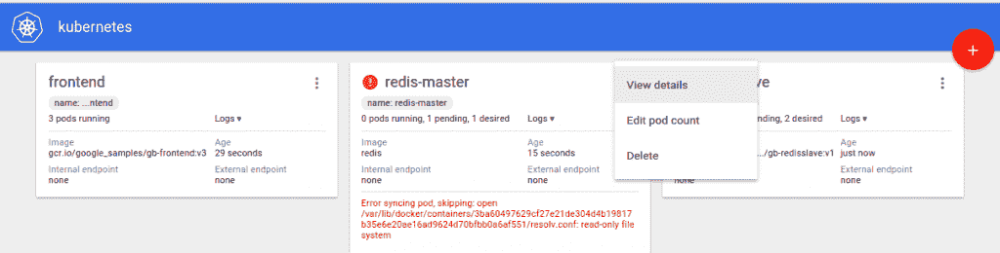

# Kubernetes 1.2 提供滚动更新、持久卷

> 原文：<https://thenewstack.io/kubernetes-1-2-offers-rolling-updates-persistent-volumes/>

上周在旧金山举行的谷歌 GCP Next 大会上，该公司展示了如何利用 Kubernetes 更新一个大量使用的分布式应用程序，同时保持该应用程序运行。

在一个 Kubernetes 1.2 的舞台演示中，谷歌云平台[的项目管理总监 Greg DeMichillie 创建了一个服务](http://us11.campaign-archive2.com/?u=ab6c02b160780b8e6569144f8&id=9e1f2f8ce6)，然后使用负载测试软件以每秒 20，000 个请求的速度发送给这个服务。

“现在，如果我在 18 个月前做这个演示，这会被认为是一件令人惊讶的事情——谁会有能力运行这种规模的服务？现在，它是我的‘你好世界’，”德米凯丽说。

该练习旨在展示 Kubernetes 的最新功能——展示该软件如何在零宕机的情况下更新服务。对于互联网服务公司来说，即使一分钟的停机时间都可能造成巨大的收入损失，这种能力展示了基于微服务的容器架构的强大优势。

在几分钟的过程中，DeMichillie 能够升级分布式应用程序的所有 pod，而不会导致任何停机。

谷歌继续大力投资 Kubernetes 的开发和营销，Kubernetes 是一款容器编排工具，不仅可以与谷歌云平台(GCP)配合使用，还可以用于建立私有云以及其他基于云的容器服务。

Brendan Burns 指出，Kubernetes 的作用是抽象出开发人员和管理员在部署新应用程序时通常必须争论的数据中心配置。

有了 Kubernetes，“机器消失在基础设施之下，”伯恩斯在会议上说。

该公司在 GCP Next 上展示的最新版本的软件具有一些新功能，包括滚动更新、持久存储和安全性增强，所有这些都使部署过程更加无缝。

在 GCP 的一次技术会议上，谷歌高级软件工程师兼工程经理蒂姆·霍金(Tim Hockin)更多地谈到了滚动升级和其他几个新功能。

Kubernetes 的新图形用户界面。

滚动更新功能是对谷歌的 Borg 的改进，这是该公司内部使用的早期容器编排软件。有了 Borg，公司学会了不要把更新系统和软件的其他部分结合得太紧密。“更新不同类型的应用程序有不同类型的更新，”Hockin 说。

更新过程就像一项服务。更新操作是在服务器端进行的，用户设置参数，包括更新应该多快以及出现问题时应该做什么。

这项服务可以与 Kubernetes 的另一项服务结合使用，即 pods 的优雅终止服务。通过正常终止，当最后一个用户结束会话时，pod 将停止。新用户将被重定向到更新的窗格。

## 持久存储

Kubernetes 1.2 还解决了目前在容器中工作的最困难的挑战之一，即如何处理存储。容器，谷歌称之为处理类似任务的容器组，可能来也可能去，这取决于工作量。但是应用程序数据需要永久存储。

目前，这需要开发人员手动调配存储，通常是通过提交票证请求或其他手动流程。Hockin 说，理想情况下，“我们喜欢谈论像对待牲口一样对待你的存储”，他指的是存储应该如何整体管理，而不是作为单独的分区。

容器软件提供商开始让开发人员的生活变得更加轻松。中间层马拉松[的第一个产品发布支持](https://thenewstack.io/mesophere-marathon-1-0-newly-released-supports-stateful-containers/)持久存储，Crate [最近发布了一个可以封装在容器中的数据库系统](https://thenewstack.io/crate-addresses-database-speed-scaling-standard-sql/)。

在这个版本的 Kubernetes 1.2 中，用户可以自动配置存储。开发人员可以从 Kubernetes 请求存储，如果可用，Kubernetes 将提供存储，如果没有存储，甚至可以创建新的存储块——假设系统有后端存储服务，如 GCP、AWS 或 OpenStack 的私有实例。Kubernetes 支持大约 20 种不同的存储格式。

“您可以将所有这些数据写入永久卷，然后您可以终止您的应用程序。您可以将该数据移交给不同的 pod，因为您仍然拥有该数据。除非你告诉我们可以，否则我们不会销毁它，”霍金说。

## 多区域群集和安全性

Hockin 还讨论了 Kubernetes 的一些其他新特性。

为了进一步帮助使应用程序尽可能无缝，Kubernetes 现在支持多区域集群。一个集群可以跨多个可用性区域运行，例如 GCP 或 AWS 提供的区域区域。

“现在是凌晨 2 点，星期天晚上。你希望你的寻呼机因为谷歌关闭了一个区域而响吗？”霍金反问。

Hockin 说，这项工作是正在进行的代号为“Ubernetes”的项目的一部分，旨在建立一个跨多个集群的容器编排的联合模型。

为了提高安全性，Kubernetes 开发团队还借鉴了 [12 因素应用](http://12factor.net/)，这是一个广为流传的关于构建云服务最有效方式的宣言。其中一个建议是，将配置工作包含在应用程序本身中。

为此，Kubernetes 现在提供了一个 API 来管理敏感的认证信息，比如 SSH 密钥、API 令牌。“我们给你一个 API 来管理你的秘密，”霍金说。当用户启动应用程序时，会调用安全 API 在运行时提供身份验证凭据。

然而，最后一个特性可能需要更多的工作。使用 Kubernetes 运营的 [WePay](https://go.wepay.com/) 的首席软件工程师 Richard Steenberg 指出，它以纯文本形式存储密码和其他敏感信息，如果被恶意黑客访问，可能会危及安全。

特征图片:布伦丹·伯恩斯，谷歌高级软件工程师。

<svg xmlns:xlink="http://www.w3.org/1999/xlink" viewBox="0 0 68 31" version="1.1"><title>Group</title> <desc>Created with Sketch.</desc></svg>