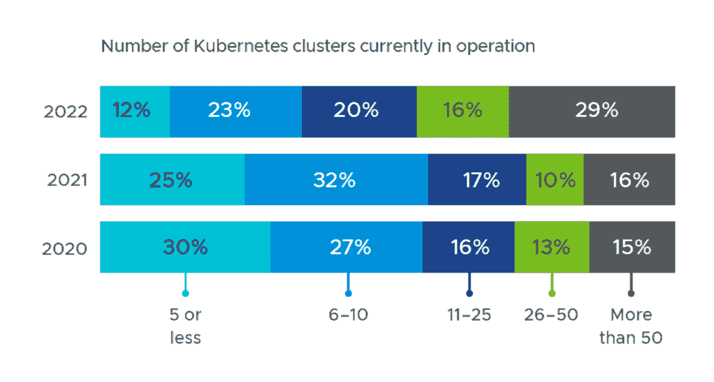

# Kubernetes 1.24 放弃了 Dockershim，为有状态工作负载腾出了空间

> 原文：<https://thenewstack.io/kubernetes-1-24-drops-dockershim-makes-space-for-stateful-workloads/>

最新发布的 [Kubernetes](https://kubernetes.io/) 容器编排引擎，昵称为“Stargazer”，旨在更好地支持数据库、微服务和其他新兴用例，同时摆脱早期阻碍 K8s 核心开发人员生产力的失误。

总的来说，根据管理开源项目的[云本地计算基金会](https://cncf.io/?utm_content=inline-mention)的说法，这个版本有 46 个“增强”。15 个增强功能已经升级到稳定状态，这意味着它们已经准备好投入生产使用，同时 15 个增强功能正在进入测试阶段，13 个增强功能已经进入测试阶段。

首先，淘汰旧的。

那些仍然在使用 Docker 运行时引擎的人必须找到一个替代品，或者一个商业解决方案，以便在 Kubernetes 的新版本中使用它:从 1.24 开始，将不再支持 Dockershim。

在 2020 年决定[放弃对 Docker 运行时](https://thenewstack.io/this-week-in-programming-kubernetes-says-dont-panic-about-docker-deprecation/)[的支持](https://kubernetes.io/blog/2020/12/02/dont-panic-kubernetes-and-docker/)。虽然 Docker 引发了容器使用的第一次广泛成功，但 Kubernetes 转向了 2016 年推出的标准化[容器运行时接口](https://kubernetes.io/docs/concepts/architecture/cri/)，以允许 Kubernetes [Kubelet](https://kubernetes.io/docs/reference/command-line-tools-reference/kubelet/) 节点引擎与任何兼容的运行时引擎接口，目标是不完全依赖 Docker 本身。

当然，最初的 Docker 引擎本身并不兼容，所以它自己做了一个 shim 来运行 K8s 上的运行时。直到这个版本才支持该填充程序。

这一变化将与那些仍在使用 Docker 引擎本身的运行部署相关，这些部署需要在更新之前更新到兼容的运行时— [CRI-O](https://cri-o.io/) 或 [containerd](https://containerd.io/) 或商用的 [Mirantis 容器运行时](https://docs.mirantis.com/mcr/20.10/overview.html) (MCR)。

基于 Docker 开发工具构建的容器现在可以在 CRI 规范上运行，不会受到这一变化的影响。“对于大多数应用程序开发人员来说，这将是一个明显的变化，”1.24 版本的项目负责人 James Laverack 解释道。

虽然 Laverack 没有估计有多少部署仍然依赖 Docker 引擎，但他指出，仍然这样做的唯一原因是 Kubernetes 的功能是在其 API 之外访问的。在这些情况下，这样做的应用程序将需要一些工作来升级。

Laverack 解释说，通过 API 以外的方式访问 Kubernetes 是有问题的，原因有几个。首先，它可以锁定用户只使用一个 [Docker 引擎来访问 Kubernetes 的功能](https://thenewstack.io/kubernetes-vs-docker-swarm-whats-the-difference/)。

Docker shim 也有问题，因为它给 K8s 维护人员带来了大量的维护工作。有很多专门处理 Docker 的代码(与 CRI 本身并行)，而且错误百出。Laverack 说，消除支持有助于 K8s 工程师简化代码库。

“社区认为删除它将允许代码库的这一部分得到简化，减少错误，提高稳定性，并为更多的发布提高速度，”Laverack 说。“因此，这确实是一个根本性的变化，将有助于 Kubernetes 在未来以更好的质量推出更多功能。”

据 VMware 称，[那些使用 Kubernetes 的公司正在稳步增加其集群的规模和数量。](https://hello-tanzu.vmware.com/state-of-kubernetes-2022/)

## 盒子里还有什么？

Stargazer 还展示了为 Kubernetes 提供存储感知控制所做的工作。对于那些计划在 Kubernetes 上运行有状态工作负载(比如数据库)的人来说，这是个好消息。Kubernetes 感知应用程序将能够利用这些功能以更精细的粒度管理存储，提供调整卷大小的能力，或者允许应用程序在任何给定时刻根据剩余可用存储做出决策。

一个[上下文日志](https://github.com/kubernetes/enhancements/issues/3077)特性，作为 alpha 版本引入到 [API 服务器](https://kubernetes.io/docs/reference/command-line-tools-reference/kube-apiserver/)，将帮助平台工程师和 Kubernetes 核心开发团队本身调试 Kubernetes。该版本现在支持测试版的第 3 版 Kubernetes OpenAPI，允许第三方开发者编写操作符和自定义资源定义来扩展 Kubernetes。

微服务开发者的好消息:Kubernetes 1.24 支持 Google 的 [gRPC 通信协议](https://thenewstack.io/grpc-delivers-on-the-promise-of-a-proxyless-service-mesh/)。

一个新的[探测器功能](https://github.com/kubernetes/enhancements/issues/2727)消除了设置单独的 HTTP 服务器来检查容器的就绪性和可用性的需要。Laverack 说，微服务经常使用 gRPC 进行通信，这将允许开发人员标准化他们在 gRPC 上的堆栈。

安全性已经向前迈出了一大步，现在可以用 [Sigstore](https://www.sigstore.dev/) 签署发布工件。K8s 用户现在可以签署他们的软件组件，确保它们没有被篡改。

“这是在保护 Kubernetes 生态系统的完整性方面迈出的巨大一步，并表明由于供应链攻击的增加，大规模的代码签名是可能的，坦率地说是必要的，” [Chainguard](https://thenewstack.io/chainguard-a-zero-trust-supply-chain-security-company/) 的开源负责人 [Tracy Miranda](https://twitter.com/tracymiranda) 说，他在[一篇宣布包含](https://blog.sigstore.dev/kubernetes-signals-massive-adoption-of-sigstore-for-protecting-open-source-ecosystem-73a6757da73)的 Sigstore 博客文章中引用了他的话。

Kubernetes 自己现在也在使用 SigStore 来满足软件产品的供应链标准( [SLSA](https://slsa.dev/) )，这是一个安全框架来防止恶意第三方篡改软件包。

关于 Kubernetes 1.24 中新特性的完整概要，请参见这里的发布说明。

## 前进的道路

Kubernetes 的每个版本都有一个[专门的发布经理](https://kubernetes.io/releases/release-managers/)。Laverack 在 2020 年加入发布团队，在他对代码库做出任何贡献之前。他的日常工作是作为 Kubernetes 服务提供商 [Jetstack](https://www.jetstack.io/) 的员工解决方案工程师。在这次发布之前，他在每次发布中都是发布团队的影子。

“人们有兴趣加入发布团队，我们非常乐意接受新的贡献者，”他说。

[黄](https://github.com/cici37)将领导 [Kubernetes 1.25](https://github.com/kubernetes/sig-release/tree/master/releases/release-1.25) 的发布，其工作将于本月在 [KubeCon+CloudNativeCon EU](https://thenewstack.io/kubecon-cloudnativecon-2022-europe-in-valencia-bring-a-mask/) 开始，并于 8 月 23 日左右发布。

TNS 分析师 Lawrence Hecht 对本文有贡献。

<svg xmlns:xlink="http://www.w3.org/1999/xlink" viewBox="0 0 68 31" version="1.1"><title>Group</title> <desc>Created with Sketch.</desc></svg>