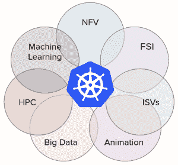

# Kubernetes 1.8 带来了稳定性、安全性和存储支持方面的改进

> 原文：<https://thenewstack.io/kubernetes-1-8-arrives-improvements-simplicity-stability-security-storage-improvements/>

Kubernetes 1.8 将于周四发布，更新集中在稳定性、简单性和安全性上。

谷歌 [Kubernetes](/category/kubernetes/) 集团产品经理[阿帕娜·辛哈](https://twitter.com/apbhatnagar?lang=en)**说:“这不是一个有许多新功能的盛大发布，而是一个深化现有功能的发布。”。[谷歌](https://cloud.google.com/kubernetes-engine)最初将 Kubernetes 作为开源软件发布，尽管软件代码库由[云本地计算基金会](https://www.cncf.io/)管理。**

 **这个开源容器编排引擎的发布计划是每三个月发布一次。最新的包括个人贡献者以及 Avi Networks、CoreOS、Google、Heptio、华为、微软、Red Hat 和三星 SDS 及其他公司的员工的贡献。

据分析公司 Redmonk 称，约 54%的财富 100 强公司以某种形式运营 Kubernetes。稳定、简单、安全是市场的主要需求，CNCF 和 Kubernetes 1.8 功能发布负责人开发倡导者 Ihor Dvoretskyi 指出。

在新版本中:

**为了安全:**基于角色的访问控制，在 1.6 中移到测试版，现在移到稳定版。它允许集群管理员动态定义角色，通过 Kubernetes API 强制执行访问策略。CoreOS 的 Eric Chiang 在[博客文章](https://coreos.com/blog/kubernetes-1.8-announcement)中写道 [CoreOS](https://coreos.com/) 的 [Eric Chiang](https://github.com/ericchiang) 。与 RBAC 相关的其他功能正在开发中，包括用于确定用户在系统中可以执行的动作的新 API。

通过网络策略过滤出站流量，现在处于测试阶段，增加了对过滤入站流量的现有支持。在新版本中， [Kubelet](https://kubernetes.io/docs/admin/kubelet/) 节点代理的传输层安全性(TLS)证书轮换也升级到了 beta 版。

**稳定性:**自定义功能[水平 pod 自动缩放](https://kubernetes.io/docs/tasks/run-application/horizontal-pod-autoscale/)移至 beta。Sinha 解释说:“过去[Kubernetes]允许根据 CPU 利用率进行扩展和缩减，但开发人员希望根据其他类型的指标来扩展他们的应用程序，例如队列长度或负载平衡器上的负载。

提供这一点需要资源度量 API 和定制度量 API 的稳定性。此外，还构建了一个新的度量服务器。她说，现在它有了更多可读和可理解的错误输出，所以如果它不工作，你就知道为什么以及它在哪里失败了。

工作负载 API 也转移到了测试版。它们提供了管理部署到 Kubernetes 的应用程序所需的抽象。蒋解释了四种:

*   [DaemonSets](https://kubernetes.io/docs/concepts/workloads/controllers/daemonset/) 根据用户指定的标准，管理在所有节点或节点子集上运行 Pod 的复杂性。
*   一个[复制集](https://kubernetes.io/docs/concepts/workloads/controllers/replicaset/)提供了一个基本的高可用性原语，以确保一个 Pod 的指定数量的副本正在运行。
*   [部署](https://kubernetes.io/docs/concepts/workloads/controllers/deployment/)控制器支持对 pod 和副本集的声明式更新，提供关键功能，如加那利和滚动部署。
*   [StatefulSet](https://kubernetes.io/docs/concepts/workloads/controllers/statefulset/) 是一种支持需要持久性的 pod 的机制，通过向它们灌输一个唯一的身份来执行排序和持久性卷访问保证。

他引用了 Bootkube 作为 CoreOS 使用工作负载 API 的项目，Bootkube 引导高度可用的自托管集群。

对于 Kubernetes 1.8，这些 API 已经从**extensions/v1 beta 1**API 组移至 **dedicatedapps/v1beta2** ，为工作负载在未来版本中升级到 GA 奠定了基础。

**对于工作负载的多样性** : Red Hat，[在一篇详细介绍你需要了解的 Kubernetes 1.8 的博客文章中，](https://www.redhat.com/en/blog/what-you-need-know-about-kubernetes-18)提到了一个新的内容，它指出这是云计算的下一波浪潮。他们引用了来自[资源管理工作组](http://blog.kubernetes.io/2017/09/introducing-resource-management-working.html)的 alpha 代码，该工作组最近成立以支持正在开发的日益复杂的应用程序类别。该小组反映了不同生态系统与 Kubernetes 的交集，正如在关于新资源管理工作组的博客帖子中发布的维恩图所反映的那样。

**对于存储:**现在可以为暂时存储设置一些限制，指定装载选项，更好地覆盖存储使用指标。flex 驱动程序部署已经作为 alpha 引入，它允许树外卷驱动程序。

Kubernetes 使用存储的方式是有一个存储驱动程序和一个存储插件框架。在过去，这些驱动程序必须编写并编译到 Kubernetes 核心中。他们被称为入口量驱动因素。Sinha 说，现在有了解耦，所以卷驱动程序可以从树中写出。

**简单来说:**大约一年前，随着 [kubeadm](https://kubernetes.io/docs/setup/independent/create-cluster-kubeadm/) 的发布，团队一直致力于使安装更加容易。建立一个 Kubernetes 集群需要两行代码。现在，kubeadm 命令包含了对集群升级的支持。

此外，许多用户正在 Kubernetes 上运行机器学习和大数据以及高级计算工作负载。辛哈说，那些用户将会非常高兴地知道 cron jobs 处于测试阶段。有运行特定作业的调度和计时功能。Swarm 中已经支持 Cron ，这是 Docker 自己的编排引擎。

该团队已经为支持 Spark 数据分析框架工作了一年多。它现在在 Kubernetes 上得到原生支持。

Kubernetes 1.8 的自定义资源定义仍处于测试阶段。CRD 允许对 Kubernetes API 进行扩展以提供功能，而不是在核心的 Kubernetes 中向用户提供看起来像一流的 API 的功能。该交换机要求用户[将](https://thenewstack.io/kubernetes-1-7-brings-extensibility-security-hardening-network-policy-api/)第三方资源迁移到 CRDs。对于 1.8 版本，CRD 在 alpha 中添加了模式验证，以获得更健壮的客户端体验。根据 Chiang 的说法，这种变化让 CRD 定义它们的资源的服务器端验证，而不是客户今天使用的当前无模式的“值包”。

## 接下来会发生什么

辛哈说，阿尔法特征指明了未来的方向。他们专注于让事情变得更可靠。

它们包括:

**优先级和抢占:**您可以指定一个特定的 pod 比其他 pod 具有更高的优先级，这可能意味着如果集群中没有足够的资源，其他 pod 可能会被牺牲。

**节点的自动污染** : [污染和容忍](https://kubernetes.io/docs/concepts/configuration/taint-and-toleration/)在 1.6 中出现。这可以用在许多不同的方面。例如，您可以将一个节点专用于某种类型的应用程序，并说这个节点是不可调度的。在这个版本中，Kubernetes 指出了这一点，实际上是在说，“好吧，这个节点被感染是因为它关闭了或者有一个错误或其他什么；不应该安排。”

**卷快照更新**:在存储端，您可以调整持久卷的大小，但现在增加了调整大小功能。

扩展命令行界面 kubectl 来定制与集群的交互的能力也是 1.8 版本的新增功能。

亚历克斯·威廉姆斯促成了这个故事。

云本地计算基金会、CoreOS、Google 和 Red Hat 分别是新堆栈的赞助商。

通过 Pixabay 的特征图像。

<svg xmlns:xlink="http://www.w3.org/1999/xlink" viewBox="0 0 68 31" version="1.1"><title>Group</title> <desc>Created with Sketch.</desc></svg>**