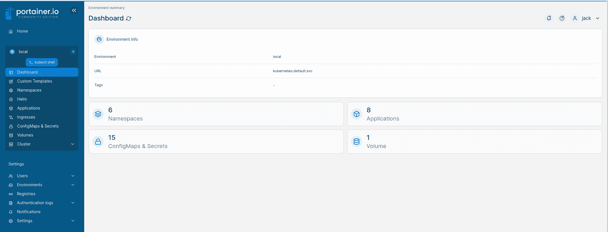

# Kubernetes 101:将 Portainer 部署到 MicroK8s 集群

> 原文：<https://thenewstack.io/kubernetes-101-deploy-portainer-to-a-microk8s-cluster/>

Portainer 是一个强大的容器管理平台，它不仅能很好地适应 Docker 部署，还能适应 Kubernetes 环境。然而，正如任何与 Kubernetes 打过交道的人都会告诉你的那样……这很难。考虑到 Kubernetes 集群中有多少移动的部分，除非您真的知道自己在做什么，否则您会发现管理这样一个环境绝对是一场噩梦。

谢天谢地，有像 Portainer 这样的[图形用户界面可以极大地简化你的 Kubernetes 体验。是的，您仍然需要了解 Kubernetes 是如何工作的——您需要了解名称空间、pod、网络、应用程序、入口等等。想象一下，如果有一个基于 web 的 GUI 来消除这种困惑，那么您就可以真正进入重要的部分……部署您的应用程序和服务。](https://thenewstack.io/deploy-a-container-stack-in-portainer-from-a-github-repository/)

这就是 Portainer 所做的，在 MicroK8s 的[的帮助下，你可以部署 Portainer，使管理 Kubernetes 变得更加容易。](https://thenewstack.io/kubernetes-101-deploy-your-first-application-with-microk8s/)

让我告诉你怎么做。

## 要求

要做到这一点，你需要至少三台运行 Ubuntu Server 22.04 的机器(因为这是我最喜欢的服务器版本)。是的，您可以在另一个 Linux 发行版上这样做，但是您需要修改安装过程。部署 MicroK8s 和 Portainer 的步骤是相同的，所以一旦您完成了 MicroK8s 的安装，这里的一切都将正常工作。

## 步骤 1:安装 MircoK8s

首先要做的是安装 MicroK8s。然而，有一个技巧。Portainer 不能与 1.24 之前的任何版本的 MicroK8s 一起使用。除此之外，我发现 1.24 以后的版本不能可靠地集群。正因为如此，我们将安装 MicroK8s 的 1.24 版本。以下是步骤。

## 编辑主机文件

您要做的第一件事是编辑所有三台机器上的主机文件。要打开文件进行编辑，发出命令:

在该文件的底部，添加以下内容(确保使用您的 IP 地址和主机名):

```
192.168.1.70  k8s1
192.168.1.71  k8s2
192.168.1.72  k8s3

```

保存并关闭文件。确保在所有三台计算机上以相同的方式编辑 hosts 文件。

## 更改主机名

您还需要更改每台机器的主机名。我们将坚持我们上面的约定。在每台机器上，您将运行如下命令:

```
sudo hostnamectl set-hostname k8s1

```

在每台机器上做同样的事情，使用 k8s2 和 k8s3 作为其他主机名。完成后，注销每台机器，然后重新登录。

## 设置正确的时区

您还需要确保所有机器都在同一个(正确的)时区。为此，您将运行如下命令:

```
sudo timedatectl set-timezone America/Kentucky/Louisville

```

确保用 America/Kentucky/Louisville 替换您的时区，这可以通过命令找到:

```
sudo timedatectl list-timezones

```

## 安装 MicroK8s

MicroK8s 可以用 snap 轻松安装在 Ubuntu 服务器上。在每台机器上，您将发出命令:

```
sudo snap install microk8s  --channel=1.24/stable  --classic

```

接下来，使用
将您的用户添加到 MicroK8s 组

```
sudo usermod  -aG microk8s  $USER

```

注销并重新登录。

最后，更改。kube 文件夹包含:

```
chown  -f  -R  $USER  ~/.kube

```

在所有三台机器上都安装了 MicroK8s 之后，就可以创建集群了。

## 群集您的机器

在控制器(k8s1)上，发出命令:

输出将包括您将在所有节点上运行的 join 命令。该命令看起来会像这样:

```
microk8s join  192.168.1.70:25000/5c4af12af72cef10c631e5db00e3b3c5/5786c9b07835

```

回到控制器，使用命令
验证节点是否已成功加入

```
microk8s kubectl get nodes

```

输出应该是这样的:

```
k8s1     Ready      &lt;none&gt;     9d      v1.24.8-2+1dda18a15eea38
k8s2     Ready      &lt;none&gt;     9d      v1.24.8-2+1dda18a15eea38
k8s3     Ready      &lt;none&gt;     9d      v1.24.8-2+1dda18a15eea38

```

现在您已经准备好将 Portainer 部署到集群了。

## 将 Portainer 部署到 MicroK8s

在控制器上，您必须首先启用一些附加组件，这可以通过以下命令来完成:

```
microk8s enable dns
microk8s enable ha-cluster
microk8s enable ingress
microk8s enable metrics-server
microk8s enable rbac
microk8s enable hostpath-storage

```

接下来，您必须使用命令启用 MicroK8s 社区存储库:

```
microk8s enable community

```

最后，您可以使用
启用 Portainer

```
microk8s enable portainer

```

给 Portainer 一分钟左右来完成部署。要检查 Portainer 的状态，发出以下命令:

```
microk8s kubectl get pods  -n  portainer

```

一旦 Portainer 被列为运行状态，打开您的默认 web 浏览器，并将其指向 *http://SERVER:30777* 或 *https://SERVER:30799* (其中 SERVER 是托管服务器的 IP 地址或域)。

Portainer 将提示您创建新的管理员用户。完成之后，确保选择本地环境，然后会看到 Portainer 仪表板(图 1)，清楚地显示您有一个可以使用的 Kubernetes 环境。



图 1: Portainer 现在可以进行第一次 Kubernetes 部署了。

这就是为 Kubernetes 环境部署 Portainer 管理平台的全部内容。多亏了 MicroK8s，这是一个快速使用 Kubernetes 的好方法，而不会被太多的命令或部署 Kubernetes 本身的噩梦所淹没。

<svg xmlns:xlink="http://www.w3.org/1999/xlink" viewBox="0 0 68 31" version="1.1"><title>Group</title> <desc>Created with Sketch.</desc></svg>