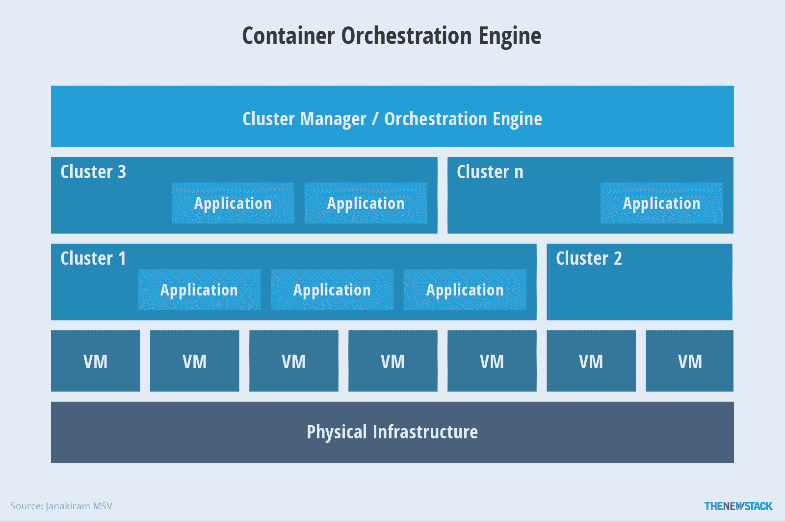
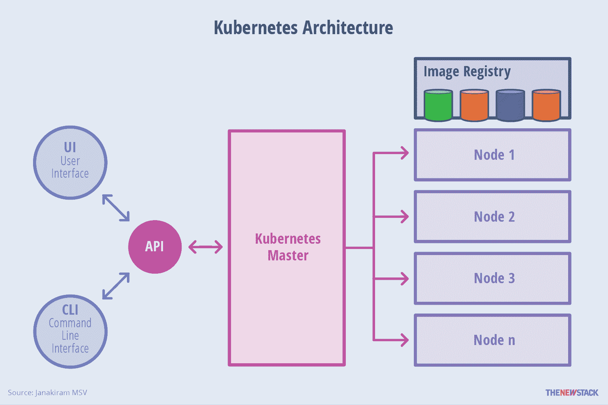
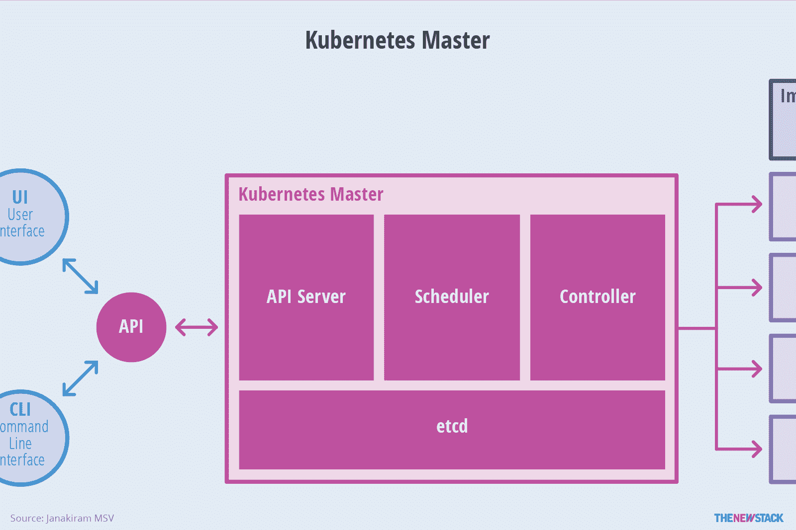
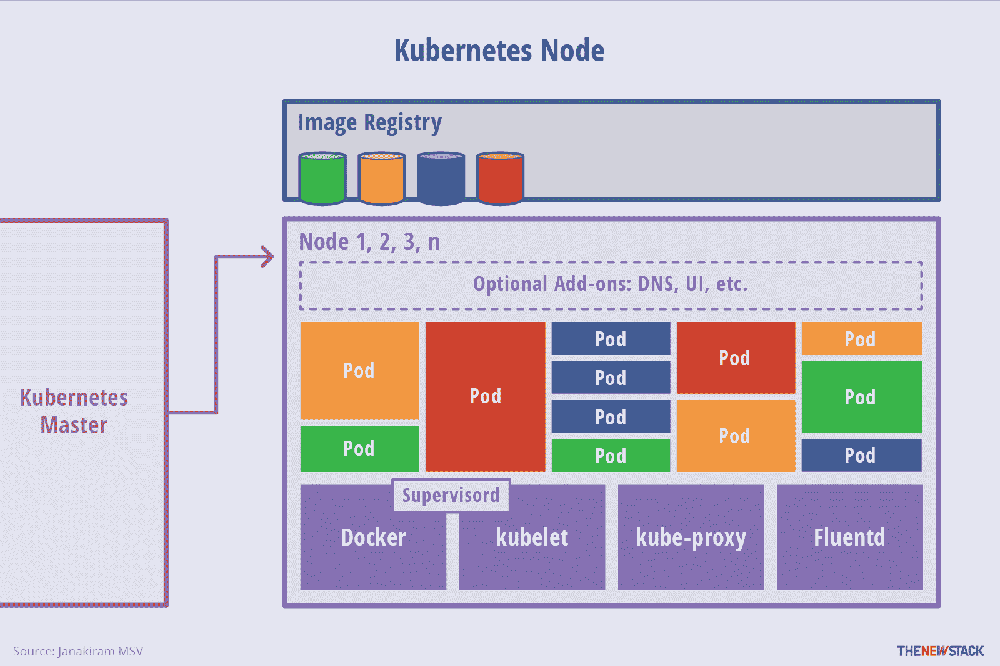

# Kubernetes:概述

> 原文：<https://thenewstack.io/kubernetes-an-overview/>

Kubernetes 是一个开源容器管理平台，旨在运行企业级、支持云且可通过 web 扩展的 IT 工作负载。它建立在 Google 在运行容器化应用程序方面的 15 年经验的基础之上。

虽然它们的流行是最近的趋势，但是容器的概念已经存在了十多年。主流的基于 Unix 的操作系统(OS ),如 Solaris、FreeBSD 和 Linux，都有对容器的内置支持，但是 Docker 通过使容器便于开发和 it 运营团队管理和访问，真正实现了容器的大众化。Docker 已经证明了容器化可以推动应用程序的可伸缩性和可移植性。开发人员和 IT 运营人员正转向使用容器来打包用各种语言编写的代码和依赖项。容器在 DevOps 流程中也起着至关重要的作用。它们已经成为构建自动化和持续集成和持续部署(CI/CD)管道不可分割的一部分。

对容器的兴趣导致了[开放容器倡议](https://www.opencontainers.org/) (OCI)的形成，以定义容器运行时和图像格式的标准。业界也见证了容器的各种实现，如 Canonical 的 [LXD](https://www.ubuntu.com/cloud/lxd) ，CoreOS 的 [rkt](https://github.com/coreos/rkt) ，微软的 [Windows 容器](https://msdn.microsoft.com/en-us/virtualization/windowscontainers/about/about_overview)，通过 Kubernetes 孵化器评审的 [CRI-O](https://github.com/kubernetes-incubator/cri-o) ，以及 VMware 的[VSP here Integrated Containers](https://blogs.vmware.com/vsphere/2015/10/vsphere-integrated-containers-technology-walkthrough.html)。

虽然核心实现以单个容器的生命周期为中心，但生产应用程序通常会处理跨多个主机运行数十个容器的工作负载。处理运行在生产环境中的多个主机和容器的复杂体系结构需要一套新的管理工具。一些流行的解决方案包括 Docker Datacenter、 [Kubernetes](http://kubernetes.io/) 和[meso sphere DC/操作系统](https://mesosphere.com/product/)。

容器编排通过为打包、部署、隔离、服务发现、扩展和滚动升级提供一个开放和高效的模型，影响了传统的平台即服务(PaaS)架构。大多数主流的 PaaS 解决方案都采用了容器，并且有一些新的 PaaS 实现构建在容器编排和管理平台之上。客户可以选择部署与 IT 运营更加一致的核心容器编排工具，也可以选择面向开发人员的 PaaS 实现。

图 1:容器编排引擎的高级架构。

关键是容器编排已经影响了现代软件开发和部署的方方面面。Kubernetes 将在推动企业和新兴创业公司采用容器方面发挥至关重要的作用。

## 库伯内特建筑

Kubernetes 的这种架构为服务发现提供了一种灵活的、松散耦合的机制。像大多数分布式计算平台一样，Kubernetes 集群至少包含一个主节点和多个计算节点。[主](http://kubernetes.io/docs/admin/high-availability/)负责暴露应用程序接口(API)，调度部署和管理整个集群。每个[节点](http://kubernetes.io/docs/admin/node/)运行一个容器运行时，如 [Docker](https://github.com/docker/docker) 或 [rkt](https://github.com/coreos/rkt) ，以及一个与主节点通信的代理。该节点还运行用于日志记录、监控、服务发现和可选附加组件的附加组件。节点是 Kubernetes 集群的主力。它们向应用程序公开计算、网络和存储资源。节点可以是运行在云中的虚拟机(VM ),也可以是运行在数据中心内的裸机服务器。

图 2: Kubernetes 分解成多个架构组件。

一个 [pod](http://kubernetes.io/docs/user-guide/pods/) 是一个或多个容器的集合。pod 是 Kubernetes 的核心管理单元。pod 充当共享相同上下文和资源的容器的逻辑边界。pod 的分组机制弥补了容器化和虚拟化之间的差异，使多个相关的流程可以一起运行。在运行时，可以通过创建副本集来扩展 pod，这可以确保部署始终运行所需数量的 pod。

[副本集](http://kubernetes.io/docs/user-guide/replicasets/)通过始终维护一组预定义的 pod 来提供所需的规模和可用性。单个 pod 或副本集可以通过服务向内部或外部消费者公开。服务通过将一组 pod 与特定标准相关联来实现 pod 的发现。pod 通过称为标签和选择器的键值对与服务相关联。该服务将自动发现标签与选择器匹配的任何新 pod。这种架构为服务发现提供了一种灵活的、松散耦合的机制。

图 master 负责公开 API、调度部署和管理整个集群。

Kubernetes 对象的定义，比如 pod、副本集和服务，被提交给主服务器。基于定义的需求和资源的可用性，主节点在特定节点上调度 pod。该节点从容器映像注册中心获取映像，并与本地容器运行时协调以启动容器。

[etcd](https://github.com/coreos/etcd) 是来自 CoreOS 的开源分布式键值数据库，它充当了 Kubernetes 集群所有组件的唯一真实来源( [SSOT](https://en.wikipedia.org/wiki/Single_source_of_truth) )。主设备查询 etcd 以检索节点、箱和容器的状态的各种参数。

Kubernetes 的这种体系结构通过在应用程序和底层基础设施之间创建一种抽象，使其具有模块化和可伸缩性。

图 4:节点向应用程序公开计算、网络和存储资源。

## 关键设计原则

Kubernetes 的设计原则是可伸缩性、可用性、安全性和可移植性。它通过在可用资源之间高效地分配工作负载来优化基础架构的成本。本节将重点介绍 Kubernetes 的一些关键属性。

### 工作负载可扩展性

部署在 Kubernetes 中的应用程序被打包为微服务。这些微服务由分组为 pod 的多个容器组成。每个容器被设计成只执行一项任务。pod 可以由无状态容器或有状态容器组成。无状态 pod 可以轻松地按需扩展或通过动态自动扩展进行扩展。Kubernetes 1.4 支持水平 pod 自动扩展，它可以根据 CPU 利用率自动扩展复制控制器中的 pod 数量。未来版本将支持自定义指标来定义自动缩放规则和阈值。

运行在 Google Cloud 上的托管 Kubernetes 也支持集群自动伸缩。当 pod 跨所有可用节点扩展时，Kubernetes 会与底层基础设施协调，以向集群添加额外的节点。

[英特尔的乔纳森·唐纳森探讨库伯内特](https://thenewstack.simplecast.com/episodes/intels-jonathan-donaldson-discusses-kubernetes)

基于微服务构建、打包为容器并部署为 pod 的应用程序可以利用 Kubernetes 的极端扩展能力。虽然这主要适用于无状态的 pods，但是 Kubernetes 正在通过 pet sets 增加对持久工作负载的支持，例如 NoSQL 数据库和关系数据库管理系统(RDBMS );这将支持扩展无状态应用程序，如 Cassandra 集群和 MongoDB 副本集。这种能力将把弹性的、无状态的 web 层和持久的、有状态的数据库结合在一起，在同一个基础设施上运行。

### 高可用性

当代工作负载需要基础架构和应用程序级别的可用性。在大规模集群中，一切都容易发生故障，这使得生产工作负载的高可用性变得非常必要。虽然大多数容器编排引擎和 PaaS 产品提供应用程序可用性，但 Kubernetes 旨在解决基础设施和应用程序的可用性问题。

在应用程序方面，Kubernetes 通过[副本集](http://kubernetes.io/docs/user-guide/replicasets/)、[复制控制器](http://kubernetes.io/docs/user-guide/replication-controller/)和 pet 集来确保高可用性。操作员可以声明在任何给定时间点需要运行的最小 pod 数量。如果容器或 pod 由于错误而崩溃，声明性策略可以将部署带回所需的配置。可以通过 pet sets 配置有状态工作负载以实现高可用性。

在基础设施可用性方面，Kubernetes 支持广泛的存储后端，来自网络文件系统( [NFS](https://en.wikipedia.org/wiki/Network_File_System) 和 [GlusterFS](https://www.gluster.org/) 等分布式文件系统，块存储设备如[亚马逊弹性块存储(EBS](https://aws.amazon.com/ebs/) 和谷歌计算引擎[持久磁盘](https://cloud.google.com/compute/docs/disks/)，以及专门的容器存储插件如 [Flocker](https://clusterhq.com/flocker/introduction/) 。向 Kubernetes 添加可靠、可用的存储层可确保有状态工作负载的高可用性。

Kubernetes 集群的每个组件——etcd、API 服务器、节点——都可以配置为高可用性。应用程序可以利用负载平衡器和健康检查来确保可用性。

### 安全性

Kubernetes 中的安全性在多个级别上进行配置。API 端点通过传输层安全性(TLS)来保护，这确保了使用最安全的可用机制对用户进行身份验证。Kubernetes 集群有两类用户——由 Kubernetes 直接管理的服务帐户，以及由独立服务管理的普通用户。由 [Kubernetes API](http://kubernetes.io/docs/api/) 管理的服务账户由 [API 服务器](http://kubernetes.io/docs/admin/kube-apiserver/)自动创建。管理群集内运行的进程的每个操作都必须由经过身份验证的用户启动；这种机制确保了集群的安全性。

部署在 Kubernetes 集群中的应用程序可以利用秘密的概念来安全地访问数据。 [secret](http://kubernetes.io/docs/user-guide/secrets/) 是一个 Kubernetes 对象，它包含少量敏感数据，如密码、令牌或密钥，这降低了数据意外泄露的风险。用户名和密码在存储到 Kubernetes 集群之前是以 base64 编码的。Pods 可以通过挂载的卷或环境变量在运行时访问这个秘密。需要注意的是，同一个集群名称空间的所有用户都可以使用这个秘密。

要允许或限制 pod 的网络流量，可以将网络策略应用到部署中。Kubernetes 中的一个[网络策略](http://kubernetes.io/docs/user-guide/networkpolicies/)是一个规范，说明了选择的 pod 如何被允许相互通信以及与其他网络端点通信。这对于隐藏多层部署中不应该向其他应用程序公开的 pod 非常有用。

### 轻便

Kubernetes 旨在在选择操作系统、容器运行时、处理器架构、云平台和 PaaS 时提供自由选择。

Kubernetes 集群可以配置在主流的 Linux 发行版上，包括 CentOS、CoreOS、Debian、Fedora、Red Hat Linux 和 Ubuntu。它可以部署在本地开发机器上运行；AWS、Azure、Google Cloud 等云平台；基于 KVM、vSphere 和 libvirt 的虚拟化环境；和裸机。用户可以启动在 Docker 或 rkt 运行时上运行的容器，将来还可以支持新的容器运行时。

通过联合，还可以混合和匹配跨多个云提供商和本地运行的集群。这为容器化的工作负载带来了混合云功能。客户可以无缝地将工作负载从一个部署目标转移到另一个部署目标。我们将在下一节讨论混合架构。

<svg xmlns:xlink="http://www.w3.org/1999/xlink" viewBox="0 0 68 31" version="1.1"><title>Group</title> <desc>Created with Sketch.</desc></svg>