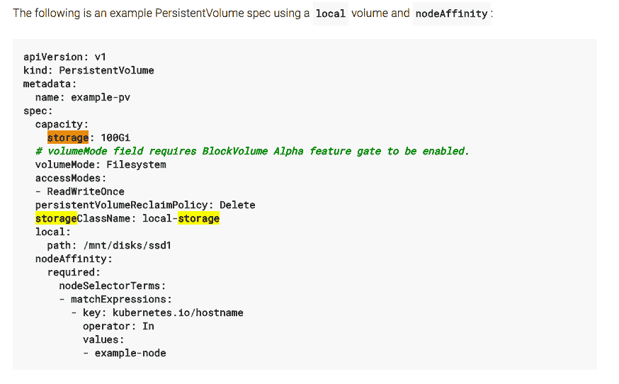

# Kubernetes 和添加持久存储的挑战

> 原文：<https://thenewstack.io/kubernetes-and-the-challenge-of-adding-persistent-storage/>

Kubernetes 的采用率正在激增，但抛开宣传不谈，Kubernetes 仍然非常新——在成为大多数 it 基础设施的组成部分之前，它还有很长的路要走。

与此同时，许多(如果不是大部分的话)企业和 IT 商店只是想在进入这个勇敢的新世界 [Kubernetes](https://kubernetes.io/) 时做些准备。在开发人员开始在平台上工作之前；管理员、运营团队和/或开发人员必须为添加传统但重要的数据管理组件打下基础:持久存储是 Kubernetes 部署中必要组件的一个很好的例子，尽管它并不总是容易实现。

## 将持久添加到无状态

企业应该有的一个关键需求是，开发人员应该能够在 Kubernetes 集群中存储数据，而不必担心持久存储是如何工作的。

“应用程序开发人员和开发运维团队不是数据管理人员。正如我不希望我的数据库管理员扮演应用程序开发人员一样，我也不希望我的应用程序开发人员扮演数据库管理员，” [John L. Myers](https://www.linkedin.com/in/johnlmyers) ，企业管理协会(EMA) 的分析师说。“我想让应用程序开发人员有机会通过 API 访问持久数据管理层，或者不必在每次部署容器化应用程序时从头创建一个数据管理层。”

然而，Kubernetes 的短暂结构使得它不太适合在有状态卷上部署。

“容器从未被设计成持久的，但是企业需要这种持久性来改变负载、保持状态、为不同的负载使用更多的硬件，等等。“[星座研究](https://www.constellationr.com/users/holger-mueller)的分析师霍尔格·穆勒说。“这是企业容器的一种设计缺陷，因为对企业来说，所有重要的东西都需要持久化。”

尽管如此，Kubernetes 提供了各种各样的选项来设置持久存储。例如， [MapR](http://www.mapr.com/) 的产品管理总监 Suzy Visvanathan 说，Kubernetes 提供了一种在安装到容器编排平台的卷上静态和动态供应数据的方法。Visvanathan 表示:“这为用户提供了在需要时使用存储的灵活性。

然而，Kubernetes 提供的 flex volume 插件让外部供应商可以与 Kubernetes 集成，这有其问题。Visvanathan 说，在引入[容器存储接口](https://github.com/container-storage-interface/spec) (CSI)模型之前，一个这样的问题是插件依赖性。有 [Apache Mesos](http://mesos.apache.org/) 、 [Red Hat](https://www.redhat.com/en) 、 [OpenShift](https://www.openshift.com/) 、 [Docker](https://www.docker.com/) ，还有云解决方案，比如[Amazon Elastic Container Service for Kubernetes](https://aws.amazon.com/eks/)(EKS)和[Google Kubernetes Engine](https://cloud.google.com/kubernetes-engine/)(GKE)；编排层现在内在地与 Kubernetes 集成在一起。

“CSI 模型在使外部存储解决方案与 Kubernetes 更容易集成方面取得了很大进展，”Visvanathan 说。

## 按比例放大

许多企业总是试图扩展 Kubernetes 来容纳更多共享容器资源的用户。然而，纵向扩展持久性存储组件可能会带来挑战。例如，传统存储解决方案及其配置也不一定是最合适的。

“Kubernetes 能够轻松快速地扩大容器的生产规模。MapR 的 Visvanathan 说:“下一个挑战是提供一个可以随之扩展的数据平台。“传统存储选项根本无法跟上这种规模。在 Kubernetes 改造旧式安全设施使情况进一步恶化”

MapR 的 Visvanathan 指出，新的持久存储替代方案通常是单节点解决方案，如果集群化，仍然不能提供全局可寻址的命名空间或混合/多云移动性。

“Kubernetes 用于云风格的弹性和选择自己选择的云模式的能力，包括内部、混合或多云部署，”Visvanathan 说。“持久存储需要实现相同的目标”

同时，[Diamanti](https://www.linkedin.com/in/saroth/)的产品营销总监 Sean Roth 说，在带有内部存储的服务器上部署容器可以使扩展更加简单。

Roth 说:“扩展存储可能会造成中断，并可能导致一笔巨大的、通常无法预料的增量支出。“Kubernetes 持久存储的主要挑战主要源于扩展。集装箱存储基础设施的自助式方法可能会造成中断，而且成本高昂。”

最终，组织将需要在越来越多的服务器之间平衡存储使用。Roth 说，在 Kubernetes 部署中共享存储的可用资源可以包括网络文件系统(NFS)或开源集群文件系统协议，如 Ceph 或 GlusterFS。

## 体积积分

尽管存在上述挑战，Kubernetes 确实为存储集成提供了广泛的卷选项。改进也在不断增加。Visvanathan 说，例如，Kubernetes 提供了一种在安装到 Kubernetes 的卷上静态和动态提供数据的方法。“这为用户提供了在需要时使用存储的灵活性。”

事实上，Kubernetes 的卷存储驱动程序选项可以促进许多不同的持久存储机制的使用， [CloudPassage](https://www.cloudpassage.com/) 的战略工程专家 [Ash Wilson](https://www.linkedin.com/in/ashwilson/) 说，并补充说，一些卷驱动程序是 IaaS(基础设施即服务)平台特定的，而一些是底层云基础设施不可知的。

然而，也存在一些警告。“这些卷存储驱动程序选项很棒，但是正确评估和确定哪一个最能满足应用程序要求的时间可能会延长在架构过程中花费的时间，”Wilson 说。Kubernetes 中与保护持久存储相关的任务通常是特定于卷驱动程序的，因此在构建过程中必须考虑安全问题和要求

## 走裸机之路

Kubernetes 的虚拟化结构在设置持久存储时也特别适合裸机服务器部署。MapR 的 Visvanathan 说，这是因为容器虚拟化了操作系统，而不是虚拟化操作系统下面的硬件。

“就其本质而言，容器是在裸机上部署应用程序的理想方式，而 Kubernetes 简化了容器的创建和管理，”Visvanathan 说。“这是这一概念的自然延伸，Kubernetes 的持久存储也最好在裸机上提供。一旦容器用于弹性，虚拟化服务器不会提供任何额外的好处，因此它们只是一个没有附加值的附加层。”

## 安全考虑

Kubernetes 工作负载的动态和无状态特性长期以来给确定用户对 Kubernetes 中运行的应用程序的访问权限带来了困难。事实上，Kubernetes 存储的主要安全问题是保持访问控制和授权特权，以确保只有相关的容器和服务才能访问敏感数据， [Aqua Security](https://www.aquasec.com/) 的营销副总裁 [Rani Osnat](https://www.linkedin.com/in/raniosnat/) 说。

“有几种方法可以实现这一点，但它们必须依赖于一个安全策略，该策略具有应用程序上下文并将权限与特定服务联系起来，”Osnat 说。

为 Kubernetes 提供的保护持久存储的安全工具也应该继续发展。换句话说，一切都会及时好转。

“短暂的工作负载会给捕获适当的安全信息带来挑战，尤其是出于审计和合规目的。CloudPassage 的 Wilson 说:“这需要在不减缓敏捷过程的情况下，对工具进行改进。跟踪、审核和保护存储机制也存在类似的问题—工具必须不断发展以满足安全需求，同时又不会减缓应用程序交付流程

<svg xmlns:xlink="http://www.w3.org/1999/xlink" viewBox="0 0 68 31" version="1.1"><title>Group</title> <desc>Created with Sketch.</desc></svg>