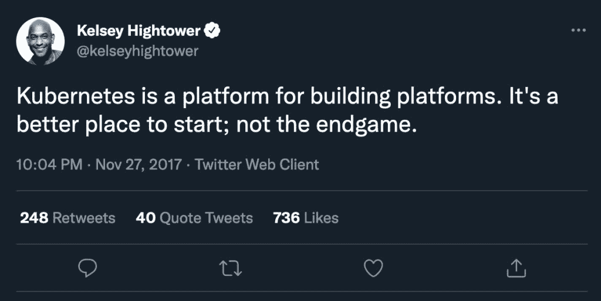

# Kubernetes 和下一代 PaaS

> 原文：<https://thenewstack.io/kubernetes-and-the-next-generation-of-paas/>

2022 年到了。Web3、元宇宙、NFT 风靡一时，但像 2015 年一样，大量开发人员仍在努力将他们的应用程序部署到云上。

为什么会这样？这是不可避免的吗？让我们试着回答这些问题。

## **问题**

 [扬·伊尔巴

Yann 是 Qovery 的开发人员体验工程师，在软件和站点可靠性工程方面拥有超过 15 年的经验。](https://www.linkedin.com/in/yannirbah) 

你可能会说，并非所有的开发人员在部署他们的应用程序时都有困难，你可能是对的。谷歌和网飞正以惊人的速度平稳地运送代码。随着他的全新创业，你的朋友正在 Vercel 上无缝地部署他的 Jamstack 应用程序。那我们在谈什么？

我说的是那些成千上万的中型公司，他们的应用程序太大，不适合平台即服务(PaaS)，但不足以雇佣一大批开发人员和站点可靠性工程师(SREs)。

## **英雄的日子**

一家初创公司希望在早期阶段尽快将其最小可行产品(MVP)推向市场。大多数公司将转向 PaaS，如 Heroku、Vercel 或市场上无数解决方案中的任何一种。这个决定完全有道理，原因如下:

*   它很便宜:通常有一个免费的计划，每月几美元就可以运行一个应用程序。
*   它很容易使用:早期创业公司最不希望的事情就是花时间建立他们的基础设施。在网络用户界面上点击几下，在 git 上推一下，应用就上线了。

## **AWS 来电**

童话可能会永远继续下去，但不幸的是，有一天他们会发现自己面对一个复杂的现实:他们正在超越他们的 PaaS。或者至少不再适合他们的需求。这可能有多种原因。

*   他们的代码库在增长，在他们的平台上管理几十个服务变得很困难。
*   开始时很便宜，但现在太贵了。
*   出于某种原因，他们需要部署在特定的云提供商上。
*   PaaS 不支持他们需要部署到的特定区域。
*   他们不希望被供应商锁定。
*   他们的应用程序具有与 PaaS 不兼容的特定需求。
*   这份清单还在继续…

此时，这些公司通常会求助于主要的云提供商之一——AWS。一开始看起来很有希望。他们能想到的每一个 API 或服务都已经存在了。他们可以使用几乎无限数量的 EC2 实例类型来定制他们的基础设施，以满足他们的确切需求。托管数据库？是啊！CDN？当然啦！您甚至可以在组合中加入一些 lambdas，将“无服务器”添加到您的堆栈中。

这一定是个完美的梦，对吧？

## **Kubernetes，披着羊皮的狼**

除非从梦中醒来，否则现实并不那么吸引人。亚马逊网络服务是一个复杂的庞然大物，入门并不像一开始看起来那么容易。像 Elastic Beanstalk 这样的服务与其他 PaaS 有着相同的缺点，在提供的构建模块上从头开始构建交付管道并不容易。如果您还想部署到 GCP 或 Azure 呢？每个云提供商都有自己的特性和 API。没有明显的方法可以实现多云。

为了解决这些问题，许多公司求助于 Kubernetes。这个平台很快成为主流，成为每个团队“云原生”的事实上的选择

问题解决了，对吧？不对！许多人错误地认为 Kubernetes 是一个开发者平台。最初看起来可能很简单，但是随着复杂性的增加，人们发现自己陷入了疯狂的境地，直到他们最终意识到 Kubernetes 并不适合开发人员使用。

凯尔西·海托华发推文。

然后，公司建立完整的 DevOps 和 SRE 团队，在 Kubernetes 的基础上创建自己的开发者平台。有些人成功了，但大多数人失败了。

## **下一代平台即服务**

一方面，我们有 Heroku 风格的 PaaS，易于使用，但功能有限。另一方面，Kubernetes，有无限的可能性，但非常复杂。如果我们能两全其美呢？

*   对开发人员来说像 PaaS 一样简单
*   没有供应商锁定
*   库伯内特的全部力量

## **两个世界**

这就是 Qovery 的目标。

那些使用自己的 AWS(或 GCP 或 Azure)账户的团队需要的不是一个一体化的托管平台。他们需要一种方法来最大限度地减少开发工作。

[Qovery](https://www.qovery.com/) 是 DevOps 工程师即服务。它让您能够完全控制您的基础架构，同时为您进行维护和繁重的工作。

我们生成的所有地形和头盔配置都在您自己的云账户中实时显示。

如果出于某种原因，你决定停止使用 Qovery，你的应用程序会像以前一样在你自己的 Kubernetes 集群上继续运行。您只是失去了一些功能，例如:

*   自动光盘流水线
*   集群的自动升级
*   开发人员友好的工具(UI、CLI 和 API)
*   预览环境

## **结论**

Heroku 多年来一直是标准的云部署解决方案。然而，它也有很多缺点，包括快速上涨的价格和缺乏精细控制。

解决这些问题的现代解决方案已经出现，如 AWS Fargate、Google Cloud Run 和 Qovery。

您可以考虑 Qovery，而不是花费几个月的时间来建立您的基础设施或直接处理 AWS 的复杂性。您可以连接您的 git 存储库，并在大约 15 分钟内开始部署您的应用程序，同时保留您的云提供商的能力。

<svg xmlns:xlink="http://www.w3.org/1999/xlink" viewBox="0 0 68 31" version="1.1"><title>Group</title> <desc>Created with Sketch.</desc></svg>