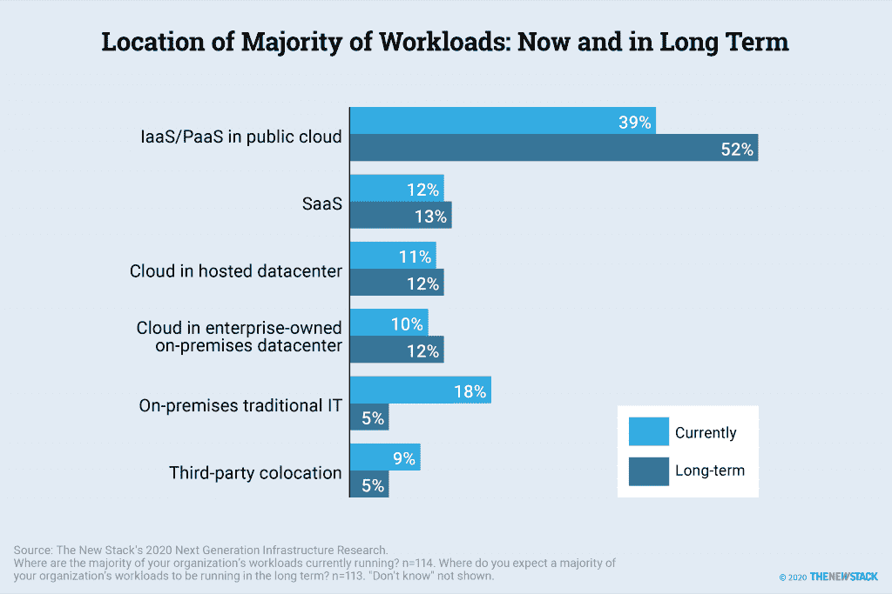

# Kubernetes 和进化建筑的下一步

> 原文：<https://thenewstack.io/kubernetes-and-the-next-step-for-evolutionary-architecture/>

回想 2012 年。当时你是如何构建云环境的？Docker、Kubernetes 和 Amazon Lambda 还没有出现。OpenStack 和 CloudFoundry 还是新生事物。微软 Azure 刚刚开始超越其作为. NET 平台即服务的根基，扩展到基础设施即服务。谷歌根本没有参与基础设施即服务(IaaS)的游戏。

一晃五年过去了，到了 2017 年，一切都已经不同了。一些 IaaS 提供商和供应商已经转向或完全退出。亚马逊、谷歌和微软现在主导着这个领域。集装箱化正在飞速发展。

这种革命相对罕见。2010 年的前半段是试验期，后半段则更多的是精细化和标准化。自 2017 年以来，该行业一直在对容器和 Kubernetes 进行标准化，无服务器架构看起来将会继续存在。如果说我们在 2020 年学到了什么，那就是任何事情都可能发生完全出乎意料的变化。

根据最近进行的下一代 IaaS 研究，尽管市场趋于稳定，企业仍然对进一步的变化持开放态度[。当 62 名受访者被问及他们最了解的私有云时，不到一半的人表示该提供商在很大程度上满足了他们的未来需求。与较新的 AWS Outpost 和 Azure Stack 相比，VMware vSphere 和 OpenStack 不太可能满足未来的需求。虽然这两个都是专有的云解决方案，但这项研究没有提供证据表明公司有目的地在一个云上标准化另一个云。事实上，受访者被问及供应商中立的开源 IaaS 基金会，80%的受访者表示，这种项目与当今商业、专有产品竞争的能力至少对他们组织的计划有一定的影响。](https://thenewstack.io/cloud-architects-edge-multicloud-and-workload-portability-not-top-priorities/)

托管数据中心和企业自有内部数据中心中的云预计会增加，而不是减少。向公共云的迁移将来自传统的内部 IT，它可能是也可能不是虚拟化的。传统的第三方主机托管提供商越来越多地将自己重塑为边缘计算公司。

但是没有人愿意随意更换架构。咨询公司[集装箱解决方案](https://www.container-solutions.com/)的首席技术官[伊恩·克罗斯比](https://twitter.com/iandcrosby)说:“即使在理想的情况下，你的平台的核心层也很难被取代。

进化架构正在成为帮助开发团队将新技术融入应用程序的一种方式，即使这些应用程序在设计时并没有考虑新技术。

“很长一段时间，软件行业遵循这样一种观念，即架构是应该在编写第一行代码之前开发和完成的东西，”行业观察家[马丁·福勒](https://martinfowler.com/)在他的[转发](https://martinfowler.com/articles/evo-arch-forward.html)到[构建进化架构](https://www.amazon.com/Building-Evolutionary-Architectures-Support-Constant/dp/1491986360)中写道，作者是尼尔·福特、丽贝卡·帕森斯和创造了术语“进化架构”的 [Thoughtworks](https://www.thoughtworks.com/) 员工帕特·夸

“受到建筑行业的启发，人们认为成功的软件架构的标志是在开发期间不需要改变的东西，这通常是对由于重新架构事件而发生的废弃和返工的高成本的反应，”Fowler 写道。

进化架构抛弃了这种方法，转而将敏捷开发和持续交付/持续交付中的相同思想应用到架构中。克罗斯比说:“我们正试图转变观念，认为建筑是我们一直在做的事情。”。“相反，你应该设计灵活的系统，这样当新技术出现时，你就可以利用这些独立的部分。”这样，随着业务目标的变化，您可以采用支持这些目标的技术，而无需完全重新架构。

沃尔玛是一家努力确保其架构能够支持任何类型的未来应用的公司。“我们一直在全面评估、采用和适应新技术，”沃尔玛技术平台执行副总裁 Koby Avital 表示。该公司使用各种公共和私有云基础架构，并构建了自己的云原生平台来跨越所有这些不同的云。“我们还建立开发框架和运营模型，隐藏差异并简化技术之间分界线的体验，以实现高水平的开发人员生产力，”Avital 说。“我们预计这种架构将在未来几年很好地满足我们不断发展的需求。”

但是，如果您是一家寻求采用持续架构而不构建自己的多云平台和编程框架的小型公司，您应该这样做吗？克罗斯比说，为可扩展性而设计。“设计一个核心平台，当核心无法解决的新用例出现时，你可以扩展它，”他说。

开源生态系统是构建可扩展架构的重要部分。一方面，像 Kubernetes 这样的项目提供了一个强大的模型，告诉你如何构建一个可扩展的核心平台。另一方面，它们可以提供一个很好的起点，您可以结合开源社区对其进行扩展。

## 进入 Kubernetes

事实上，Kubernetes 为构建进化架构提供了一个很好的基础层。“Kubernetes 在很多方面都是一个平台对平台的平台，”克罗斯比说。“你会看到不同的风格和插件出现。”

戴尔科技的首席架构师丹尼尔·巴克对此表示赞同。“Kubernetes 提供了很大的灵活性，”他说。

Kubernetes 的崛起对于那些被过去几年云技术的快速变化弄得晕头转向的人来说是个好消息。它正在成为行业标准。“每个云提供商都有 Kubernetes 产品，”Barker 指出。“就连 OpenStack 的用户也迁移到了 Kubernetes 层。你现在所处的世界是 Kubernetes 在抽象它下面的一切。”

这意味着，一方面，你不用担心 Kubernetes 会很快消失。另一方面，你将为不久的将来发生的一切变化做好准备。

<svg xmlns:xlink="http://www.w3.org/1999/xlink" viewBox="0 0 68 31" version="1.1"><title>Group</title> <desc>Created with Sketch.</desc></svg>