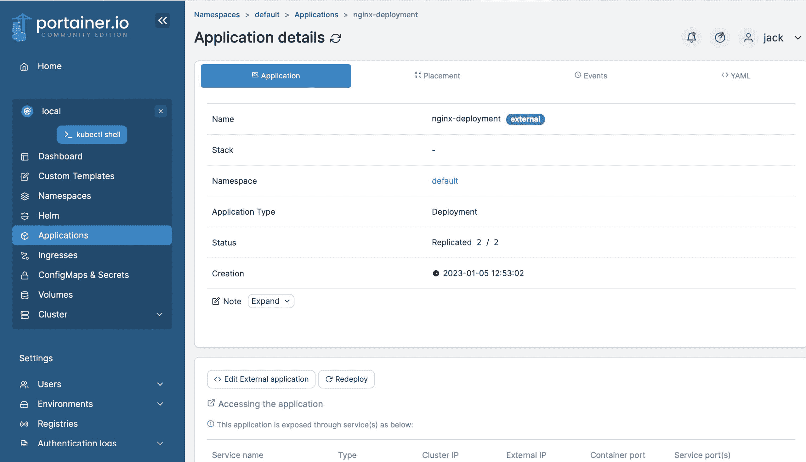

# 从命令行部署 Kubernetes 应用程序

> 原文：<https://thenewstack.io/kubernetes-app-deployment-from-the-command-line/>

如果你一直在关注我的 Kubernetes 101 系列(T1)，你可能会发现(T2)有很多方法(T3)可以让 Kubernetes 变得更加简单。感谢 MicroK8s 和 Portainer，旅程不必总是充满挑战。但是即使你可以通过 Portainer 的[点击操作开始进入 Kubernetes，在某些时候你可能希望能够从命令行工作。这并不是必然的，但你永远不知道你是否会陷入这样的境地:你被要求将一个应用或服务部署到 Kubernetes 集群，却找不到](https://thenewstack.io/microk8s-and-portainer-is-the-easiest-way-to-deploy-an-application-on-kubernetes/) [Portainer GUI](https://thenewstack.io/kubernetes-101-deploy-portainer-to-a-microk8s-cluster/) 。

如果出现这种情况，您会很高兴知道如何控制命令行界面并完成工作。

这正是我们在这里要做的。我们将运行一个简单的 NGINX 部署，并从命令行完成所有工作。

## 要求

为了跟进，您需要一个正在运行的 Kubernetes 集群，在 MicroK8s 的帮助下，这个集群很容易部署。您可以在这里找到如何安装 MicroK8s [，然后在这里](https://thenewstack.io/deploy-a-kubernetes-cluster-on-ubuntu-server-with-microk8s/)找到如何向集群[添加节点。现在，因为我们正在用一个 MicroK8s 版本的 Kubernetes 进行演示，所以命令会有些不同，因为它们将使用 microk8s 和 kubectl。](https://thenewstack.io/add-nodes-to-your-microk8s-kubernetes-cluster/)

这就是你所需要的。让我们开始部署。

## 如何创建您的第一个部署

我们要做的第一件事是登录到 Kubernetes 控制器节点。登录后，使用以下命令验证您的所有节点仍处于连接状态:

microk8s kubectl 获取节点

该命令的输出应该包含类似这样的内容:

```
k8s3     Ready      &lt;none&gt;     23d     v1.24.8-2+1dda18a15eea38
k8s2     Ready      &lt;none&gt;     23d     v1.24.8-2+1dda18a15eea38
k8s1     Ready      &lt;none&gt;     23d     v1.24.8-2+1dda18a15eea38

```

现在您确定您的节点都处于就绪状态，使用命令创建一个新目录:

使用命令:
切换到新创建目录

使用:
创建新的部署 YAML 文件

```
nano nginx-deployment.yml

```

在该文件中，粘贴以下内容:

* * *

apiVersion: apps/v1
种类:部署
元数据:
名称:nginx-部署
标签:
app: nginx
规格:
副本:2 个
选择器:
匹配标签:
app: nginx
模板:
元数据:
标签:
app: nginx
规格:
容器:
–名称:nginx

上述文件的大部分内容应该是不言自明的，但是有一些部分需要密切注意，例如:

*   API version–详细说明将使用哪个版本的 API。
*   种类–详细说明您正在创建的对象的类型。
*   元数据–帮助识别对象的数据。
*   规格——您希望对象达到的状态

使用[Ctrl]+[X]键盘快捷键保存并关闭文件。

使用命令:
应用新创建的 YAML 文件

```
microk8s kubectl apply  -f  nginx-deployment.yml

```

输出应该如下所示:

```
deployment.apps/nginx-deployment created

```

使用
验证部署

```
microk8s kubectl get deployments

```

您应该会在输出中看到类似这样的内容:

```
nginx-deployment  2/2  2  2  5m32s

```

牛逼。我们继续吧。

您现在需要找出 NGINX pod 可以到达的 IP 地址。需要记住的一点是，第一次部署只适用于本地网络。下次我们将更进一步，让它在群集外可用。

要定位 NGINX pod 的 IP 地址，发出命令:

```
microk8s kubectl describe   pods nginx

```

在输出中，您应该会看到类似这样的内容:

我们的 NGINX pod 运行在 IP 地址 10.1.219.7 上。我们可以通过从控制器节点运行以下命令进行测试:

输出应该是这样的:

```
&lt;!DOCTYPE html&gt;
&lt;html&gt;
&lt;head&gt;
&lt;title&gt;Welcome to nginx!&lt;/title&gt;
&lt;style&gt;
body  {
width:  35em;
margin:  0  auto;
font-family:  Tahoma,  Verdana,  Arial,  sans-serif;
}
&lt;/style&gt;
&lt;/head&gt;
&lt;body&gt;
&lt;h1&gt;Welcome to nginx!&lt;/h1&gt;
&lt;p&gt;If you see this page,  the nginx web server is successfully installed and
working.  Further configuration is required.&lt;/p&gt;

&lt;p&gt;For online documentation and support please refer to
&lt;a  href="http://nginx.org/"&gt;nginx.org&lt;/a&gt;.&lt;br/&gt;
Commercial support is available at"
&lt;a href="http://nginx.com/"&gt;nginx.com&lt;/a&gt;.&lt;/p&gt;
&lt;p&gt;&lt;em&gt;Thank you for using nginx.&lt;/em&gt;&lt;/p&gt;
&lt;/body&gt;
&lt;/html&gt;

```

如果您的控制器节点有一个 GUI，您可以打开一个 web 浏览器，指向 http://10.1.219.7，然后查看打印的 NGINX 欢迎页面。

现在，如果您已经阅读了我以前的文章，并且[将 Portainer 安装到了 Microk8s 集群](https://thenewstack.io/kubernetes-101-deploy-portainer-to-a-microk8s-cluster/)，那么您可以登录 Portainer，进入 Applications，查看我们的 nginx 部署是否可用(图 1)。


图 1:我们的 nginx 部署正在运行。

单击列表，您会看到 pod 已经被复制到两个节点上(图 2)。



图 2:我们的 NGINX 部署不仅仅运行在一个节点上，而是两个。

当然，这不是很有用，因为您无法从集群外部访问应用程序。没关系，因为下一次我们将回到 Portainer，看看部署同一个 NGINX 应用程序有多简单，只需让它在集群外部可见。尽管使用 Portainer 这样的工具部署这样的应用程序要容易得多，但是知道如何从命令行部署也总是好的。

当然，最好是更聪明地工作，而不是更努力…这正是 Portainer 将帮助我们实现的目标。

<svg xmlns:xlink="http://www.w3.org/1999/xlink" viewBox="0 0 68 31" version="1.1"><title>Group</title> <desc>Created with Sketch.</desc></svg>