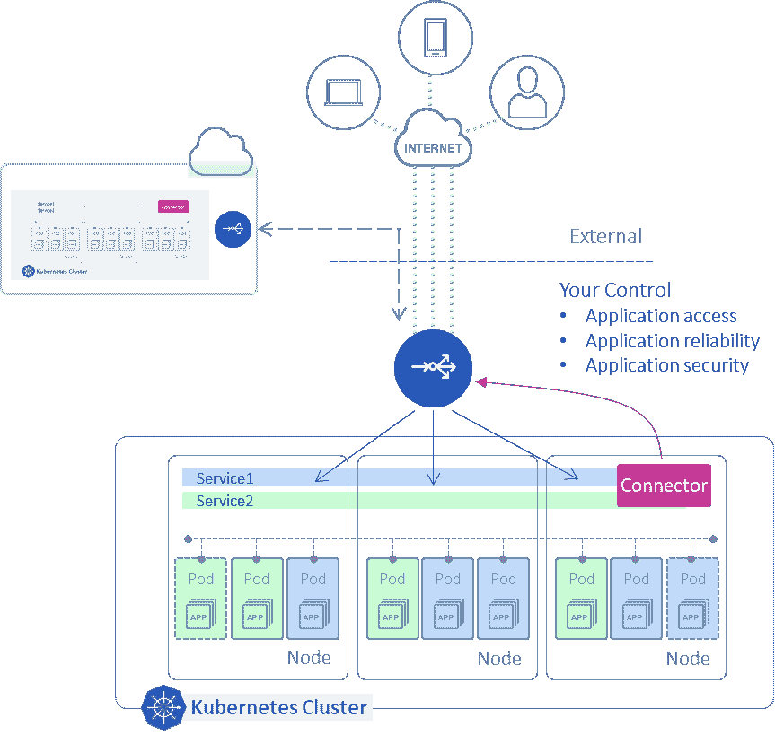

# 面向多云和混合云环境的 Kubernetes 应用

> 原文：<https://thenewstack.io/kubernetes-applications-for-multicloud-hybrid-cloud-environs/>

 [悉达多·阿格沃尔

悉达多·阿格沃尔目前是 A10 网络公司的首席产品营销工程师。他在数据网络(路由/交换)、网络安全、计算机编程和 Linux/Windows 系统领域拥有超过 15 年的经验。](https://www.linkedin.com/in/siddhartha-aggarwal-244536/) 

为了在竞争中保持领先地位，组织不断寻找快速、灵活地推动创新的方法，同时最大限度地提高运营和经济效率。为此，他们将应用程序迁移到[多云](https://www.a10networks.com/glossary/what-is-multi-cloud-environment/)和[混合云](https://www.a10networks.com/glossary/what-is-a-hybrid-cloud-environment/)环境已经有一段时间了。

最初，这些应用程序使用“提升和转移”的方法迁移到云中，保留了它们最初的整体架构。然而，这种单一的应用程序无法充分利用云提供的优势，如弹性和分布式计算，并且难以维护和扩展。

因此，作为下一步发展，组织已经开始重新构建他们现有的整体应用程序，或者开发新的容器化应用程序。

然而，部署和管理容器化的应用程序是一项复杂的任务，这就是 Kubernetes 的用武之地。最初由 Google 开发的容器编排工具 Kubernetes(也称为 K8s)已经迅速成为在公共云和私有云部署容器化应用程序的首选平台

使用 K8s，组织已经能够成功地在公共云和私有云中初始部署和管理这些容器化的应用程序。然而，他们在随后的步骤中遇到了困难，例如以简单和自动化的方式使最终用户可以从外部访问 Kubernetes 应用程序，同时仍然保持控制以确保对这些应用程序的安全和可靠的访问。

出现这种情况的主要原因是，传统的[负载平衡器](https://www.a10networks.com/glossary/what-is-a-load-balancer-and-how-does-load-balancing-work/)用于将这些应用置于前端，并使最终用户可以访问它们，它们是在考虑整体应用的情况下设计的，因此无法跟上这些 Kubernetes 应用的敏捷部署方式。

这些负载平衡器专为部署流程而设计，在该流程中，应用程序的网络资源由网络和安全团队手动调配，该流程可能需要数天甚至数周时间，然后在负载平衡器上手动配置。这个过程显然不适合与 Kubernetes 应用程序的部署过程保持同步，从而成为整个部署过程中的瓶颈。

进一步加剧这一问题的是，当在[多云和混合云](https://www.a10networks.com/blog/hybrid-cloud-and-multi-cloud-polynimbus-policy-enforcement/)环境中部署应用时，每个公共云提供商都有自己的定制负载平衡器和管理系统。

比如[亚马逊 Web 服务](https://aws.amazon.com/?utm_content=inline-mention)有自己的弹性负载均衡解决方案，与微软的 Azure 负载均衡器不同。这使得自动化应用程序部署的任务更加复杂和耗时。这也使得在不同的云环境中应用一组一致的策略的任务容易出错，因为每个负载平衡器都有自己单独的配置和操作。

## 那么，有什么解决办法呢？

为了跟上 Kubernetes 应用程序的部署，需要一个访问解决方案，使负载平衡器能够在应用程序部署和扩展时动态管理这些应用程序。

实现这一点的一种方法是部署一个入口控制器或连接器代理，将外部负载平衡器连接到 Kubernetes 应用程序。这种连接器可以监控这些应用程序的生命周期，并自动使用信息更新负载平衡器，以将流量路由到这些应用程序。随着新服务部署到 K8s 集群中，这将极大地简化和自动化配置外部负载平衡器的过程，从而消除与手动配置过程相关的延迟。

*   除了支持外部负载平衡器的动态和自动配置之外，该解决方案最好还应具备以下属性:
*   **与云无关:**上述流程在部署于单个云中时可以工作，但要真正使其在多云和混合云环境中工作，该解决方案应该有不同的外形规格，如物理、虚拟和容器，因此它可以部署在公共云和私有云。拥有跨不同云环境一致工作的解决方案还提供了相关的好处，即能够应用一组一致的策略来访问应用程序，而不管它在哪个云环境中运行。这将导致更安全的部署，并避免将配置从一个云部署移植到另一个云部署时的潜在错误。
*   **对自动化工具的支持:**解决方案要支持自动化工具，如 Terraform、 [Ansible](https://www.a10networks.com/webinars/intent-based-network-load-balancer-and-ansible/) 和 Helm，这样整个应用部署和 Day-N 操作过程都可以自动化。
*   **灵活的许可模式:**该解决方案应提供软件订阅模式，使组织能够通过在多个站点之间分配和分发容量来优化成本，以适应不断发展的业务和应用需求。
*   **集中的可见性和分析:**最后，解决方案应该提供集中的可见性和分析。这将实现主动故障排除和快速根本原因分析，从而延长应用程序正常运行时间，确保最终用户高度满意。

将应用程序作为容器化应用程序迁移到多云和混合云环境具有诸多优势，包括更高的灵活性和运营效率。然而，传统的负载平衡器是为管理单一应用程序而构建的，可能会成为部署容器化应用程序的障碍，从而阻碍获得云部署的全部优势。

此外，使用特定于云的负载平衡器会增加管理混合云基础架构的复杂性。通过部署连接到外部负载平衡器的入口控制器或连接器代理，IT 团队可以在 K8s 集群中部署新服务时，更有效地简化和自动化外部负载平衡器的配置流程。

<svg xmlns:xlink="http://www.w3.org/1999/xlink" viewBox="0 0 68 31" version="1.1"><title>Group</title> <desc>Created with Sketch.</desc></svg>