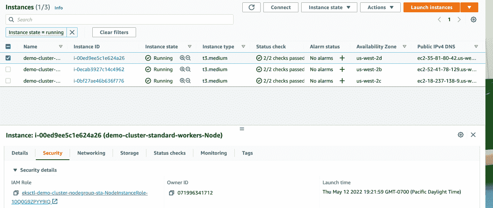
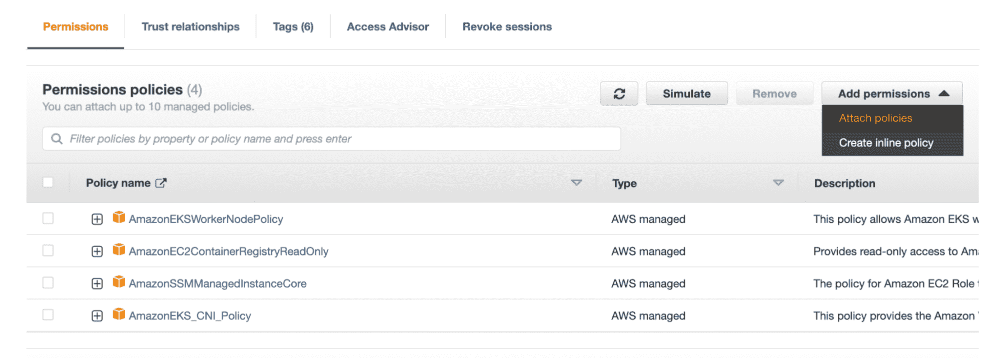
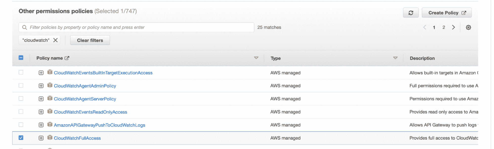
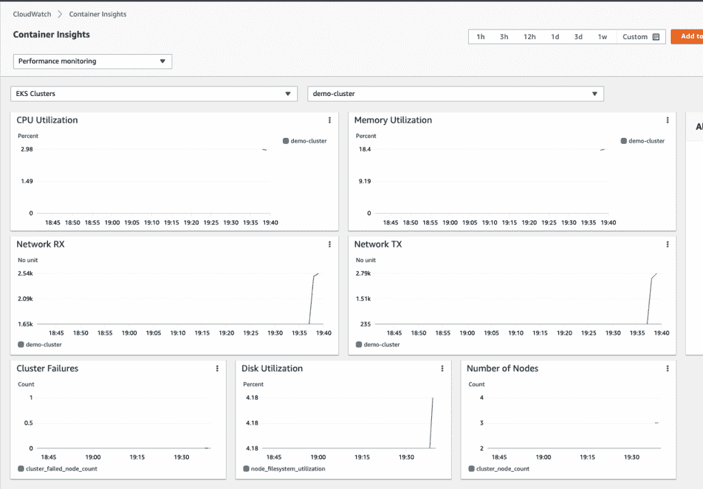
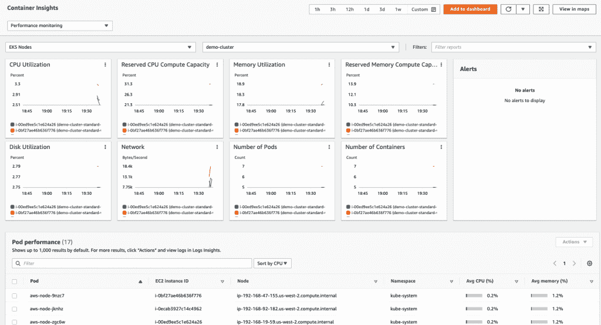

# 使用亚马逊 EKS 的 Kubernetes 即服务

> 原文：<https://thenewstack.io/kubernetes-as-a-service-using-amazon-eks/>

[](https://in.linkedin.com/in/roshan-shetty-7905a746)

 [罗山谢蒂

罗山是夸夸特公司的现场可靠性工程师。他是一个开源爱好者，主要致力于构建解决企业可靠性问题的工具。他也喜欢为各种开源项目做贡献。](https://in.linkedin.com/in/roshan-shetty-7905a746) [](https://in.linkedin.com/in/roshan-shetty-7905a746)

Kubernetes 是一款开源软件，可以帮助您管理和部署容器化的应用程序。

Kubernetes 由两个主要的组件控制平面(决定在哪里运行 pod)和一个 worker 节点(运行工作负载的地方)组成。

由于 Kubernetes 是一个复杂的系统，管理这些组件具有挑战性，这就是你可以使用 Kubernetes 作为服务解决方案的地方，如亚马逊弹性 Kubernetes 服务(EKS)。

在本帖中，我们将看到如何设置和管理 EKS，并利用 EKS 与其他 AWS 服务(亚马逊 CloudWatch、亚马逊 VPC 等)的本机集成。).

## **什么是亚马逊弹性库本内特服务(EKS)？**

亚马逊 EKS 是一个托管的 Kubernetes 服务，它可以轻松地在 AWS 上运行 Kubernetes，而无需安装和管理您的 Kubernetes 集群。AWS 负责所有繁重的工作，如集群配置、执行升级和打补丁。EKS 运行上游的 Kubernetes 版本，所以你可以轻松地将现有的 Kubernetes 集群迁移到 AWS，而不需要改变代码库。EKS 将您的基础架构运行到多个可用性区域，消除了单点故障。

## **EKS 的不同组成部分**

AWS EKS 集群由两个主要组件组成:

*   **控制平面**由运行 Kubernetes 软件 etcd 和 Kubernetes API 服务器的节点组成。AWS 负责控制平面的可扩展性和高可用性，并确保两个 API 服务器节点和三个 etcd 节点在三个可用性区域内始终可用。
*   **数据平面**是您的应用/工作负载运行的地方。它由 Kubelet 和 Kube-proxy server 组成。

亚马逊 EKS 将完全管理你的控制平面，但是你需要多少控制来管理你的数据平面取决于你的需求。AWS 提供了三个选项来管理数据平面节点。

*   **非托管工作节点:**你自己会完全管理这些。
*   **受管节点组:**这些工作节点部分由 EKS 管理，但是您仍然控制您的资源。
*   AWS Fargate: 这将完全负责管理你的工人节点。

在这个竞争激烈的云市场中，有许多云提供商提供支持使用 Kubernetes 的服务。这里有一个比较，可以帮助您选择更好地满足您需求的云提供商。

## **对比亚马逊的 EKS、谷歌的 GKE 和 Azure AKS**

在选择托管 Kubernetes 服务之前，了解每种服务的优势和劣势至关重要。所有托管服务都可以满足您轻松部署 Kubernetes 集群的目标。第一个决定是您现有的工作负载在哪里运行。继续使用你已经使用的云提供商可能更容易。

三种托管服务之间的一些比较:

*   谷歌 Kubernetes 引擎(GKE)自 2015 年以来一直在市场上。亚马逊弹性 Kubernetes 服务(EKS)和 Azure Kubernetes 服务(AKS)已于 2018 年推出。
*   GKE 控制平面对于一个区域集群是自由的；否则就是 72 美元。EKS 控制飞机花费你 72 美元，而 AKS 控制飞机是免费的。
*   AK 和 GKE 有更容易的设置。EKS 设置有点复杂，但是可以使用 eksctl 之类的工具来简化。
*   AWS 和 GKE 可以使用 Fargate 和 Autopilot 等功能管理您的工作节点。目前，AKS 不提供任何这样的功能。

既然您现在已经了解了这三种托管服务之间的区别，那么使用 EKS 的主要原因包括:

*   这是使用最广泛的 Kubernetes 托管服务。
*   像证书管理和 DNS 这样的 Kubernetes 工具与 AWS 完全集成。
*   可以自带亚马逊机器镜像(AMI)。
*   支持工具，如 Terraform 和 eksctl，以快速设置您的 EKS 集群。
*   大型用户社区支持。

## **使用 eksctl 安装 eksctl】**

本节将展示如何使用 eksctl 设置您的 EKS 集群。这是一个简单的命令行实用程序，可以帮助您设置和管理 EKS 集群。更多信息，请查看 https://github.com/weaveworks/eksctlT4 的文档。

### **先决条件**

在使用 eksctl 安装和设置 EKS 集群之前，您必须满足一些先决条件。

### **在 Linux 上安装 Kubectl**

*   *   从你的亚马逊 S3 桶下载 kubectl 二进制文件。

```
# curl -o kubectl 
https://s3.us-west-2.amazonaws.com/amazon-eks/1.22.6/2022-03-09/bin/linux/amd64/kubectl
  %  Total    %  Received  %  Xferd  Average Speed Time    Time Time  Current
 Dload  Upload Total Spent    Left  Speed
100  44.7M  100  44.7M    0 0  20.1M      0  0:00:02  0:00:02  --:--:--  20.1M

```

*   更改权限以使二进制文件可执行。

*   将二进制文件复制到$PATH，这样在执行二进制文件时就不需要键入完整的路径。或者，您可以将它添加到 bash 配置文件中，以便在 shell 初始化期间对它进行初始化。

```
# mkdir -p $HOME/bin && cp ./kubectl $HOME/bin/kubectl && export PATH=$PATH:$HOME/bin
# echo 'export PATH=$PATH:$HOME/bin' >> ~/.bashrc

```

*   使用以下命令验证安装的 kubectl 版本:

```
# kubectl version --short --client
Client Version:  v1.22.6-eks-7d68063

```

**注意:**要在 Windows 或 Mac 等其他平台上安装 Kubectl，请查看以下文档:[https://docs . AWS . Amazon . com/eks/latest/user guide/install-Kubectl . html](https://docs.aws.amazon.com/eks/latest/userguide/install-kubectl.html)

### **在 Linux 上安装 eks CTL**

*   下载最新版本的 eksctl，并使用以下命令将其解压缩:

```
# curl --silent --location "https://github.com/weaveworks/eksctl/releases/latest/download/eksctl_$(uname -s)_amd64.tar.gz" | tar xz -C /tmp

```

*   将下载的二进制文件移动到`/usr/local/bin`或您的$PATH 定义中:

```
# sudo mv /tmp/eksctl /usr/local/bin

```

*   使用以下命令验证安装的 eksctl 版本:

## **创建您的 EKS 集群**

下一步是创建具备所有先决条件的 EKS 集群。运行`eks cluster`命令并传递以下选项

*   eksctl `create cluster`将为您创建 EKS 集群。
*   `name`用来给你的 EKS 集群命名。如果忽略这个值，eksctl 将为您生成一个随机名称。
*   `version`会让你指定 Kubernetes 版本。
*   `region`是您希望在其中建立 EKS 集群的地区名称。
*   `nodegroup-name`是节点组的名称。
*   `node-type`是节点的实例类型(默认值为 m5.large)。
*   `nodes`是工作节点的总数(默认值为 2)。
*   `nodes-min`是指定工人节点的最小数量。

```
eksctl create cluster  --name demo-cluster  --version  1.22  --region us-west-2  --nodegroup-name standard-workers  --node-type t3.medium  --nodes  3  --nodes-min  1  
2022-05-13  02:06:30  [ℹ]  eksctl version  0.96.0
2022-05-13  02:06:30  [ℹ]  using region us-west-2
2022-05-13  02:06:30  [ℹ]  setting availability zones to  [us-west-2d  us-west-2c  us-west-2b]
2022-05-13  02:06:30  [ℹ]  subnets for us-west-2d  -  public:192.168.0.0/19  private:192.168.96.0/19
2022-05-13  02:06:30  [ℹ]  subnets for us-west-2c  -  public:192.168.32.0/19  private:192.168.128.0/19
2022-05-13  02:06:30  [ℹ]  subnets for us-west-2b  -  public:192.168.64.0/19  private:192.168.160.0/19
2022-05-13  02:06:30  [ℹ]  nodegroup  "standard-workers"  will use  ""  [AmazonLinux2/1.22]
2022-05-13  02:06:30  [ℹ]  using Kubernetes version  1.22
2022-05-13  02:06:30  [ℹ]  creating EKS cluster  "demo-cluster"  in  "us-west-2"  region with managed nodes
2022-05-13  02:06:30  [ℹ]  will create  2  separate CloudFormation stacks for cluster itself and the initial managed nodegroup
2022-05-13  02:06:30  [ℹ]  if you encounter any issues,  check CloudFormation console or try  'eksctl utils describe-stacks --region=us-west-2 --cluster=demo-cluster'
2022-05-13  02:06:30  [ℹ]  Kubernetes  API  endpoint  access  will  use  default  of  {publicAccess=true,  privateAccess=false}  for cluster  "demo-cluster"  in  "us-west-2"
2022-05-13  02:06:30  [ℹ]  CloudWatch logging will not be enabled for cluster  "demo-cluster"  in  "us-west-2"
2022-05-13  02:06:30  [ℹ]  you can enable it with  'eksctl utils update-cluster-logging --enable-types={SPECIFY-YOUR-LOG-TYPES-HERE (e.g. all)} --region=us-west-2 --cluster=demo-cluster'
2022-05-13  02:06:30  [ℹ]  
2  sequential tasks:  {  create cluster control plane  "demo-cluster",  
    2  sequential sub-tasks:  {  
        wait for control plane to become ready,
        create managed nodegroup  "standard-workers",
    }  
}
2022-05-13  02:06:30  [ℹ]  building cluster stack  "eksctl-demo-cluster-cluster"
2022-05-13  02:06:31  [ℹ]  deploying stack  "eksctl-demo-cluster-cluster"
2022-05-13  02:07:01  [ℹ]  waiting for CloudFormation stack  "eksctl-demo-cluster-cluster"
2022-05-13  02:07:31  [ℹ]  waiting for CloudFormation stack  "eksctl-demo-cluster-cluster"
2022-05-13  02:08:31  [ℹ]  waiting for CloudFormation stack  "eksctl-demo-cluster-cluster"
2022-05-13  02:09:32  [ℹ]  waiting for CloudFormation stack  "eksctl-demo-cluster-cluster"
2022-05-13  02:10:32  [ℹ]  waiting for CloudFormation stack  "eksctl-demo-cluster-cluster"
2022-05-13  02:11:32  [ℹ]  waiting for CloudFormation stack  "eksctl-demo-cluster-cluster"
2022-05-13  02:12:33  [ℹ]  waiting for CloudFormation stack  "eksctl-demo-cluster-cluster"
2022-05-13  02:13:33  [ℹ]  waiting for CloudFormation stack  "eksctl-demo-cluster-cluster"
2022-05-13  02:14:33  [ℹ]  waiting for CloudFormation stack  "eksctl-demo-cluster-cluster"
2022-05-13  02:15:34  [ℹ]  waiting for CloudFormation stack  "eksctl-demo-cluster-cluster"
2022-05-13  02:16:34  [ℹ]  waiting for CloudFormation stack  "eksctl-demo-cluster-cluster"
2022-05-13  02:17:34  [ℹ]  waiting for CloudFormation stack  "eksctl-demo-cluster-cluster"
2022-05-13  02:18:35  [ℹ]  waiting for CloudFormation stack  "eksctl-demo-cluster-cluster"
2022-05-13  02:20:37  [ℹ]  building managed nodegroup stack  "eksctl-demo-cluster-nodegroup-standard-workers"
2022-05-13  02:20:38  [ℹ]  deploying stack  "eksctl-demo-cluster-nodegroup-standard-workers"
2022-05-13  02:20:38  [ℹ]  waiting for CloudFormation stack  "eksctl-demo-cluster-nodegroup-standard-workers"
2022-05-13  02:21:08  [ℹ]  waiting for CloudFormation stack  "eksctl-demo-cluster-nodegroup-standard-workers"
2022-05-13  02:21:49  [ℹ]  waiting for CloudFormation stack  "eksctl-demo-cluster-nodegroup-standard-workers"
2022-05-13  02:22:48  [ℹ]  waiting for CloudFormation stack  "eksctl-demo-cluster-nodegroup-standard-workers"
2022-05-13  02:24:35  [ℹ]  waiting for CloudFormation stack  "eksctl-demo-cluster-nodegroup-standard-workers"
2022-05-13  02:24:35  [ℹ]  waiting for the control plane availability...
2022-05-13  02:24:35  [✔]  saved kubeconfig as  "/root/.kube/config"
2022-05-13  02:24:35  [ℹ]  no tasks
2022-05-13  02:24:35  [✔]  all EKS cluster resources for  "demo-cluster"  have been created
2022-05-13  02:24:35  [ℹ]  nodegroup  "standard-workers"  has  3  node(s)
2022-05-13  02:24:35  [ℹ]  node  "ip-192-168-19-59.us-west-2.compute.internal"  is ready
2022-05-13  02:24:35  [ℹ]  node  "ip-192-168-47-155.us-west-2.compute.internal"  is ready
2022-05-13  02:24:35  [ℹ]  node  "ip-192-168-92-182.us-west-2.compute.internal"  is ready
2022-05-13  02:24:35  [ℹ]  waiting for at least  1  node(s)  to become ready in  "standard-workers"
2022-05-13  02:24:35  [ℹ]  nodegroup  "standard-workers"  has  3  node(s)
2022-05-13  02:24:35  [ℹ]  node  "ip-192-168-19-59.us-west-2.compute.internal"  is ready
2022-05-13  02:24:35  [ℹ]  node  "ip-192-168-47-155.us-west-2.compute.internal"  is ready
2022-05-13  02:24:35  [ℹ]  node  "ip-192-168-92-182.us-west-2.compute.internal"  is ready
2022-05-13  02:24:38  [ℹ]  kubectl command should work with  "/root/.kube/config",  try  'kubectl get nodes'
2022-05-13  02:24:38  [✔]  EKS cluster  "demo-cluster"  in  "us-west-2"  region is ready

```

*   您可以通过执行以下命令来验证 EKS 集群是否已启动。

```
# eksctl get cluster -r us-west-2
2022-05-13  02:26:00  [ℹ]  eksctl version  0.96.0
2022-05-13  02:26:00  [ℹ]  using region us-west-2
NAMEREGIONEKSCTL CREATED
demo-clusterus-west-2True

```

*   要更新`kubeconfig`文件以使用新创建的 EKS 集群作为当前上下文，请运行以下命令:

```
# aws eks update-kubeconfig --name demo-cluster --region us-west-2
Added new context arn:aws:eks:us-west-2:123456789:cluster/demo-cluster to  /root/.kube/config

```

*   要验证工作节点是否启动并运行，请使用以下命令:

```
# kubectl get nodes
NAME STATUS ROLES AGE VERSION
ip-192-168-19-59.us-west-2.compute.internal  Ready  <none>  7m24s  v1.22.6-eks-7d68063
ip-192-168-47-155.us-west-2.compute.internal  Ready  <none>  7m27s  v1.22.6-eks-7d68063
ip-192-168-92-182.us-west-2.compute.internal  Ready  <none>  7m25s  v1.22.6-eks-7d68063

```

```
# kubectl create deployment my-demo-deploy --image=nginx --replicas=3
deployment.apps/my-demo-deploy created

```

*   使用-o wide 选项验证它是否部署在集群中的不同节点上:

```
# kubectl get pods -o wide
NAME READY STATUS RESTARTS AGE IP NODE NOMINATED NODE READINESS GATES
my-demo-deploy-85d855f586-d9chq  1/1  Running  0  29s  192.168.92.101  ip-192-168-92-182.us-west-2.compute.internal  <none>  <none>
my-demo-deploy-85d855f586-kqr8n  1/1  Running  0  29s  192.168.53.46  ip-192-168-47-155.us-west-2.compute.internal  <none>  <none>
my-demo-deploy-85d855f586-x7bjj  1/1  Running  0  29s  192.168.18.111  ip-192-168-19-59.us-west-2.compute.internal  <none>  <none>

```

## **亚马逊云观察容器洞察**

*   亚马逊 EKS 与亚马逊 CloudWatch 等其他 AWS 服务集成，为您的容器化应用程序收集指标和日志:亚马逊 CloudWatch container insight 从您的容器化微服务和应用程序中收集、总结和聚合指标和日志。这些指标包括 CPU、内存、网络和磁盘利用率。它还帮助您提供诊断信息，例如容器重启失败，以便快速隔离和解决这些问题。
*   它作为 CloudWatch 代理的容器化版本运行，以发现所有正在运行的容器。此外，它作为一个 daemonset 作为一个日志收集器运行，在集群中的每个节点上都有一个 CloudWatch 插件。然后，它通过收集所有性能数据来创建聚合指标。

### **安装 CloudWatch Container Insight**

在这个阶段，您的 EKS 集群已经启动并正在运行。下一步是安装 CloudWatch container insight 来收集您的指标。但是首先，确保身份和访问管理(IAM)策略附加到您的实例。在这种情况下，您需要一个 CloudWatch 完全访问策略用于您的 worker 节点，这样它就可以将指标推送到 CloudWatch。



图 1: EKS 工作节点 EC2 控制台



图 2:带有附加到工作节点的策略的 IAM 控制台



图 3:将 CloudWatchFullAccess 策略附加到工作节点

*   通过运行以下命令部署 CloudWatch container insight:

```
# curl https://raw.githubusercontent.com/aws-samples/amazon-cloudwatch-container-insights/latest/k8s-deployment-manifest-templates/deployment-mode/daemonset/container-insights-monitoring/quickstart/cwagent-fluentd-quickstart.yaml | sed "s/{{cluster_name}}/demo-cluster/;s/{{region_name}}/us-west-2/" | kubectl apply -f -
%  Total  %  Received  %  Xferd  Average  Speed  Time  Time  Time  Current

Dload Upload Total Spent Left Speed
100  15896  100  15896  0  0  320k  0  --:--:--  --:--:--  --:--:--  323k
namespace/amazon-cloudwatch created
serviceaccount/cloudwatch-agent created
clusterrole.rbac.authorization.k8s.io/cloudwatch-agent-role created
clusterrolebinding.rbac.authorization.k8s.io/cloudwatch-agent-role-binding created
configmap/cwagentconfig created
daemonset.apps/cloudwatch-agent created
configmap/cluster-info created
serviceaccount/fluentd created
clusterrole.rbac.authorization.k8s.io/fluentd-role created
clusterrolebinding.rbac.authorization.k8s.io/fluentd-role-binding created
configmap/fluentd-config created
daemonset.apps/fluentd-cloudwatch created

```

*   验证 CloudWatch 和 Fluentd pods 是在 amazon-cloudwatch 名称中创建的；运行以下命令:

```
# kubectl get all -n amazon-cloudwatch
NAME READY STATUS RESTARTS AGE
pod/cloudwatch-agent-5295c  1/1  Running  0  4m54s
pod/cloudwatch-agent-jvxsl  1/1  Running  0  4m54s
pod/cloudwatch-agent-nncjk  1/1  Running  0  4m54s
pod/fluentd-cloudwatch-6q5m5  1/1  Running  0  4m51s
pod/fluentd-cloudwatch-9qp6f  1/1  Running  0  4m51s
pod/fluentd-cloudwatch-f8kqd  1/1  Running  0  4m51s
NAME DESIRED CURRENT READY UP-TO-DATE AVAILABLE NODE SELECTOR AGE
daemonset.apps/cloudwatch-agent  3  3  3  3  3  <none>  4m54s
daemonset.apps/fluentd-cloudwatch  3  3  3  3  3  <none>  4m51s

```

*   *   一旦配置了 CloudWatch container insight，您就可以看到跨 EKS 集群的各种指标，如 CPU、内存、磁盘和网络统计数据。
    *   转到 CloudWatch 仪表盘[https://console.aws.amazon.com/cloudwatch/home](https://console.aws.amazon.com/cloudwatch/home)；在 Container Insights 下，单击“Performance monitoring”查看各种指标。



图 4:查看 EKS 集群指标的 CloudWatch container insight 控制台



图 5:查看 EKS 节点指标的 CloudWatch container insight 控制台

## **亚马逊虚拟私有云(VPC)使用 VPC CNI 插件进行 Pod 联网**

AWS EKS 使用用于 Kubernetes 的 AWS VPC 容器网络接口(CNI)插件支持虚拟专用云(VPC)网络。使用这个插件，Kubernetes 豆荚拥有与 VPC 网络相同的 IP 地址。更多信息，请查看以下链接:【https://github.com/aws/amazon-vpc-cni-k8s 

*   *   *   CNI 使用 EC2 为一个主机实例提供多个弹性网络接口(Eni ),因此每个接口将从 VPC 池中获得多个 IP。然后，它将这些 IP 分配给 pod，将 ENI 连接到 pod 创建的 VETH(虚拟以太网)端口，最后，Linux 内核会处理其余的事情。这种方法的优点是，每个 pod 将拥有从 VPC 分配的真正可路由的 IP 地址，并且可以与其他 pod 和 AWS 服务进行通信。
        *   为了实现网络策略，EKS 使用了 Calico 插件。calico 节点代理部署在集群中的每个节点上。这有助于使用边界网关协议(BGP)路由群集中所有节点之间传播的信息。

## **基于角色的访问控制的身份和访问管理(IAM)**

对于 EKS，Kubernetes 命令的授权由基于角色的访问控制(RBAC)管理，但是对于 AWS 命令，身份和访问管理(IAM)同时管理身份验证和授权。EKS 与 IAM authenticator 服务紧密集成，后者使用 IAM 凭证对 Kubernetes 集群进行身份验证。这大大有助于避免为 Kubernetes 访问管理单独的凭证。一旦身份被认证，RBAC 就被用于授权。以下是一步一步的步骤:

*   *   *   假设您调用了一个 kubectl 来获取 pod。在这种情况下，您的 IAM 身份随 Kubernetes 调用一起传递。
        *   Kubernetes 通过使用 authenticator 工具来验证 IAM 身份。
        *   基于身份验证器令牌的响应被传回 Kubernetes。
        *   Kubernetes 检查 RBAC 的授权。这是允许或拒绝 pod 呼叫的地方。
        *   Kubernetes API 要么允许要么拒绝这个请求。

## **亚马逊弹性容器注册(ECR)库**

Amazon Elastic Container Registry(ECR)存储库是一个完全托管的存储容器图像的存储库。每个 AWS 帐户都有一个(默认的)ECR 注册中心，但是您可以创建一个或多个注册中心来存储容器映像。ECR 与身份和访问管理(IAM)等其他 AWS 服务很好地集成在一起，您可以使用它来设置权限以控制访问。您可以使用 ECR 来存储其他工件，如舵图。

要将您的映像推送到 ECR 存储库，请执行以下步骤

*   *   *   通过检索身份验证令牌，向您的注册表验证您的 docker 客户端:

```
aws ecr get-login-password  --region us-west-2  |  docker login  --username AWS  --password-stdin1234567890.dkr.ecr.us-west-2.amazonaws.com

```

**注意:**认证令牌仅在自其发布之时起的 12 小时内有效。

*   *   *   通过运行下面的命令构建 Docker 映像。如果您的映像已经构建好，请跳过这一步。有关从头创建 docker 文件的更多信息，请查看以下链接:

[https://docs . AWS . Amazon . com/AmazonECS/latest/developer guide/create-container-image . html](https://docs.aws.amazon.com/AmazonECS/latest/developerguide/create-container-image.html)

```
docker build  -t  my-eks-repo  .

```

*   *   *   标记图像，以便可以将其推送到存储库。

```
docker tag my-eks-repo:latest1234567890.dkr.ecr.us-west-2.amazonaws.com/my-eks-repo:latest

```

**注意:** 1234567890 是你的 AWS 账户 ID。替换为您的帐户 ID:

*   *   *   将新创建的映像推送到 ECR 注册表。

```
docker push  1234567890.dkr.ecr.us-west-2.amazonaws.com/my-eks-repo:latest

```

## **结论**

亚马逊 EKS 是使用最广泛的 Kubernetes 托管服务之一。在本文中，您了解了如何设置 EKS 集群和部署工作负载。使用 EKS 的主要优势之一是它与身份管理和虚拟私有云等 AWS 服务的集成。此外，AWS 将负责所有繁重的工作，如修补、执行升级和配置您的集群。最重要的是，如果您使用像 Fargate 这样的 AWS 产品，AWS 将管理您的 worker 节点。

### **Plug:使用 K8s 和 Squadcast 以获得更快的分辨率**

[Squadcast](https://www.squadcast.com/) 是一款事故管理工具，专门用于现场可靠性工程。它可以让您摆脱不想要的警报，接收相关通知，并与流行的 ChatOps 工具集成。您还可以使用虚拟事件作战室协同工作，并使用自动化来消除辛劳。

<svg xmlns:xlink="http://www.w3.org/1999/xlink" viewBox="0 0 68 31" version="1.1"><title>Group</title> <desc>Created with Sketch.</desc></svg>