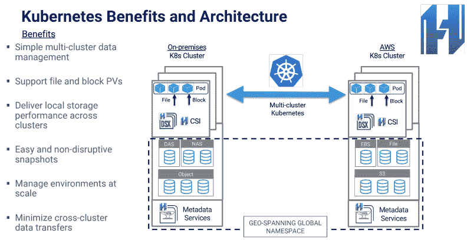
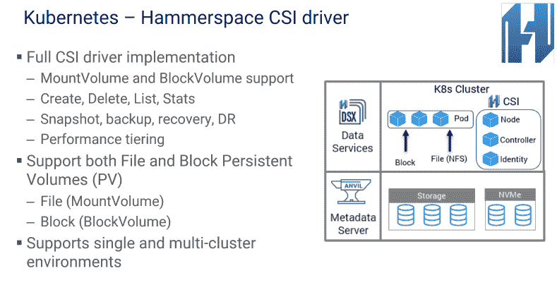

# 基于 Kubernetes 的 Hammerspace 首次推出数据即微服务

> 原文：<https://thenewstack.io/kubernetes-based-hammerspace-debuts-data-as-a-microservice/>

关于 [Hammerspace](http://www.hammerspace.com/) ，David Flynn 想让你知道的第一件事是，它不仅仅是另一家存储公司:该公司是第一家提供数据即微服务的公司。

根据一份声明，该公司周二推出了“部署持久数据即微服务，同时跨多个 Kubernetes 集群、内部或任何云中扩展有状态应用程序”的能力。

Hammerspace 的首席执行官弗林说:“围绕微服务的热潮都是基于 it 无状态的前提，而挑战在于，在某些时候，你必须与一个组织的持久数据相结合。”“让一家公司有价值的是他们的数据。如何在容器环境中处理数据是一个挑战。我们代表数据的容器化，”

“我们不是一家仓储公司，”他说。“我们不是向您销售一种新的存储产品。这是这个世界最不需要的。我们说数据应该表现得更像你的容器。它应该非常敏捷，”他说。

退一步说，Hammerspace 背后的基本思想是元数据与数据的分离，以及定位和访问数据的服务与存储数据的服务的分离。但是实际上，在将数据虚拟化引入容器的过程中, [Hammerspace 所做的事情很少是简单的。Flynn 在下面引用的一个演示中做了一个简单的类比:](https://gigaom.com/2018/11/12/from-storage-to-data-virtualization/)

[https://www.youtube.com/embed/MD81pWu7QqE?feature=oembed](https://www.youtube.com/embed/MD81pWu7QqE?feature=oembed)

视频

“这就像使用 DNS，”弗林在演示中解释道。“如果您的 DNS 服务器必须代理所有流量，您能想象吗？将控制平面和数据路径耦合起来，类似于让 DNS 基础设施也必须通过管道传输互联网上的所有信息。这是行不通的，”弗林说。“分离是这把钥匙的组成部分。我们将此称为“数据即服务”，因为这允许您以服务的形式跨基础架构访问数据，而不考虑数据的物理位置。”

GigaOm 在公司发布会上写的一篇文章试图消除任何怀疑，同时承认这种可能性。

“HammerSpace 的辉煌只有一个原因。它以某种方式解决或更好地隐藏了数据重力的问题，并允许他们的数据即服务平台通过 NFS 或 S3 等标准协议在多云环境中提供虚拟化视图来虚拟化数据集，”该网站解释道，并提供了以下视频作为进一步的证据:

[https://www.youtube.com/embed/4949E6zdPAA?feature=oembed](https://www.youtube.com/embed/4949E6zdPAA?feature=oembed)

视频

回到本周的新闻，该公司现在正在将这种数据虚拟化带到微服务中，Flynn 解释说，它将长期有状态数据的价值带到了无状态的容器化应用程序中。

“企业需要的是一种将企业数据连接到容器环境并对其进行管理的方法。Flynn 说:“无状态的微服务只能让你到此为止。“必须插入一些东西，并将数据同步回长期受治理和存在的企业数据。这些数据库必须将它们摄取的数据存储在某个地方。我们提供了一个平台，在这个平台上，他们的状态可以被容纳、管理和复制，因此他们也可以成为记录系统。”

该公司无疑带来了一些专业知识。Hammerspace 的首席技术官是[特隆德·米克尔巴斯特](https://www.linkedin.com/in/trond-myklebust-9a81791/)，他是 NFS Linux 堆栈的维护者，也是一个团队的成员，他说这个团队负责“超过 70%的独立于存储管理数据的增强功能”

## 与库伯内特一起玩耍

根据该公司的声明，新服务将“通过多集群 Kubernetes 的 Hammerspace 数据管理，使文件数据成为云原生数据”，并提供“一个与存储和协议无关的云数据控制平面，从基础设施中提取数据，用于自助式混合云数据管理，由机器学习和元数据管理驱动，以提供数据即服务。”

新的 Hammerspace 产品可以与上游的 Kubernetes 以及大多数主要的 Kubernetes 产品一起工作，包括 AKS、EKS、OpenShift 和 GKS，以及许多数据库系统，包括 Microsoft SQL Server、MySQL、Redis、Elastic、MongoDB 和 Cassandra。

管理 Kubernetes 的云本地计算基金会是新堆栈的赞助商。

<svg xmlns:xlink="http://www.w3.org/1999/xlink" viewBox="0 0 68 31" version="1.1"><title>Group</title> <desc>Created with Sketch.</desc></svg>