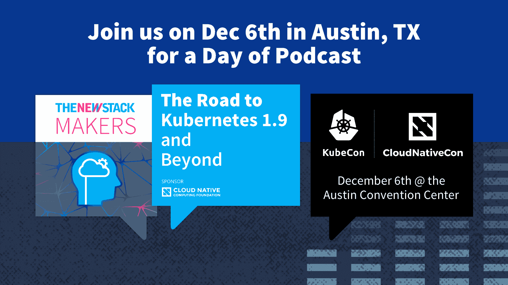

# Kubernetes 联合创始人布伦丹伯恩斯:编排正在成为一种商品

> 原文：<https://thenewstack.io/kubernetes-co-founder-brendan-burns-orchestration/>

[Kubernetes 联合创始人布伦丹·伯恩斯:编排正在成为一种商品](https://thenewstack.simplecast.com/episodes/kubernetes-co-founder-brendan-burns-orchestration-is-becoming-a-commodity)

2016 年 7 月，[Kubernetes 容器编排软件的联合创始人之一 Brendan Burns](https://www.linkedin.com/in/brendan-burns-487aa590/) 加入[微软](https://azure.microsoft.com/en-us/?v=17.14)。此次招聘是微软参与 Kubernetes 社区的一系列举措之一。一年后的 2017 年 7 月，微软甚至加入了管理开源 [Kubernetes](/category/kubernetes/) 项目的[云原生计算基金会](https://www.cncf.io/)。

在本月早些时候举行的 2017 年欧洲多克顿会议上，我们与 Burns 讨论了 Kubernetes 的广泛采用及其对社区的影响。在这次会议上，Docker [宣布将 Kubernetes 作为一个管弦乐队](https://thenewstack.io/docker-fully-embraces-kubernetes/)，就在它自己的 Docker Swarm 旁边。

我们讨论了编排是如何成为一种商品的。

“堆栈的这一层应该成为我们构建的枯燥部分和我们在其上构建的工具，以及使开发人员更具生产力的东西。这是我真正感到兴奋的事情。这是一个很好的机会，让全世界所有的容器用户看到这种关注和合作，”伯恩斯说。

“如果你看看可以部署容器编排器的 Azure 容器服务，你可以零成本部署 Kubernetes。编排是免费的。我认为这确实指出了一个事实，即用户希望消费面向容器的原语，”他补充道。

在对话接近尾声时，我们谈到了微软与 Kubernetes 社区的合作，此外还围绕该项目的大规模采用进行了非常有见地的讨论。我们还介绍了 Docker 越来越多地参与 Kubernetes，以及它将如何帮助这个项目。

[https://www.youtube.com/embed/47MJxt7DCy8?feature=oembed](https://www.youtube.com/embed/47MJxt7DCy8?feature=oembed)

视频

### 在这个版本中:

[1:07:](https://thenewstack.simplecast.com/episodes/kubernetes-co-founder-brendan-burns-orchestration-is-becoming-a-commodity?t=1:07) Docker 拥抱 Kubernetes
的决定 [3:16:](https://thenewstack.simplecast.com/episodes/kubernetes-co-founder-brendan-burns-orchestration-is-becoming-a-commodity?t=3:16) 论 Docker 在 Kubernetes 生态系统中的理想参与度或贡献
[7:16:](https://thenewstack.simplecast.com/episodes/kubernetes-co-founder-brendan-burns-orchestration-is-becoming-a-commodity?t=7:16)Burns 为何加入微软。
[9:24:](https://thenewstack.simplecast.com/episodes/kubernetes-co-founder-brendan-burns-orchestration-is-becoming-a-commodity?t=9:24) 探究伯恩斯在微软的角色。
[10:32:](https://thenewstack.simplecast.com/episodes/kubernetes-co-founder-brendan-burns-orchestration-is-becoming-a-commodity?t=10:32) 微软在 Kubernetes 社区中的贡献
[12:04:](https://thenewstack.simplecast.com/episodes/kubernetes-co-founder-brendan-burns-orchestration-is-becoming-a-commodity?t=12:04) 确保 Kubernetes 在继续扩展的同时拥有适当的制衡机制。

云本地计算基金会和微软 T21 是这个新体系的赞助商。

<svg xmlns:xlink="http://www.w3.org/1999/xlink" viewBox="0 0 68 31" version="1.1"><title>Group</title> <desc>Created with Sketch.</desc></svg>