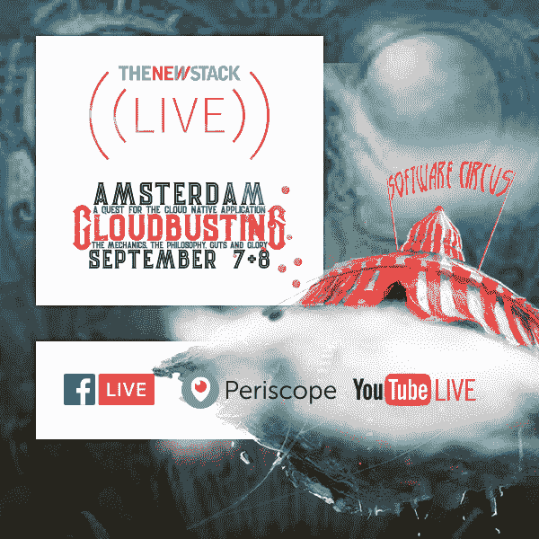

# Kubernetes 联合创始人蒂姆·霍金谈可扩展性和生态系统

> 原文：<https://thenewstack.io/kubernetes-co-founder-tim-hockin-extensibility-ecosystem/>

[Kubernetes 1.7 和扩展性](https://thenewstack.simplecast.com/episodes/kubernetes-1-7-and-extensibility)

如果没有他，开源容器编排引擎就不会存在，编排的整个概念也可能永远不会实现，其中一个人不相信他使之可行的平台真正处于新兴生态系统的中心。是的，我们称之为“Kubernetes 生态系统”，但谷歌的蒂姆·霍金在这一集的 [The New Stack Makers](https://thenewstack.io/podcasts/makers) 播客中解释说，他认为该平台更像是一种更大的生态系统的中心，甚至是“生态系统”，复数形式。

“Kubernetes 最初真正打算做的一部分，”Hockin 说，“是提供生态系统的中枢。有网络生态系统、存储生态系统和安全生态系统。在现在的网络生态系统中，有一种新产品需要销售:网络策略。人们在过去的一年里一直在创新，看到这一点真的很令人兴奋。对于像生态系统扩展这样的事情，我们已经正式确定了一些扩展模式。”

在这里，Hockin 向我们解释了该平台的最新版本如何用[自定义资源定义](https://thenewstack.io/extend-kubernetes-1-7-custom-resources/)替换其最初的可扩展性构造，称为第三方资源。Hockin 现在通过[云本地计算基金会](https://www.cncf.io/)为 Kubernetes 项目贡献他的时间和努力，该基金会是新堆栈即将推出的电子书*Kubernetes 生态系统的状态*的基金会赞助商。

[cyclone slider id = " kubernetes-series-book-1-赞助商"]

### 在这个版本中:

[3:58:](https://thenewstack.simplecast.com/episodes/kubernetes-1-7-and-extensibility?t=3:58) 分解 Kubernetes 模块化。
[10:57:](https://thenewstack.simplecast.com/episodes/kubernetes-1-7-and-extensibility?t=10:57)Kubernetes 作为一个项目指向 Prometheus 等解决方案有什么好处？
[12:33:](https://thenewstack.simplecast.com/episodes/kubernetes-1-7-and-extensibility?t=12:33)Kubernetes 1 有什么变化。7 对生态系统的贡献，企业应该如何整合 Kubernetes 向前发展？
[23:36:](https://thenewstack.simplecast.com/episodes/kubernetes-1-7-and-extensibility?t=23:36) 定义适当的 Kubernetes 抽象。
[31:30:](https://thenewstack.simplecast.com/episodes/kubernetes-1-7-and-extensibility?t=31:30) 在 Kubernetes 中使用多个应用程序和不同的应用程序模型。
[36:02:](https://thenewstack.simplecast.com/episodes/kubernetes-1-7-and-extensibility?t=36:02) 客户端 Kubernetes 讨论栈管理。

云本地计算基金会和谷歌 T21 是这个新体系的赞助商。

<svg xmlns:xlink="http://www.w3.org/1999/xlink" viewBox="0 0 68 31" version="1.1"><title>Group</title> <desc>Created with Sketch.</desc></svg>