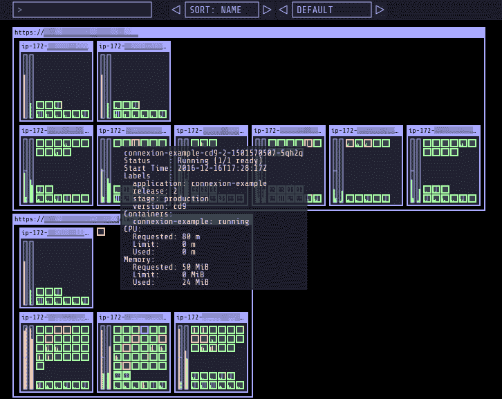

# Kubernetes 仪表板:你需要知道的一切

> 原文：<https://thenewstack.io/kubernetes/kubernetes-dashboards/>

Kubernetes 自带 web UI，用于使用向导将容器化的应用程序部署到集群，对工作负载进行故障排除并管理集群资源——称为 Dashboard。但是还有其他的选择。

## 什么是 Kubernetes 仪表板？

在一个地方查看日志、指标和错误报告非常有用，如果您更喜欢使用图形界面而不是命令行，您可以启动滚动更新、扩展 pod 和节点、创建和重启 pod 以及作业和部署等其他资源，或者查看所有正在运行的服务并进行编辑。

Kubernetes 仪表板实际上是一个容器，您必须[选择部署](https://kubernetes.io/docs/tasks/access-application-cluster/web-ui-dashboard/)，因此如果您选择使用不同的 Kubernetes 仪表板来管理、监控和故障排除应用程序和集群本身，它不会消耗资源。

## Kubernetes 仪表板的优势

Kubernetes 有各种各样的替代仪表板:一些旨在简化操作并提供护栏，另一些则添加高级功能或将 Kubernetes 与现有的管理生态系统集成。一些在集群上运行，一些在您的本地工作站上运行，您也可以考虑 SaaS 解决方案，如 [Datadog](https://www.datadoghq.com/solutions/kubernetes/) 和 [ContainIQ](https://prometheus.io/community/) :您选择什么将取决于您是否想要监控 [Kubernetes 集群](https://thenewstack.io/best-practices-for-securely-setting-up-a-kubernetes-cluster/)本身、主机服务器的性能、应用和服务层或整个堆栈。

## 附加 Kubernetes 仪表板选项

您可能还想考虑仪表板的含义，如头灯、透镜或八分仪，它们具有读写权限，因此您可以使用它们进行更改，就像使用 [kubectl](https://thenewstack.io/kubecost-monitor-kubernetes-costs-with-kubectl/) 一样。这可能会有所帮助，但如果您希望通过这些工具避免带外更改，请记住使用 RBAC 和准入控制器，因为您使用的是 GitOps 自动化管理。

### **前照灯**

Kinvolk 的 Kubernetes web UI 最开始只有集群、工作负载、存储、网络和安全信息的窗格，混合了标题指标和不同对象的细节，但你可以显著扩展 [Headlamp](https://headlamp.dev/) 或只需用前端[插件](https://kinvolk.github.io/headlamp/docs/latest/development/plugins/building/)修改界面(这些插件很容易编写，因为它们是用 JavaScript 编写的)。

即使没有这些，Headlamp 也非常强大，具有良好的性能——我们喜欢它在界面中为您提供 Kubernetes 对象的文档。

不同寻常的是，Headlamp 让你选择在你的桌面上本地运行它，或者如果经常使用的话，直接在集群中运行[。身份验证通过 OpenID Connect (OIDC)进行。](https://kinvolk.io/docs/headlamp/latest/installation/in-cluster/)

### **Skooner(原 K8dash)**

一个完全基于 web 的仪表板，既有详细的桌面视图，又有针对移动设备运行而优化的更简单的界面，因此您可以从几乎任何地方获得您的集群的实时视图， [Skooner](https://github.com/skooner-k8s/skooner) 既强大又受欢迎——它现在是 CNCF 的一个沙盒项目，它可能会在未来看到像多集群支持这样的缺失功能。

如果您已经使用 OIDC 对您的集群进行身份验证，您可以通过添加环境变量来使用它登录到仪表板:如果没有，您可以使用服务帐户令牌或节点端口服务。Skooner 易于安装，并且只运行一个服务，但是它依赖于 [metrics-server](https://github.com/kubernetes-incubator/metrics-server) 来获得实时指标。您可以监控和管理一系列集群对象—名称空间、节点、pod、副本集、部署、存储、RBAC 配置和工作负载—请参阅日志和文档，使用 YAML 编辑器编辑资源，或者使用浏览器窗口中的终端将 SSH 编辑到正在运行的 pod 中。

### **编织范围**

由 [Weaveworks](https://www.weave.works/oss/scope/) 、 [Scope](https://github.com/weaveworks/scope) 维护的开源是一个针对 Docker 和 Kubernetes 的监控、可视化和管理 web 平台，它可以自动生成您的容器基础设施和特定应用程序的地图，以帮助您解决稳定性和性能问题。您可以查看流程、容器、编排器和主机的拓扑结构，深入了解详细信息和指标，或者启动命令行与容器进行交互，如果您想做的不仅仅是暂停、停止、重启或删除。

### **镜头**

越来越多的开发者需要至少做少量的 Kubernetes 操作。 [Lens](https://k8slens.dev/) 实际上是一个桌面 IDE，它对 Kubernetes 集群进行编目，并允许您甚至在具有数千个 pod 的超大型集群中探索和创建资源。Lens Desktop 最初由 VMware 创建，然后由 Mirantis 开源，但也有各种用于安全扫描和协作的商业模块与之集成。

设置相当简单，因为安装程序使用设备上现有的 kubeconfig 文件，所以您不必设置额外的权限或认证选项。如果您希望显示指标而不是目录视图(考虑文件或空闲通道的目录),以便查看和编辑集群中的 pod、部署、名称空间、存储、网络、作业、自定义资源和其他对象，您可以[将其配置为与 Prometheus](https://docs.k8slens.dev/main/catalog/settings/#prometheus) 一起使用，以查看实时统计数据和实时日志流。开发人员可以使用 Lens 从 Helm charts 安装应用程序，在终端窗口中编辑对象，而不是使用 kubectl，或者添加[有限范围的插件](https://github.com/lensapp/lens-extensions)以获得更多功能。

如果您只想在 IDE 中查看 Kubernetes 集群， [Kubernator](https://marketplace.visualstudio.com/items?itemName=smpio.kubernator-vscode) 是一个 Visual Studio 代码扩展，它为您提供了一个 Kubernetes 对象树查看器和清单编辑器，但没有仪表板。

### **八分圆**

最初由 Heptio 开发并被 VMware 采用作为其 Tanzu 项目的一部分， [Octant](https://github.com/vmware-tanzu/octant) 似乎不再处于活跃的开发中，并且它还没有达到 1.0 版本。然而，它仍然很受欢迎，您可能会发现它对于可视化集群工作负载、名称空间、元数据和其他实时信息很有用，开发人员需要这些信息来了解应用程序如何在集群上运行——特别是如果您对 Kubernetes 还没有深入的了解。

Octant 在您用来管理 Kubernetes 集群的工作站上本地运行，因此它不会耗尽集群资源(如果您使用 k3s、KIND 或类似选项在资源最少的系统上获得 Kubernetes，这将特别受欢迎)。像 Lens 一样，它使用您的 kubeconfig 文件进行设置。

Octant 称自己是“一个具有仪表板视图的平台”,而不是仪表板。该界面分为应用程序、Kubernetes 名称空间概述、集群概述和供您选择的[插件](https://github.com/topics/octant-plugin)面板(可扩展性是 Octant 的一大优势)，图表显示应用程序的结构，标签过滤缩小您看到的范围，颜色编码帮助您发现潜在的问题。

### **Kube-Ops 视图**

[Kubernetes Operational View](https://codeberg.org/hjacobs/kube-ops-view)(KOV)是一个只读的系统仪表板，在本地运行，旨在让您在一个屏幕上了解多个集群的概况。相当复古的控制台风格 GUI 实际上是用 WebGL 编写的。KOV 不是 Kubernetes 仪表板的替代品，因为您无法管理应用程序或与集群交互，但您可以一目了然地看到状态和资源使用情况。

### **普罗米修斯**

您可能已经在使用 [Prometheus](https://prometheus.io/) 来监控集装箱化的工作负载，因为这个毕业于 CNCF 的项目是一个非常受欢迎的监控和警报工具包，具有针对许多工具和云的服务发现和针对广泛应用的[集成](https://prometheus.io/docs/instrumenting/exporters/)，通常与 Grafana 一起使用来创建仪表板。Kubernetes 通过 [kube-state-metrics](https://github.com/kubernetes/kube-state-metrics) 服务以 Prometheus 格式直接公开指标，因此您可以使用它来监控您的 Kubernetes 基础设施以及容器工作负载。这个 [Grafana 模板用于设置 Kubernetes 监控仪表板](https://grafana.com/grafana/dashboards/6417-kubernetes-cluster-prometheus/)是一个快速入门的方法——或者您可以使用像 Lens 这样的工具来使用 Prometheus 指标。

Prometheus 是强大的，完全免费的，并且有一个活跃的社区可以帮助你提高速度。请记住，这是一个收集和处理指标的系统，而不是一个事件记录系统，因此您可能更喜欢像 Grafana Loki 这样的系统来处理日志，并且它不是为长期存储数据而设计的，因此它对长期趋势分析不太有用。

<svg xmlns:xlink="http://www.w3.org/1999/xlink" viewBox="0 0 68 31" version="1.1"><title>Group</title> <desc>Created with Sketch.</desc></svg>