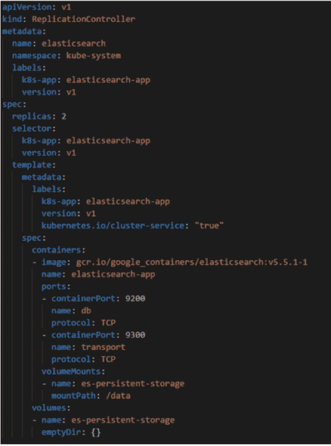
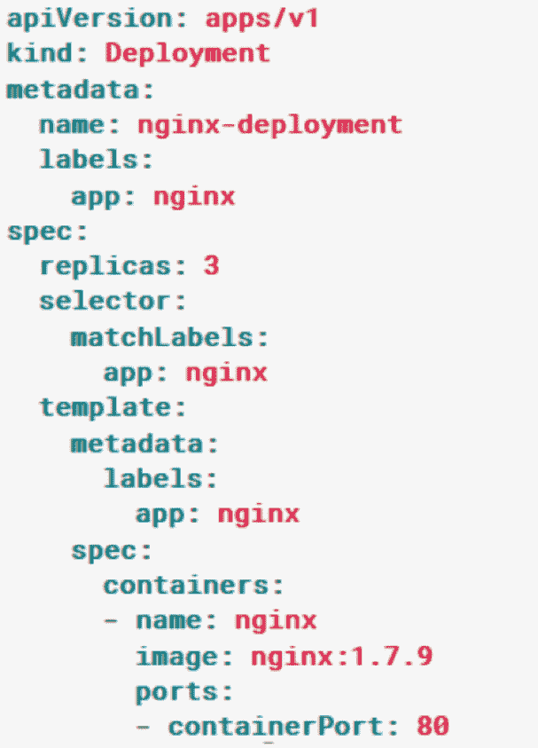

# Kubernetes 深潜和使用案例

> 原文：<https://thenewstack.io/kubernetes-deep-dive-and-use-cases/>

[](https://cloudify.co/)

 [杰瑞米·赫斯

杰瑞米·赫斯是 Cloudify 的社区经理，cloud ify 是一家开源的多云服务协调公司。他还是 OASIS TOSCA 技术委员会的技术营销&教育特别会议的联合主席。虽然他没有花时间与妻子和两个女儿在一起或酿造啤酒，但 Jeremy 是几个聚会和会议的组织者，如 OpenStack Day Israel 和 DevOpsDays Tel Aviv。](https://cloudify.co/) [](https://cloudify.co/)

当容器在 2008 年首次推出时，虚拟机(VM)是优化数据中心物理资源的最先进选项。这种安排工作得很好，但是有一些缺陷:虚拟机使用了太多的资源，因为它们需要一个完整的操作系统，并且模拟指令到达物理 CPU。即使有一些像英特尔 VT-x 和 AMD-V 这样试图解决仿真问题的技术，虚拟机也在裸机之后。

容器的目标是最大限度地提高资源利用率，以达到与虚拟机相似的裸机性能。为此，所有应用程序共享一个公共内核，这些应用程序可以根据需要选择任何操作资源。所有容器都有对资源(如 CPU、内存、磁盘和网络)的独占访问权，并且每个容器都可以由一个管理人员确定优先级。换句话说，容器可以在裸机上运行，同时共享资源，但是不能访问其他容器的资源。

容器如何确保高可用性、灾难恢复或可伸缩性？Kubernetes(昵称 K8S)等容器编排系统提供了一个解决方案。这些系统负责处理一个或多个机器集群，并检测其上运行的每个映像的可用性。集群的规模可以从三台机器到数千台机器和容器不等，如果需要，可以分布在不同的云提供商之间。如果机器发生故障，该工具应该能够将其容器转移到另一个节点，同时保持整个集群的运行。

## 作为多云操作系统的 Orchestrators

Container orchestrators 处理多台机器，这些机器可以位于同一数据中心，也可以位于不同提供商提供的不同物理位置。事实上，当使用像 Kubernetes 这样的 orchestrator 工具时，它创建了一个抽象，组织不需要知道*在哪里*或者*如何*分配它的计算资源。orchestrator 工具将云提供商的能力转化为易于替代的商品，或者更好的是，组织可以在不同的提供商之间分配工作负载。

拥有本地数据中心的公司也可以从容器编排器中受益。如果 orchestrator 部署在本地基础架构中，则云上的无限计算资源将不可用。然而，公司可以以同样的方式管理资源，这使得在必要时可以轻松地进行迁移。

另一种使用情形是，除了内部资源之外，运营商希望使用无限的云计算能力。混合云旨在利用公司现有的硬件资源，同时增加计算能力，而无需购买新硬件。

像 Kubernetes 这样的容器编排工具有能力作为一个多云操作系统。公司不需要知道他们在处理什么，操作系统在哪里，或者谁在提供它——他们只需要指定哪些资源需要运行。

## 库伯内特人的崛起

[Kubernetes](https://cloudify.co/kubernetes/) 于 2014 年首次发布，是一款开源的容器编排工具，可以自动扩展、分布和管理容器上的容错能力。Kubernetes 最初由 Google 创建，然后捐赠给了[Cloud Native Computing Foundation](https://www.broadcom.com/info/aiops/docker-monitoring)，它被广泛用于生产环境中，以容错的方式处理 Docker 容器和其他容器工具。作为一个开源产品，它可以在各种平台和系统上使用。 [Google Cloud](https://cloud.google.com/kubernetes-engine/) 、[微软 Azure](https://azure.microsoft.com/en-us/services/container-service/) 和[亚马逊 AWS](https://aws.amazon.com/pt/ecs/) 为 Kubernetes 提供官方支持，因此没有必要对集群本身进行配置更改。

Kubernetes 的受欢迎程度稳步上升，2017 年发布了超过 4 个主要版本。K8s 也是 2017 年 GitHub 中[讨论最多的项目，也是评论第二多的项目。](https://octoverse.github.com/)

### 部署 Kubernetes

Kubernetes 提供了一种使用容器部署应用程序的新方法。它创建了一个抽象层，可以用声明式编程而不是命令式编程来操作。这样，随着时间的推移，部署和升级服务就简单多了。下面的屏幕截图显示了一个[复制控制器](https://kubernetes.io/docs/concepts/workloads/controllers/replicationcontroller/)的部署，它控制着[pod](https://kubernetes.io/docs/concepts/workloads/pods/pod-overview/)的创建——可用的更小的 K8S 单元。该文件几乎是不言自明的:gcr.io/google_containers/elasticsearch:v5.5.1- 1 的定义*表明 Docker Elasticsearch 将被部署*。*该映像将有两个副本，并使用持久存储来存储持久数据。*



通过 Kubernetes 部署 ElasticSearch

部署工具有多种方式。例如，[部署](https://kubernetes.io/docs/concepts/workloads/controllers/deployment/)是从复制控制器升级而来，复制控制器具有执行[滚动更新](https://kubernetes.io/docs/concepts/workloads/controllers/deployment/#rollover-aka-multiple-updates-in-flight)的机制——在保持工具可用的同时更新工具。而且，可以通过声明配置[负载平衡器](https://kubernetes.io/docs/concepts/services-networking/service/#type-loadbalancer)，子网，甚至[机密](https://kubernetes.io/docs/concepts/configuration/secret/)。

计算资源偶尔会保持空闲；主要目标是避免超额，比如包含云环境成本。减少空闲时间的一个好方法是使用[名称空间](https://kubernetes.io/docs/concepts/overview/working-with-objects/namespaces/)作为集群中虚拟集群的一种形式。每个名称空间都是 Kubernetes 内部一个完全隔离的空间，这意味着可以根据需要创建几个环境，比如生产环境或登台环境。名称空间内的服务将接收一个 DNS 名称，如< service-name >。这意味着同一个名称空间内的服务只需要使用服务名向另一个服务发出请求。

根据公司的规模和目标，K8s 可以部署在非常不同的场景中:

*   内部:组织可以将自己的数据中心转变为 K8s 集群。在这种情况下，企业可以充分利用自己的资源。
*   云:设置过程类似于内部部署，但包括云中的虚拟机。这允许根据需求创建几乎无限数量的机器。
*   混合:一个组织的数据中心可能在一天的大部分时间都运行良好，但有时会出现本地计算资源无法处理的峰值。在这种情况下，混合解决方案效果很好。必要时，K8s 将在云上创建虚拟机，以便在本地服务器满时更好地分配计算资源。
*   内部部署:一些云提供商嵌入了自己的 K8s 实施。在这种情况下，不需要部署和配置 Kubernetes 本身；一个组织只需要管理服务。由于部署 Kubernetes 可能很棘手，对于没有大型 IT 团队来处理集群配置和维护的公司来说，这是一个很好的解决方案。
*   多云:这是混合云解决方案的下一个级别。计算资源部署在两个或多个云供应商之间。在这种情况下，公司需要避免供应商锁定，并在出现问题时将风险降至最低。

Kubernetes 不是唯一可用的容器 orchestrator。市场上其他流行的工具包括 [Docker Swarm](https://docs.docker.com/engine/swarm/) 和 [Apache Mesos](http://mesos.apache.org/) 。 [Swarm](https://docs.docker.com/engine/swarm/) 是一个开源的容器编制器，旨在成为 Docker 和 Docker Compose 的“老大哥*”*。Swarm 使用来自 Docker 的相同命令行，并且不是非常固执己见:组织必须决定为他们的集群上需要的几乎每个特性使用哪些工具。Apache Mesos 是另一个开源 orchestrator，除了管理容器之外，它还管理其他技术。Apache Mesos 自称为“数据中心操作系统”。这也是其商业产品的名字， [Mesosphere](https://d2iq.com/) 的[数据中心操作系统(DC/OS)](https://dcos.io/) 。Apache Mesos 比 K8s 更少固执己见，允许部署除容器化应用程序之外的各种类型的应用程序。

## 用例

我们选择了一些常见的用例来展示 Kubernetes 的能力。用例可以一起用于不同的设置。

### 自我修复和扩展服务

为简单起见，K8s 过程单元可以被详细描述为[pod](https://kubernetes.io/docs/concepts/workloads/pods/pod/)和 [services](https://kubernetes.io/docs/concepts/services-networking/service/) 。吊舱是 Kubernetes 上可用的较小的部署单元。一个 pod 可以包含几个容器，这些容器将进行一些相关的通信，例如网络和存储。服务是提供对一组容器的可访问性的接口。这些服务可以供内部或公共访问，并且可以对几个容器实例进行负载平衡。

豆荚是凡人:一旦完成，他们从集群中消失。Pod 终止可能是自然的，也可能是由于错误。一个[部署](https://kubernetes.io/docs/concepts/workloads/controllers/deployment/)是创建和维护 pod 的最现代的 Kubernetes 模块。使用单个描述文件，开发人员可以指定部署、保持运行、扩展和升级 pod 所需的一切。

下图显示了一个简单的部署。这创建了一个包含三个副本的 Nginx(版本 1 . 7 . 9)pod。换句话说，Kubernetes 将管理三个 Nginx 实例；当一个实例停止工作时，Kubernetes 将创建一个新的实例。



Nginx 的 Kubernetes 部署

可以使用下面的命令行将该部署配置为可自动伸缩的:

```
$  kubectl autoscale deployment nginx-deployment  --min=10  --max=15  --cpu-percent=80

```

K8s 的一个好处就是很容易理解平台在做什么。在这种情况下，集群将有 10 个 Nginx 实例，如果 CPU 利用率超过容量的 80 %,将有多达 15 个实例。

### 无服务器，带服务器

[自从 AWS 推出](https://martinfowler.com/articles/serverless.html) [Lambda](https://aws.amazon.com/lambda/) 以来，无服务器架构已经席卷全球。原理很简单:开发代码就好，其他的不用管。服务器和可伸缩性由云提供商处理，代码只需开发为处理特定事件的功能:从 HTTP 请求到队列消息。

供应商锁定是这种解决方案的主要缺点。如果不重构大部分代码，几乎不可能改变云提供商。有一些像[无服务器](https://serverless.com/)这样的解决方案寻求跨云标准化功能代码。另一个解决方案是使用 Kubernetes 集群来创建一个无供应商的无服务器平台。如上所述，K8S 抽象出了云服务器之间的区别。目前，两个流行的框架将集群虚拟化为无服务器平台: [Kubeless](http://kubeless.io/) 和[裂变](http://fission.io/)。

### 利用命名空间优化资源使用

一个 [K8s 命名空间](https://kubernetes.io/docs/concepts/overview/working-with-objects/namespaces/)也被称为虚拟集群。名称空间在真实的集群内部创建了一个虚拟的独立集群。没有名称空间的集群可能有测试、登台和生产集群。虚拟集群通常会浪费一些资源，因为它们没有经过持续的测试，而且有时会使用 staging 来验证新功能的工作。通过使用虚拟集群或命名空间，运营团队可以根据给定的工作负载将同一组物理机用于不同的组。

名称空间与 DNS 密切相关，因为位于同一名称空间内的服务可以通过它们的名称来访问。名称空间为创建通过网络名称定位服务的类似环境提供了一个很好的解决方案:来自不同名称空间的实例将找到它们的依赖关系，而不必考虑它们位于哪个名称空间中。

此外，名称空间可以有[资源配额](https://kubernetes.io/docs/concepts/policy/resource-quotas/):每个虚拟集群可以接收一个定义的分配，以避免名称空间之间的资源竞争。这对于避免生产环境只与少数几个优先环境共享计算资源特别有用。最后，可以使用[角色](https://kubernetes.io/docs/admin/authorization/rbac/)为每个名称空间创建不同的权限，以限制有权访问生产环境的个人数量。

### 混合和多云

混合云利用来自本地传统数据中心和云提供商的计算资源。当公司在内部数据中心拥有一些服务器，并且希望使用云的无限计算资源来扩展或替代公司资源时，通常会使用混合云。另一方面，多云指的是使用多个云提供商来处理计算资源的云。多云通常用于避免供应商锁定，并降低云提供商在执行任务关键型运营时停机的风险。

这两种解决方案都是由 Kubernetes 联合会提出的。创建多个集群，每个云或本地数据中心一个集群，由联盟管理。该联盟同步计算资源，甚至允许跨集群发现:几乎任何 pod 都可以与另一个集群中的 pod 通信，而无需了解基础设施。

联盟的设置并不简单，有一个警告:由于显而易见的原因，该解决方案无法在托管服务上工作，如[谷歌 Kubernetes 引擎](https://cloud.google.com/kubernetes-engine/)、 [Azure 容器服务](https://azure.microsoft.com/en-us/services/container-service/)或 [AWS EKS](https://aws.amazon.com/pt/eks/) 。

<svg xmlns:xlink="http://www.w3.org/1999/xlink" viewBox="0 0 68 31" version="1.1"><title>Group</title> <desc>Created with Sketch.</desc></svg>