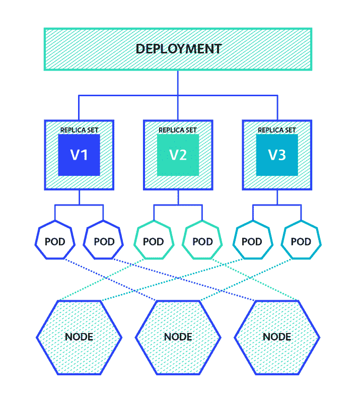

# Kubernetes 部署如何工作

> 原文：<https://thenewstack.io/kubernetes-deployments-work/>

本文是系列文章的一部分，来自

[Cloud Native Computing Foundation](https://www.cncf.io/)

(CNCF)，关于 CNCF 的 Kubecon/CloudNativeCon，来自奥斯丁，2017 年 12 月 6 日至 8 日。

我们已经写了相当多的关于 [Kubernetes](/category/kubernetes/) 容器编排引擎以及如何部署到 Kubernetes 的博文，但是没有一篇详细介绍 Kubernetes 部署是如何工作的。

使用 Kubernetes 部署，您“在一个部署对象中描述一个期望的状态，并且部署控制器以一个受控的速率将实际状态改变到期望的状态，” [Kubernetes 部署文档陈述](https://kubernetes.io/docs/concepts/workloads/controllers/deployment/)。在这篇博客中，我们将从高层次的角度解释部署是如何工作的，然后通过创建一个部署并了解它与 ReplicaSet 和 Pod 对象的关系来动手实践。

## Kubernetes 中的对象

在我们了解部署到底是如何工作的之前，让我们后退一步。Kubernetes 实际上是一个对象存储，加上与这些对象交互的代码。您存储的每个对象都有三个部分:元数据、规范和当前观察到的状态。

作为用户，您必须提供元数据和描述对象期望状态的规范。Kubernetes 非常努力地让这种期望的状态发生，在对象的状态键下报告它的进展。

## 部署的高级视图

Kubernetes 部署管理集群上运行的无状态服务(与管理有状态服务的 StatefulSets 相反)。他们的目的是保持一组相同的 pod 运行，并以受控的方式升级它们——默认情况下执行滚动更新。关于不同部署策略的更多细节，请看我的同事 Etienne 的[博客。](http://container-solutions.com/kubernetes-deployment-strategies/)



Kubernetes 部署管理的副本集。每一个都代表部署的应用程序的不同版本。每个复制集管理一组相同版本的 pod。

## 创建部署对象

 [马尔滕·胡根多恩

Maarten 是 Container Solutions 的一名工程师，他帮助客户处理集装箱、构建系统、编排器和 CI/CD 管道。Maarten 喜欢用 Rust 编程，喜欢用 Nix 以声明方式构建/部署软件。他还组织了阿姆斯特丹 Nix Meetup 和 Rust Amsterdam meetups。](https://nixos.org) 

在继续之前，请确保 Kubernetes 集群正在运行。我推荐使用 [minikube](https://github.com/kubernetes/minikube/) ，或者使用 [Google 容器引擎](https://cloud.google.com/container-engine/docs/quickstart)创建一个小型集群。

您的集群准备好了吗？太好了！然后通过运行以下命令创建一个部署对象:

```
$  kubectl run my-nginx  --image=nginx  --port  80

deployment  "my-nginx"  created

```

当然，您也可以创建一个. yml 清单，并使用 [kubectl](https://kubernetes.io/docs/reference/kubectl/overview/) create 或 kubectl apply 来创建部署。

现在我们来看看 Kubernetes 创造了什么。考虑到输出很长，我已经删除了一些现在不相关的值，并将其分成几部分来分别解释每一部分。

**提示:**通过使用 kubectl get $ OBJECT _ KIND $ NAME-o $ FORMAT(with $ FORMAT = YAML 或$FORMAT=json)，您将能够看到比普通 kubectl get 的输出更多的细节。

```
$  kubectl get deployment my-nginx  -o  yaml
apiVersion:  extensions/v1beta1
kind:  Deployment
metadata:
 <strong>annotations:</strong>
<strong>   deployment.kubernetes.io/revision:  "1"</strong>
<strong> name:  my-nginx</strong>
<strong> uid:  2c2a591a-c869-11e7-b488-42010a8401a1</strong>
<strong> labels:</strong>
<strong>   run:  my-nginx</strong>
 ...
spec:
 ...  (covered later)
status:
 ...  (covered later)

```

元数据包含部署的名称(必须是惟一的)、Kubernetes 使用的内部 uid 和 annotations 对象。它包含一个注释，即当前部署修订版是 1。我们稍后再讨论这个。kubernetes 中的每个对象都可以有一组标签，它们是键值对。

接下来，我们将看看同一个部署对象的规范部分。

```
apiVersion:  extensions/v1beta1
kind:  Deployment
metadata:
 ...  (covered in previous section)
spec:
 <strong>replicas:  1</strong>
<strong> strategy:</strong>
<strong>   rollingUpdate:</strong>
<strong>     maxSurge:  1</strong>
<strong>     maxUnavailable:  1</strong>
<strong>   type:  RollingUpdate</strong>
<strong> template:</strong>
<strong>   metadata:</strong>
<strong>     labels:</strong>
<strong>       run:  my-nginx</strong>
<strong>   spec:</strong>
<strong>     containers:</strong>
<strong>     -  image:  nginx</strong>
<strong>       name:  my-nginx</strong>
<strong>       ports:</strong>
<strong>       -  containerPort:  80</strong>
<strong>         protocol:  TCP</strong>
status:
...  (covered later)

```

部署的 spec(规格)有两个您必须设置的键:

*   副本，描述此部署应该有多少个单元。在我们的例子中，将会创建一个唯一的 pod。
*   模板，描述每个窗格的外观。它描述了应该在 Pod 中的容器列表。

可以设置另外两个键来自定义部署的行为。

*   选择器，用于确定哪些 pod 被视为该部署的一部分。
*   策略，它规定了部署的更新应该如何展开。

在部署对象的最后一部分，观察到的状态由 Kubernetes 填充，并且只能由 Kubernetes 自己更新:

```
apiVersion:  extensions/v1beta1
kind:  Deployment
metadata:
 ...  (covered in previous section)
spec:
 ...  (covered in previous section)
status:
 <strong>availableReplicas:  1</strong>
<strong> observedGeneration:  1</strong>
<strong> readyReplicas:  1</strong>
<strong> replicas:  1</strong>
<strong> updatedReplicas:  1</strong>
<strong> conditions:</strong>
   ...

```

请注意，键名中的“副本”是指复制盒的数量，而不是副本集的数量。其他需要考虑的问题:

*   副本只是从规范中复制的。这是异步发生的，所以在很短的时间间隔内，您可能会看到 spec.replicas 不等于 status.replicas 的部署。
*   availableReplicas 表示至少在一段时间内有多少 pod 准备就绪(minReadySeconds)。这防止了状态的波动。
*   unavailableReplicas 是应该存在的 pod 总数，减去必须创建的 pod 数，或不可用的 pod 数(例如，失败或未准备好进行 minReadySeconds)。
*   updatedReplicas 此部署可到达的、与规格模板匹配的 pod 的数量。
*   readyReplicas 通过所有副本从部署可到达的 pod 的数量(参见图片，通过所有副本集从部署跟踪所有 pod)。
*   observedGeneration 等于 deployment.kubernetes.io/revision 注释。这是被观察的一代。
*   条件是条件列表，请参见下一节。

### 情况

Kubernetes 在多个地方使用条件。它们都是条件对象的列表。最低条件对象包含类型、状态和原因。可能是人类可读的消息，以及特定于条件对象所属资源的其他字段。

*   类型描述了实际情况(参见下面的详细解释)。
*   状态可以是“真”、“假”或“未知”如果您正在查找 foo 类型的条件，而它不在列表中，则它被认为是“未知的”
*   Reason 是一个驼峰式字符串，是机器可读的。
*   Message(可选)人类可读的消息，可能包含一些额外的详细信息。

一个有用的类比可能是，如果你认为类型是一个基本的异常类，例如 IntegerArithmicErrors，原因可能是 DivisionByZero。

在我们的部署中，我们目前有一个状态:

```
apiVersion:  extensions/v1beta1
kind:  Deployment
metadata:
 ...
spec:
 ...
<strong>status:</strong>
<strong> ...</strong>
<strong> conditions:</strong>
<strong> -  lastTransitionTime:  2017-11-13T11:52:49Z</strong>
<strong>   lastUpdateTime:  2017-11-13T11:52:49Z</strong>
<strong>   message:  Deployment has minimum availability.</strong>
<strong>   reason:  MinimumReplicasAvailable</strong>
<strong>   status:  "True"</strong>
<strong>   type:  Available</strong>

```

它声明“它是可用的，因为 MinimalReplicasAvailable。”在下一篇博文中，我们将讨论如何添加启用更多条件来帮助我们调试问题。

## 复制集对象

通过在部署的标签上过滤属于部署的 ReplicaSet 对象，可以找到它们。如果您返回到部署的元数据部分，您会看到它有一个标签:run=my-nginx。

如果我们过滤那个标签，让我们看看有哪些复制集。

```
$  kubectl get replicaset  -l  run=my-nginx
NAME                   DESIRED    CURRENT    READY      AGE
my-nginx-4293833666    1          1          1          3h

```

在那里！现在我们将再次分别描述元数据、规范和状态部分(我再次删除了一些与这篇博文无关的关键字)

现在，下面的规范看起来应该比较熟悉。

```
$  kubectl get replicaset my-nginx-4293833666  -o  yaml
apiVersion:  extensions/v1beta1
kind:  ReplicaSet
metadata:
 annotations:
   deployment.kubernetes.io/revision:  "1"
   ...
 generation:  1
 <strong>labels:</strong>
<strong>   pod-template-hash:  "4293833666"</strong>
<strong>   run:  my-nginx</strong>
<strong> name:  my-nginx-4293833666</strong>
 ...
spec:
 ...
status:
 ...

```

如你所见，ReplicaSet 确实有标签 run=my-nginx。不仅如此，元数据还包含部署修订号。这就是部署知道哪个副本集是当前副本集的方式。

好的，很好，现在让我们来看看副本集的规格。

```
$  kubectl get replicaset my-nginx-4293833666  -o  yaml
apiVersion:  extensions/v1beta1
kind:  ReplicaSet
metadata:
 ...
spec:
 replicas:  1
 template:
   metadata:
     labels:
       <strong>pod-template-hash:  "4293833666"</strong>
<strong>       run:  my-nginx</strong>
   spec:
     containers:
     -  image:  nginx
       name:  my-nginx
       ports:
       -  containerPort:  80
         protocol:  TCP

```

这与我们通过 kubectl run 给 Kubernetes 的规范几乎相同。我会破坏游戏，告诉他们唯一的变化是，部署增加了一个 pod-template-hash 标签。这是如何计算的现在并不重要，重要的是这让我们知道哪个复制集创建了哪个豆荚。

我将跳过副本集的状态部分；他们没那么有趣。你可以在参考手册中查找钥匙(类似这样的链接见博文末尾)。

```
$  kubectl get replicaset my-nginx-4293833666  -o  yaml
apiVersion:  extensions/v1beta1
kind:  ReplicaSet
metadata:
 ...
spec:
 ...
status:
 <strong>availableReplicas:  1</strong>
<strong> fullyLabeledReplicas:  1</strong>
<strong> observedGeneration:  1</strong>
<strong> readyReplicas:  1</strong>
<strong> replicas:  1</strong>

```

## Pod 对象

我们可以通过筛选 ReplicaSet 对象的 spec.template.metadata.labels 中标签上的窗格来找到属于 ReplicaSet 的窗格。

这次我会做一些不同的事情。我将要求它返回所有匹配模板标签的 pods，而不是运行 kubectl get 两次。这可能会返回多个结果，因此我们将得到一个实物列表，而不是实物 Pod。像往常一样，我已经从输出中删除了一些不相关的键。

```
$  kubectl get pods  -l  "pod-template-hash=4293833666,run=my-nginx"  -o  yaml
apiVersion:  v1
kind:  List
metadata:  {}
items:
-  apiVersion:  v1
 kind:  Pod
 metadata:
   labels:
     pod-template-hash:  "4293833666"
     run:  my-nginx
   name:  my-nginx-4293833666-7krbq
 spec:
   containers:
   -  image:  nginx
     name:  my-nginx
     ports:
     -  containerPort:  80
       protocol:  TCP
 status:
   conditions:
   -  status:  "True"
     type:  Initialized
   -  status:  "True"
     type:  Ready
   -  status:  "True"
     type:  PodScheduled

```

标签元数据与 ReplicaSet 模板中指定的完全一致。该名称是自动生成的，以确保是唯一的。

正如您所看到的，容器的规范在从部署中的模板，通过复制集到 Pod 的转换中幸存了下来。

最后，一个 pod 在其状态部分还有一个条件列表，这些条件的名称不言自明。可能的类型有 PodScheduled、Ready、Initialized 和 PodScheduled。在调试部署问题的过程中，后者尤其令人感兴趣。这表明 Kubernetes 无法将 pod 放在机器中，这可能表明没有足够的资源可用(物理上可用，或允许使用)。

## 下一步是什么？

现在，您已经了解了部署、复制集和 pod 之间的关系，可以开始阅读以下材料了:

或者阅读我们关于 Kubernetes 的其他博客:

<svg xmlns:xlink="http://www.w3.org/1999/xlink" viewBox="0 0 68 31" version="1.1"><title>Group</title> <desc>Created with Sketch.</desc></svg>