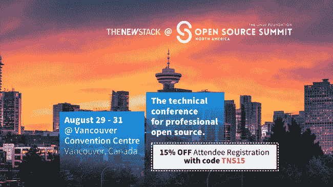

# Kubernetes 设计和开发说明

> 原文：<https://thenewstack.io/kubernetes-design-and-development-explained/>

本文是演讲人系列文章的一部分

[Open Source Summit](https://events19.linuxfoundation.org/events/open-source-summit-north-america-2018/register/)

，于 2018 年 8 月 29-31 日在温哥华举行。更多信息见下文。

Kubernetes 正迅速成为在分布式系统上部署工作负载的事实方式。在本帖中，我将通过揭示 Kubernetes 设计的一些基本原则来帮助您更深入地理解它。

## 陈述性优于命令性

 [萨德·阿里

Saad Ali 是谷歌的高级软件工程师，他在谷歌从事开源 Kubernetes 项目。他于 2014 年 12 月加入该项目，领导了 Kubernetes 存储和卷子系统的开发。他是 Kubernetes 存储 SIG 的负责人，也是容器存储接口的合著者和维护者。在加入 Google 之前，他在微软工作，领导了 Outlook.com IMAP 协议的开发。](https://www.google.com/) 

一旦您学会在 [Kubernetes](https://kubernetes.io/) 开源编排引擎上部署您的第一个工作负载(pod ),您就会遇到 Kubernetes 的第一个原则:Kubernetes API 是声明性的，而不是命令性的。

在命令式 API 中，您直接发出服务器将执行的命令，例如“运行容器”、“停止容器”等等。在声明式 API 中，你声明你希望系统做什么，系统就会不断地向那个状态前进。

把它想象成手动驾驶 vs 设置自动驾驶系统。

所以在 Kubernetes 中，您创建一个 API 对象(使用 CLI 或 REST API)来表示您希望系统做什么。并且系统中的所有组件都朝着该状态努力，直到该对象被删除。

例如，当您想要安排一个容器化的工作负载，而不是发出一个“运行容器”命令时，您可以创建一个 API 对象，一个 pod，它描述了您想要的状态:

此对象在创建后会保留在 API 服务器上:

如果容器由于某种原因崩溃，系统将重新启动容器。

要终止容器，请删除 pod 对象:

### 为什么“声明性优于命令性”？

声明式 API 使系统更加健壮。

在分布式系统中，任何组件都可能在任何时候发生故障。当组件恢复时，它需要想出该做什么。

使用命令式 API，崩溃的组件可能在它关闭时错过了一个调用，并需要一些外部组件在它恢复时“赶上它”。但是对于声明式 API，组件只是在 API 服务器恢复时查看它的当前状态，以确定它需要做什么(“啊，我需要确保这个容器正在运行”)。

这也被称为“电平触发”而不是“边沿触发”。在边缘触发的系统中，如果系统错过“一个事件”(“一个边缘”)，该事件必须被重放以便系统恢复。在电平触发系统中，即使系统错过了“事件”(可能是因为它停机)，当它恢复时，它可以查看信号的当前状态并做出相应的响应。

所以声明式 API 使得 Kubernetes 系统对组件故障更加健壮。

## 没有隐藏的内部 API

如果您深入了解各种 Kubernetes 组件是如何工作的，您会发现 Kubernetes 的下一个原则:控制平面是透明的，因为没有隐藏的内部 API。

这意味着 Kubernetes 组件使用与 Kubernetes 交互相同的 API 进行交互。结合我们的第一个原则(Kubernetes API 是声明性的，而不是命令性的)，这意味着 Kubernetes 组件只能通过监视和修改 Kubernetes API 来相互交互(而不是直接用下一步该做什么的指令相互调用)。

让我们通过一个简单的例子来说明这一点。为了启动容器化的工作负载，您需要在 Kubernetes API 服务器上创建一个 pod 对象，如上所示。

Kubernetes 调度程序根据可用资源确定 pod 运行的最佳节点。调度程序通过监控 Kubernetes API 服务器来监控新的 pod 对象。当一个新的未调度的 pod 被创建时，调度程序运行它的算法来为该 pod 找到最佳节点。在调度了该 pod 之后(已经为该 pod 选择了最佳节点)，调度器不会通知所选择的节点启动该 pod。记住，Kubernetes API 是声明性的(不是命令性的),内部组件使用相同的 API。因此，调度程序会更新 pod 对象中的 NodeName 字段，以指示该 pod 已被调度。

kubelet(在节点上运行的 Kubernetes 代理)监控 Kubernetes API(就像其他 Kubernetes 组件一样)。当 kubelet 看到一个带有 NodeName 字段的 pod 与其自身对应时，它知道一个 pod 已经被调度给它，并且必须被启动。一旦 kubelet 启动了 pod，它就继续监视 pod 的容器状态，并且只要相应的 pod 对象继续存在于 API 服务器中，就保持它们运行。

当 pod 对象被删除时，Kubelet 知道不再需要容器，并终止它。

### 为什么没有隐藏的内部 API？

让 Kubernetes 组件使用相同的外部 API 使得 Kubernetes 具有可组合性和可扩展性。

如果由于某种原因，Kubernetes 的一个默认组件(例如调度器)不足以满足您的需要，您可以关闭它，用您自己的使用相同 API 的组件来替换它。

此外，如果有您想要的功能，但还没有，您可以很容易地使用公共 API 编写一个组件来扩展 Kubernetes 的功能。

## 在用户所在地与他们见面

Kubernetes API 允许存储工作负载可能感兴趣的信息。例如，Kubernetes API 可以用来存储机密或配置映射。秘密可以是您不希望包含在容器映像中的任何敏感数据，包括密码、证书和其他敏感信息。配置映射可以包含独立于容器映像的配置信息，比如应用程序启动和其他类似的参数。

由于上面定义的第二个原则，即没有隐藏的内部 API，所以可以修改运行在 Kubernetes 上的应用程序，以便直接从 Kubernetes API 服务器获取机密或配置映射信息。但是这意味着您需要修改您的应用程序才能知道它正在 Kubernetes 中运行。

这就是 Kubernetes 的第三个原则:在用户所在的地方与他们见面。这意味着 Kubernetes 不需要重新编写应用程序就可以在 Kubernetes 上运行。

例如，许多应用程序接受机密和配置信息作为文件或环境变量。因此，Kubernetes 支持将秘密和配置映射作为文件或环境变量注入到 pods 中。例如，参见[机密文档](https://kubernetes.io/docs/concepts/configuration/secret/)的“使用机密”部分。

### 为什么要在用户所在的地方与他们见面？

通过做出设计选择，最大限度地减少在 Kubernetes 上部署工作负载的障碍，Kubernetes 可以轻松地在 Kubernetes 上运行现有的工作负载，而不必重写或大幅修改它们。

## 工作负载可移植性

一旦无状态工作负载在 Kubernetes 上运行，自然下一步就是尝试在 Kubernetes 上运行有状态工作负载。Kubernetes 提供了一个强大的卷插件系统，使许多不同类型的持久存储系统能够用于 Kubernetes 工作负载。

例如，用户可以轻松地请求将 Google Cloud 持久性磁盘安装到他们的 pod 中的特定路径:

当这个 pod 被创建时，Kubernetes 会自动将指定的 GCE PD 附加到 pod 被调度到的节点上，并将其装入指定的容器中。然后，容器可以写入 GCE PD 安装到容器或 pod 生命周期之外的持久数据的路径。

这种方法的问题是 pod 定义(pod YAML)直接引用了 Google Cloud 持久磁盘。如果这个 pod 部署在非 Google Cloud Kubernetes 集群上，它将无法启动，因为 GCE PD 将不可用。

这就是另一个 Kubernetes 原则的用武之地:工作负载定义应该可以跨集群移植。用户应该能够使用相同的工作负载定义文件，比如相同的 pod yaml，来跨不同的集群部署工作负载。

理想情况下，上面指定的 pod 甚至应该在没有 GCE PD 的集群上运行。为了实现这一点，Kubernetes 引入了 PersistentVolumeClaim (PVC)和 PersistentVolume (PV) API 对象。这些对象将存储实施与存储消耗分离开来。

PersistentVolumeClaim 对象为用户提供了一种以与实现无关的方式请求存储的方式。例如，用户可以创建一个 PVC 对象来请求 100 GB 的读写存储，而不是请求特定的 GCE PD:

Kubernetes 系统要么将该请求与由 PersistentVolume 对象组成的可用磁盘池中的一个卷相匹配，要么自动提供一个新卷来满足该请求。无论哪种方式，用于在 Kubernetes 集群上部署工作负载的对象都可以跨集群实现进行移植。

### 为什么是工作负载可移植性？

工作负载可移植性的原则强调了 Kubernetes 的核心优势:正如操作系统使应用程序开发人员不必担心底层硬件的细节一样，Kubernetes 也使分布式系统应用程序开发人员不必担心底层集群的细节。有了 Kubernetes，分布式系统应用程序开发人员不必局限于特定的集群环境。针对 Kubernetes 部署的应用可以轻松部署到内部和云环境中的各种集群，而无需对应用或部署脚本(Kubernetes 端点除外)进行特定于环境的更改。

## 结论

由于这些原则，Kubernetes 更加健壮、可扩展、可移植和易于移植。这就是 Kubernetes 迅速成为在分布式系统上部署工作负载的行业标准的原因。

*[开源峰会](https://events19.linuxfoundation.org/events/open-source-summit-north-america-2018/register/)在一个屋檐下连接开源生态系统。它涵盖了基础开源技术；帮助生态系统领导者通过多样性授权峰会导航开源转型，并跟踪业务和合规性；并深入研究涉及开源的最新技术和最新趋势，包括网络、原生云、边缘计算、人工智能等等。这是开发人员、系统管理员、DevOps 专业人员和 It 架构师之间交流的绝佳机会，推动着技术的未来。*

通过 Pixabay 的特征图像。

<svg xmlns:xlink="http://www.w3.org/1999/xlink" viewBox="0 0 68 31" version="1.1"><title>Group</title> <desc>Created with Sketch.</desc></svg>