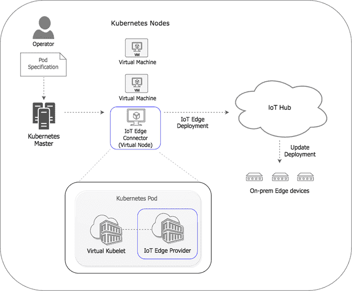

# 面向边缘计算的 Kubernetes:微软 Azure 方法

> 原文：<https://thenewstack.io/kubernetes-for-edge-computing-the-microsoft-azure-approach/>

边缘设备被设计为生活在网络的边缘，通常连接缓慢或偶尔连接，它们越来越多地被用于监控之外的其他用途。微软已经创建了一个名为 Azure IoT Edge 的托管服务，使用容器将分析和智能放在这些设备上。可以将它视为一种将云工作负载(如分析、机器学习、SQL Server 数据库甚至无服务器功能)移动到集中部署和管理的设备上的方式，即使它们只是偶尔连接。

正如在最近的 Build 会议上宣布的那样，这些工作负载现在包括微软的认知服务；第一个可用的是 [Custom Vision](https://www.customvision.ai/) ，它使用与微软 Bing 用于图像识别相同的 ResNet-50 深度学习网络，但最后一层被一个针对您的特定图像进行训练的层所取代，以进行图像分类和对象识别(用边界框找到并标记图像中已知对象的位置)。

对于对象识别，您可以使用自定义 Vision 门户查找所有已识别的对象，并对其进行专门标记(包括调整边界框以更精确地描绘对象，从而有助于训练)。每个班级只需上传 50 张带标签的图片作为训练集，不到一分钟，你就有了一个训练好的模型，可以作为一个模块部署到 Azure IoT Edge 设备。

不断反馈图像识别的结果(或者添加更多的训练图像)，你就会得到一个更好的模型，可以用来更新设备。

您在导出中得到的是一个“紧凑”版本的模型，它可以在更受限制的移动设备上运行，并且您需要在导出之前选择一个紧凑的域来训练模型(当前的选项是通用、地标和零售，这并不像您将模型作为 API 调用那样有那么多域选项)。代价是，它可能不如运行在云中的相同数据模型准确，那里有更多的资源，但它可以在您需要识别的地方运行，即使没有网络连接。

自定义视觉服务的物联网边缘导出是 DockerFile，这是一个 TensorFlow 模型和服务代码，可以在 Windows 或 Linux 容器中运行(在 X64 或 ARM 上)。Azure IoT Edge 运行时是[开源](https://github.com/azure/iot-edge)。

由微软提供。

如果你想创建自己的数据模型，而不是使用认知服务，你可以[将这些](https://docs.microsoft.com/en-us/azure/iot-edge/tutorial-deploy-machine-learning)打包为 Docker 容器，以同样的方式部署到物联网边缘。为了简化用 Azure 机器学习构建的模型的打包，[使用 Azure IoT Edge 的 AI 工具包](https://github.com/Azure/ai-toolkit-iot-edge)。

现在有更多的方式将这些容器部署到由物联网边缘管理的边缘设备上，而不仅仅是通过 Azure 门户。

为了更容易地从 Kubernetes 环境内部管理物联网边缘部署，如 Azure Kubernetes 服务(Azure 上完全管理的 Kubernetes 容器编排服务的新名称，不太容易混淆)，使用熟悉的 Kubernetes 概念，如清单，微软刚刚在 GitHub 上发布了开源的[物联网边缘虚拟 Kubelet](https://github.com/azure/iot-edge-virtual-kubelet-provider) 提供程序，您可以使用 Helm 安装在您的 Kubernetes 集群中。

> “这为您提供了一个一致的界面，您可以跨云和边缘推送整个 Kubernetes 工作负载，”— Sam George。

正如 Azure 物联网工程总监 Sam George 在构建时向新堆栈解释的那样，“在 Kubernetes 集群中，Kubernetes 节点通常绑定到一个虚拟机；如果我将容器推送到集群中，它们会被放在一个虚拟机中。虚拟 Kubelet 就像一个代理一样工作。它可以解释 Kubernetes 命令，除了将容器放入虚拟机之外，还可以对容器做其他事情。”

到目前为止，虚拟 Kubernetes 已经从 Kubernetes 集群发展到云 Kubernetes 服务，如 Azure Container Instances 或 [Hyper](https://github.com/hyperhq) 以获得规模或速度或每秒计费等优势，而不必担心管理代理节点。ACI 连接器是一个虚拟 Kubelet。然而，在这里，物联网边缘虚拟 Kubelet 提供商将容器放入边缘设备，然后看起来好像它们是集群的一部分。

George 解释说，将提供商托管在 Kubernetes 集群中，它显示为另一个节点。“当你向物联网边缘提供商推送容器时，我们将这种推送理解为物联网边缘部署；我们通过我们的 Azure 物联网中心服务，将容器推送到边缘设备。Kubernetes master 认为它只是在云中运行了一个大型的 Kubernetes 集群，但事实上，一些容器现在正在边缘设备上运行。”

该提供商仍在开发中，并非所有的集成都已完成，但它承诺了很大的灵活性。物联网边缘的一大优势是将云服务一致地引入边缘设备，使用 Kubernetes 使这一优势不仅适用于与物联网边缘集成的 Azure 服务。你可以使用它将数据模型带到边缘设备，但如果有新版本的，比如说，你使用的压缩算法，你可以设法以同样的方式将其部署到云和边缘系统。

物联网边缘提供商可以推送多个边缘设备，使用标签和设备选择器查询将部署定位到正确的边缘设备。具有相同软件配置的物联网设备通常会连接到不同区域的物联网集线器，以获得性能或弹性；为这些物联网集线器中的每一个创建虚拟 Kubernetes 节点意味着相同的 kubectl 命令可以将部署清单应用于具有相同配置的设备，即使它们连接到不同的集线器。

乔治说，只要联网，这些物联网设备连接速度慢也没关系。“还不能工作的部分是当边缘设备断开连接时。虚拟 Kubelet 在任何时候都可以连接到边缘的情况下都非常有用，因为它可以报告每个容器的健康状况的双向通信。”

<svg xmlns:xlink="http://www.w3.org/1999/xlink" viewBox="0 0 68 31" version="1.1"><title>Group</title> <desc>Created with Sketch.</desc></svg>