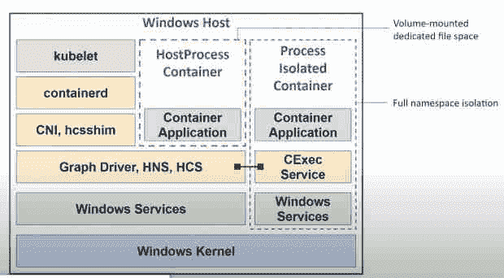

# Kubernetes for Windows

> 原文：<https://thenewstack.io/kubernetes-for-windows/>

尽管大多数人认为 Kubernetes 和 T2 容器是 Linux 技术，但 Linux 并不是唯一可以使用容器的操作系统。一旦您开始在一台或多台主机上运行多个容器和微服务，您将需要像 Kubernetes 这样的容器编排器所提供的功能，比如负载平衡、高可用性、容器调度、资源管理等。虽然 Kubernetes 控制平面目前只在 Linux 上运行，但是您仍然可以在 Kubernetes 上运行 Windows 容器。

## **Kubernetes 上的窗户**

Windows Server 2016 引入了容器(使用[作业对象和竖井内核对象](https://unit42.paloaltonetworks.com/what-i-learned-from-reverse-engineering-windows-containers/)，而 Linux 使用控制组和名称空间)。针对 Kubernetes 的 [Windows 支持工作于 2016 年开始，2019 年](https://kubernetes.io/docs/concepts/windows/intro/#supported-functionality-and-limitations)将在 Kubernetes 1.14 [中稳定发布。我们的目标不是将整个控制平台迁移到 Windows，而是将 Windows Server 作为 Kubernetes 的计算节点，为组织提供一个可以在同一个地方运行所有应用的环境。](https://kubernetes.io/blog/2019/04/01/kubernetes-v1.14-delivers-production-level-support-for-windows-nodes-and-windows-containers/)

不要把它想成是把 Kubernetes 带到了 Windows，而是把它带到了 Windows。NET、IIS 和其他 Windows 编程框架，以便 Windows 开发人员可以使用云原生工具来构建和部署分布式应用，同时降低支持现有应用的成本，并在旧版本 Windows 失去支持时简化从旧版本 Windows 的迁移。

现在，您可以在同一个 Kubernetes 集群中并排管理 Windows 和 Linux 容器，方法是向该集群添加可以运行 Windows 容器的 Windows 服务器工作节点:它们只需运行 Windows Server 2019 或更高版本(并且您需要使用与 Windows 和 Linux 都兼容的 CNI，如 Calico 或法兰绒)。

例如，微软[在 Azure Kubernetes 服务上的 Windows 容器](https://customers.microsoft.com/en-in/story/1536483517282553662-modernizing-microsoft-365-windows-containers-azure-kubernetes-service)中运行许多支持 Office 365 和微软 365 的服务。

支持 Windows 的集群将是 Windows 和 Linux 节点的混合，即使 Linux 节点仅用于领导角色，如 API 服务器和调度程序。但是，您也可以在同一集群中的 Windows 容器中部署运行反向代理或 Redis 缓存的 Linux 容器和 IIS 应用程序，甚至作为同一应用程序的一部分，并使用相同的管道进行部署，使用相同的工具监控应用程序的所有不同部分。

这使得 Windows 容器成为现代化应用程序的一个好方法:您可以从将应用程序“提升和转移”到容器中开始，然后在方便的时候添加更多的云原生功能。

## **Kubernetes 中的 Windows 容器**

在 Kubernetes 上支持 Windows 容器并不能让 Windows 像 Linux 一样工作；管理员仍将使用熟悉的 Windows 概念，如 ACL、sid 和用户名，而不是 Linux 风格的对象权限、userIDs 和 groupIDs，并且他们可以像以前一样在文件路径中使用\

像 hugepage 这样的 Linux 特性在 Windows 容器中是不可用的，因为它们不是 Windows 中的一个特性，而且您不能像在 Linux 容器中那样使根文件系统只读，因为 Windows 注册表和系统进程需要写访问权限。

还有一些特性，你需要在 Windows 上使用稍微不同的选项，比如 [runAsUserName](https://kubernetes.io/docs/tasks/configure-pod-container/configure-runasusername/) 而不是 runAsUser，来选择容器作为什么用户运行，或者限制容器管理员帐户而不是根用户。

默认情况下，Windows Server 容器有两个用户帐户(对容器主机都不可见):容器用户和容器管理员。Container user 用于运行不需要额外权限的工作负载，如果您在多租户环境中部署容器，它绝对是最佳选择:Container administrator 允许您安装持久的用户模式服务和软件(如 IIS)，创建新的用户帐户和对容器操作系统的主要配置更改。

您还可以创建具有所需特定权限的用户帐户。虽然您可以为 Linux 容器的卷指定文件权限，但是它们目前并不适用于 Windows 容器，但是有一个建议是在 Kubernetes 的下一个版本中使用 Windows ACLs 来支持它。

一般来说，身份是 Kubernetes for Windows 最不同的地方之一，因为它需要支持 Active Directory，以使应用程序能够访问资源。与外部数据库服务器或文件共享进行通信的 Windows 应用程序可能会使用 Windows 身份进行授权，如果没有该 AD 帐户，将无法获得访问权限。但是容器不能加入域。

相反，工作负载可以使用[组管理的服务器帐户](https://kubernetes.io/docs/tasks/configure-pod-container/configure-gmsa/) (GMSA)，它将 ad 身份分配给容器，该容器以一种可以在整个集群中协调的方式处理密码管理、服务主体名称管理和对其他管理员的委托。如果一个节点出现故障，工作负载迁移到群集中的另一个节点，只要 pod 可能所在的群集中的所有 Windows 主机都加入了域，身份就会随之转移。

您可以通过 Kubernetes 的 [Azure AD 工作负载身份将 Kubernetes 与 Azure Active Directory 结合使用(适用于 Windows 和 Linux 容器工作负载)。这实现了 Azure AD 工作负载身份联合，因此您可以访问受 Azure AD 保护的资源-从您自己的 Microsoft 365 租户资源到 Azure Key Vault 等 Azure 服务的一切-而不需要秘密。](https://github.com/Azure/azure-workload-identity)

## 【Windows 容器的存储和联网

Kubernetes 在 Windows 上的其他领域越来越类似于它们在 Linux 上的工作方式。

早期，Kubernetes 上的 Windows 容器可以访问有限范围的存储类型:通过 [CSI Proxy for Windows](https://github.com/kubernetes-csi/csi-proxy) 支持容器存储接口插件(在 Kubernetes 1.16 中引入，自 1.22 起稳定)，这意味着 Windows 节点可以通过使用现有的 CSI 插件来与广泛的存储卷系统一起工作。

类似地，Windows Kubernetes 网络已经从依赖主机网络服务转向使用[覆盖网络](https://techcommunity.microsoft.com/t5/networking-blog/introducing-kubernetes-overlay-networking-for-windows/ba-p/363082)来支持 CNI 插件、kube-proxy 和网络控制平面，如[法兰绒](https://github.com/flannel-io/flannel)。更新后的下一代 kube-proxy 也将移植到 Windows 上。

如果你遇到了问题，这是一个很好的关于 Kubernetes 在 Windows 上联网的故障排除提示列表，这些提示可以帮助你找出 Kubernetes 或 Windows 的问题。

## **了解 Kubernetes for Windows 中的隔离**

Windows 容器可以使用传统的 Linux 容器隔离模型，在 Windows Server 中称为进程隔离，其中容器彼此(和主机)共享相同的内核，或者它们可以使用 Hyper-V 隔离，其中每个容器在轻量级 VM 中运行，为其提供自己的内核。这类似于 Linux 上改进的隔离 Kata 容器。

使用进程隔离，容器与同一主机上的其他容器以及主机本身共享内核，这意味着容器映像的内核版本必须匹配。

除非您在当前版本的 Kubernetes 上使用 Windows Server 2022 或 Windows 11，即使您更新了容器主机，也可以继续使用现有的 Windows Server 2022 或 Windows 11 容器映像，否则 Windows 容器需要主机和容器映像的操作系统版本与内部版本号相匹配(在每个新版本的 Windows 中都会发生变化)。对于 Windows Server 2016 和旧版本的 Kubernetes，匹配需要更加接近:下至修订号，当您应用 Windows 更新时，修订号会发生变化。

Hyper-V 容器将避免这个问题，因为内核将不再与其他容器甚至容器主机共享；相反，Hyper-V 会加载容器需要的任何内核，为您提供向后兼容性，以便您可以将 Windows 节点移动到新版本的操作系统，而无需重建容器映像和更新应用程序来使用它们。

然而，Kubernetes 目前不支持 Hyper-V 容器:在 Kubernetes 的早期版本中，使用 Docker 运行时和 Hyper-V 的[主机计算服务](https://learn.microsoft.com/en-us/virtualization/community/team-blog/2017/20170127-introducing-the-host-compute-service-hcs)提供了 alpha 支持，但它只支持每个 pod 一个容器。这已经被否决了，并且用主机计算服务的 containerd 运行时和 v2 来[启用 Hyper-V 容器的工作正在](https://github.com/Azure/AKS/issues/1792)[缓慢进行](https://github.com/containerd/containerd/issues/6862)。

但是另一个期待已久的容器选项现在可用了。尽管 Windows 容器不支持特权容器，但是您可以使用新的 [HostProcess 容器](https://kubernetes.io/docs/tasks/configure-pod-container/create-hostprocess-pod/)获得类似的功能。HostProcess 容器可以访问容器主机上的所有内容，就像它们直接在主机上运行一样。您不希望将它们用于大多数工作负载，但是它们对于管理、安全和监控非常有用——包括通过部署网络和存储插件或 kube-proxy 等任务来管理 Kubernetes 本身。

HostProcess 容器可以访问文件并在主机上安装驱动程序或系统服务。这不是一种部署服务器工作负载的方式，但是它为您提供了一个可以运行集群管理操作的地方。这意味着您可以减少其他 Windows 节点和容器所需的特权。网络和存储组件，或者日志收集和安装安全补丁或证书等任务现在可以在(非常小的)容器中运行，这些容器在您启动新节点后会自动运行，而不必手动登录并直接在节点上作为 Windows 服务运行。

Kubernetes 1.26 将于 2022 年 12 月发布，它将稳定发布 HostProcess 容器。

## **在 Kubernetes 中调度 Windows 容器**

您可以使用 [kubeadm](https://kubernetes.io/docs/setup/production-environment/tools/kubeadm/create-cluster-kubeadm/) 或[集群 API](https://thenewstack.io/cluster-api-offers-a-way-to-manage-multiple-kubernetes-deployments/) 将 Windows 节点部署到集群，用于创建和部署服务和工作负载的 [kubectl](https://kubernetes.io/docs/tasks/tools/install-kubectl-windows/) 命令对于 Linux 和 Windows 容器的工作方式相同。但是您需要做一些明确的基础设施规划(记住，您将通过与运行在 Linux 上的 Kubernetes 控制平面交互来部署这些节点)。

您不能在单个 pod 上混合和匹配容器类型:pod 可以运行 Windows 或 Linux 容器。Windows 节点只能运行 Windows 容器，而 Linux 节点只能运行 Linux 容器，因此您需要使用节点选择器来选择将在什么操作系统上运行部署。

在 Kubernetes 1.25 中，将 OS 字段添加到 pod 规范中的 IdentifyPodOS 功能门默认为启用，因此您可以使用它来标记哪些 pod 运行 Windows Server，从而允许 kubelet 拒绝那些由于 OS 错误而不应该在节点中运行的 pod—但它尚未用于调度。它仍然值得使用，因为如果 Windows 容器因为在 Linux 节点上结束而失败(或者 Linux 容器因为在 Windows 节点上结束而失败)，它会给你更清晰的错误消息。

如果您要将 Windows 节点添加到已经部署了 Linux 工作负载的集群中，您会希望在 Windows 节点上设置污点，以便在 Linux 节点发生故障转移时，这些应用程序不会在 Windows 节点上终止(反之亦然)。您还可以使用污点来标记每个 Windows 节点运行的操作系统版本(因为虽然您可以在一个集群中运行多个 Windows Server 版本，但是 pod 和节点上的 Windows Server 版本需要匹配)。你可以通过[使用 RuntimeClass 变量](https://kubernetes.io/docs/concepts/containers/runtime-class/)来封装定义你需要的窗口构建的污点和容忍来简化它。

如果您使用舵图进行部署，请检查它们是否能够处理异构集群，或者添加污点和容差来将容器导向正确的节点。

向群集添加 Windows 节点时要考虑的另一件事是增加您在模板中指定的资源。虽然由于只读内存页在多个容器之间共享，它们在活动使用时不需要大量内存，但 Windows Server 容器往往需要更多内存才能成功启动，并且第一个容器的启动时间可能会更长。如果应用程序需要调用比它们能够访问的内存更多的内存，容器就会崩溃，而在容器中运行的 Windows 后台服务意味着内存分配可能需要比 Linux 容器大。如果您的模板是为 Linux 容器指定的，那么增加内存分配将会避免 Windows 容器的问题——同时仍然可以提供比虚拟机高得多的密度。

Windows 节点的资源管理也略有不同。pod 容器规范中的 CPU 和内存请求有助于避免过度配置节点，但是如果节点已经过度配置，它们就不能保证资源。

pod 扩展等操作的指标与 Linux 相同。节点问题检测器可以[监控 Windows 节点](https://github.com/kubernetes/node-problem-detector/tree/master/pkg/systemstatsmonitor)，尽管它还没有使用 Windows Management Instrumentation(WMI)，所以只包括一些指标。使用微软的开源 [LogMonitor](https://github.com/microsoft/windows-container-tools/tree/main/LogMonitor) 工具从 Windows 日志位置提取指标，如 ETW、事件日志和 Windows 应用程序通常使用的自定义日志文件。

## **哪些 Windows Server 版本最适合 Kubernetes**

因为 Windows Server 版本有支持终止日期，所以您可能需要考虑升级容器的操作系统版本，这比使用虚拟机更容易:您可以只编辑容器的 docker 文件(并升级节点以使其匹配)，尽管这对于 Windows 版本更改时您可能需要对应用程序进行的任何更改没有帮助。

Windows Server 2016 过去由 Kubernetes 支持，但不允许每个 pod 有多个容器。Windows Server 2019 对覆盖网络进行了重大的[更改，增加了对 Calico 等 CNI 网络插件的支持，因此您现在需要对 Kubernetes pods、节点和容器使用 Windows Server 2019 或更高版本。但是根据您运行的 Kubernetes 版本，支持不同的 Windows 版本。](https://techcommunity.microsoft.com/t5/networking-blog/introducing-kubernetes-overlay-networking-for-windows/ba-p/363082)

当 Windows Server 有更频繁的半年期渠道(SAC)发布时，这就有点复杂了，但微软现在建议希望更快升级 Windows Server 版本以获得容器支持改进的组织转移到 Azure Stack HCI 并使用 Azure Kubernetes 服务，所以如果你已经在运行现有的 SAC 发布，你只需要考虑这一点。Kubernetes 1.25 支持 Windows Server 2019、Windows Server 2022 和 Windows Server 20H2(最终的 SAC 版本)。

Kubernetes 1.17 到 1.19 支持较旧的 SAC 版本，但使用 SAC 版本的目的是更快地利用新功能，因此受此影响的大多数组织应该能够升级到 Windows Server 2022。它具有较小的基本容器映像，但也包括更多的容器功能，如分布式应用程序的虚拟化时区、运行依赖于 Active Directory 而没有域的应用程序-使用 GMSA 加入您的容器主机、Windows 容器的 IPv6 支持以及其他网络改进。

如果你使用 GKE，你不能再使用 SAC 镜像创建新的容器[。](https://cloud.google.com/kubernetes-engine/docs/deprecations/windows-server-sac)

今后，在下一个长期服务渠道发布之前，您将能够在所有新版本的 Windows 11 和 Windows Server 上运行 Windows Server 2022 容器映像，因此您现在可以使用 Windows Server 基本操作系统映像构建 Windows 容器映像，它将在 Windows Server 2025 (或微软称之为下一个 LTSC 版本的任何版本)之前的版本[上运行。此时，微软将添加一个弃用方案，因此新版本的 Windows 基本操作系统映像将在下一个 LTSC 上运行。](https://techcommunity.microsoft.com/t5/containers/windows-server-2022-and-beyond-for-containers/ba-p/2712487#M139)

这给了微软更多的自由来改变用户和内核模式之间的 API，同时允许用户通过使用进程隔离来运行一个容器映像更长时间。

## **Kubernetes 在 Windows 上的运行时间**

对于许多开发人员来说，Kubernetes 是 Docker 容器的同义词，但尽管 Docker 运行时已被广泛使用 containerd，并自 2018 年起作为 Kubernetes 运行时得到支持，并且自 Kubernetes 1.18 起一直是 Windows 容器的接口。使用 containerd 作为运行时将最终允许 Hyper-V 隔离容器在 Kubernetes 上运行，为您提供跨 Windows 容器的安全多租户边界:它也是 TerminationGracePeriod 等节点功能所必需的。

当 Mirantis 收购 Docker Enterprise 并将其重命名为 Mirantis Container Runtime 时，它还承诺用 Docker 维护 dockershim 代码:使用该运行时的 Windows 容器仍将以 say 方式构建和运行，但对它们的支持现在来自 Mirantis，而不是微软。你也可以为 Windows 容器使用[莫比运行时](https://github.com/moby/moby)。

**Windows 桌面上的 Kubernetes**

如果您运行的是 Kubernetes 基础设施，您可能不想要虚拟化的开销。但是如果你想在你的 Windows 桌面上使用 Kubernetes——为了开发或者只是为了学习 API——你可以使用 Hyper-V 和一个 Linux VM，或者 [WSL](https://kubernetes.io/blog/2020/05/21/wsl-docker-kubernetes-on-the-windows-desktop/) 并直接运行一个 Linux 发行版来运行 Kubernetes。

如果你正在使用 [Docker for Windows](https://docs.docker.com/desktop/windows/wsl/#download) 、 [Rancher Desktop、](https://github.com/rancher-sandbox/rancher-desktop)或 [minikube](https://minikube.sigs.k8s.io/docs/) 以及最近构建的 Windows 10 或 11，它们可以与 WSL 2 集成，因此你可以获得更好的性能、更好的内存使用以及与 Windows 的集成(简化文件处理)。 [Kind](https://kind.sigs.k8s.io/docs/user/using-wsl2/) 和 [k3s](https://docs.k3s.io/) 都可以在 WSL 2 或 Hyper-V 上运行，但你可能需要[一些额外的步骤](https://www.guide2wsl.com/k3s/)(而且由于 Kind 在 Docker 中代表 Kubernetes，你无论如何都需要它或 Rancher Desktop)。如果你只想要 Linux 容器，你可以在没有 Docker 桌面的 WSL 2 上安装 Docker。

或者，如果您刚开始在 Windows 上使用 Kubernetes，并且想要快速构建您的第一个 Windows Kubernetes 集群来进行试验——或者创建本地开发环境——SIG Windows dev-tools repo[拥有从头创建双节点集群所需的一切，您可以选择生产或领先的 Kubernetes 版本。它使用 vagger 通过 Hyper-V 或 VirtualBox 创建虚拟机，创建并启动 Kubernetes 集群，启动一个 Windows 节点，将其加入集群，并设置一个类似 CNI 的 Calico。](https://github.com/kubernetes-sigs/sig-windows-dev-tools)

## **Kubernetes 适合所有 Windows 应用吗？** 

的。许多企业运行的. NET、ASP.NET 和 IIS 应用程序可以被容器化，像 DirectX(像游戏服务器)这样使用 Windows APIs 的应用程序也可以，但是和容器一样，你需要考虑状态。经验法则是，如果像状态这样的关键数据被保存在进程之外，重启应用程序可以修复常见错误，那么你可以在 Kubernetes 上[容器化 Windows 应用程序](https://learn.microsoft.com/en-us/virtualization/windowscontainers/quick-start/lift-shift-to-containers)。如果那样会失去状态，你需要考虑重写应用程序或者[给工作负载增加额外的工作](https://blog.container-solutions.com/windows-container-k8s-cluster)。如果不止一个进程可以处理共享数据，Kubernetes 应该是扩展应用程序的好方法。

许多 IIS 和 ASP.NET 应用程序在 web config 中有硬编码的配置。要迁移到 Kubernetes，您需要在应用程序的 web 配置文件和 YAML 文件中使用环境变量将应用程序配置和秘密移出 pods(这样工作负载就知道它是在测试环境还是生产环境中运行)。如果您不想重写代码，您可以通过从 docker 文件为容器映像调用 PowerShell 脚本来实现。

Windows 管理中心内置了一些工具来帮助你[将现有的 Windows 应用](https://learn.microsoft.com/en-us/virtualization/windowscontainers/wac-tooling/wac-images)容器化:它可以选择将容器带到 Azure，但你可以用它来创建映像，并在任何 Kubernetes 基础设施上使用它们。

**Kubernetes 控制飞机会出现在 Windows 上吗？**

运行 Kubernetes 意味着要么运行自己的 Linux 基础设施，要么使用云 Kubernetes 服务，但即使是拥有大量 Windows 服务器工作负载的企业也越来越多地拥有 Linux 专业知识。虽然已经讨论过将 Kubernetes 控制计划引入 Windows(甚至一些原型，因为运行作为领导者的节点所需的大多数组件可以移植到 Windows 上运行)，但用于日志记录、监控和其他操作工具的更广泛的 Kubernetes 生态系统是基于 Linux 的。即使像 [eBPF](https://thenewstack.io/microsoft-brings-ebpf-to-windows/) 这样的技术出现在 Windows 中，将所有这些技术替换或迁移到 Windows 也是一项巨大的工作，尤其是当虚拟机和 WSL 可以处理大多数场景的时候。

但是，随着 Kubernetes 越来越多地用于边缘，特别是在资源经常受到严重限制的物联网场景中，Linux VM 与 Windows 容器一起工作的开销可能会令人望而却步。物联网设备和容器收集和处理数据的边缘位置很多，例如购物中心的自动食品亭、节日的弹出式商店或小型油田的无人值守钻头，在这些地方 Kubernetes 会很有用，但运行管理服务器很有挑战性。

[微软 Kubernetes 联合创始人兼公司副总裁 Brendan Burns](https://twitter.com/brendandburns) 在最近的一次 Azure 活动中提到，虽然团队预计客户将部署越来越大的集群，但“人们正在部署大量的小型集群。”物联网可能会让这种情况变得更加普遍。

微软为边缘基础设施设计的新 [AKS-lite Kubernetes 发行版](https://learn.microsoft.com/en-us/azure/aks/hybrid/aks-lite-overview)可以在 PC 级硬件上运行 Windows 10 或 11 的物联网企业版、企业版和专业版，Kubernetes 或 k3s 可以在 Linux VM 上运行(私有预览版最初只运行使用 Windows 物联网映像的 Windows 容器，尽管在公共预览版中可以使用 Linux 容器支持)。

Kubernetes 的价值在于它提供的 API 多于提供 API 的特定 Linux 实现，强大的 CNCF 认证过程意味着许多 Kubernetes 发行版在它们所包含的工具和增强功能以及它们为适应特定场景而对运行时、网络和存储所做的选择上进行竞争，而不是在 Kubernetes 的基础上进行竞争。如果像编排物联网容器这样的场景变得有用，也许未来不依赖于 Linux 虚拟机的 Windows Kubernetes 发行版会加入这个列表。

<svg xmlns:xlink="http://www.w3.org/1999/xlink" viewBox="0 0 68 31" version="1.1"><title>Group</title> <desc>Created with Sketch.</desc></svg>