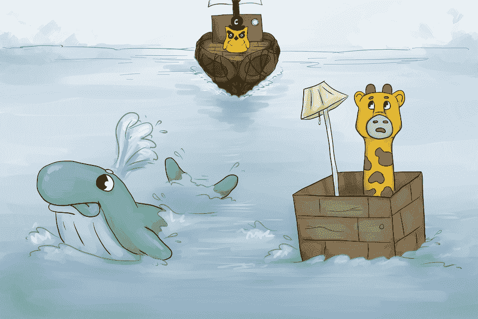

# Kubernetes 得到一本儿童书籍

> 原文：<https://thenewstack.io/kubernetes-gets-childrens-book/>

从前有一个 PHP 应用叫 Phippy。Phippy 生活在一个主机提供商，以及许多其他应用程序，可怕的应用程序，她不愿意被联系在一起。恐怖！可怜的菲皮该怎么办呢？她渴望有一个属于自己的安全的地方，一个属于自己的家，一个为她服务的网络服务器。

这是第一本，也可能是唯一一本关于 [Kubernetes](/category/kubernetes/) 容器编排管理器的儿童读物。"[Kubernetes](https://deis.com/blog/2016/kubernetes-illustrated-guide/)儿童图解指南由 [Deis](http://deis.io/) 平台架构师 [Matt Butcher](https://github.com/technosophos) 撰写，他称自己是“智慧、咖啡和精雕细琢的代码的爱好者”

“前几天，我女儿溜进我的办公室问我。最亲爱的父亲，他的知识是无与伦比的，什么是 Kubernetes？”"他在书的第一页开了个玩笑。"好吧，这是一点点的转述。但是你明白了…”

在一篇博客文章中，Butcher 将这本书描述为一种弥合极客和非极客之间鸿沟的方式。“有什么比讲故事时间更好的方式来和你的父母、朋友和同事谈论你一直在谈论的 Kubernetes 的事情呢？”这个故事的特点是由贝利·贝欧盖创作的一套精美的彩色插图。这个应用程序用一只可爱的黄色小长颈鹿来表示。

有几个印刷版显然是在贸易会议和 Twitter 赠品上分发的(还有一个“你自己的黏糊糊的小菲皮玩具！”).但是 Butcher 也在博客上分享了这个故事，并在 YouTube 上发布了一个特殊的视频，作为 Kubernetes 社区博客的客座博文[。](http://blog.kubernetes.io/2016/06/illustrated-childrens-guide-to-kubernetes.html)

[https://www.youtube.com/embed/4ht22ReBjno?feature=oembed](https://www.youtube.com/embed/4ht22ReBjno?feature=oembed)

视频

在帖子中，Deis 的首席执行官 [Beau Vrolyk](https://www.linkedin.com/in/beau-vrolyk-4879a25) 称这个故事是“Deis 办公室中的乐趣”的一个例子，并开玩笑说“我们喜欢在我们的架构图中添加一些字符，并拉动请求。这一次，真的…”

菲皮会怎么样？首先，一只“友好的鲸鱼”来拜访她，它游过并向菲皮建议，像她这样的应用程序生活在容器中可能会更快乐。菲皮发现这个容器很不错，“但这有点像有一个漂浮在大海中央的豪华客厅，”布彻写道。

”鲸鱼耸了耸肩。“对不起，孩子，”他说，然后消失在水面下……”

显然，菲皮需要一个好的集群管理员。但幸运的是，就在这时，她被一只聪明的老猫头鹰发现了，它叫 Kube 船长——驾驶着一艘由几十个小木筏绑在一起组成的船。他做的第一件事是给她贴上一个姓名标签，然后在他的船上给她一个吊舱，“这感觉就像家一样。”

这个比喻有时似乎有点牵强。(“如果我想按需克隆自己，克隆任意次，该怎么办？”长颈鹿问友好的猫头鹰…)但这给了布彻一个向菲皮介绍复制控制器的理由。服务被描述为到其他应用程序的隧道，Phippy 最终被授予她自己的卷来存储来自其他应用程序的“礼物”,以及访问适当的名称空间。

"菲皮和她的新朋友们一起，乘着库伯船长的大船在海上航行。她有许多大冒险，但最重要的是:菲皮找到了她的家，”布彻写道，然后总结道(剧透警告！)“菲皮从此过上了幸福的生活。结局。”

在网上看其他极客的反应很有趣。这个故事在 Reddit 的“编程”论坛— [上获得了 42 张赞成票，还有至少一个好评如潮的评论](https://www.reddit.com/r/programming/comments/4okv7h/the_childrens_illustrated_guide_to_kubernetes/)。(“这个又萌又好看。我甚至不做基础设施工作，但我现在想做了。”)它还在《黑客新闻》上获得了 [401 张赞成票](https://news.ycombinator.com/item?id=11922299)——尽管一些评论者提出了一些有趣的替代解释。

*“看来猫头鹰把长颈鹿俘虏了，进行克隆之类不道德的实验。”*

“我一直在等着库贝船长杀死菲皮。”

“是啊，”另一位用户开玩笑说，“真实的故事可能更像是一个恐怖故事……库贝船长抓住了菲皮，把他锁在船上的一个黑暗的集装箱里，强迫他夜以继日地重复工作——更糟糕的是，库贝船长开始在菲皮身上进行高度危险的实验，包括克隆他，搞乱克隆人，然后在似乎永无止境的暴力和痛苦循环中无情地一个接一个地屠杀他们。”

毕竟，集群管理器是为牛而不是为宠物设计的。

一个最有趣的讨论开始于一个用户发帖说“我愿意花大价钱让像这样复杂的话题以儿童寓言的形式出现。”这促使其他几个评论者指出，还有其他尝试以更友好的插图格式来处理复杂的技术主题。一位用户推荐了 [SELinux 涂色书](https://github.com/mairin/selinux-coloring-book)，其他人分享了指向 [No Starch 的漫画指南](https://www.nostarch.com/manga)用于[数据库](https://www.nostarch.com/mg_databases.htm)，以及[电学](https://www.nostarch.com/mg_electricity.htm)和[线性代数](https://www.nostarch.com/linearalgebra)。

但是，大多数人对“儿童图解库本内特指南”的反应是毫无保留的热情。

*“我从来没读过这么有娱乐性和启发性的东西！！为此谢谢你。”*

“最好的技术写作”

“谢谢你，我试着告诉我的未婚夫我的工作是什么，但她直到现在还不明白！”

<svg xmlns:xlink="http://www.w3.org/1999/xlink" viewBox="0 0 68 31" version="1.1"><title>Group</title> <desc>Created with Sketch.</desc></svg>