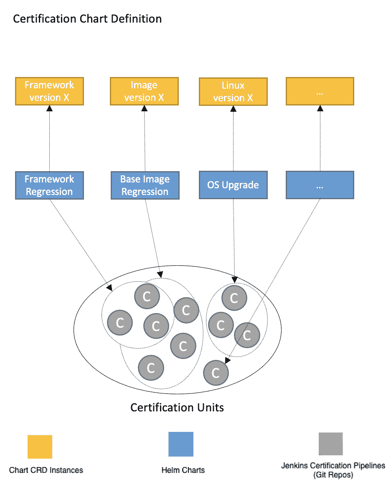
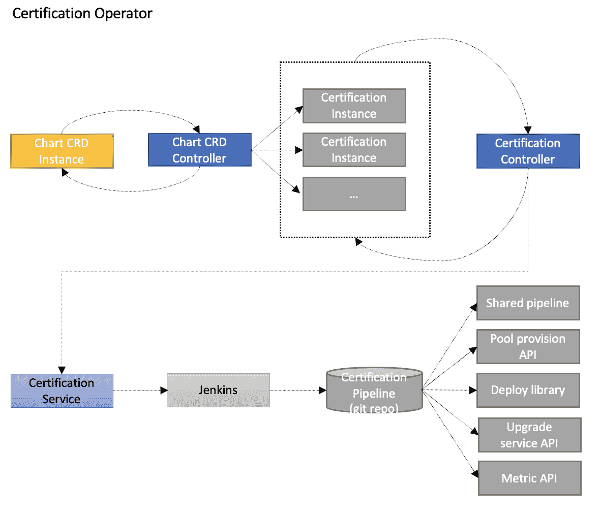
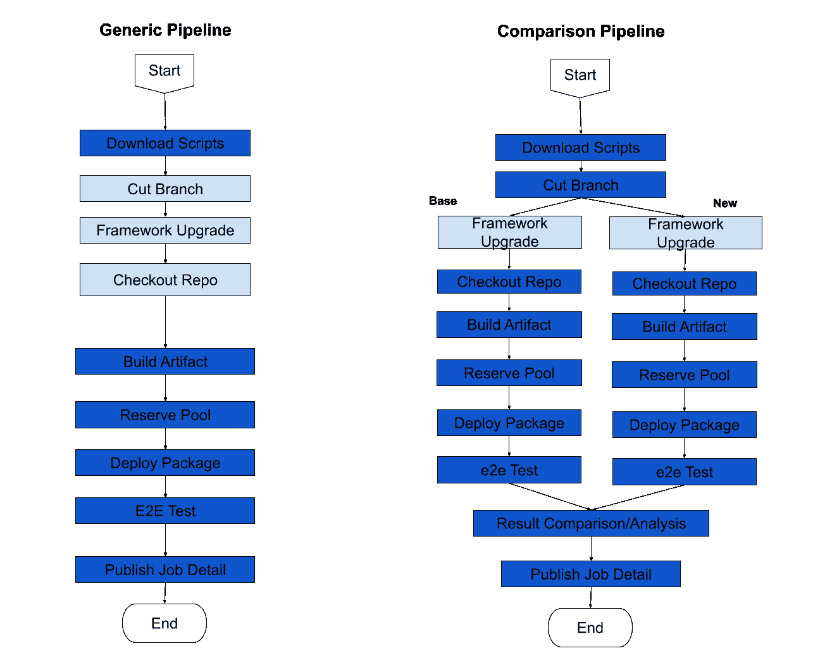

# 易贝如何利用 Kubernetes、Helm Charts 和 Jenkins Pipelines 交付高质量软件

> 原文：<https://thenewstack.io/kubernetes-helm-charts-and-jenkins-pipelines-deliver-ebays-automated-software-stack/>

 [拉米特·贝迪

7 年多来，Ramit 一直是易贝平台团队的核心成员，在服务平台、安全平台和 CI/CD 方面做出了重要贡献。](https://www.linkedin.com/in/ramitbedi/) 

在[易贝](https://tech.ebayinc.com/?utm_content=inline-mention)，产品团队可以从多个堆栈(Java-spring/spring-boot、Nodejs、Python 等)中进行选择。)来实现易贝的 3000+前端 UI、微服务、批处理和消息应用。应用平台团队是一个中心团队，通过集成水平功能(如监控和可观察性、日志记录、跟踪、安全保护、authn 和 authz 等)来实施开放源代码项目，供易贝使用。此外，应用程序平台团队还提供运行应用程序的底层容器/环境。当应用程序平台团队升级到平台的最新版本时，一个糟糕的版本可能会破坏许多应用程序。因此，平台发布认证对应用平台团队至关重要。本文描述了我们如何使用 Kubernetes 操作符、Helm Charts 和 Jenkins 管道来实现软件质量认证和自动化测试结果比较的完全自动化。

需要经常认证的变更集类型:

*   框架版本:
    *   全站点升级版本
    *   微型版本补丁
    *   跨团队贡献
*   运行时更新:
    *   JDK、Tomcat、Envoy 和 Node.js 运行时补丁
*   操作系统更新:
    *   具有新容器图像的框架认证
*   其他:
    *   操作系统认证:内核+操作系统
    *   易贝应用程序容器认证

 [洛基·尚

Rocky 是易贝核心框架小组的成员，在过去的 12 年里，他一直专注于分布式系统的各个方面。](https://github.com/rokii) 

我们设计了高效的认证解决方案，避免了任何手动测试和结果分析。此外，我们还开发了可自助服务的解决方案，能够执行任何类型的认证。

认证解决方案提供了一个标准的自动化模板，可以协调和处理多个复杂的认证请求和组合。为不同类型的认证请求提供了定义明确的认证套件。

## **详情**

### **认证单位**

认证单元是一个独立的单元，完成认证的一部分，包括:

*   简单:只有测试用例
*   测试用例+测试应用+管道
*   特性试验
*   具有响应比较的交通镜

### **认证舵图表**

各认证类别(镜像认证、框架发布认证、内核升级认证等。)有自己的 Helm 图表，其中包含认证单元和认证实例的模板。触发认证需要在 Kubernetes 集群中安装相应的 Helm Chart 和用户提供的参数。

认证和海图 CRD 实例是基于舵图和用户输入参数创建的。**认证实例**定义詹金斯管道 git 库和管道参数，而**图表 CRD 实例**定义公共参数、认证单元组及其依赖关系。

## **图表 CRD 控制器和认证控制器**

 [钟申

钟是应用平台团队的技术架构师。](https://www.linkedin.com/in/zhoshen/) 

控制器是整个自动化解决方案的主要协调者。认证图表控制器负责管理所有认证单元实例，例如依赖性实施、暂停/恢复/中止认证、每个单元实例的状态和结果的集合。认证控制器通过认证服务驱动管道作业运行的整个生命周期。它还通过回退重试来补救每个失败的作业，以提高成功的概率。

## **认证服务**

认证服务是认证控制器和后端 Jenkins 服务之间的协调服务。它提供 RESTful APIs 来执行和查询控制器的动作，并将请求动作委托给后端 Jenkins 服务器执行。所有 Jenkins 管道都是按需创建和删除的。认证服务还会在删除管道之前保存作业日志。

## **模块化的 Jenkins 管道脚本**

管道流量因每个单独的认证单元类型而异。我们已经将模块化的管道脚本构建为独立的步骤，因此可以通过重用它们来构建不同的管道流。

我们还开发了管道模块，通过 n+1 代码、负载和性能运行(使用 JMeter 和 Taurus)等将一定百分比的实时流量转发到目标主机，来执行响应比较。，并自动比较指标(事务时间、TPS、GC、内存等。)

## **结果**

开发一个统一的可扩展的认证体验对于我们实现软件质量认证和自动化测试比较的完全自动化的目标是一个巨大的进步。我们建立了不同的功能模块(如框架升级、代码部署、结果分析等。)使用可重用的 Jenkins 管道库，用于实例化认证单元。只需调整参数和故障阈值，即可轻松将认证单元包含在所有认证图表中。

自助认证门户使团队成员能够触发认证作业，而无需担心复杂的配置。具有可配置故障阈值的通知机制已到位，可快速排除故障。我们的认证解决方案还帮助我们将整个认证时间从几天缩短到几个小时。通过利用 Kubernetes 控制器协调机制，我们增加了对网络问题和不可靠依赖的弹性，减少了团队成员的参与。

## **学习和建议**

在设计您的技术时，请牢记可扩展性。有时，必须升级容量和底层基础设施以满足项目需求，例如改进的供应机制、节点选择器、轻量级 jenkins 构建器、故障转移集群等。

大胆尝试新事物。有时开源软件已经解决了一部分问题，可以作为一个有用的基础，而不是从零开始。最后，重要的是不断创新——考虑到长期的利益——以创造一种飞轮效应，将您的所有增强功能构建成一个有凝聚力的、流线型的软件系统。

## **下一步**

提高开发速度并为我们的工程团队提供世界一流的工具对于向我们的客户提供卓越的体验非常重要。我们通过评估行业标准和最佳实践并将其纳入我们的 SDLC 来不断创新，并致力于软件质量认证的未来增强功能:

### 云本机 CD 管道

我们计划利用 Tekton，一个强大而灵活的开源框架，为管道创建 CI/CD 系统，并将其与 CRD 控制器集成。

### 人工智能驱动的故障分析服务

我们正在研究故障分类、根本原因分析以及使用机器学习预测未来故障。

有兴趣在易贝发展事业吗？我们在招人！请 [*看看我们目前的职位空缺。*](https://ebay.to/eBayCareers)

<svg xmlns:xlink="http://www.w3.org/1999/xlink" viewBox="0 0 68 31" version="1.1"><title>Group</title> <desc>Created with Sketch.</desc></svg>