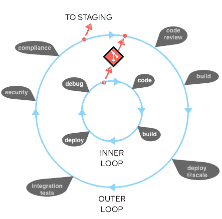

# Kubernetes 基础设施:了解内部开发循环

> 原文：<https://thenewstack.io/kubernetes-infrastructure-know-the-inner-dev-loop/>

本文是关于 Kubernetes 及其生态系统的[系列](https://medium.com/timecampus/infrastructure-engineering-the-first-principles-9d7748e3b3fb)的一部分，在这里我们将一次一个地深入研究基础设施。

虽然我们已经在本系列中探索了围绕云原生 Kubernetes 堆栈的各种原则、架构和部署策略，但如果处理不当，拥有如此复杂的分布式系统通常会对工程和 DevOps 团队的生产力和敏捷性造成巨大影响。虽然拥有云原生堆栈在当今世界非常重要，但它应该辅之以一条清晰的路径，以实现更快的开发工作流，为团队带来急需的敏捷性。这正是我们今天要讨论的问题。

根据专注于 Kubernetes 的 DevOps 堆栈提供商[大使](https://www.getambassador.io/use-cases/accelerate-inner-dev-loop/)的说法，“内部开发循环”是“在公开或与他们的团队共享代码之前，单个开发人员执行的编写、构建和调试代码的迭代过程。”

然后，有“外部开发循环”,它在您的代码被签入版本控制时就开始了(或者您发送了相同的 PR)。在这里，您将大部分职责移交给自动化系统、CI/CD 管道，让它们按照典型的 [GitOps 工作流程](https://www.weave.works/technologies/gitops/)为您完成工作。

内部开发循环是这两者中最关键的，因为这是开发人员完成实际工作的地方，他们要么处理增强、bug 修复、安全问题，要么处理你能想到的任何事情。这就是快速和持续的反馈循环真正有助于调试问题、做出更改并立即看到他们面前的输出，而没有任何上下文切换或延迟。这意味着更快的内部开发循环将意味着更高的生产率、快乐的开发人员、快速的运输周期，最终转化为快乐的客户和更好的收入增长。

现在，我已经试图说服你什么是内部开发循环，为什么它对开发人员和业务都非常重要，让我们看看它实际上是什么样子。

典型的内部和外部 dev 循环看起来是这样的:

来源:红帽

由于内部开发循环是您在工作流程中花费大部分时间的地方，它需要大量的优化，消除开发过程中所有可能的瓶颈，老实说，考虑到 Kubernetes 和围绕它的工具所带来的巨大复杂性，到目前为止与 Kubernetes 合作一直很困难。

但不再是了。这一直是 Kubernetes 和开源社区最重要的关注点，特别是在过去的一年里，现在有很多令人惊叹的工具可以用来解决内部开发循环的问题。但是在我们深入研究这些之前，让我们看看我们对这些工具有什么期望，以及我们如何能使内部开发循环更快。

搭建舞台:

*   **尽可能避免映像构建:**根据您尝试构建的内容、您现有的缓存和您正在使用的构建器，映像构建可能会花费相当多的时间，从几秒钟到几分钟不等，随着时间的推移，这些时间累积起来可能会非常昂贵且没有成效。这就是为什么需要尽可能避免图像构建的策略。
*   **无缝联网:**当我们与 Kubernetes 合作时，我们的集群可能会在本地或远程运行，这取决于向/从我们的应用发送/接收流量所需的步骤可能会有很大差异。这可能包括集群内的服务间通信，如果您有严格的安全约束，您可能还会有更多的顶层(如通过 bastion 主机、代理、VPN 等的隧道)。但这不是你在开发期间应该担心的事情，因为重点应该是根据需要进行更改，获得输出，并对其进行迭代。这就是我们需要无缝联网的原因，这样从联网的角度来看，所有的复杂性都可以从用户那里抽象出来。
*   **出色的 IDE/编辑器集成:**IDE/编辑器是任何开发人员完成大部分工作的地方。无论是编写代码、使用 IntelliSense 和特定于语言的功能、扩展、代码片段，还是个人而言，我每秒都在使用 VSCode，并使用它来支持我的所有工作流。这使得与编辑器/IDE 的良好集成变得非常重要。虽然您总是可以使用 CLI 和 shell 脚本来完成工作，但是最好将它们用于一次性操作或那些一天中很少使用的工作流。除此之外，当涉及到生产力时，上下文切换是非常昂贵的。这就是为什么与我们的编辑器很好的集成实际上会有很大帮助。
*   **对混合开发的支持:**当你在 Kubernetes 甚至其他地方使用微服务架构时，你有很多服务需要依赖它们来完成工作和满足请求，你可以让它们在你的 Kubernetes 集群上运行。但是随着服务数量的增加，通常不可能让它们都在您的系统中本地运行，因为这可能需要大量的资源，这通常会造成瓶颈并减慢您的开发周期。这需要一个混合开发工作流，您只需处理当前正在本地修改的服务，同时让其余的工具和服务远程运行，在集群之间来回代理请求，从而加快开发周期，同时大幅减少本地所需的资源。正如您在下面看到的，hybrid 绝对适合大多数情况，开发者不需要担心架构的规模。
*   **支持隔离协作:**这听起来可能有点奇怪，您可能想知道在隔离您的服务的同时如何实现协作。当您团队中的多个开发人员希望同时在同一个微服务上工作，而没有太多的操作噩梦时，Kubernetes 必须是一个推动者。虽然每个开发人员都可以有自己的命名空间或自己的集群来独立完成所有开发，但这可能会给运营团队带来噩梦，因为他们需要扩展操作系统/版本升级、安全补丁、RBAC 权限，您甚至可能想要找到一种方法来同步所有配置。这也带来了额外的成本，因为你几乎为每个开发者复制了所有可能根本不需要的工具/服务。拥有一个独立的集群或名称空间对于开发人员来说是非常强大的，因为它为您提供了完全的控制和高度的隔离，但是考虑到它所增加的复杂性，团队中的每个人可能都不需要它。这就是对基于头部的代理和路由机制的支持真正有用的地方。
*   **强大的日志/调试/警告支持:**毫无疑问，日志是几乎每个开发人员工作流程中最重要的部分之一。如果您使用的是 VSCode 之类的编辑器，那么很有可能您还会使用调试器来启动您的工作流，遍历所有代码和变量，并在遍历过程中观察变化。最后，如果您正在使用多个服务，并且由于您在服务 a 中所做的更改而在服务 C 中出现错误，则警报/分布式跟踪会有助于您获得通知。所有这些都成为内部开发循环的一个非常重要的部分，因此更好的日志记录/调试/警报支持会让开发人员的生活变得更好。
*   **清晰和一致的生产路径:**虽然专注于内部开发循环非常重要，但如果该工具也能为用户提供清晰的生产路径，那就更好了。你可能会说，这就是为什么我们有 CI/CD 管道。没错，而且这种情况会一直持续下去，但是考虑到任何开发人员都会测试所有代码在他/她的开发环境中是否正常运行，开发环境和生产环境之间的配置漂移/重复可能会带来麻烦，因为开发环境可能正常工作，而生产环境可能在某个时候仍然会失败。这就是为什么如果我们能有一个从开发到生产的桥梁会很棒。
*   **社区对 APIs 插件的支持:**虽然我们可以假设一个乌托邦式的工具来为我们做所有的工作，但事实上，情况并非如此，因为每个用例都可能有很大的不同，而且几乎不可能满足所有无数开发人员的工作流，也不期望它出自一个工具。相反，我们期望该工具能够很好地与来自社区的插件一起工作，作为一个平台，根据需要公开所有的基本 API，以便开发人员可以根据需要在其上构建适合他们用例的插件。
*   **默认安全:**虽然提高生产力对于每个开发人员和整个组织来说都非常重要，但这不应该以牺牲安全为代价。这可以包括以非根用户身份运行的能力、避免权限提升、使用受限的 Pod 安全策略以及进一步减少未来任何可能的攻击的外围应用。

现在我们已经清楚了我们的期望和各种可以加速内部开发循环的方法，让我们看看今天我们有哪些选择。

### 远程呈现

来自 Ambassador(现在是[Cloud Native Computing Foundation](https://cncf.io/?utm_content=inline-mention)的一部分)的 Telepresence 已经成为内部开发循环的先驱有一段时间了，如果您已经在开发人员之间实现了所有的隔离(无论是作为单独的集群还是名称空间)，它会是一个非常好的选择。它提供了各种机制，使用代理和交换部署(有/没有 docker)将流量从本地机器转移到远程集群。

但是，如果您希望让多个开发人员共享同一个名称空间，从而在网络流量中产生大量冲突，这可能会变得很有挑战性，因为没有 [Telepresence(专有，最初称为服务预览)](https://www.getambassador.io/products/telepresence/)它就没有协作机制，Telepresence 实际上是在您的集群中运行 telepresence 代理，并在 Ambassador 的流量管理器的帮助下，根据报头来帮助路由请求。

您需要注意的另一个事实是，它目前使用 SSHD，如果您在集群中运行[受限 pod 安全策略](https://raw.githubusercontent.com/kubernetes/website/master/content/en/examples/policy/restricted-psp.yaml)，您可能会遇到安全许可问题。

### 倾斜

[Tilt](https://tilt.dev/) 是一个很好的工具，如果你是一个使用本地 Kubernetes 集群(无论是 Kind、Minikube、MicroK8s、K3s 还是类似的集群)做大部分工作的人。Tilt 对所有的配置都使用了[星号](https://github.com/bazelbuild/starlark)，这让你很容易操作，尤其是如果你懂 Python，不用太担心摆弄 YAML 文件，你也可以编排多个 Tiltfiles。正如他们所说，这就像向上倾斜和向下倾斜一样简单，使您在使用本地集群时体验愉快，支持端口转发、多容器引擎/构建器，并带有一个漂亮的仪表板以及日志、警报和相关信息，您甚至可以将这些信息用作您可能拥有的所有 shell 脚本的剧本。

虽然它确实支持远程开发，能够进行实时同步，但它并没有为此进行很好的优化，不支持开箱即用的混合工作流，而且由于仪表板是一个独立的界面，您需要在编辑器和仪表板之间切换上下文(在这种情况下，您肯定希望有多个监视器)，随着时间的推移，这可能会被证明是昂贵的。

但是考虑到它还处于创业的早期阶段，我确实相信有很多令人惊讶的东西正在开发中(他们目前正在开发 [Tilt Cloud](https://cloud.tilt.dev/) ),等着看他们能提供什么可能会很有趣。

### 奥克泰托

如果你希望每个开发人员都有一个名称空间或者一个完全隔离的环境，那么 [Okteto](https://github.com/okteto/okteto) 可能是一个不错的选择。Okteto CLI 是开源的，使您能够与任何支持文件同步、SSH 服务器支持等的本地和远程集群一起工作。尽管它没有提供 Okteto cloud 的完整功能，包括临时开发或预览环境、自动资源清理等等。

虽然它在处理远程集群时提供了一个快速的内部开发循环，但是它还不支持混合工作流。但是作为一个非常新的创业公司，我们可以很快对 Okteto 寄予厚望。

### 花园

虽然 [Garden](https://garden.io/) 标榜自己是一个让 Kubernetes 中的测试变得容易的工具，但当涉及到开发工作流的其余部分时，它也是一个真正强大的工具。虽然它还不支持混合工作流，但它支持本地和远程开发工作流，并利用了[堆栈图](https://docs.garden.io/basics/stack-graph)的概念，其中所有依赖项都保持自己的配置，并最终被明确定义。

这里的问题是，Garden 对于许多应用程序来说可能是一种矫枉过正的做法，因为您必须从[项目](https://docs.garden.io/using-garden/projects)、[模块](https://docs.garden.io/using-garden/modules)、[服务](https://docs.garden.io/using-garden/services)、[测试](https://docs.garden.io/using-garden/tests)、[任务](https://docs.garden.io/using-garden/tasks)、[工作流](https://docs.garden.io/using-garden/workflows)等开始学习和应用相当多的概念，这使得开始工作变得很困难，缺乏对混合工作流的支持，并且仅在产品的企业版本中规划了自动环境清理等功能。

但是如果你愿意花时间来设置和维护你需要的所有配置，Garden 是非常值得的。

### ska fold+云代码

Skaffold 今天处于一个非常有趣的领域，不仅帮助开发人员跨越内部开发循环，还帮助开发人员跨越外部开发循环，在外部开发循环中，您不仅可以将它用于您的开发工作流，还可以用于您的 CI/CD 管道。更有趣的是它与[云代码](https://github.com/GoogleCloudPlatform/cloud-code-vscode/)扩展的集成，这使得开发体验非常愉快。它具有强大的功能，包括文件同步、服务的端口转发、自动清理(针对本地集群)、日志跟踪、基于模板的自动标记、支持多个容器构建器、支持多个配置文件以及支持舵图和其他部署机制，从而为所有正在进行开发的人打包了一个全面的功能集，并得到了巨大的社区支持和令人惊叹的 Google 容器工具团队的支持。

但是与我们在这个列表中看到的许多其他工具一样，它还不支持混合开发工作流，当你将它与微服务一起使用时可能会很棘手(他们正在努力对多种配置的支持)，远程开发可能会很棘手(T2)，云代码仍处于积极开发的早期阶段，有很多东西在他们的管道中。

虽然它可能并不与所有相关，但云代码也与 GCP 集成在一起，如云运行、API、秘密管理器、项目浏览器等。)，允许初学者快速使用 Kubernetes，内置了对多种语言的调试支持，用于 Kubernetes YAMLs 的 IntelliSense，日志查看器等，这使得 Skaffold 和云代码成为一对伟大的搭档。

### Kubernetes 桥(明达罗)

【Kubernetes 的 Bridge 是微软的一个非常新的工具，最近[正式发布](https://devblogs.microsoft.com/visualstudio/bridge-to-kubernetes-ga/)。它旨在提供我们在本博客中一直在谈论的混合工作流，允许开发人员专注于他们正在工作的服务，同时根据发送的报头自行处理其余的路由。您可以在这里阅读更多关于它如何工作的信息[在这里](https://docs.microsoft.com/en-us/visualstudio/containers/overview-bridge-to-kubernetes)它在您的 Kubernetes 集群中运行一个代理，使用 Envoy 基于头部进行路由，在本地进行端口转发，从而允许多个开发人员同时在同一名称空间中处理同一服务，而不影响其他人的工作，这正是我们在这里所寻求的。

但是由于它还处于早期，我在运行它的时候确实面临了很多挑战，我在这里记录了这些挑战，比如缺乏对 VSCode 远程 SSH 的支持，sidecar 支持，使用受限的 pod 安全策略运行它的问题等等。但是，所有这些问题肯定都在他们的考虑范围内，我们可以期待他们很快会有很好的表现。

不过有一点需要注意，Kubernetes 的 Bridge 本身并不满足完整的内部开发循环等式，而是利用了生态系统。事实上，它挂钩到 Kubernetes VSCode 扩展，并使用其 API 在幕后完成其余工作。因此，它可以被视为一个更大难题的重要部分。

这些不是现在展览中唯一的工具。事实上，我们还没有谈到像 [Ksync](https://github.com/ksync/ksync) 、 [Squash](https://github.com/solo-io/squash) 、 [Draft](https://draft.sh/) 等工具，所有这些工具都专注于内部开发循环，同时试图以不同的方式解决问题，为您选择正确工具的最佳方式是记住您的用例，实际尝试它们。事实上，我只是希望我能有一个工具，它是我列出的所有这些工具中最好的一个组合，那一天离我们很近了，加速这个过程的最好方法是做出贡献，每件事都很重要，无论是对源做出贡献，参加 UX 调查，提交错误报告，写这样的博客或对文档做出贡献。

我对 Kubernetes 生态系统的愿景是，它逐渐消失在幕后，同时允许开发人员专注于他们手头最重要的事情，即要解决的业务逻辑和问题，考虑到我们在生态系统中看到的所有发展，我们应该很快就会实现。

*如果您有任何问题或寻求帮助或咨询，请随时通过 [Twitter](https://www.twitter.com/techahoy) 或 [LinkedIn](https://www.linkedin.com/in/tvvignesh) 联系 Vignesh TV。*

<svg xmlns:xlink="http://www.w3.org/1999/xlink" viewBox="0 0 68 31" version="1.1"><title>Group</title> <desc>Created with Sketch.</desc></svg>