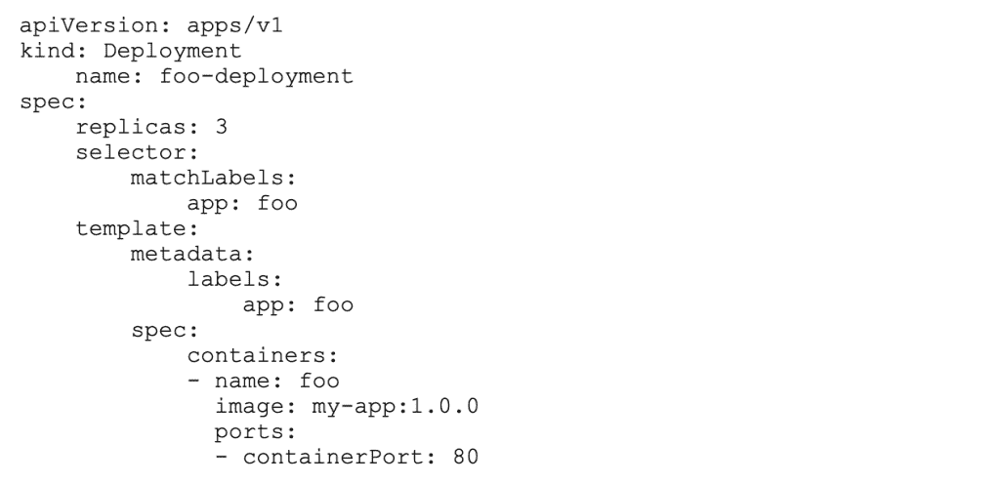
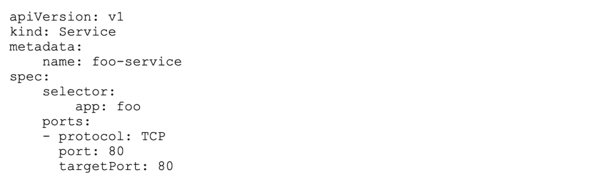
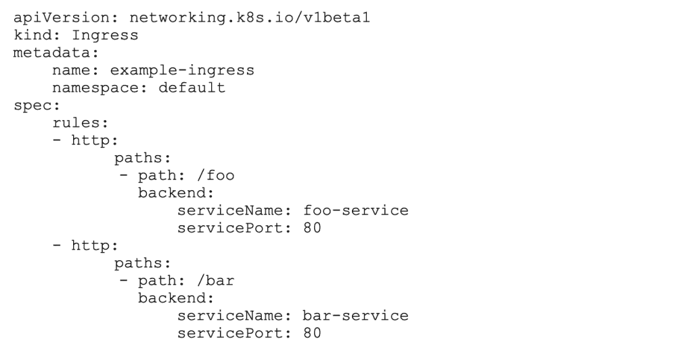
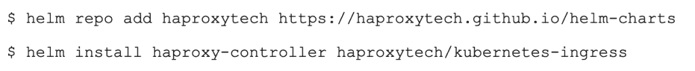
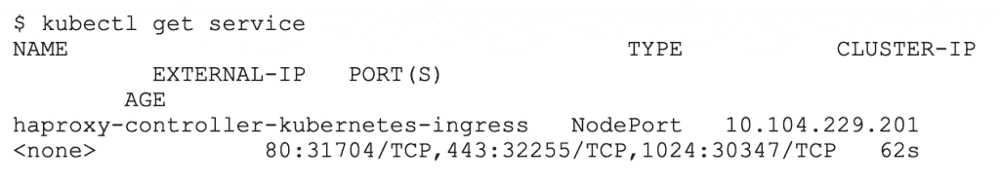
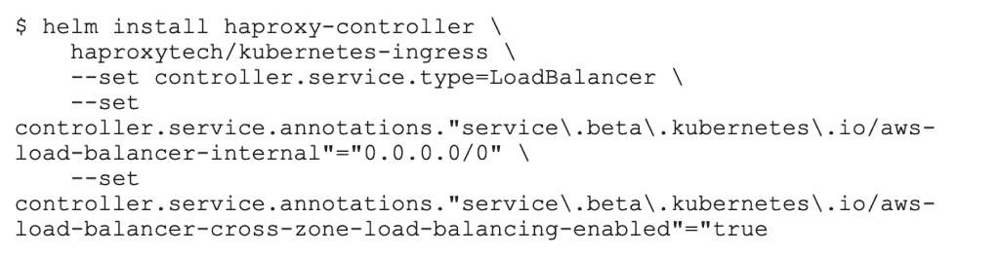

# 面向初学者的 Kubernetes 入口

> 原文：<https://thenewstack.io/kubernetes-ingress-for-beginners/>

 [尼克·拉米雷斯

尼克是一名软件开发者和作者。他目前为 HAProxy Technologies 工作，创建博客帖子、文档和网络研讨会，帮助人们充分利用 HAProxy。此前，他是咨询公司 Columbus 的一名软件开发人员，专攻 DevOps、基础设施自动化和 CI/CD 管道。](https://www.linkedin.com/in/nick-ramirez-1b44624/) 

参与项目的工程师[说](https://www.youtube.com/watch?v=cduG0FrjdJA) [Kubernetes Ingress API](https://kubernetes.io/docs/concepts/services-networking/ingress/) 比以往任何时候都更接近摆脱它的 *beta* 标签。这听起来可能很奇怪，考虑到许多公司已经使用它来公开他们的 Kubernetes 服务，尽管它还处于测试阶段。话说回来，这是一个漫长的测试阶段——事实上已经过了好几年——在 2015 年秋天进入了这个阶段。然而，这给了 Kubernetes 贡献者所需的时间来完善规范，并使其更接近实现者(HAProxy、NGINX、Traefik 等)已经构建的内容，使 API 形式化，以反映最常见和最需要的特性。

随着 GA 的到来，感觉是时候帮助新来者了解 Ingress 的工作方式了。简而言之，入口是一个规则，它描述了集群内部的服务如何跨越与外部世界的鸿沟，让客户可以使用它。与此同时，一个称为入口控制器的代理在集群网络的边缘侦听，监视要添加的规则，并将每个服务映射到特定的 URL 路径或域名，以供公共使用。当 Kubernetes 维护者开发 API 时，其他开源项目实现了入口控制器，并为其代理添加了自己独有的特性。

在这篇文章中，我将把这些概念放到上下文中，帮助您理解入口模式背后的驱动力。

## 路线问题

当您在 Kubernetes 中创建 pod 时，您为它们分配选择器标签，如下面的[部署](https://kubernetes.io/docs/concepts/workloads/controllers/deployment/)清单片段所示:

这个部署创建了三个运行 Docker 映像 *my-app* 的副本，并为它们分配 app=foo 标签。通常不直接访问 pod，而是将它们分组到一个[服务](https://kubernetes.io/docs/concepts/services-networking/service/)下，这使得它们可以在单个集群 IP 地址上使用，尽管只能来自同一个集群。该服务作为一个抽象层，隐藏了 pod 的短暂性，可以随时扩展、缩减或替换。它执行基本的循环负载平衡。

例如，以下服务定义收集了所有具有选择器标签 app=foo 的 pod，并在它们之间均匀地路由流量。

但是，该服务只能从集群内部访问，由附近运行的其他 pod 访问。Kubernetes 运营商努力解决如何为集群外的客户提供访问权限。这个问题在早期就很明显，有两种机制被直接集成到服务规范中来处理它。在编写服务清单时，可以包含一个名为 *type* 的字段，该字段的值可以是 *NodePort* 或 *LoadBalancer* 。下面是一个将 type 设置为 NodePort 的示例:

具有节点端口类型的服务很容易。他们实际上宣布他们希望 Kubernetes API 给他们分配一个随机的 TCP 端口，并在集群之外公开它。方便之处在于，客户端可以使用该端口将集群中的任何节点作为目标，并且它们的消息将被中继到正确的位置。这就像你可以打电话给美国的任何一个电话，无论谁接起电话，都会确保你被转接到正确的人。

缺点是端口的值必须在 30000 和 32767 之间，这个范围安全地避开了众所周知的端口，但是与我们熟悉的 HTTP 端口 80 和 HTTPS 端口 443 相比，这个范围明显是非标准的。随机性本身也是一个障碍，因为这意味着你不知道值会是什么，这使得配置 NAT、防火墙规则等。只是多了一点挑战性——特别是当为每个服务设置不同的随机端口时。

另一个选项是将类型设置为*负载平衡器*。然而，这有一些先决条件。只有当你在云托管的环境中运行时，比如谷歌的 GKE 或亚马逊的 EKS 和 T2，如果你同意使用云供应商的负载平衡器技术，它才会起作用，因为它是自动选择和配置的。最大的缺点是，这种类型的每一个服务都要为*启动一个托管负载平衡器，以及一个新的公共 IP 地址，这会产生额外的成本。*

## 入口路由

分配一个随机端口或外部负载平衡器很容易启动，但会带来独特的挑战。定义许多节点端口服务会造成随机端口的混乱。定义许多负载平衡器服务会导致支付比预期更多的云资源。这是不可能完全避免的，但也许可以减少，遏制，这样你就只需要分配一个随机端口或一个负载平衡器来公开许多内部服务？该平台需要一个新的抽象层，一个可以在一个入口点后整合许多服务的抽象层。

就在那时，Kubernetes API 引入了一种新的清单类型，称为*入口*，这为路由问题提供了一个新的视角。它是这样工作的:您编写一个入口清单，声明您希望如何将客户端路由到服务。清单本身实际上不做任何事情；您必须在集群中部署一个入口控制器来监视这些声明并根据它们采取行动。

入口控制器是 pod，就像任何其他应用程序一样，因此它们是集群的一部分，可以看到其他 pod。它们是利用活跃在市场上多年的反向代理构建的。因此，您可以选择 HAProxy 入口控制器、NGINX 入口控制器等等。底层代理为其提供了第 7 层路由和负载平衡功能。不同的代理带来了他们自己的一套特性。例如，HAProxy Ingress 控制器不需要像 NGINX Ingress 控制器那样频繁地重新加载自己，因为它为服务器分配插槽，并在运行时使用其运行时 API 填充它们。这可以带来更好的性能。

由于在集群内部，入口控制器和其他 Kubernetes pods 一样容易受到同样的限制。您需要通过 NodePort 或 LoadBalancer 类型的服务向外部公开它们。然而，现在您有了一个所有流量都要通过的入口点:一个服务连接到一个入口控制器，而入口控制器又连接到许多内部单元。控制器能够检查 HTTP 请求，并根据它发现的特征(如 URL 路径或域名)将客户机定向到正确的 pod。

考虑这个入口的例子，它定义了 URL 路径 */foo* 应该如何连接到一个名为 *foo-service* 的后端服务，而 URL 路径 */bar* 指向一个服务名 *bar-service* 。

您仍然需要为您的 pod 设置服务，如前所示，但是您不需要在它们上面设置 *type* 字段，因为路由和负载平衡将由入口层处理。该服务的角色被简化为在一个公共名称下对 pod 进行分组的能力。最终， */foo* 和 */bar* 两条路径由一个公共的 IP 地址和域名服务，比如*example.com/foo*和*example.com/bar*。这本质上是 [API 网关模式](https://www.haproxy.com/blog/using-haproxy-as-an-api-gateway-part-1/)。在 API 网关中，单个地址将请求路由到多个后端应用程序。

## 添加入口控制器

入口清单的声明方法让你指定*你想要什么*，而不需要知道*它将如何实现。实现是入口控制器的工作，它监视新的[入口规则](https://thenewstack.io/using-traefik-ingress-controller-with-istio-service-mesh/)并配置其底层代理来制定相应的路由。*

您可以使用 Kubernetes 软件包管理器 Helm 安装 [HAProxy 入口控制器](https://github.com/haproxytech/kubernetes-ingress)。首先，[通过下载 Helm 二进制文件并将其复制到您的 PATH 环境变量中包含的一个文件夹来安装 Helm](https://helm.sh/docs/intro/install/) ，比如 */usr/local/bin/* 。接下来，添加 HAProxy Technologies Helm 存储库，并使用 helm install 命令部署入口控制器。

验证入口控制器是通过使用 kubectl get service 列出所有正在运行的服务而创建的:

ha proxy Ingress 控制器在集群中的 pod 内运行，并使用 NodePort 类型的服务资源向外部客户端发布访问。在上面显示的输出中，您可以看到端口 31704 被选择用于 HTTP，端口 32255 被选择用于 HTTPS。也可以在端口 30347 查看 HAProxy 统计页面。HAProxy Ingress 控制器提供了关于流经它的流量的详细指标，这在许多其他控制器中是找不到的，因此它是一个很好的工具，可以用来更好地观察进入集群的流量。

当控制器创建一个类型设置为 NodePort 的服务时，这意味着分配一个随机的、大数量的端口，现在您只能管理几个这样的端口——连接到入口控制器的端口，而不是每个服务一个端口。只要您在云中运行，您还可以将其配置为使用负载平衡器类型。它看起来像这样:

总的来说，管理一个入口控制器没什么大不了的。一旦安装，它基本上在后台完成它的工作。您只需要定义入口清单，控制器就会立即将它们连接起来。入口清单是与它们所引用的服务分开定义的，让您可以控制何时向公众公开服务。

## 结论

通过允许 API 网关风格的流量路由，入口资源整合了外部客户端访问 Kubernetes 集群内部服务的方式。代理服务通过一个公共入口点进行中继，您可以通过使用意图驱动的 YAML 声明来控制何时以及如何发布服务。

随着 Ingress API GA 发布的临近，您肯定会看到这种模式变得更加流行。可能会有细微的变化，主要是为了使 API 与现有控制器中已经实现的功能保持一致。其他改进可能会指导控制器如何继续发展，以符合 Kubernetes 维护者的愿景。总而言之，现在是开始使用该功能的最佳时机！

<svg xmlns:xlink="http://www.w3.org/1999/xlink" viewBox="0 0 68 31" version="1.1"><title>Group</title> <desc>Created with Sketch.</desc></svg>