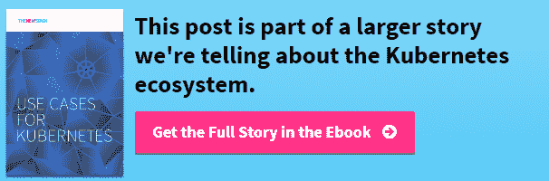

# KubeCon 煎饼早餐:保持梦想活着

> 原文：<https://thenewstack.io/kubernetes-keep-the-dream-alive/>

建立一个社区不是一件只能由大多数人，或通过听那些传播错误信息的人来完成的事情。当涉及到围绕软件联合起来的社区时，尤其如此，比如 Kubernetes。最终，我们必须考虑散布恐惧、错误信息的传播以及不明智的观点，以及划定哪个平台将“获胜”的界限对整个技术进步的影响。

在我们周三举行的 Kubecon TNS 分析师煎饼和播客中，我们邀请了思科云平台和服务集团首席技术官[肯·欧文斯](https://twitter.com/kenowens12)，咨询分析师兼 TNS 撰稿人[贾纳基拉姆·MSV](https://twitter.com/janakiramm)，谷歌云平台开发者倡导者[凯尔西·海塔尔](https://twitter.com/kelseyhightower)，以及比特纳米·首席运营官和联合创始人[埃丽卡·布雷西亚](https://twitter.com/ericabrescia)，来讨论 Kubernetes 如何作为一个社区向前发展。TNS 创始人亚历克斯·威廉姆斯主持了小组讨论，TNS 执行主编乔布·杰克逊向观众提出了问题。

[#121: KubeCon 煎饼早餐——让梦想活着](https://thenewstack.simplecast.com/episodes/121-kubecon-pancake-breakfast-keep-the-dream-alive)

[https://www.youtube.com/embed/Tp3CKUi980Q?feature=oembed](https://www.youtube.com/embed/Tp3CKUi980Q?feature=oembed)

视频

虽然谷歌的支持显然支持了 Kubernetes 社区，但 Kubernetes 开发并没有闭门造车。该公司对项目的方向、社区的期望及其总体目标一直保持透明和开放。这一立场意味着 Kubernetes 的稳定增长。在某种程度上，Kubernetes 正在成为集装箱领域的另一个重心，这个领域长期以来一直由 Docker 主导。

“我确实认为社区里有一种真正的恐惧，担心 Docker 会变得过于强大。我认为这确实有助于推动 Kubernetes 的增长，因为有很多公司不希望 Docker 拥有这个生态系统。布雷西亚说:“我想我们会看到这种情况如何发展，但如果 Docker 的一些人后悔他们最初的社区方式，我也不会感到惊讶。”

与会者[罗布·希施菲尔德](https://twitter.com/zehicle),[RackN](https://rackn.com/)的首席执行官向小组提问，在 Kubernetes 社区继续以如此快的速度扩张的同时，如何最好地发展该社区。

“我专注于教育和个人赋权。我认为教育是我们共同的责任。每个人都必须发表和分享哪怕是最小的想法，”海塔尔说。布雷西亚补充说:“有一个结构化的计划是有帮助的，在这个计划中，有人实际上在思考这种东西，并把过程放在适当的位置，把工具放在人们的手中。”个人问责制和对资源的访问不仅意味着 Kubernetes 社区将继续繁荣，而且其贡献者有能力访问他们需要的东西，以有意义的水平做出贡献。

Jackson 后来继续问目前是否存在泡沫，Kubernetes 社区远远领先于整个容器社区。“你为什么讨厌泡沫？你想偷走我们的快乐，但我们有 Kubernetes。对有些人来说，是梦想让我们坚持下去，”海塔尔回答道。

在小组讨论的最后时刻，出现了一个闪电回合，每个小组成员理论上有两分钟的时间来帮助理事会 Docker 改变其与社区的互动方式。以下是他们的回应:

布雷西亚:“我想我会告诉他们，他们需要做出一个强有力的声明，说明他们可能会考虑如何改变他们的行为，实际上拥抱社区，并分享一点关于他们计划前进的方向。”

Hightower:“不要走出去，不要无知地给出让社区困惑的观点。如果你没有关注过去三周发生的事情，你只是在制造混乱和误导。这开始建立不信任。我们不需要击败对手，在这种情况下，我们不是在和真人快打比赛。”

欧文斯:“帮助客户解决问题就是选择正确的工具。不要担心选择 Kubernetes 社区中没有的东西，但是一定要让我们知道，这样我们就可以将这些特性添加到项目中。我们希望让服务和解决方案变得更好。”

MSV:“从客户的角度来看，这真的无关紧要。98%的客户并不真正了解容器。我认为宣传容器比争论使用什么更重要。我认为我们有责任宣传集装箱化的好处，然后谈论解决问题的正确工具。”

Bitnami、Docker 和 Cisco 是新堆栈的赞助商。

专题图片:(从左到右):艾丽卡·布雷西亚，肯·欧文斯，凯尔西·海托华，贾纳奇拉姆·MSV。

<svg xmlns:xlink="http://www.w3.org/1999/xlink" viewBox="0 0 68 31" version="1.1"><title>Group</title> <desc>Created with Sketch.</desc></svg>