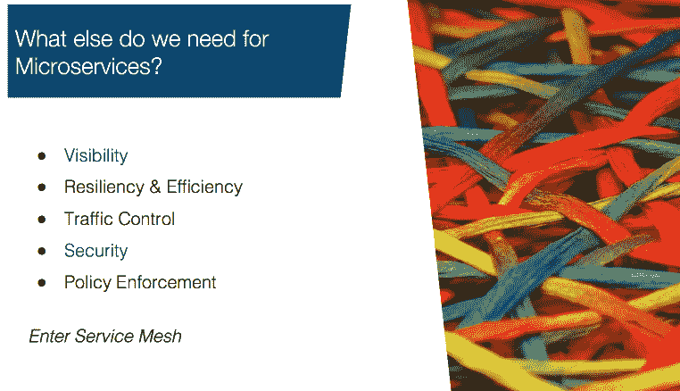
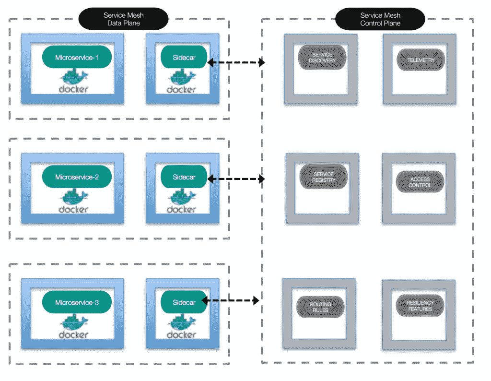
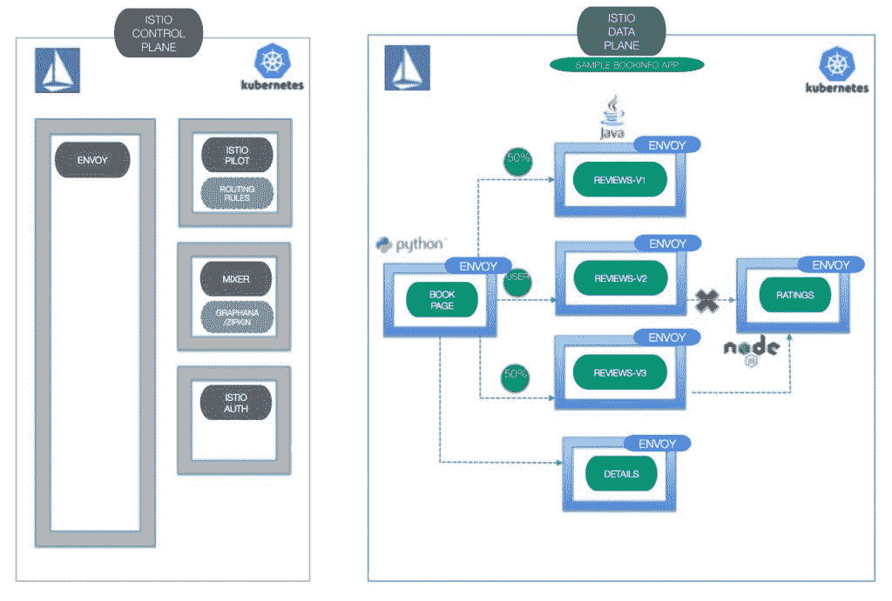

# Kubernetes、微服务和 Istio——非常适合！

> 原文：<https://thenewstack.io/kubernetes-microservices-istio%e2%80%8a-%e2%80%8aa-great-fit/>

在今年 12 月的 KubeCon 大会上，我们将深入探讨 CNCF[Istio](https://istio.io/)服务网状架构的[弹性和容错特性](https://kccncna17.sched.com/event/CU6i/enable-your-microservices-with-advanced-resiliency-and-fault-tolerance-leveraging-istio-i-animesh-singh-tommy-li-ibm)。在此之前，让我们讨论一下服务网格在云原生环境中的重要性。

[微服务](/category/microservices/)和容器已经改变了应用设计和部署模式。它们也带来了一些新的挑战，比如服务发现、路由、故障处理和可见性。虽然像 [Cloud Foundry](https://www.cloudfoundry.org/) 这样的 PaaS 平台非常适合部署微服务，但它们的创建是为了简化跨多个运行时的应用部署。同样，CNCF 的 [Kubernetes](/category/kubernetes/) 容器编排软件可以处理多种基于容器的工作负载，包括微服务，但当涉及到流量管理、故障处理和弹性等更复杂的功能时，这两个平台都有很多需要改进的地方。

 [阿尼梅斯·辛格

Animesh Singh 负责 IBM 云、容器和基础设施开发技术。他还是 IBM 技术学院的成员，并且是一名积极的开源 IBM 拥护者。在过去几年中，他一直在领导 IBM Cloud 和 Bluemix 的主要计划，目前正与开发人员合作，围绕 Kubernetes、Docker、Serverless、OpenWhisk、OpenStack 和 Cloud Foundry 设计和开发云计算解决方案。他还为电信、银行、航空和医疗保健行业的 IBM 客户(美国和全球)领导尖端技术云产品和项目。Animesh 拥有多项专利，在 Cloud Foundry 和无服务器技术方面运营着湾区会议和用户组，并且是全球会议的活跃发言人。](https://kccncna17.sched.com/event/CU6i/enable-your-microservices-with-advanced-resiliency-and-fault-tolerance-leveraging-istio-i-animesh-singh-tommy-li-ibm) 

想象一个应用被分解成多个微服务；每个微服务有多个实例，每个部署的实例有多个版本。通常，即使是这种模型的简单应用程序部署也可以跨越数百个微服务。当应用程序部署变得如此庞大、分布式和复杂时，结果往往是失败。但是你需要快速失败并快速恢复。您需要一种容错机制，这种机制能够提供对复杂的微服务网络的更多可见性和控制，并确保它们之间可靠、安全和及时的通信。

对于这个部署模型，我们需要跟踪微服务之间的流量，根据请求内容或流量起始点为微服务路由流量，并在许多微服务不可达时以优雅的方式处理故障。我们还需要在服务之间实施强身份断言，并限制可以访问服务的实体。最重要的是，我们希望在不改变应用程序代码的情况下完成所有这些工作。服务网格架构就是为了处理这些需求而创建的。可以将服务网格想象成一个由路由器和交换机互连的设备组成的网络，只是在这种情况下，网络存在于应用层(OSI 堆栈的第 7 层)，节点是服务，路由、交付和其他任务被卸载到服务网格。我们的目标是以可靠、安全和及时的方式在这个微服务网中从源微服务到目的微服务获取请求。

通常，这是通过使用“代理”拦截所有传入和传出的网络流量来实现的。服务网格架构中的代理是使用 sidecar 模式实现的:sidecar 在概念上附属于主(或*父*)应用程序，并通过提供平台特性来补充该父应用程序。通过这种模型，您的微服务可以将 sidecar 用作同一个微服务容器中的一组进程，或者用作其自己的容器中的 sidecar，以利用平台功能，如路由、负载平衡、弹性、深度监控和访问控制。

## **Istio:一个服务网格架构实现**

Istio 是一个由 IBM、Google 和 Lyft 合作创建的服务网。它使用 sidecar 模式，sidecar 由 [Envoy 代理](https://thenewstack.io/lyfts-envoy-provides-move-monolith-soa/)启用，并基于容器。通过将 Envoy 代理服务器注入服务之间的网络路径，Istio 提供了复杂的流量管理控制，如负载平衡和细粒度路由。该路由网状网络还使您能够提取大量关于流量行为的指标，这些指标可用于实施策略决策，例如运营商可以配置的细粒度访问控制和速率限制。这些相同的指标也被发送到监控系统。Istio 通过部署以下产品来实现这一目标:

*   管理整个网络基础设施并实施策略和流量规则的控制平面
*   一个数据平面，包括使用 Envoy(一个开源的 edge 代理)实现的 sidecars。

除了 Envoy proxy，Istio 的主要组件包括:

*   **Istio Pilot** (用于流量管理):除了提供基于内容和策略的负载平衡和路由，Pilot 还维护网格中服务的规范表示。
*   **Istio Auth** (用于访问控制):Istio Auth 根据流量发起点和用户控制对微服务的访问，并提供密钥管理系统来管理密钥和证书。
*   **Istio Mixer** (用于监控、报告和配额管理):Istio Mixer 为微服务提供深度监控和日志数据收集，以及请求跟踪收集。它使用 Prometheus、Grafana 和 Zipkin 来提供这些深入的指标。

*了解 IBM 的 Animesh Singh 和 Tommy Li 于 2017 年 12 月 6 日至 8 日在德克萨斯州奥斯汀举行的 KubeCon 和 CloudNativeCon North America 上发表的“[利用 Istio](http://sched.co/CU6i) 让您的微服务具备高级弹性和容错能力”的更多信息。在此处注册。*

<svg xmlns:xlink="http://www.w3.org/1999/xlink" viewBox="0 0 68 31" version="1.1"><title>Group</title> <desc>Created with Sketch.</desc></svg>