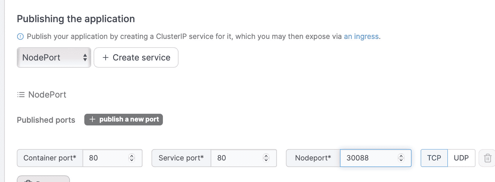

# Kubernetes 需要向 Portainer 学习易用性

> 原文：<https://thenewstack.io/kubernetes-needs-to-take-a-lesson-from-portainer-on-ease-of-use/>

不到两年前，我可以轻松地部署一个 Kubernetes 应用程序，并让它在集群之外[可用。同样的过程不再有效。更具体地说，我很难让 Kubernetes 应用程序和服务可以从局域网访问。](https://thenewstack.io/deploy-a-kubernetes-cluster-on-ubuntu-server-with-microk8s/)

不应该这么难。

说真的。

甚至 [Kubernetes 文档](https://kubernetes.io/docs/tutorials/kubernetes-basics/)也帮不上什么忙。几个月前似乎奏效的方法失败了。我遇到的每一份第三方文档要么破损、过时，要么忽略了在集群之外发布应用或服务所需的一些重要步骤。

至少可以说，这令人沮丧。

这里有一个例子，说明我过去是如何做到这一点的。我将使用 [InfluxDB 时间序列数据库](https://thenewstack.io/getting-started-using-scripts-with-influxdb/)进行演示。

在您的 Kubernetes 控制器上，使用命令:
创建一个新的 YAML 文件

在该文件中，粘贴以下内容:

```
apiVersion:  v1
kind:  Pod
metadata:
name:  influxdb
spec:
hostNetwork:  true
containers:
-  name:  influxdb
image:  influxdb

The important bit here is: 

hostNetwork:  true

```

重要的一点是 hostNetwork: true。

保存并关闭文件。

为了部署 InfluxDB pod，我将发出命令:

```
kubectl create  -f  influxdb.yml

```

为了测试 InfluxDB pod 的外部访问，我必须使用命令:
找出 pod 部署到了哪个节点

```
kubectl describe pods influxdb

```

在输出中，您会看到这样一行:

然后，您可以使用如下命令测试连接:

```
curl  -v  http://IP:8086/ping

```

其中 IP 是上面输出中显示的 IP 地址。

每次都成功了。

现在吗？并没有。

我明白…技术发展的速度远远超过了我们大多数人的速度。当像 Kubernetes 这样重要的技术继续做出如此重要的改变，却没有用高质量的文档来帮助用户轻松过渡时，就有大问题了。这个大问题从未像 Kubernetes 这样明显。

作为一个必须定期写关于这项技术的文章的人，当曾经有效的东西不再有效时，会变得非常沮丧。雪上加霜的是，当前的文档并没有减轻这种挫败感。没有“你过去使用主机网络的地方:是的，你现在将使用诸如此类的东西。”

这就是 Portainer 的用武之地。我毫不怀疑这个基于 web 的 GUI 是我管理容器的首选。[在 MicroK8s](https://thenewstack.io/microk8s-and-portainer-is-the-easiest-way-to-deploy-an-application-on-kubernetes/) 的帮助下，部署 Portainer 来管理 Kubernetes 集群变得非常容易。但是这种简单性并不局限于集群的部署和基于 web 的 GUI。在 Portainer 的帮助下，我可以部署一个应用程序，这样就可以在集群之外轻松地访问它，这是 Kubernetes 本身无法比拟的。

不相信我？让我展示给你看。

## 要求

要做到这一点，您需要 Portainer 的一个运行实例。最好的部署方式是通过 MicroK8s，我在 [Kubernetes 101:将 Portainer 部署到 MicroK8s 集群](https://thenewstack.io/kubernetes-101-deploy-portainer-to-a-microk8s-cluster/)中演示了这一点。准备好之后，登录 Portainer，单击本地环境，然后单击左侧导航栏中的 Applications。在出现的窗口中，单击 Add With Form，这将带您到一个页面，在这里您可以快速创建一个简单的 NGINX 应用程序来测试这一点。在该页面上，选择默认名称空间，将应用程序命名为类似 nginx-test 的名称，并在 Image 字段中键入 nginx。完成后，向下滚动到发布应用程序的位置(图 1)。



图 1:这一部分允许您将应用程序暴露在集群之外。

从下拉列表中，选择节点端口，然后单击创建服务。在结果部分，填写以下内容:

*   集装箱港口:80
*   服务端口:80
*   节点端口:30088

完成后，向下滚动并单击 Deploy Application。给应用程序一分钟左右的时间来部署，然后打开一个 web 浏览器到 http://SERVER:30088(其中 SERVER 是您的托管服务器的 IP 地址)。如果在创建应用程序的过程中，您将实例计数增加到 3，那么您可以从与 Kubernetes 集群相关联的任何 IP 地址访问 NGINX 服务器，例如:

*   192.168.1.70:30088
*   192.168.1.71:30088
*   192.168.1.72:30088

这就是用 Portainer 在集群外公开 Kubernetes 应用程序的全部内容。这就是任务应该有多简单，Kubernetes 开发社区应该注意到这一点。事实上，使用 Kubernetes 是如此具有挑战性，似乎只有开发人员和那些拿工资的人才能真正掌握这项技术，他们整个工作周都在使用和管理这项技术。正因为如此，Kubernetes 的进入壁垒非常具有挑战性，那些新技术的人总是很难让它运行起来。

然而，我想对那些不熟悉 Kubernetes 的人说，跳过命令行，直接使用 Portainer。想要使用这项技术绝对没有什么不好意思的，但是要以这样一种方式来做，当事情不正常时，你不会揪着自己的头发或者尖叫。

<svg xmlns:xlink="http://www.w3.org/1999/xlink" viewBox="0 0 68 31" version="1.1"><title>Group</title> <desc>Created with Sketch.</desc></svg>