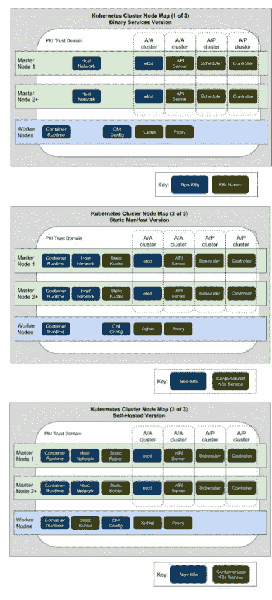

# Kubernetes 不可怕，不复杂，甚至令人困惑

> 原文：<https://thenewstack.io/kubernetes-not-scary-complex-even-confusing/>

 [罗布·希施菲尔德

罗布·希施菲尔德是 RackN 的首席执行官兼联合创始人，该公司为以容器为中心的数据中心提供编排软件。他已经在云计算和基础设施领域工作了近 15 年，从早期的 ESX 测试版开始工作，到在 OpenStack Foundation 董事会任职四届。作为数字 Rebar 项目的联合创始人，Rob 创建了新一代 DevOps 编排工具，以利用容器和面向服务的运营。他认为，在云上运行数据中心和应用程序的技术只是更大故事的一部分。作为一名工业工程师，他热衷于将精益和敏捷流程应用到软件交付中。](http://robhirschfeld.com/digital-rebar/) 

在过去的几个月里，我一直在与 [Kubernetes Cluster Ops SIG](https://thenewstack.io/kubernetes-cluster-ops-sig/) 合作，以创建一个[操作员指南](https://docs.google.com/document/d/1c4DMomZgS1i6AlKbb_8CiTcuimotkcJZAqJtQTN1iqc/edit#heading=h.elb94s160cg7)。该指南的第一批可交付成果，如上图所示，帮助我们展示了 Kubernetes 确实是一个非常简单的架构。

我们做这项工作是为了纠正对 Kubernetes 复杂性的一个普遍误解。这个平台非常优雅，只有相对较少的活动部件。如果这是真的，是什么造就了库伯内特的复杂性小说？

**与平台本身不同，构建 Kubernetes 集群所需的常规先决任务既复杂又困难。**

这些任务使得凯尔西·海托华的“[库伯内特斯的《艰难之路》](https://github.com/kelseyhightower/kubernetes-the-hard-way)”安装指南实际上很难。It 开发人员对常见的集群操作任务缺乏了解和耐心，如创建安全通信(TLS)、配置负载平衡器、运行守护程序服务和其他环境准备任务，从而导致这种看法。其实 Docker 的兴起就是对这种类型作品的反叛！

> 多节点运营很难:这就是为什么我们想要 Kubernetes 这样的平台。

对于多节点操作任务，有一些捷径，如构建[公钥基础设施](https://www.entrust.com/products/entrust-authority-pki/) (PKI)、负载平衡器配置、正确安装 Docker、在 [systemd](https://www.freedesktop.org/wiki/Software/systemd/) 或 [upstart](http://upstart.ubuntu.com/) 中配置服务，以及创建功能软件定义的网络。这还不包括扩展或升级集群等序列敏感任务。由于没有这些繁重的工作，Kubernetes 将无法工作，所以一个简单的三层平台被称为复杂也就不足为奇了。

**一个复杂的因素是，Kubernetes，** [**要求加密传输层安全(TLS)通信**](https://robhirschfeld.com/2016/11/16/provisioned-secure-by-default/) **。删除这个要求会简化先决条件，但会损害默认安全性。**

Kubernetes 集群节点图。

有解决办法吗？是的，如果我们承认平台底层(又名“[就绪状态](https://robhirschfeld.com/tag/ready-state/)”)是一个不同于集群安装的问题。

事实上，所有多节点集群都面临着同样的复杂性问题。关于 OpenStack，我们已经听了很多年了。修复仍然难以实现的原因是这些问题无法在平台中单独解决。好消息是，这些底层挑战是所有平台共有的，并且可以通过最佳实践方式来解决。事实上，当覆盖层试图通过巧妙的捷径(如 roll-your-own-PKI)绕过基本的集群构建需求时，解决这些问题要困难得多。

**平台能对这个问题产生影响吗？有文件证明，是的！**

具有清晰的配置需求和边界的文档有助于限制集成面。它还有助于清楚地确定底层需求，以便我们可以围绕这些需求构建操作自动化，因为有多种有效的方法来完成这项工作。

平台需要信任他们的社区来解决他们的底层需求。我们已经在 Kubernetes 看到了这种情况。由于有多种正确的方式，它可能看起来很混乱或支离破碎。我相信让生态系统独立工作是我们收敛到正确模式的最快方法。

Kubernetes 非常简单——我们不要在项目中引入底层复杂性。

<svg xmlns:xlink="http://www.w3.org/1999/xlink" viewBox="0 0 68 31" version="1.1"><title>Group</title> <desc>Created with Sketch.</desc></svg>