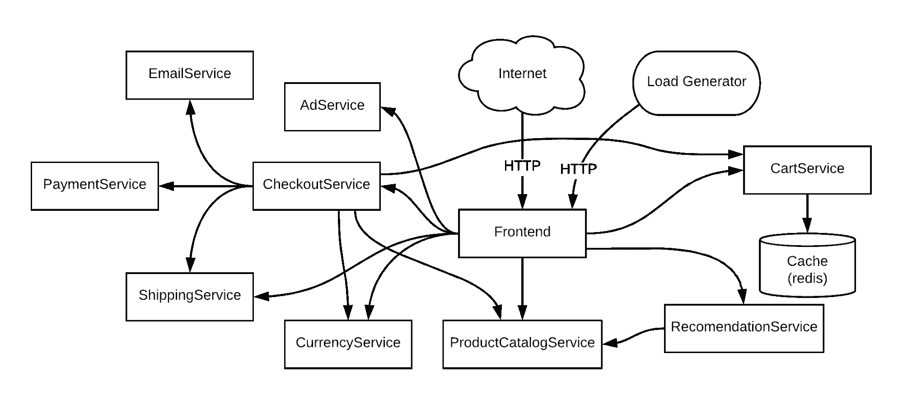

# Kubernetes 云原生架构中的可观测性挑战

> 原文：<https://thenewstack.io/kubernetes-observability-challenges-in-cloud-native-architecture/>

[](https://www.linkedin.com/in/amitgupta1/)

 [艾米特·加普塔

Amit 是 Tigera 的产品管理副总裁。](https://www.linkedin.com/in/amitgupta1/) [](https://www.linkedin.com/in/amitgupta1/)

[Kubernetes](https://thenewstack.io/kubernetes-and-the-cloud-native-community/) 是编排容器化工作负载和微服务的实际平台，是[云原生应用](https://thenewstack.io/what-are-cloud-native-patterns-and-how-should-you-use-them/)的构建模块。Kubernetes 的工作负载是高度动态的、短暂的，并且部署在分布式和敏捷的基础设施上。虽然 Kubernetes 管理的云原生应用程序有很多好处，但 Kubernetes 在云原生应用程序中提出了一系列新的可观察性挑战。

让我们考虑一些可观察性挑战:

1.  **数据孤岛:**传统的监控工具专门收集应用程序和基础设施级别的指标。鉴于云原生应用的高度动态性、分布式和短暂性，这种类型的指标收集会创建孤岛中的数据，这些数据需要在服务上下文中缝合在一起，以便开发运维人员和服务请求人员能够调试服务问题(例如，响应时间慢、停机时间等)。).此外，如果开发运维人员或服务所有者添加新的观察指标，数据孤岛可能会导致交叉引用中断和数据误解，从而导致数据错位、通信变慢和分析错误。
2.  **数据量和粒度组件:** Kubernetes 部署具有粒度组件，如运行在分布式和短暂基础设施之上的 pod、容器和微服务。每一层都会生成数量惊人的粒度数据，如警报、日志和跟踪，并且这一数据量会随着服务的扩展而增长。数据越多，梳理模式和调试问题就越困难。随着数据的增长，可观察性和故障排除变得更加困难。
3.  Kubernetes abstraction:Kubernetes abstraction 让我们很难理解动态的、短暂的、分布式的基础设施发生了什么。解开这些抽象就像剥开洋葱的层(在容器、节点、网络和流程级别，有时甚至到套接字和数据包级别)来理解底层问题。

考虑到 Kubernetes 微服务部署的复杂性和生成的海量数据，在 Kubernetes 环境中对应用程序进行故障排除极具挑战性。需要一种不同的方法来解决 Kubernetes 的可观测性挑战。

## Kubernetes 可观测性的另一种方法

 [迪拉杰·塞加尔

Dhiraj 是 Tigera 的产品营销总监。](https://www.linkedin.com/in/dhirajsehgal/) 

Kubernetes 的声明性质使得正确实现可观测性变得极其简单。DevOps、SREs 或服务所有者可以围绕他们希望如何保护和观察系统来声明一个高级语言结构，Kubernetes 可以负责实现。可观察性可以被视为代码，这样它就可以作为应用程序不可分割的一部分，然后与应用程序一起传播，这样它就可以在任何云、基础设施、网络或应用程序上运行。可观察性可以进一步细化，因为代码可以集成到 CI/CD 链中并向上游移动。这使得开发人员和软件工程师能够以适当的可观察性来构建他们的应用程序，以确保应用程序按预期运行。

为了进一步理解这一点，让我们看一个简单的例子，展示在 Kubernetes 环境中，作为代码的可观察性是如何为云原生应用程序工作的。

[线上精品店](https://github.com/GoogleCloudPlatform/microservices-demo)(原名潮人店)是谷歌云的 11 层微服务演示应用。

[](https://cdn.thenewstack.io/media/2021/04/5c028560-image1.png)

图:线上精品微服务架构

其中一个微服务是 ProductCatalogService，其目的是显示最新的目录(该目录根据较新的产品可用性和现有产品库存而变化)。部署 Online Boutique 后，将监控关联的微服务(包括 ProductCatalogService)的故障、超时和缓慢的性能。

使用传统的监控和故障排除方式，开发人员、开发人员和服务人员在他们自己的数据孤岛中工作，分别为 ProductCatalogService 捕获数据，然后通过构建内部脚本或利用第三方软件将他们各自的数据相互关联。最初，在数据量较低的情况下，这可能是可行的，但这种方法不会随着业务的增长而扩展(由于更大的产品目录和/或业务逻辑会吸引更多的客户)。由于应用程序使用 Kubernetes 作为短暂的、分布式的和动态的基础设施来运行 ProductCatalogService，Kubernetes 抽象将使数据上下文在节点、容器、网络、流程和数据包级别变得困难。所有这些挑战加在一起将导致更长的故障排除时间，并在应用程序崩溃或性能下降时导致猜测错误。

DevOps 或 SREs 可以采用不同的方法，通过利用 Kubernetes-native 抽象及其声明性模型来正确观察 ProductCatalogService，从而将可观察性作为代码。

```
apiVersion:  projectcalico.org/v3
kind:  PacketCapture
metadata:
  name:  productcatalogservice-pcap
  namespace:  onlineboutique
spec:
  selector:  app  ==  "productcatalogservice"
  destination:
 ports:
 -  80
  protocol:  TCP

```

以上是代码可观察性的一个例子。在名称空间“onlineboutique”中创建了一个作业“packetcapture-pcap”，它选择并过滤 Kubernetes 上运行的工作负载，标记为“app == productcatalogservice”，并在端口 80 和协议 TCP 上进行数据包捕获。由于 Packetcapture 是 Online Boutique 中 ProductCatalogService 的一部分，并且正在收集所有相关的元数据，因此消除了数据孤岛和数据粒度问题。这种方法有以下好处:

1.  由于 Kubernetes 将应用程序和相关的微服务部署在短暂的分布式基础设施上，因此代码中的标签和作业确保所有相关的上下文都在所有团队成员的指尖上。这使得流量有效载荷的过滤和后续分析变得容易。
2.  不同的团队成员可以在不同的端口或不同的协议上使用此示例来获取其他服务或数据包。
3.  以同样的方式，开发团队维护单元测试以确保他们的代码在构建时的质量，作为代码的可观察性(就像这个例子中的)可以被维护以确保各种涉众(DevOps，SREs，等等)。)可以在运行时轻松地对应用程序进行故障排除。

如本例所示，由数据仓、数据量和粒度组件以及 Kubernetes 抽象构成的可观察性挑战可以通过使用代码可观察性方法来解决，这种方法利用了 Kubernetes 的声明性。如果您的应用程序遇到性能、故障或超时问题，这将导致更快的故障排除和更短的解决时间。

准备好为自己尝试一种代码可观察性方法了吗？入门有 **[免费 14 天印花布云试用](https://www.tigera.io/tigera-products/cloud-trial)** 。

通过 Pixabay 引导图像。

<svg xmlns:xlink="http://www.w3.org/1999/xlink" viewBox="0 0 68 31" version="1.1"><title>Group</title> <desc>Created with Sketch.</desc></svg>