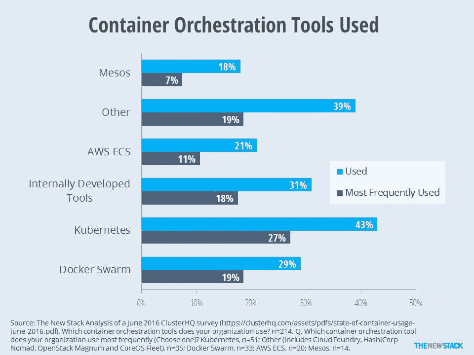

# 一岁大的库伯内特已经在改变规则了

> 原文：<https://thenewstack.io/kubernetes-one-year-game-already-changing-rules/>

自从 Kubernetes 1.0 发布以来的近一年时间里，没有任何事情会让任何人感到惊讶。谷歌围绕 [Kubernetes](/category/kubernetes/) 培育了一个生态系统，就像 [Docker](https://www.mirantis.com/software/docker/kubernetes/) Inc .围绕其集装箱化平台构建了一个生态系统一样。

从去年谷歌云首席执行官 Greg DeMichillie 在奥莱利的 OSCON 舞台上走上舞台，听到歌词包括“我们在数量上有优势，他们会为此付出代价”的音乐，谷歌就已经传达了一个不那么微妙的信息，即 Kubernetes 将负责编排空间。

那么, [Kubernetes](http://kubernetes.io/) 现在是容器生态系统的中心吗？

“中心？“这是一个非常亲切的词，”谷歌的高级软件工程师和 Kubernetes 的联合创始人 Tim Hockin 回应道，“我也这么认为。

“我认为我们一直在推动我们一直在做的事情的极限，”霍金在接受即将到来的一期 **[新堆栈:上下文](/tag/the-new-stack-context/)** 播客采访时继续说道。“我认为我们引入了一系列广受欢迎的想法。也就是说，这个领域正在发生很多事情，所以很难定义中心。它就像宇宙的中心。一切都在同时远离彼此……除了在很多地方，我们也在向彼此靠近。”

## 谷歌一下这个

上个月， [ClusterHQ](https://clusterhq.com/) ，Flocker container volume manager 背后的公司，询问了 214 名开发人员他们的容器环境使用了哪些编排工具。他们得到了一份有五个主要选择的列表，外加“其他”，并被要求选择所有适用的选项。43%的受访者选择了 Kubernetes，击败了约 4%的其他人。当被要求选择他们最常用的管弦乐队时，大约 27%的受访者选择了 Kubernetes。

IT 公司可能采取的一种竞争方法是让他们的竞争对手专注于系统的一个元素，然后系统地使该元素变得不相关。在容器化领域，Google 现在将 Kubernetes 作为一个越来越不可知的平台，用于暂存和管理工作负载，而不管容器是什么。但是，为诸如 **appc** 以及其他可能出现的东西开放一个流行而高效的平台，有一个附带的好处，就是使格式成为一个不太相关的问题。

“当 Kubernetes 进入这个领域时，*事实上的*在容器中进行联网的方式，”Hockin 解释说，“有点像码头工人的方式。你为每个容器建立你的网络命名空间，它们有一个私有的 IP 地址，你[将你的主机上的一些端口映射到你的容器](https://docs.docker.com/v1.8/articles/networking/)上的端口，并且通过某种复制过程——无论是 **iptables** 或**用户空间**或其他——你以这种方式路由流量。”

Hockin 随后提到了谷歌 2015 年 4 月著名的白皮书，详细描述了其内部开发的 Borg 项目，以及从该项目中吸取的经验教训如何导致 Kubernetes 的产生。上面写道，“每台机器一个 IP 地址会让事情变得复杂。在 Borg 中，机器上的所有任务都使用它们主机的单一 IP 地址，因此共享主机的端口空间。这导致了许多困难:Borg 必须将港口作为一种资源进行调度；任务必须预先声明它们需要多少端口，并且在启动时愿意被告知使用哪些端口；博格特必须加强端口隔离；命名和 RPC 系统必须处理端口和 IP 地址。”

> 只要应用程序或服务不必依赖于特定于系统架构的任何东西来与其他服务联系并开始与它们做生意，编排层就成为它们之间非常有效的抽象层。

Hockin 解释说，“对开源软件来说，把 IP 地址硬连接到容器上比谷歌内部更难，因为你不能随意改变开源软件；你必须完成开源过程，并尝试上游的变化。我们出来告诉人们，'*这*就是你必须如何编写你的软件；*这*是你如何做你的网络，永远不会飞。所以我们采取了不同的方法，做了我们一直想做的事情。”

他继续说，Kubernetes 通过将“真正的”IP 地址委托给 pods(容器集群)来解决这个问题，pods 是由 DNS 和 DHCP 等真正的互联网服务来维护和控制的地址。这些地址的范围不限于容器集群，因此服务发现对于 pod 的地址和对于网络中其他地方的虚拟机的地址一样有效。“所有这些地址都可以相互交流，而不必穿越不同的存在层，”他说，“也不必在端口号之间进行转换。”

对于开发者来说，这意味着端口号可以被硬编码——Hockin 解释说，这就是它们最初的设计方式。例如，端口 443 应该始终为传入的 SSL Web 流量保留，而不是出于指定的目的随意委托给某个容器，并且会随机更改。

谷歌的工程师认为，当互联网地址可以按照最初设计的那样自由运行时，分布式系统中的应用程序可以使用传统的服务发现方法来定位彼此，并交换数据和消息。

这就是意外之财的来源:只要应用程序或服务不需要依赖于特定于系统架构的任何东西来与其他服务联系并开始与它们做生意，编排层就成为它们之间非常有效的抽象层。他们的架构对彼此越来越不重要，在这个系统中，他们可以成为他们的开发者所描述的那样。

## 菲多的复仇

目前，Kubernetes architects 正在努力充分利用这种自由，测试一个与 DNS 相关的功能，他们称之为*宠物集*——在 1.3 版本中发布，尽管有多个警告称它将被视为“阿尔法”如果这个名字让你想起[现在广为人知的“宠物与牛”的类比](https://thenewstack.io/pets-and-cattle-symbolize-servers-so-what-does-that-make-containers-chickens/)，那是设计使然。他们的想法是，一个 DNS 主机名可以分配给 Kubernetes pods 的一个子集。这个名称作为这些 pod 的集体身份，因为它们在集群应用程序中使用。

“我们研究过的大多数数据库系统都需要或想要某种持久的名称——某种持久的身份，”Hockin 解释说。“该身份通常以 IP 地址的形式被捕获，但并不一定如此。我们认为，与网络模型的其他部分一致，依赖一个持久的 IP 地址会以一种你并不真正想要的方式耦合你自己。”

随着分布式应用程序在数据中心之间和通过云进行迁移，IP 地址往往会发生变化。Kubernetes 已经提供了稳定的 DNS 名称和虚拟 IP 地址，但是一个更强大的身份机制可以实现对持久存储的访问，而无需基础设施调用网络插件。

Hockin 说:“有了宠物集，你就可以得到一个 DNS 名称，这个名称与你在 quorum 中的位置相关联。“您将获得一个连接到相同插槽的存储卷，因此，如果您的容器失效并恢复，您将获得相同的身份和相同的存储。因此，如果你保存的信息附有你的名字或类似的东西，你可以很容易地重新创建它。我们用它来支持像 MySQL Galera 和 T2 Cassandra 这样的东西

因此，工作负载的包容格式对 Kubernetes 来说越来越无关紧要。这种观点认为，开发团队不应该再将精力集中在一种格式上，以实现一个重要的目标，比如利用持久数据库的微服务。如果编排系统在接下来的几个月里证明了自己的观点，那么它可能会让所有关于容器格式相对优势的讨论和辩论变得无关紧要——至少就编排而言。

“我认为 Kubernetes 对这种形式并不感兴趣，”霍金曾说。“我们真的想成为集装箱技术的瑞士。我们真的不关心你是否在[CoreOS ']**rkt**中推出你的东西，或者在 Docker 的存储库中，或者在其他人的存储库中，或者是否有你想要使用的其他格式。我们欢迎所有这些想法。我不认为这是配器有趣的地方。我知道这对用户很重要；这些技术如何工作，以及它们如何适应他们的企业，这一点非常重要。我不认为这改变了我们的编排方式。"

## 第二级起飞

一段时间以来， [CoreOS](https://coreos.com/) 一直在生产一个商业 Kubernetes 实现——structural。因此，谷歌对 CoreOS 肯定并不陌生，尽管最近几个月，它实际上可能已经越来越接近了。虽然 Kubernetes 的贡献者在早些时候淡化了他们自己环境中插件的需求，但最近，orchestrator 已经[开始使用容器网络接口(CNI)插件](http://kubernetes.io/docs/admin/network-plugins/)，使用来自 CoreOS**rkt**的规范。这使得 Kubernetes 能够在管弦乐队的影响范围内采用 Hockin 所描述的“一流的容器系统”。

在去年四月发表的一篇 CoreOS 博客文章中， **rkt** 贡献者 [Derek Gonyeo](https://github.com/dgonyeo) 解释道:“使用一个专门的 **stage1** 映像， **rkt** 在每个 CoreOS 集群成员上控制 kubelet 节点管理器的下载、加密验证和执行。这将集群编排软件层从底层操作系统和容器化应用层中分离出来，允许更轻松、更频繁地更新所有组件，从而提高开发运维团队的灵活性和安全性。”

“这真的证明了我们可以不止做一件事，”谷歌的霍金告诉我们。“我有点担心 Docker 在我们的代码库中扎根太深，但我们能够提取它们——这是一项了不起的工作。”

毫无疑问，现代建筑开发的开源本质已经证明，开发一个系统仅仅为了维持它自己和它自己的品牌不再值得。如果完成某件事情的更好的方法是可行的，即使它还没有在生产环境中被证明，那么开源开发者将会解构和抛弃与他们的目标不再相关的东西，以推进更大的目标。这就是谷歌如何构建 Kubernetes 的演变；这是谷歌希望我们理解的进化。

但是，正如 Oracle 在其历史上多次证明的那样，根深蒂固的方法在企业数据中心最有机会生存。借用谷歌的比喻，现在显然有不止一种方法来命名这个谚语中的宠物，这将取决于 Kubernetes 的竞争对手挖足够深的壕沟，以在下一轮抽象中生存下来，这是由绝对的形式大师创造的。

科洛斯和[码头工人](https://www.mirantis.com/software/docker/kubernetes/)是新堆栈的赞助商。

标题图片:[“湾流”，温斯洛·霍默【1899】](https://en.wikipedia.org/wiki/The_Gulf_Stream_(painting)#/media/File:Winslow_Homer_-_The_Gulf_Stream_-_Metropolitan_Museum_of_Art.jpg)，纽约大都会艺术博物馆，公共领域。

<svg xmlns:xlink="http://www.w3.org/1999/xlink" viewBox="0 0 68 31" version="1.1"><title>Group</title> <desc>Created with Sketch.</desc></svg>