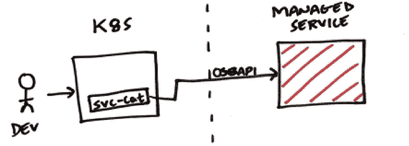
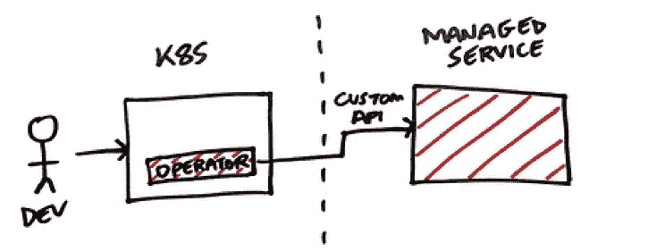
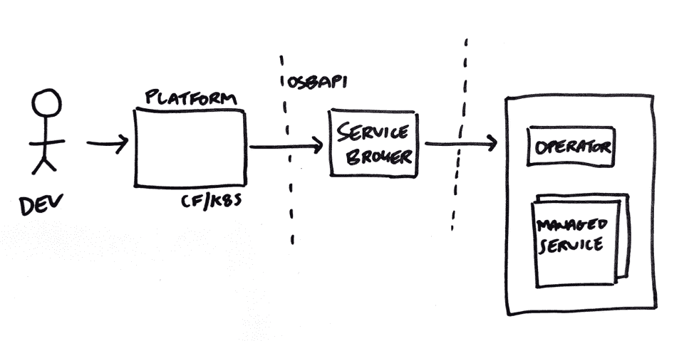

# Kubernetes 运营商和开放服务代理 API:完美的结合

> 原文：<https://thenewstack.io/kubernetes-operators-and-the-open-service-broker-api-a-perfect-marriage/>

 [马特·乔里克

马特是 Pivotal 的一名软件工程师。在过去的五年里，他一直在云铸造生态系统中工作。](https://www.linkedin.com/in/mattcholick/) 

如今，有两种流行的机制将后台服务附加到云本地应用程序:运营商和开放服务代理 API。这篇文章比较了这些技术，并解释了它们如何一起工作来处理更广泛的开发场景。

应用程序开发人员通过三种软件实现价值:

1.  **定制软件**:他们自己创建并运行的软件(例如，他们提供给最终用户的移动应用)；
2.  **常见的现成软件**:别人写的自己运行的软件(比如自己安装、配置、运行的 MySQL 版本)。Kubernetes 的人们通常将这种类型的软件称为[白盒软件](https://github.com/kubernetes/community/blob/master/contributors/design-proposals/architecture/declarative-application-management.md)；
3.  [**托管服务**](https://kubernetes.io/docs/reference/glossary/?all=true) :由第三方运行和维护的软件(如 AWS 关系数据库服务或 MySQL for PCF)。注意，第三方不一定是指不同的公司；它可能是由您组织内的另一个团队构建或运行的软件。

在这篇文章中，我们将这些类型的软件称为*定制软件*、*普通现成软件*和*托管服务*。然而，这篇文章主要关注的是*托管服务*。

 [马特·麦克尼尼

Matt 是 Cloud Foundry Services API 项目的项目负责人，该项目旨在增强开发人员提供和管理服务的体验。Matt 还是 Open Service Broker API 的联合主席，该项目由 Pivotal、Google、IBM、Red Hat 和其他公司开发，允许开发人员向运行在多个平台上的应用程序提供服务，包括 Cloud Foundry 和 Kubernetes。在过去的一年中，Matt 在各种会议上发表了关于服务和服务代理的演讲，包括 CF Summit EU、VMworld 和 SpringOne Platform。](https://tanzu.vmware.com/) 

Cloud Foundry 提供的一大优势是，开发人员能够自助访问其工作负载所需的托管服务。[Cloud Foundry Services](https://docs.cloudfoundry.org/services/overview.html)[API](https://docs.cloudfoundry.org/services/overview.html)[规范](https://docs.cloudfoundry.org/services/overview.html)于 2012 年推出，允许任何服务提供商构建*托管服务*以在任何 Cloud Foundry 平台上提供该服务。

当 Kubernetes 推出时，服务提供商看到了一个机会，可以为这个生态系统带来蓬勃发展的云计算托管服务市场。毕竟，在 Kubernetes 集群上运行的工作负载需要访问许多相同的服务集。因此，Cloud Foundry 服务 API 规范成为了[开放服务代理 API (OSBAPI)](https://www.openservicebrokerapi.org/) 。

Kubernetes 社区中的人们已经建立了对 OSBAPI 规范的支持，并创建了[服务目录](https://github.com/kubernetes-incubator/service-catalog)项目，以在 Kubernetes 集群中提供服务市场。

然而，我们看到在这个问题领域出现了新的技术。这篇文章的目的是围绕这些技术是什么，以及它们与我们今天已有的机制相比如何展开讨论。首先，让我们看看操作符，以及它们与 OSBAPI 的比较。

## 什么是运算符，为什么它们很重要？

在过去的几个月里，我们看到运营商人气飙升。很容易看出为什么。运营商允许与 Kubernetes 合作的开发人员直接从 Kubernetes 集群消费托管服务。随后，操作者模式经常被提出来作为构建符合 OSBAPI 的服务代理的替代方案。

关于什么是操作符，存在一些混淆，因此需要澄清:

1.  [操作符模式](https://coreos.com/blog/introducing-operators.html)是一组[自定义资源定义](https://kubernetes.io/docs/tasks/access-kubernetes-api/custom-resources/custom-resource-definitions/)(CRD)，带有自定义控制器对其进行操作；
2.  [运算符框架](https://github.com/operator-framework)是运算符模式加:

*   *   管理部署的工具(自动更新和注册表)。
    *   CRD 上的元数据有助于构建用户体验。

对于这里的讨论，我们主要关注操作符模式。如果您看一看 [operatorhub.io](http://operatorhub.io/) ，您可以看到 Operator 模式的两个不同的用例:

1.  其中 Operator 是一个特定于应用程序的控制器，它扩展 Kubernetes API 来创建、配置和管理在 Kubernetes 集群上运行的复杂有状态应用程序的实例。操作员通常在与相关工作负载相同的集群上运行。操作员可用的工作负载示例包括 Couchbase 和[PostgreSQL](https://operatorhub.io/operator/postgres-operator)；
2.  使用托管服务，如 AWS 服务操作员。这里，任何供应的服务都运行在与使用它的软件完全不同的基础设施中。

这两个用例之间的关键区别是谁负责运行软件。第一个用例可用于运行和管理*定制软件*和*普通现成软件*。这与 OSBAPI 有明显的区别，因为 Service Broker 模型不满足这个用例。

第二个用例提供了消费*托管服务*的用户体验，因此可以被认为是 OSBAPI 的替代方案。

## 将运算符与 OSBAPI 进行对比

OSBAPI 提供了与托管服务交互的说明性接口。它为开发人员提供了供应、更新、取消供应、绑定和解除绑定的能力。服务提供商只需要构建“服务器”端(例如服务代理)，并依靠平台(例如 Cloud Foundry 或 Kubernetes [服务目录](https://github.com/kubernetes-incubator/service-catalog))来提供用户体验。请注意，[服务目录](https://github.com/kubernetes-incubator/service-catalog)项目是[仍在成熟的](https://www.infoq.com/articles/service-catalog-kubernetes/)。因此，OSBAPI 不被视为向 Kubernetes 开发人员提供*托管服务*的有效机制。

消费*托管服务*的操作者模式为这种交互提供了更加灵活的接口。许多不同的东西可以被建模为一个定制资源；因此，开发人员可以与更广泛的服务进行交互。

当然，这种灵活性伴随着复杂性。服务提供商需要构建“客户机”端(开发者安装的提供用户体验的操作器)*和*“服务器”端。注意，这个场景中的“服务器”端可以是任何 API，包括符合 OSBAPI 规范的 API。

不管服务提供商需要编写什么样的软件以及这些软件在哪里运行，这项工作都归结为两件事:

1.  **用户体验**:OS API 为开发人员提供了一个关于生命周期管理的强有力的观点。对于运营商，没有太多的意见。服务提供商可以构建他们想要的任何用户体验。即使有了提议的[通用扩展](https://github.com/openservicebrokerapi/servicebroker/pull/431)，OSBAPI 规范也永远不会提供像定制操作符那样的灵活性。然而，灵活性往往会导致不一致的用户体验；
2.  **开发成本**:有了 OS API，服务提供商只需要构建和维护 OS API 兼容的“服务器”(即服务代理)，否则就要依赖平台提供的用户体验。对于运营商来说，服务提供商必须构建和维护他们的“服务器”(并可能定义他们自己的 API)。他们还必须构建自己的运营商来提供用户体验。

现在我们知道了一些 OSBAPI 和操作符之间的区别。现在让我们探索 Kubernetes 开发的当前状态。

## **如今开发者如何使用 Kubernetes？**

关于开发人员应该如何使用 Kubernetes，有两种主要的观点:

1.  **开发者应该直接在 Kubernetes 上部署应用。**如 [https://kubernetes.io](https://kubernetes.io/) 所述:“Kubernetes (K8s)是一个用于自动化部署、扩展和管理容器化应用的开源系统”；
2.  **“Kubernetes 是一个搭建平台的平台。”这是凯尔西·海托华学派。在这里，开发人员应该使用构建在 Kubernetes 之上的抽象。**

对于第一种情况，使用原生 Kubernetes 构造让应用程序访问*托管服务*是有意义的。像[服务目录](https://github.com/kubernetes-incubator/service-catalog)和独立服务市场这样的项目今天通过利用 Kubernetes [秘密](https://kubernetes.io/docs/concepts/configuration/secret/)来存储应用程序消费*托管服务*所需的信息来做到这一点。

对于第二种情况，有很多未知数。基于 Kubernetes 构建的平台是新兴的。我们需要更多的数据，然后才能权威地说，从像 [Knative](https://pivotal.io/knative) 这样的更高抽象中消费托管服务的“好”用户体验是什么样的。

## 未来会是什么样子

可以理解的是，许多服务提供商希望了解他们应该使用什么机制在未来向 Cloud Foundry 和基于 Kubernetes 的平台提供*托管服务*。

考虑到我们到目前为止讨论的技术，这里有三个观察结果:

1.  运营商似乎越来越关注*通用现成软件*，开发人员需要运行和管理这些软件。对于构建在 Kubernetes 之上的软件，这种模式似乎是占主导地位的模式，并提供了很多好处；
2.  社区需要就运行在 Kubernetes 上的应用程序应该如何使用托管服务达成共识。这既影响了构建*托管服务*的服务提供商，也影响了那些在 Kubernetes 上构建平台的提供商。(记住，我们还需要学习这些平台应该提供什么样的用户体验)；
3.  目前，除了开放的 Service Broker API 之外，别无选择。没有其他*标准*可供服务提供商用来向多个平台提供*托管服务*。

## OSBAPI 和操作者可以一起工作

有鉴于此，找到这两种技术协同工作的方法是有意义的。根据我们的经验，有一种方法可以包含每个项目各自的优势、投资和牵引力。这可能是这样的。

OSBAPI 对如何进行管理没有强烈的意见；它只是要求以某种方式管理服务。这使得 OSBAPI 能够利用成熟和老练的运营商的投资。编码到操作符中的自动化程度差别很大。操作符框架将这些操作符放在操作符成熟度模型谱上。成熟的运营商能够实现类似于 BOSH 部署的管理自动化水平。

这使得在企业中运行 Cloud Foundry 和 Kubernetes 的平台工程师可以向他们的开发人员提供这样的服务。符合 OSBAPI 的服务代理可以坐在操作员前面，并与操作员交互。我们看到的许多开源操作符都有一个交互子集，可以相对清晰地映射到 OSBAPI 端点。一旦即将到来的[通用扩展](https://github.com/openservicebrokerapi/servicebroker/pull/431)特性被纳入 OSBAPI 规范，未来将会支持更高级的交互。注意，OSBAPI 服务代理本身可以部署在 Cloud Foundry、Kubernetes 或其他地方。

通过服务代理将这两个概念联系起来，平台工程师可以管理基于 Kubernetes 的服务。我们经常听到平台工程师不希望开发者只安装 ***任何*** 舵图或操作符。负责任的公司需要更好的治理。(只要看看最新的安全漏洞就知道为什么强权限模型是个好主意。)

什么机制可以平衡安全性和治理与按需自助访问附加功能？代理服务的目录。像 Cloud Foundry 这样的平台上的开发者可以消费服务，而不用担心这些服务在哪里运行。平台工程师可以暴露和管理正在获得牵引力的高质量运营商。

实际上，运营商作者和平台工程师可以利用一个通用的代理，如 [Kibosh](https://content.pivotal.io/blog/use-kubernetes-helm-packages-to-build-pivotal-cloud-foundry-tiles-kibosh-a-new-service-broker-makes-it-simple) 来使他们的工作对集成了 OSBAPI 的平台可用。在许多情况下，OSBAPI 和操作符技术可以很好地相互补充。

另一方面，社区正在重构[服务目录](https://github.com/kubernetes-incubator/service-catalog)项目，以使用[定制资源](https://kubernetes.io/docs/concepts/extend-kubernetes/api-extension/custom-resources/)。完成后，这个新的改进版本将提供对托管服务的访问，这些托管服务位于 OSBAPI 兼容的服务代理之后。这可能会为*托管服务*的作者提供一条未来的途径，让他们可以轻松地向使用 Kubernetes 的开发人员提供他们现有的基于 OSBAPI 的服务。

## 结论:看好这个空间

在 Pivotal，我们已经探索这个领域很长时间了。在过去几年中，我们已经帮助数百家独立软件供应商(ISV)创建了高质量的服务，可以轻松地提供给运行任何版本的 Cloud Foundry 的客户。Kubernetes 也为这些独立软件开发商开辟了有趣的新机会。

Pivotal 已经在这一领域开始了新的旅程。我们的目标是一种机制，允许平台工程师轻松管理服务市场，这些服务可由运行在许多 Cloud Foundry 和 Kubernetes 集群上的应用程序使用。通过建立在当今可用的多样化服务生态系统之上，并集成像 [Kibosh](https://www.infoq.com/presentations/kibosh-pks) 这样的现代工具，我们希望这种新机制将使企业能够管理大型、繁荣的服务市场，供其所有工作负载使用，无论它们运行在什么平台上。

*感谢 Aaron Meza、Jatin 纳伊克、Sam Gunaratne 和 Ed King 对本文的贡献。*

<svg xmlns:xlink="http://www.w3.org/1999/xlink" viewBox="0 0 68 31" version="1.1"><title>Group</title> <desc>Created with Sketch.</desc></svg>