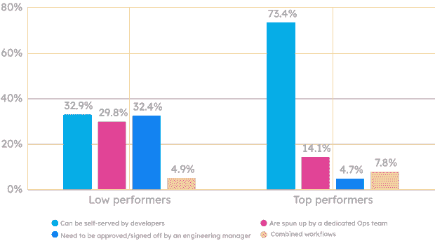

# Kubernetes 痛苦？平台工程可以提供帮助

> 原文：<https://thenewstack.io/kubernetes-pains-platform-engineering-can-help/>

让我们描绘一幅现代云原生设置中的开发人员的图画:无论是在数量上还是在复杂性上，工具领域都在快速发展。组织的工程设置通常要求开发人员不仅要对 Kubernetes 有一个端到端的理解，还要对基础设施供应、部署管道和配置管理有一个端到端的理解。在过去的 10 年中，开发人员对软件交付过程中越来越多的部分负责。

所有这些转变都给开发人员带来了[认知负荷](https://platformengineering.org/blog/cognitive-load)。而且，正如许多开发者现在在 [Twitter](https://twitter.com/luca_cloud/status/1562349679660122112?ref_src=twsrc%5Etfw%7Ctwcamp%5Etweetembed%7Ctwterm%5E1562349679660122112%7Ctwgr%5Ee90dc6c7c0c0e831911ef247d36c40cde0bd28ad%7Ctwcon%5Es1_&ref_url=https%3A%2F%2Fthenewstack.io%2Fdevops-is-dead-embrace-platform-engineering%2F) 、 [Reddit](https://www.reddit.com/r/devops/comments/wusvc9/devs_dont_want_to_do_ops/) 和[会议](https://thenewstack.io/devs-and-ops-can-this-marriage-be-saved/)上分享的那样，这种认知负荷正在干扰他们执行最重要任务的能力:发布功能。

对于开发者来说，Kubernetes 是这面复杂的墙中的一块砖。因此，在本文中，我们将解决组织在 Kubernetes 中遇到的具体问题，以及它们如何适应采用 DevOps 的更大问题，这正是[平台工程](https://humanitec.com/platform-engineering)旨在解决的问题。

## 管理不当的期望

许多 Kubernetes 的痛苦是对期望管理不当的结果。一些组织希望 Kubernetes 易于使用和维护，能够为组织节省资金，并且不受云供应商的限制。他们没有意识到的是，为了实现潜在的好处，他们仍然需要先决的功能系统和安全专业知识，这些知识以前由具有多种职业道路的多人掌握。

如果没有强大的配置管理、适当的文档和与 CI/CD 系统的成熟集成，实现 Kubernetes(或任何其他技术)将变得非常困难。您必须在第一时间获得正确的技术实现细节。

平台工程不是一根魔杖，可以让这个基本需求消失。然而，构建您的平台所需的产品方法可能有助于说明您的组织还没有准备好支持 Kubernetes 的领域。

如果你还没有采用 Kubernetes，进行用户研究和建立一个强有力的反馈环也可能有助于为 Kubernetes 将为你的组织做什么设定更现实的期望。

## 开发者缺乏信心

在一些 DevOps 设置中，开发人员缺乏信心去弄脏自己的手。他们担心每次接触与 Kubernetes 相关的送货系统时会弄坏东西。

但是如果你不想慢下来，你需要为 Kubernetes 设置实现真正的自助服务。开发人员自助服务意味着工程师可以自行调配和使用他们测试、保护和部署其应用和服务所需的技术，而不必等待运营人员为他们调配资源或旋转环境。这并不一定意味着开发人员需要掌握他们的整个工具链。

[内部开发人员平台](https://humanitec.com/blog/what-is-an-internal-developer-platform)提供了抽象层次，降低了开发人员完成工作所需的 Kubernetes 专业知识水平。同样，支持开发人员自助服务并不意味着任何开发人员都应该能够影响生产基础架构。事实上，设计良好的平台允许开发人员花更少的时间摆弄基础设施，而花更多的时间发布特性。

当涉及重复任务时，如开发新功能或预览环境，支持开发人员自助服务对于节省团队时间和资源至关重要。如果没有它，组织将面临制造更多瓶颈和关键人员依赖性的风险，这将拖慢新功能和创新周期的交付时间、部署频率和上市时间。

在 [Humanitec 的 2022 年 Kubernetes 基准研究](https://humanitec.com/whitepapers/kubernetes-benchmarking-study-2022)中，我们发现在 DORA 指标上表现优异的团队也支持开发人员自助服务。在 73.4%的团队中，开发人员可以为特性和预览环境自助使用 Kubernetes 名称空间。

**特性或预览环境的新命名空间**

此外，在 89.1%的高绩效团队中，开发人员能够独立地按需部署到开发或试运行。只有 32.9%的低绩效组织是如此。此外，近三分之一的低绩效者报告说，尽管理论上他们组织中的每个人都可以部署到他们的 Kubernetes 集群，但对犯错误的恐惧阻止了许多人坚持到底。

在这些设置中，交付时间增加，部署频率降低。这些团队需要能够满怀信心地进行部署。内部开发人员平台可以提供开发人员在与 Kubernetes 交互时更加自信所需的支持(以及使运营更加自信的护栏)。

## 一种尺寸不适合所有人

平台工程的兴起反映了开发和运营之间关系的某种程度的破裂，这种破裂是由组织将一刀切的开发方法复制并粘贴到他们的组织中造成的。在 [DevOps 拓扑](https://web.devopstopologies.com)中，Matthew Skelton 和 Manuel Pais 概述了许多组织在尝试实现 DevOps 时会遇到的一些反模式。

当组织决定不再需要专门的运营角色时，就会出现一个反模式。他们无意中把这些任务交给了有经验的开发人员。这错误地分配了组织的一些最有价值的资源，造成了更多的低效率，DevOps 就是为了解决这些问题而引入的。Humanitec 的 [2021 DevOps 基准研究](https://humanitec.com/whitepapers/2021-devops-setups-benchmarking-report#whitepaper)发现，在 44.9%的情况下，高级开发人员接管运营的角色，以帮助经验较少的开发人员。

这种所谓的“影子操作”模式造成了各种各样的低效率。显然，许多组织正在努力以一种与他们的团队和现有资源兼容的方式实现 DevOps 原则。

平台工程通过采用[产品方法](https://platformengineering.org/talks-library/platform-as-a-product)避免了这个陷阱。对于内部开发人员平台，开发人员就是客户。[平台团队](https://humanitec.com/blog/internal-platform-teams-what-are-they-and-do-you-need-one)通过开展用户研究和定期征求反馈，全面了解开发人员的需求。这种交流是平台团队决定首先构建哪些特性，以及需要迭代平台的哪些方面的方式。

产品方法还需要了解不同的利益相关者群体，并向他们推销平台。这确保了平台不会因为缺乏采纳或高管的支持而失败。如果做得正确，产品方法应该揭示开发人员在 Kubernetes 中的哪些地方挣扎，以及他们需要什么样的抽象才能成功。

当提到 Kubernetes 时，内部开发人员平台也可能缓解开发人员和运营人员之间的紧张关系。该平台取代了 DevOps 工程师所做的大量临时工作，尽管不一定是全部。这些人有机会转变为平台工程角色，并将其专业知识转化为整个组织中更好的开发人员体验。

开发人员可以花更多的时间编写代码，花更少的时间处理基础设施和其他运营任务。运营可以向上游转移到更关键的任务，如管理网络或物理硬件。或者，他们也可以成为平台工程师。总体而言，内部开发人员平台使开发人员和运营人员能够专注于他们工作的核心职责和优势。和 DevOps 工程师在整个组织中产生更广泛的影响。

## 结论

说到 Kubernetes 的“成长的烦恼”,平台工程并不是灵丹妙药。然而，平台工程已经嵌入到 it 实践和方法中，可以帮助组织避免或减轻经常出现的挑战。

想更深入地研究平台工程吗？[下载 2022 年平台工程状况报告](https://humanitec.com/whitepapers/state-of-platform-engineering-report-volume-1)了解更多信息。

<svg xmlns:xlink="http://www.w3.org/1999/xlink" viewBox="0 0 68 31" version="1.1"><title>Group</title> <desc>Created with Sketch.</desc></svg>