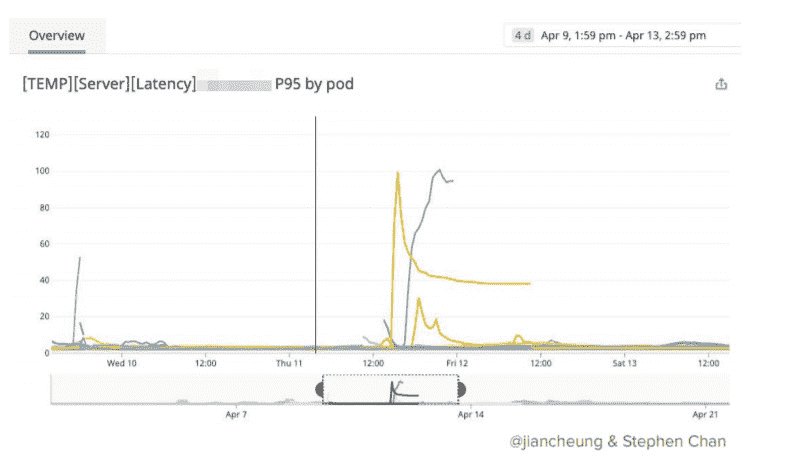

# Kubernetes 性能故障点:Airbnb 的采取

> 原文：<https://thenewstack.io/kubernetes-performance-troublespots-airbnbs-take/>

现在，组织普遍开始依赖 Kubernetes 和 containers，性能成为管理员的主要关注点，尤其是面向公众的高使用率服务，如 Airbnb。该公司的工程师在 KubeCon+CloudNativeCon 北美 2019 上分享了一些关于这个主题的经验教训。

在他们的谈话中，“【Kubernetes 是不是让我的 p95s 更差了？ " Airbnb 软件工程师[陈志云](https://www.linkedin.com/in/stephenyehengchan/)，他在该公司的计算基础设施团队，和 [Jian Cheung](https://www.linkedin.com/in/jian-cheung/) ，他在服务编排团队工作，讨论了他们目睹的使用开源容器编排引擎的性能问题。

自 2018 年以来，在线住房市场一直在将其直接驻留在 AWS EC2 实例上的服务转移到其自己的 Kubernetes 管理的容器中，目前总共约有 1000 项服务。因此，Airbnb 开发人员很快就会问服务编排团队，“为什么我的 pod 这么慢？”该公司为 minion 实例运行 [Amazon Linux 2](https://aws.amazon.com/amazon-linux-2/) ，为容器网络运行 Ubuntu images、法兰绒/Calico 集成 [Canal](https://github.com/projectcalico/canal) ，并运行 K8s [NodePort](https://kubernetes.io/docs/concepts/services-networking/service/) 来与该公司的服务发现机制接口。

在会议上，工程师们分享了他们遇到的一些性能问题，以及潜在的解决方案。他们的总体信息很明确:在处理复杂的基于 Kubernetes 的基础设施时，必须在整个堆栈中进行性能调优，包括主机、集群、容器、网络，甚至底层应用程序。

## 又是那些吵闹的邻居

为什么一些 pod 比群集中的同类产品延迟更长？两人建议，首先要检查的罪魁祸首之一可能是相邻的 pod，它可能占用了繁重工作负载的所有 CPU 和网络资源。有时，这种噪音纯粹是偶然的，因为一个原本应该留在暂存区的饥饿服务被转移到了生产集群中。但也有必须设置的控制旋钮:Airbnb 在早期选择不对其服务设定 CPU 限制，这限制了服务从其主机 CPU 获取的资源量，这被证明是一个坏主意，该公司后来从 Kubernetes 设定了资源限制。

“吵闹的邻居问题”对 Kubernetes 来说并不新鲜。当多个虚拟机第一次被打包到服务器中时，第一次遇到并缓解了这一问题，一个具有 CPU 密集型应用程序的虚拟机将占用所有资源，对其他虚拟机造成损害。

Kubernetes 有工具来防止这种情况发生，尽管它们可能很难使用，并可能导致 Cheung 所说的“细粒度热点”，这是非常难以确定的。Kubernetes 使用 Linux 内核的 [CFS 带宽控制](https://www.kernel.org/doc/Documentation/scheduler/sched-bwc.txt)，它以微秒为单位将 CPU 时间分配给预定义的组。这可能导致节流问题:一个节点可能看起来很慢，即使该 CPU 上没有发生很多其他事情。如果您为请求 10 个 CPU 的应用程序设置 100 毫秒处理器时间的 CFS 配额，它可以使用所有 10 个 CPU，并在 20 毫秒内耗尽其配额，并将在剩余的 80 毫秒内受到限制，从而增加该应用程序的遗留级别(Linux 内核[随后通过补丁解决了这个问题](https://www.kernel.org/doc/Documentation/scheduler/sched-bwc.txt))。

“多租户很难不影响性能。以前，应用程序都是在它们自己的专用机器上运行，但现在它们从其他奇怪的应用程序共享所有资源，”Cheung 说。

Kubernetes 社区已经开发了一些修复，包括能够[使 CFS 配额周期可配置](https://github.com/kubernetes/kubernetes/pull/63437)。有一个“拉”请求，[为需要保证服务质量的 pod 禁用 CPU 配额](https://github.com/kubernetes/kubernetes/pull/75682)(你可能会认为它们不会被限制[，但它们是](https://github.com/kubernetes/kubernetes/issues/70585))。

自动伸缩可能是性能滞后的另一个偷偷摸摸的原因。在 Airbnb，由于需求旺盛，一项服务的床位从 600 个跃升至 1000 个。对于调度程序来说，CPU 利用率很好，总体运行在 50%左右。然而，至少有一台主机被调度程序塞满了 18 个相同的服务舱。换句话说，总体的 CPU 使用率是好的，但是一些节点仍然因为缺少 CPU 的关注而处于饥饿状态。

K8s 调度程序有一组关于在何处放置映像的规则，这些规则基于许多规则，例如将工作负载分布在尽可能多的节点上，或者遵守对特定节点的首选或必需的关联。然而，有一条规则是，如果一个映像已经下载到一个 minion 节点，那么 pods 更有可能调度到那个节点。在这种情况下，一个巨大的图像被下载到一个节点，所有其他的 pod 都堆积在该节点上。

“在某些病理情况下，日程安排可能会对你不利，”陈说。该公司将寻求限制每个节点可以运行的 pod 数量的方法。

## 一次编写，随处运行

应用程序和底层依赖关系也会影响性能。Cheung 说，以 Java 为例。一个 Airbnb 开发团队注意到，一个 Java 应用程序在 95%的延迟时间内(或发生在 95%的服务器上)从 30 毫秒的响应时间跃升到 100 毫秒以上。然而，这只有在通过驱动程序与数据库交互时才会发生。不寻常的是，该应用程序在 Kubernetes 上运行之前工作正常。罪魁祸首是 Java 虚拟机(JVM)处理多 CPU 节点的方式。在 36 节点集群上的一个 pod 中的一个 JVM 可以看到 36 个 CPU。太好了。但是在那个节点上再放两个 JVM，每个 JVM 都在它自己的 pod 上，它们将*全部*看到 36 个 CPU。自然，瓶颈会接踵而至。

Cheung 指出，该团队发现早期版本 Java 的问题是[不知道容器](https://bugs.openjdk.java.net/browse/JDK-8146115)。Java 会根据它认为自己拥有的 CPU 数量进行自动调优，在容器环境中，这可能会对线程池的处理方式产生负面影响。

这个问题已经在 Java 8u191+中得到解决，尽管这里的教训是要记住的:“语言和应用程序可能对它们运行的底层系统有更深的依赖，”Cheung 说。另一个经验是，有一个基线来比较 Kubernetes 的性能和不使用 K8s 的性能是很有用的，这个应用程序就是这样做的。

Cheung 和 Chan 讨论了其他一些潜在的问题，如 IPtables 带来的负载平衡问题，以及 DNS(域名服务器)配置错误带来的总体速度缓慢问题。

总的来说，Kubernetes 只是复杂的云原生堆栈的一个组件，他们提醒观众，因此用户性能可能会有所不同。

“设定预期，小的性能差异将会发生，”陈说。

<svg xmlns:xlink="http://www.w3.org/1999/xlink" viewBox="0 0 68 31" version="1.1"><title>Group</title> <desc>Created with Sketch.</desc></svg>