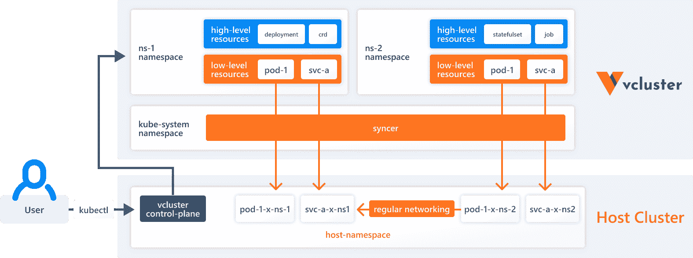

# Kubernetes:利用虚拟集群节省成本

> 原文：<https://thenewstack.io/kubernetes-saving-cost-with-virtual-clusters/>

[](https://www.linkedin.com/in/ksiig/)

 [卡斯珀 Siig

作为一名 DevOps 爱好者，卡斯珀习惯于使用各种令人兴奋的技术，从自动化简单任务，到 CI/CD，再到 Docker。](https://www.linkedin.com/in/ksiig/) [](https://www.linkedin.com/in/ksiig/)

每个尝试过使用多个集群运行 Kubernetes 的人都知道，这很快就会变得非常昂贵。无论集群如何设置，每个集群都会增加一些成本。一个显而易见的成本是控制平面，但总会有一些更多的成本，例如每个集群都需要的额外 API 服务器，它本身并不使用资源，但它会占用现有池中的资源。或者，您可能需要为每个集群配备一个单独的负载平衡器，而不是在应用程序之间共享一个。

在本文中，我们将更深入地探讨这个主题，以及如何通过使用虚拟集群来减少或消除多个集群的额外成本。

## **什么是虚拟集群？**

简而言之，虚拟集群对于 Kubernetes 就像虚拟机(VM)对于裸机主机一样。在一个集群中，您可以创建新的虚拟集群。与虚拟机一样，您将获得直接主机的所有功能，但有一些限制。

在深入探讨这些限制之前，我们先来看看什么是虚拟集群以及它们是如何工作的。首先，您需要理解为什么首先要使用虚拟集群。虽然原因可能因组织而异，但有一些共同的原因。

使用虚拟集群的一个主要原因是如果您已经在运行许多小型集群。许多组织正在使用集群来改善开发人员的体验。公司不再将 Kubernetes 作为一个黑匣子锁起来，而是直接向开发人员展示 Kubernetes，这既是一种增加他们对该技术的舒适度的方式，也是为了提高开发人员的速度，因为他们现在确切地知道他们的应用程序将如何运行。

说到开发，集群就像开发人员的机器一样个性化。你永远不知道你的同事在做什么或测试什么，所以你要确保他们做的任何事情都不会影响到你。这是一个使用许多小型集群的经典例子，但也是一个良好的开发人员体验如何推动成本上升的例子。

虚拟集群是在保持低成本的同时保持开发人员高体验和速度的一种方式，但在下一节中会有更多的介绍。既然你明白了你为什么需要它，那就该明白它是如何工作的了。下面，您可以看到流行工具 [vcluster](https://www.vcluster.com/) 如何实施虚拟集群的概述。解释如下图所示。

[](https://cdn.thenewstack.io/media/2021/09/b7e5a491-image1.png)

点按以查看全尺寸图像(在新标签中打开)。

从图的底部可以看到`Host Cluster`。这是运行在 EKS、GKE、阿拉斯加或任何运行 Kubernetes 的地方的集群。这是一个标准集群。在此之上，您有了`kube-system`名称空间。同样，这是完全标准的，到目前为止没有任何虚拟的东西。当您向上移动一步，看到`ns-1`和`ns-2`名称空间时，虚拟部分就出现了。这些位于`kube-system`名称空间中。

创建虚拟集群时，可以使用现有的命名空间，也可以创建新的命名空间。通常，您会创建一个新的。这个名称空间将包含几个 pod。这些 pod 包含一个您可以连接的“新”集群。这个“新”集群拥有自己的 API 服务器，这意味着您可以将其作为自己的集群与之交互。

当您想要使用虚拟集群时，只需运行一个`vcluster connect`命令，这将导致两件事情。它将开始向虚拟集群内的 API 服务器的端口进行端口转发，并创建一个`kubeconfig.yaml`文件。您可以将它与`kubectl`一起使用，在您现在的虚拟集群中执行命令。(在这篇文章的后面，你会得到一个如何为自己设置`vcluster`的快速入门指南，所以现在不需要担心这个。)

为了使本文与成本相关，您可以在此阅读更多关于虚拟集群[的详细信息。](https://medium.com/swlh/introduction-to-virtual-clusters-in-kubernetes-eb6bc55a16ff)

## **节约成本**

使用虚拟集群节省成本源于多种因素。它主要来自虚拟集群提供的经过深思熟虑的功能，而不是专注于降低成本。

首先，你要节省控制平面的成本。节省的空间将取决于您运行的集群数量。如果您在 GKE 上运行，那么您更换的每个集群每月将节省 73 美元。除此之外，您还从以前分离的资源中节省了资金，这些资源现在可以共享。类似负载平衡器的东西现在可以共享，而不是为每个集群付费。

第二个节省成本的好处来自动态扩展 Kubernetes 集群的能力。Kubernetes 中的自动缩放绝不是一件新鲜事；事实上，这是使用 Kubernetes 的最大卖点之一。然而，Kubernetes 并没有自动调整实际使用的集群数量。借助虚拟集群，您可以在几秒钟内启动和处置集群，允许每个开发人员拥有多个集群或没有集群，这取决于任何时间点的需求。

通过关闭未使用的集群来节省成本可能是有效的，但也可能难以管理。特别是如果它是非常动态的，比如当开发人员回家时关闭它，而当他们第二天回到办公室时又启动它。虽然可能，但这有几个问题。首先，它可能很烦人。其次，毫无疑问，开发人员会忘记关闭未使用的集群。一个开发人员可能会被一个 bug 分散注意力，或者回家后会忘记这一步。

不过，这并不是说这个原则不能被有效地运用。通过 Loft 的[睡眠模式](https://loft.sh/docs/self-service/sleep-mode)，你的集群可以在一段时间不使用后自动进入睡眠状态。这种方式可以节省高达 76%的 Kubernetes 开支，假设一个开发人员每周正常工作 40 小时。

如果你想更多地了解虚拟集群的工作方式以及它们可以提供的好处，你可以查看官方的 [vcluster](https://www.vcluster.com/) 网站。

## **设置虚拟集群**

您已经意识到虚拟集群对您和您的组织有意义。你如何从这里开始？以下是快速入门指南。如果想要更详细的说明，可以看看[官方文档](https://www.vcluster.com/docs/getting-started/setup)。事实上，设置 vclusters 就像这里详述的一样简单。

您需要做的第一件事是下载 vcluster CLI:

```
$  curl  -s  -L  "https://github.com/loft-sh/vcluster/releases/latest"  |  \
sed  -nE  's!.*"([^"]*vcluster-linux-amd64)".*!https://github.com\1!p'  |  \
xargs  -n  1  curl  -L  -o  vcluster  &&  chmod  +x  vcluster  &&  \
sudo mv vcluster  /usr/local/bin

```

安装 CLI 后，您可以使用`vcluster create <vcluster-name> -n <host-namespace>`语法创建虚拟集群。像这样:

```
$  vcluster create vcluster-1  -n  host-namespace-1

```

现在您已经有了自己的虚拟集群，可以通过运行`vcluster connect vcluster-1 -n host-namespace-1`来连接。开始时不需要做更多的工作，此时您正在使用新创建的集群。

## **结论**

现在，您对虚拟集群有了更多的了解，知道了如何使用`vcluster`来实现它们，以及它如何帮助您降低成本。通过将所有小型集群整合到一个大型“主机”集群中，您可以节省每个控制平面的价格。除此之外，您还可以节省更多的成本，因为现在更多的资源可以全面共享，而不是分散开来。

将以上与 Loft 的[睡眠模式](https://loft.sh/docs/self-service/sleep-mode)结合起来，你可能会节省超过三分之二的 Kubernetes 费用。

<svg xmlns:xlink="http://www.w3.org/1999/xlink" viewBox="0 0 68 31" version="1.1"><title>Group</title> <desc>Created with Sketch.</desc></svg>