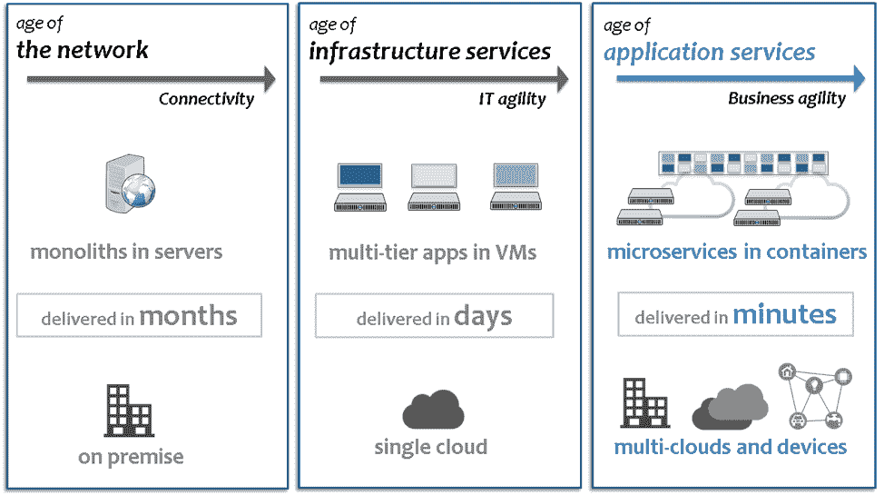
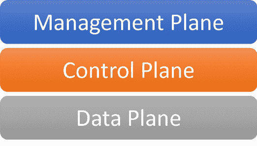

# Kubernetes:用云本地管理掌舵

> 原文：<https://thenewstack.io/kubernetes-steering-the-ship-with-cloud-native-management/>

Nirmata 赞助了这篇文章。

 [吉姆·布瓦迪亚

Jim 在建立和领导高效团队方面拥有 20 多年的经验，并开发了支持通信系统的软件。在联合创办 Nirmata 并成为首席执行官之前，Jim 是思科云自动化业务的最初架构师和业务领导者之一，他帮助该业务的收入增长到超过 2 . 5 亿美元，IDC 认为该业务是全球云服务的第一名。在思科工作之前，Jim 领导了一些初创公司的工程团队，包括桌面虚拟化初创公司 Pano Logic 无线先驱“空中飞人网络公司”:以及电信设备制造商 Jetstream Communications。](https://nirmata.com/) 

基础设施的每一次重大范式转变都会带来软件的重大范式转变。想想看:大型机导致了批处理和过程化编程。客户机-服务器导致了面向对象的编程和分布式对象的早期尝试(有人知道 CORBA 吗？).现在，云计算正在改变软件的架构、设计、分发和消费方式。这是有意义的，因为软件开发、软件交付和软件运行时都需要利用底层基础设施。

今天，每个企业都是软件企业，软件已经成为业务关键型，或者至少与其他核心基础设施服务一样关键。能够更快为客户提供价值的企业将会胜出。此外，软件开发和操作技能已经成为一个基本的业务差异。云原生企业利用云计算中的最佳实践来加速价值实现。

在这篇文章中，我描述了 IT 领导者如何在他们的企业中利用 Kubernetes 的潜力。

更具体地说，我:

*   定义云原生意味着什么；
*   帮助你了解 Kubernetes 适合哪里；
*   讨论 IT 运营团队将需要的环境属性；
*   剖析支撑技术；
*   并描述使您的云原生项目在整个企业中取得成功所需的架构。

## 定义原生云

简而言之，云原生系统旨在利用[云基础设施](https://thenewstack.io/kubernetes-and-the-cloud-native-community/)——例如，按需、弹性和复原的平台。但是这并没有告诉我们如何构建一个云原生系统。幸运的是，云计算原生计算基金会(CNCF)已经制定了一个更详细的:

“云原生技术使组织能够在现代动态环境(如公共云、私有云和混合云)中构建和运行可扩展的应用。容器、服务网格、微服务、不可变基础设施和声明式 API 就是这种方法的例子。

这些技术使得松散耦合的系统具有弹性、可管理性和可观察性。与强大的自动化相结合，它们允许工程师以最少的劳动频繁地、可预测地做出高影响力的改变。"

让我们剖析一下 CNCF 对云原生的定义，以便了解关键属性，以及用于构建云原生系统的技术。

## 云本机属性

*   **可扩展**:云基础设施服务可按需提供，为云构建的应用程序旨在利用底层服务的这种“随叫随到”的特性。云原生系统必须能够基于负载、性能或其他标准进行扩展和缩减；
*   **坚韧**:正如沃纳·威格尔的名言，“ [失败是必然的，随着时间的推移，一切终将失败](https://www.allthingsdistributed.com/2016/03/10-lessons-from-10-years-of-aws.html)。“云原生系统旨在容忍故障。通过将较大的应用程序分解成较小的组件，可以限制故障的影响；
*   **可管理**:软件系统的“可管理”是什么意思？好吧，可管理意味着易于管理，可配置的、易于修改或更新的、没有服务损失的系统可以被认为是易于管理的。并非巧合的是，其中一些非常相同的行为被定义为最佳实践，如 [12 因素应用](https://12factor.net/) 或 [微服务风格架构](https://www.nirmata.com/2015/02/02/microservices-five-architectural-constraints/)；
*   **可观察的**:在控制系统和反应式设计模式中， [可观察的](http://reactivex.io/documentation/observable.html) 是一个发出事件的对象，允许外部实体(观察者)容易地推断内部状态和条件。类似地，云原生系统是为可观察性而设计的，并提供关于系统状态变化和其他条件的详细事件。

## 云原生技术

既然我们已经了解了云原生系统必须具备的属性，那么让我们来看看用于构建云原生系统的一些关键技术和技巧:

*   **声明性 API**:声明性 API 捕获用户意图，即系统的期望状态，而不关心系统如何达到期望状态。换句话说，云原生系统的接口必须提供抽象，允许用户指定他们想要的系统应该如何运行。相反，命令式界面允许用户指定系统遵循的指令；
*   **容器**:容器已经迅速成为打包、分发和操作软件组件的最佳方式。云原生应用程序使用容器——以及下面描述的 Kubernetes 作为基本的构建模块以及构建和管理应用程序组件的基本单元。*   **微服务**:一个 [微服务风格架构](https://www.nirmata.com/2015/02/02/microservices-five-architectural-constraints/) 将一个系统分解成独立的服务，其中每个服务都是弹性的、有弹性的、可组合的、最小化的和完整的。微服务与云原生系统共享许多属性，因为微服务风格的架构是云计算和 DevOps 时代出现的第一个主要软件架构范式。*   **服务网格**:微服务风格的架构通过将智能推回到单个服务，消除了 SOA 系统中服务代理的单片中间件和集中式智能。然而，服务到服务通信的几个常见功能，如管理、可观察性和安全性，现在需要由服务来处理。服务网格解决了这个问题，并提供了分布式基础设施来管理服务间的通信。*   **不可变基础设施**:不可变基础设施的基本概念是“*替换，而不是修复*”云计算实现了这种范式。理解这一点的一个很好的方法是 Randy Bias 对 [宠物与牛](http://cloudscaling.com/blog/cloud-computing/the-history-of-pets-vs-cattle/) 的描述。对于云原生系统来说，重要的是将应用与基础架构分离，将基础架构视为不可变的是实现这一点的一个很好的方法。

 ## Kubernetes 适合哪里？

到目前为止，我们还没有提到 Kubernetes。那么，Kubernetes 适合哪里，它为云原生系统提供了什么？

Kubernetes 不仅支持上述所有技术，还充当云原生系统的“*控制平面*”。为了理解这意味着什么，我们需要首先讨论一个关键的架构模式及其在可伸缩系统设计中的应用。

## 分层架构和三个平面

构建可伸缩系统的一个关键是将系统分解成几个部分，每个部分封装相关的行为和数据，并提供可以被系统的其他部分或外部系统重用的抽象。这个简单而强大的概念的一个常见表达是分层架构模式。使用这种模式，系统的每一层都执行一个定义明确的角色，利用它下面的层，并为它上面的层提供新的抽象。

一些最大、最复杂和最可靠的系统是在电信和网络领域建立的。在电信网络中，分层系统架构用于定义三个层或“平面”每个平面封装了不同的协议和行为，从而形成可扩展的弹性系统:

1.  **数据平面**:数据平面提供承载最终用户数据或流量的功能和协议。在电话系统中，这可以是呼叫路径；在网络中，它是网络数据包和流；
2.  **控制平面**:控制平面提供协调数据平面中的进程的功能和协议。例如，在电话中，这是信令和呼叫处理，在网络中，这是路由和转发功能；
3.  **管理平面**:管理平面提供管理功能，以配置和操作控制和数据平面中的所有功能和设备。在电话技术中，缩写 FCAPS(故障、配置、计费、性能和安全)用于描述系统操作所需的管理功能的集合。

现在我们已经了解了这三个层面，让我们将它们应用到云原生系统中。下表总结了每个系统平面，并显示了它们在云原生系统中的相应功能:

云原生系统中的数据层是容器运行时，利用底层基础架构中的计算、网络和存储。云原生系统的控制平面是一个容器编排和管理系统，如 Kubernetes，以及其他应用程序控制功能，如服务网格。

与其他领域一样，管理平面通过集成故障管理(警报)、配置管理(配置)、记账(计费和计量)、性能管理(指标和监控)以及安全管理等功能，将一切整合在一起。

虽然通过 CLI 和本地接口分别管理交换机和路由器肯定是可行的，但以这种方式管理任何大规模的部署都是不切实际或不划算的。与任何新技术一样，早期采用者倾向于推出自己的管理平面解决方案。然而，随着技术的成熟，有助于提供全面管理功能的集成工具和系统也越来越成熟。

在下一节中，我们将了解云本机管理的关键属性和功能。

## 云本机管理

云本机管理是云本机系统的管理平台。它提供了集成的解决方案，可以轻松管理整个云原生堆栈。

让我们讨论一下云原生管理的关键属性和功能。

## 云本机管理的关键属性

*   **云原生**:也许很明显:云原生管理解决方案需要使用云原生原则来构建。这意味着云原生管理必须是可扩展的、有弹性的、可管理的和可观察的，并且使用诸如声明式 API、容器和微服务风格的架构之类的最佳技术来构建；
*   **可组合**:2013 年，Jonathan Murray 引入了 [可组合企业](https://www.adamalthus.com/blog/2013/04/04/the-composable-enterprise/) 的概念。Murray 建议，为了成功的数字化转型，企业 IT 系统应该使用易于替换的部分来构建，而不会影响整体。类似地，云原生管理必须是可组合的。它应该在需要的地方提供内置功能，但允许所有主要功能根据需要进行替换和定制；
*   **与基础设施无关**:为了实现弹性、效率和规模，应用程序必须与基础设施分离。云原生管理需要与基础架构和云无关。单个管理平面应该能够管理跨公共云、私有云和数据中心以及边缘计算部署的集群。

## 云本机管理的关键功能

现在我们已经定义了什么是云本机管理，让我们来描述一下它必须做什么:

*   **Kubernetes 集群运营**:云原生管理解决方案必须能够安装和运营 Kubernetes 集群，并为外部管理的集群(如云提供商提供的集群)提供通用管理功能；
*   **Kubernetes 工作负载运营**:云原生管理解决方案必须允许用户建模、部署和管理 Kubernetes 工作负载。工作负载可能是跨应用程序使用的集群服务，或者是最终用户 Kubernetes 应用程序；
*   **多层监控**:云原生管理系统必须从云原生堆栈的每一层收集、关联和汇总指标。这包括容器主机、集群和工作负载。联合指标数据收集管道用于提供当前数据以及对历史数据的下采样和长期存储的支持；
*   **集成警报和通知**:云原生管理解决方案必须支持可配置的警报(警报)，这些警报可以根据系统中的任何指标、状态或条件创建。一个重要的要求是能够将警报与应用程序、环境和最终用户 SLA 相关联，以便能够分配适当的严重性；
*   **日志管理**:云本地管理系统必须支持日志收集和聚合，能够将日志数据发送到中央日志存储库。日志数据必须在源位置得到丰富，以允许分段访问；
*   **审计跟踪**:云原生管理系统必须记录对管理、控制和数据平面所做的所有变更，并标明执行变更的实体或角色。一个重要的特性是能够跟踪跨系统组件触发的一系列更改，包括系统动作，这样任何更改都可以与用户动作相关联；
*   **联合变更管理**:云本地管理系统必须允许跨集群管理变更。这包括应用程序容器映像更改，以及资源清单配置更改。云原生管理系统不应该固执于变更管理的推或拉模型，而是提供允许不同团队决定什么最适合他们的构建模块；
*   **联合身份和访问管理:**云本地管理必须支持跨集群的联合访问控制和授权。这意味着所有的集群访问必须绑定到一个单一的身份管理系统，以便一个单一的更新可以用来终止一个角色或用户的访问；
*   **基于策略的治理**:云本地管理必须提供策略来验证和转换(变更)配置。策略应该在粒度的基础上可执行，使用熟悉的实体，如应用程序和运行时环境；
*   **安全和控制平面集成**:云原生管理系统必须与数据和控制平面安全和控制解决方案良好集成。对于容器化的应用程序，这包括与图像扫描和来源系统、合规管理系统、机密管理系统以及防火墙和网络策略执行系统的集成。除了安全性，云本地管理系统必须提供通过服务网格管理服务间通信的能力；
*   **运营洞察和最佳实践**:云本地管理系统必须检查运营最佳实践，并提供可行的建议。理想情况下，这些最佳实践是可配置和可扩展的，因此运营商可以根据自己的需求定制它们。

您可以在 Nirmata 网站上下载一份 [综合评估员指南和清单](https://info.nirmata.com/buyers-guide-to-enterprise-grade-container-management?hsCtaTracking=0f25fad5-d431-4898-8b80-7a2d0938a6bf%7C336b654c-fe2e-4c8b-b63c-22e99b68961e) 。

## 结论

软件吞噬了世界，构建、部署和操作软件的能力已经成为所有企业成功的关键。随着应用程序向云迁移，以及新的云原生应用程序的构建，容器已经成为云原生应用程序的标准打包和运行时。Kubernetes 和服务网格等技术已经出现，为打包和部署在容器中的微服务风格的应用程序提供控制和管理。

诸如电话和网络领域中的任务关键型系统是使用分层架构模式构建的，其中系统由数据平面、控制平面和管理平面组成。通过将这些原则应用到云原生系统，我们可以将容器运行时映射到数据平面，将 Kubernetes 和服务网格映射到系统的控制平面。然而，运营云原生系统所必需的一个关键组件是管理平台。

在本文中，我们定义了云原生管理的关键属性和功能以及云原生系统的管理平面。云本机管理必须使用可组合且与基础架构无关的云本机原则来构建。云原生管理还必须提供跨配置、故障、计量、警报和安全性的集成式多层管理功能。

好消息是，云原生管理解决方案正在 CNCF 生态系统中迅速成熟。随着企业采用云原生管理，云原生系统和技术(如容器和 Kubernetes)的全部潜力将成为主流应用。这是一个激动人心的建设时期！

云计算原生计算基金会是新堆栈的赞助商。

通过 Pixabay 的特征图像。

<svg xmlns:xlink="http://www.w3.org/1999/xlink" viewBox="0 0 68 31" version="1.1"><title>Group</title> <desc>Created with Sketch.</desc></svg>