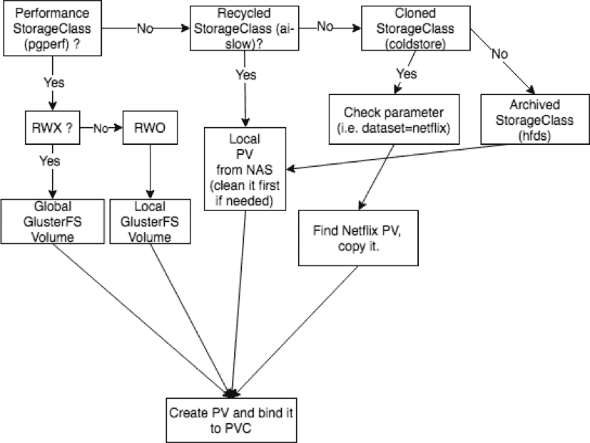
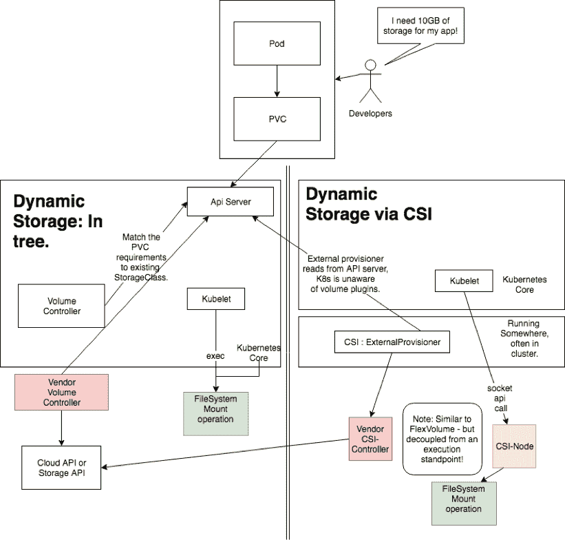

# Kubernetes 存储:动态卷和容器存储接口

> 原文：<https://thenewstack.io/kubernetes-storage-dynamic-volumes-and-the-container-storage-interface/>

在这篇由两部分组成文章中，Platform9 Kubernetes 工程师

[Jay Vyas](https://www.linkedin.com/in/jayunit100/)

介绍 Kubernetes 存储体系结构中的关键概念和组件，以构建一个与技术无关的概念性存储模型。在周三运行的本系列的下一部分中，我们将看看如何使用 minikube 观察 Kubernetes 存储的内部工作方式，并在沙盒环境中进行调整。

Kubernetes 中的存储确实会让客户和新兴云领域的新用户感到沮丧。在无数的客户体验中，我可以诚实地说，大多数客户关于 Kubernetes 存储的疑问和问题通常都很初级，其中大约一半都与持久存储模型有关。

这些基本问题很容易回答——只要有一个:

*   用于推理生产数据中心中 Kubernetes 存储范例的共享概念模型。
*   一个简单的、私有的沙箱，可以在 Kubernetes 存储 API 上以可复制的方式运行实验。

## 第 1 部分:Kubernetes 存储深度挖掘:

### 异构动态存储的经济性

首先，让我们回顾一下为什么 Kubernetes 中没有现成的存储模型。我相信，一旦你看得更深一点，你可能会同意，在任何云环境(Kubernetes 或其他)中，对分布式存储的需求看似复杂。

在概念化您的存储模型时，您需要对基本的 Kubernetes 组件如何以一种与存储无关的方式交互有一个明确的理解，这种方式与特定于供应商的术语、可翻译的脚本或 RAID 行话无关。对于拥有数百个应用程序的数据中心来说，“选择一个能够正常工作的”几乎是不可能的。考虑下表中不同工作负载的存储要求:

现在，让我们考虑一下这样一个事实:单个 100 TB 的存储阵列可能价值数万美元。为您的云存储卷使用 Postgres 解决方案的成本很容易在数据中心规模上浪费数十万美元。因此，根据您的应用程序工作负载类型来估计您的存储需求非常重要。

只有单一类型的默认存储卷的企业很少能够生存。随着 Kubernetes 的成熟，开发人员越来越希望它也能够支持 PostgreSQL、备份、回收和高性能工作负载等事务性工作负载(例如，在人工智能领域)。

虽然我们今天不会为您解决这个问题，但我们会让您在配置成熟的生产集群之前，开始有效地模拟您的存储策略并试验新兴的存储 API。

## Kubernetes 中的动态预配置，以及它的不同之处

 [杰伊·维亚斯

Jay Vyas 是 Kubernetes platform 9 的工程师，Kubernetes 的核心贡献者，ASF 成员和委员。除了自 Kubernetes core 成立以来(在 Red Hat)在几个方面的工作外，Vyas 还在 Synopsys (Blackduck)担任云原生产品线的工程主管，为全球数百家客户带来了大规模的基于 Kubernetes 的解决方案。在大数据、横向扩展存储和云原生技术的交叉领域工作过。他坚信微服务的核心附加值体现在企业工程创新周期的去风险化和民主化。在 Twitter @jayunit100 上找到他](https://platform9.com/) 

在这些文章中，我们将介绍两个快速发展的 Kubernetes 存储范例的内部原理:**动态存储**和 **CSI** ，这种方式可以在任何集群中完成，包括 minikube，不需要任何复杂的配置。我们将深入探讨配置的内部机制，并为您提供一个思维框架，用于推理 Kubernetes 存储生态系统中不断发展的基本元素。

****注意:*** *假设本文的读者了解 Kubernetes 集群中 PVC 和 PV 的基本用法[。如果没有，请查看上游 Kubernetes 社区中的综合文档，然后再次加入我们进行更深入的探讨。](https://thenewstack.io/deploy-highly-available-wordpress-instance-statefulset-kubernetes-1-5/)*

**从最一般的意义上来说，动态配置是许多集群解决方案的一个特性(例如，Mesos 在相当长的一段时间内提供了持久卷，为进程保留持久的、可回收的本地存储)。每个“云”都必须提供某种 API 驱动的存储模型。但是 Kubernetes 中的动态预配置脱颖而出——因为它的**高可插性** (PVCs，CSI)和**声明性**(即 PVCs 和动态预配置)特性。这些允许您为不同类型的存储解决方案构建自己的语义。**

 **Kubernetes 存储的动态配置由大多数云提供商实施，默认使用简单云附加磁盘类型。如果您使用过由任何公共云提供的 Kubernetes，那么您很有可能经历过创建永久卷声明(PVC ),它神奇地由底层的默认永久卷存储实现。

对于许多小型应用程序，由云提供商自动选择的慢速持久卷就足够了。然而，对于异构工作负载(如上表所示)，能够**在不同的存储模型**之间进行选择，并且能够**实施策略**，或者更好的是**围绕持久卷声明实现的“操作者”，变得越来越重要。**

 **这就是动态资源调配的存储类的用武之地。

### 存储课程:商品化绑定、保留和配置策略

**StorageClasses** 是动态配置的先决条件，StorageClass API 定义中有几个旋钮，允许您以统一的方式向 Kubernetes 集群传达首选存储语义。

大致来说，您应该从以下角度来看待存储类:

*   存储类是定义 pod 存储要求的界面，而不是实施。
*   与显式声明卷类型相比，存储类的描述性更差。
*   存储类是声明性的，持久卷是命令性的。
*   PersistentVolumeClaims 可以在没有存储类的情况下实现。
*   没有了解存储类的资源调配者，存储类就毫无用处。
*   置备程序可以是基于 CSI 的卷，也可以是树内卷。
*   存储类和动态存储支持许多应用程序的存储商品化，因此，对于极高性能的存储调整或一次性作业，您通常根本不需要存储类或动态存储。

在任何部署中都要考虑的两个特别重要的旋钮是**绑定**和**保持模式。**我们将在下面讨论这些内容。

### Kubernetes 中的动态存储生命周期

在我们深入讨论细节之前，由于动态存储经常与持久卷声明的概念相混淆，所以让我们先简单介绍一下 StorageClasses 在动态存储方案中的位置:

*   用户创建一个引用 PersistentVolumeClaim (PVC)的 pod。
*   PVC 由用户创建，并且是未绑定的。
*   如果该声明的绑定模式是等待第一个消费者，则什么都不做。
*   否则，Kubernetes 音量控制器会检查该声明的存储类。如果 kube 知道 StorageClass，就用它来创建一个卷，这是由某个地方(通常在集群中)运行的控制器完成的。
*   现在有一个绑定到(2)的 PersistentVolume。
*   现在，创建的 pod 被安排在一个节点上运行，当容器启动时，该节点上的 kubelet 挂载卷。

好了，现在您了解了存储类的魔力是如何实现动态资源调配的。如此简单的自动化存储解决方案在默认情况下可能性能低下(由于其高度商品化)、昙花一现或不安全，这仅仅是因为自动化很难，因此需要做出权衡。

为应用程序动态配置卷可以让应用程序完全不必担心存储模型，利用现有的 Kubernetes 框架来管理卷生命周期。这种自动化的代价很小:y *您需要考虑应用程序的绑定和保留策略*，以便自动化存储配置不会破坏您的应用程序需求。

因此，让我们考虑一下，在现实世界中，当您过渡到仍然能够支持动态资源调配模型的生产存储模型时，这是如何在实际应用中发挥作用的。

### 了解绑定和保留模式

如果你想知道上面列出的步骤(2)是怎么回事，你并不孤单。绑定模式是 StorageClass API 的一个重要部分，许多人在部署之前没有考虑到这一点。

在这种情况下，构建一个定制的动态置备程序可能极其重要。动态预配置不仅仅是一种提供本机存储的方法，更是一种在具有异构存储需求的数据中心中实现高性能工作负载的强大工具。

让我们考虑一下如何为上表中列出的不同工作负载实施不同的配置策略。每个都将使用不同的**存储类**语义用于绑定模式和保留策略，如下所述:

*   **HDFS/ETL 风格的工作负载**:您希望将数据存储在一个裸机磁盘上，并从该磁盘读取数据，就好像它只是一个主机卷挂载一样。这种类型的绑定模式可能会受益于*waitforfirstcustomer*策略，该策略允许在运行工作负载的节点上直接创建/附加卷。由于 datanodes 是集群的持久特性，并且 HDFS 本身会为您维护复制，因此您对此模型的保留策略可能是" *Delete。*“例如，Kafka 工作负载从这种模式中受益匪浅，因为持久。本地存储对于 Kafka 工作队列很重要。
*   **冷存储工作负载:**您希望自动执行一个策略，将特定的存储卷翻译器(例如 Gluster 中的翻译器)放入运行在特定命名空间中的工作负载中。所有资源调配都可以在当时最便宜的磁盘上按需完成。在这种情况下，您可能希望使用*立即*绑定策略，因为冷存储的可用性比性能更重要。由于冷存储通常用于需要一次保留数年的关键数据日志，您可以将这些卷上的保留策略设置为" *Retain。*“不要在此存储类上运行数据库—它可能不支持正确的操作语义(例如，某些类型的预读，等等)，或者延迟可能会造成严重后果。这些与我们的人工智能工作负载有一些共同点——因为存储的性能并不重要——但也可能需要克隆。
*   **Postgres 风格的工作负载:**您需要专用的固态硬盘，容量可能高达数 TB。一旦请求存储，您就想知道 pod 在哪里运行，以便可以在同一机架或同一节点上保留 SSD。由于磁盘位置和调度会显著影响这些工作负载的性能，因此您的 Postgres 存储类可能会使用*waitforfirstcumer*由于生产中的 Postgres 数据库通常具有重要的事务历史，因此您可以选择“ *Retain”的保留策略*
*   **人工智能工作负载:**您的数据科学家不关心存储，他们只想处理数字，需要一个暂存区来缓存旧的计算(例如，为大型数据集构建新的模型可能需要 5 秒左右的时间，您可能需要为 1000 个数据集中的 100 个数据集构建新的模型，其中各种中间计算存在重叠……数据局部性并不总是很重要，因为您在处理单个文件事务， 对于更快的 pod 启动，可以立即执行*绑定*，类似地，*删除*的保留策略可能是合适的，因为初始计算的成本由单个工作人员的长寿命分摊，并且随着时间的推移，缓存可能不太相关——因此 pod 重新启动时偶尔的彻底清理是理想的。

鉴于这些存储模型的可变性质，您可能需要一个自定义逻辑来实现卷声明，您可以简单地将这些卷类型分别命名为“hdfs”、“coldstore”、“pg-perf”、“ai-slow”。

### 使用外部置备程序定制您的动态置备

很明显，你不能有一个“一刀切”的存储模型:动态或不动态。

动态供应器作为大型集群的标准持久存储工具的出现是因为这种认识——随着时间的推移，这种认识在 kubernetes 社区中发生了:人们最终将不得不使用云原生 API 来构建自己的存储模型，而不是依赖复杂的语义。事实上，这在 API 本身中是显而易见的，因为*回收*曾经是早期 Kubernetes APIs 中的一个特性，现在已经被*弃用*，取而代之的是定制的动态存储供应器。

为什么需要外部资源调配器，最明显的原因是在使用新卷时最大化成本/收益。例如，在每种情况下，我们都需要完全不同的存储特征来最大化成本/收益。

*   人工智能:接受高延迟、短暂的存储模式。
*   合规性:高延迟、永久存储模式就足够了。
*   日志:低延迟，但仍然短暂的模型已经足够好了。

然而，即使我们有这些类型卷的现成实现，我们仍然可能需要构建我们自己的**外部供应器。**我们几乎肯定需要定制供应器的两个更细粒度的用例可能是:对性能敏感的应用程序和有特殊隐私或清理要求的应用程序。

您可能希望删除卷的某些部分，而不是全部，这有多种原因。三个例子:

*   合规性和历史数据通常很重要。
*   人工智能和机器学习工作负载也有微妙的存储需求，不像“全部删除”或“全部保留”那样二元
*   随着时间的推移，您的存储策略可能会随着磁盘变满而改变，您需要更高效地使用剩余空间。

到目前为止，我们已经讨论了为什么您可能需要一组存储类，但是我们还没有深入了解**自定义**存储供应器如何工作的细节。

现在，让我们看看*外部供应器是如何工作的，在引擎盖下* —如果您需要为运行在同一个集群中的各种应用程序提供复杂的存储服务，您可能希望至少了解一些内部信息。

### 外部置备程序:它们如何工作，以及它们是如何实现的。

在 Kubernetes 生态系统中，有几个细节值得一提，即 StorageClasses 相对于内部和外部供应器是如何工作的。

*   **内部置备程序(" In-Tree"):** 这些是 Kubernetes 自己可以创建的卷。随着 CSI 的发展(更多信息见下文)，这些列表将会逐渐减少。
*   **外部供应器**:如下图所示，它们存在于 CSI 前和 CSI 后的 kube 分布中。除了 Kubernetes 固有的供应机制之外，供应商始终有权使用高度自以为是的语义来制作供应器。外部供应是 Kubernetes 上所有存储的未来模式。
*   **storage class 中的“parameters”部分**是完全可定制的，正如我们在 pkg/apis/storage/types.go 中看到的那样……因此，您可以在其中放入任何您想要的东西，并且**构建您自己的定制存储控制器**。

```
     // parameters holds parameters for the provisioner.
     // These values are opaque to the  system and are passed directly
     // to the provisioner.  The only validation done on keys is that they are
     // not empty.  The maximum number of parameters is
     // 512, with a cumulative max size of 256K
     // +optional

     Parameters map[string]string

```

例如，在人工智能场景中，某些计算是通用的，可以缓存在磁盘上，但大多数数据确实是短暂的，应该删除。在这种情况下，您需要实施自定义逻辑来配置新卷，可能需要在存储卷上运行“终结器”类型的操作，然后才能将存储提供给下一个工作负载。

想象一下企业的自定义动态资源调配器在现实世界中为各种存储类工作的方式(使用上面的工作负载示例)，我们可以看到，在创建/删除卷之前和之后做什么的决策是一系列复杂的步骤，必须考虑(1)性能特征(2)生命周期语义，并最终决定创建什么类型的卷。一旦做出这个决定，动态供应器最终将 PVC 绑定到 PV，并且可以调度应用程序。



动态预配置实际上并不实现物理存储的自动创建，而是简单地将 Pod API 连接到一个**声明性存储模型。**

**这是集装箱存储接口(CSI)存储模式的动机。**随着动态预配置和异构存储模型的不断扩展，插入复杂物理存储实施的需求，通常是不受开源社区管理的第三方实施，必须从 Kubernetes 本身转移出去，kubelet 需要一种方法来找到并装载这些不同的卷类型。

### CSI:为 Kubernetes API 提供间接存储

CSI 往往会让很多人感到困惑，因为他们期望它能解决很多问题。实际上，它并不能立即为 Kubernetes 的最终用户解决任何问题，在短期内，你应该意识到它可能会让你的生活变得更加艰难。

为了形象化 CSI 和使用树内存储类的动态存储之间的区别，我们将“旧的”做事方式(树内存储，由 Kubernetes 的 kubelet 和主平面处理)与“新的”CSI 做事方式区分开来，如下所示:



在上图中:开发人员关心他们的 pod 是否有存储。API 服务器接收一个请求，动态存储在两种场景中都满足相同的需求，尽管在后 CSI 世界中要复杂得多(并且是分离的)。

是的，存储分离是转向生产的必要部分。随着 Kubernetes 的成熟，CSI 代表了从 Kubernetes 主组件中完全分离存储的巨大事业。这使得供应商可以发布满足良好定义的接口的存储，而不是将特定于供应商的存储代码放入 Kubernetes 本身。

**容器存储接口(CSI)是一个用于实现持久卷的**接口，**最近被提升为 GA，提供完全不知道 Kubernetes 本身的可插拔存储。关于 CSI，您应该注意一些容易混淆的事情:**

*   CSI 解决了在 Kubernetes 中升级存储功能的问题，而不需要升级 Kubernetes 本身。
*   因此，CSI 要求您在集群中运行独立的单元，这些单元具有特权，并且能够使用 CSI 语言将存储附加到挂载点。
*   容器原生存储**在任何方面都不需要 CSI——您可以在没有 CSI 的情况下运行容器中的存储并创建卷，就像有 CSI 一样容易。唯一的区别是 CSI 允许供应商完全控制他们的发布周期。**

因此，尽管 CSI 对最终用户没有重大影响，但它与云原生空间中广泛的存储供应商提供的更丰富、更好的产品相关。预计您的存储供应商会问您是否在您的内部系统上支持 CSI，如果不支持，什么时候会问—因为供应商在 CSI 后比在 CSI 前更容易为您提供好的解决方案。

将这些概念放在一起:**将 CSI 与动态预配置结合起来，可以在任何卷上实现 pods 的声明式存储，而不依赖于 Kubernetes。**事实上，通过 CSI，您可以使用相同的 API 访问您的存储，而无需任何 Kubernetes 集群。

### 该不该关心 CSI？

每当您听说 CSI 时，您都会听说它是如何模块化、如何与供应商无关，以及如何带外升级。拥有这些很好，但你真的在乎吗？如果存储只是工作，你可能不会。唉，在生产中，如果您在云中使用了**标准**存储卷类型，您可能会看到:

*   缓慢的启动时间
*   由于磁盘 I/O 或大小而失败的数据库
*   难以转移存储模型
*   存储导致权限问题，需要纠正 init pods、fsGroups、supplementalGroups 或 SELinux 异常。
*   缺少用于在不同命名空间中的机架之间传输数据卷的多租户工具

因此，供应商不断更新他们的存储 API 和性能 SLA。为了给 Kubernetes 提供尽可能好的支持，他们需要能够发布存储驱动程序，而不需要等待将代码合并到 Kubernetes 本身，这是一个漫长的过程。

在供应商层面，CSI 为及时解决存储问题带来了一些希望。因此，在不久的将来，任何需要 RAID 语义、高度敏感数据的安全合规存储或依赖于精品存储供应商的 Kubernetes 数据中心，无疑都必须以某种形式使用 CSI。

## 面向大众的动态配置

**StorageClasses** 让任何人都能够构建一个声明性的存储模型，它的工作方式类似于 CSI，并且在 PVC 内部被引用(或者由准入控制器附加到它们的后面)。)

但是在 CSI 之前，没有办法强迫 Kubernetes 使用定制代码来安装存储，这些代码可以在 Kubernetes 发行版之外进行捆绑、运输和生命周期管理。然而，我希望在本文中，我们已经阐明了卷技术(如 CSI)和动态预配置实现的正交性。尽管如此，您**仍然可以**进行动态预配置，诀窍是只使用“树内”的 Kubernetes 卷。

由于 CSI 本身就是一个庞然大物，我们将重点关注动态存储，为了真正理解如何在数据中心规模实施 CSI，必须充分理解这一点。不要担心，我们很快就会有另一篇文章将这个模型扩展到 CSI！

最终，对于许多人来说，大规模推理 Kubernetes 存储的概念模型首先应该包括分离出安全策略、访问策略、供应策略和存储技术，并随着时间的推移沿着这些维度迭代改进。

<svg xmlns:xlink="http://www.w3.org/1999/xlink" viewBox="0 0 68 31" version="1.1"><title>Group</title> <desc>Created with Sketch.</desc></svg>****