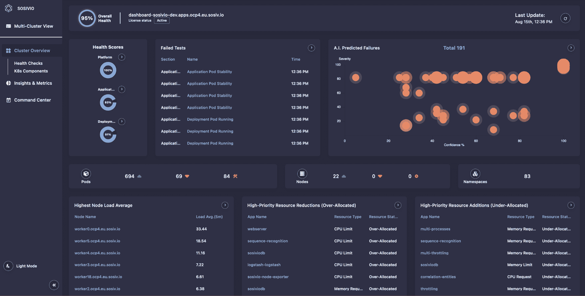
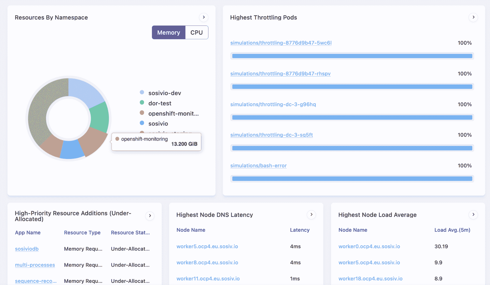

# Kubernetes 故障排除从 DNA 样的数据漩涡开始

> 原文：<https://thenewstack.io/kubernetes-troubleshooting-starts-with-dna-like-data-swirling/>

 [布兰登·兰德里

布兰登·兰德里是 Sosivio 业务发展和合作伙伴计划的先锋，同时支持营销活动。Brandon 的背景为汽车联网汽车行业铺平了道路，这使他能够很好地理解成熟的市场，识别客户痛点的根本原因，同时仍然对技术有很强的把握。](https://www.linkedin.com/in/brandonlandry24/) 

筛选 Kubernetes 故障排除的大量信息，即使有今天的可观察性工具的帮助，仍然像大海捞针。故障排除和优化 [Kubernetes 的环境](https://thenewstack.io/category/kubernetes/)通常是这样的:收集、发送和存储大量的指标、日志和跟踪信息，并依靠专家或外部顾问筛选大量数据来分析问题的根本原因。

使用开源数据收集器的传统监控和可观察性工具存在固有缺陷，因为提供给它们的数据是不完整的。故障通常由许多单独的事件组成(下面将详细介绍)，这些事件相互叠加，构成一个更大的故障序列。

如果没有故障序列中的所有环节，真正的根本原因是暗示性的。更不用说，这些工具是反应性的，在出现问题后，如果有问题，会提示用户。这使得团队花费过多的时间进行故障排除工作，或者依靠昂贵的外部专家来寻找失败的根本原因；两者都不理想。我们如何突破这种传统方法，并与现代技术一起发展，确保我们能够成功地洞察我们的环境？数据漩涡。

 [斯蒂芬·索恩

Stephen Thorn 是 Sosivio 的技术前线，主持多场网络研讨会、办公时间和技术会议。Stephen 以前来自开源领域，现在将他的经验应用于 Kubernetes 故障排除。Stephen 是客户成功的主要驱动力，通过利用所有 Sosivio 功能帮助组织进行云原生迁移，确保客户获得最大回报。](https://www.linkedin.com/in/stephenlthorn/) 

数据旋转是一种方法，由 [Sosivio](https://www.sosiv.io/) 开发，用于动态、实时地分析来自堆栈多个层的海量数据，而无需将任何内容发送到集群之外。这需要超粒度和超精确的数据。Sosivio 认识到当前数据收集器面临的挑战，并选择构建定制的数据收集器，优化收集整个基础设施堆栈中非常精细的指标和信息(内核信号、操作系统日志、进程信号、应用程序日志、容器运行时事件、网络流量、Kubernetes 事件)，进而推动 ML/AI 引擎。

> 当一个序列中的一个事件发生在 Kubernetes 星团中时，DNA 的一个“链”就被填满了。看着一个正在被填写的 DNA 序列，人们可以开始预测完整的 DNA 序列会是什么样子。

Sosivio 在每个阶段都使用一个“数据漩涡”机器学习引擎，该引擎被动地收集数据，压缩一切并将其翻译成统一的语言，将数据关联起来，形成集群内部正在发生的事情的清晰画面，然后推荐一个可以应用于修复故障的解决方案。

Sosivio 群集概述，显示人工智能预测故障图、群集运行状况得分和应用程序分析。

当 Kubernetes 中出现问题或故障时，它是相关单一事件的组合。这些事件的组合可以被认为类似于 DNA 序列。当一个序列中的一个事件发生在 Kubernetes 星团中时，DNA 的一个“链”就被填满了。看着一个正在被填写的 DNA 序列，人们可以开始预测完整的 DNA 序列会是什么样子。当这些单一事件朝着故障序列发展时，Sosivio 的 ML 预测引擎会分配上下文和严重性，并在问题变成灾难之前持续显示即将发生的问题。

Sosivio 的优势是可以实时看到这些事件，这使得预测引擎可以检测到故障序列中将会发生什么。Sosivio 只提供相关数据和可操作的见解，以避免当今工具带来的复合警报疲劳。数据 100%在内存中处理和分析，消除了向磁盘发送数据和从磁盘接收数据的额外延迟。由于数据是轻量级的，Sosivio 可以分析大量的数据，而不会成为资源的负担。

Sosivio 平台作为另一个应用程序运行在您的 Kubernetes 集群上，这意味着它是一个非侵入式的解决方案，可以在完全断开连接/空气间隙的环境中工作。Sosivio 从环境的所有层(操作系统、网络、内核、K8s、应用等)接入信号和数据，可以在任何云平台(AWS、GCP、Azure、AKS、EKS 等)或内部部署中运行。

Sosivio 始终免费的社区版本包括实时指标、集群健康检查和应用洞察。

*Sosivio 还将于 2022 年 10 月 25 日至 28 日在密歇根州底特律市的 Kubecon North America 举办活动。除了他们的展台，Sosivio 还在活动前的每天上午 8-9 点在亨廷顿广场对面的[器械室](https://detroitfoundationhotel.com/apparatus-room/)举办早餐酒吧社交活动。每天早上，Sosivio 的首席技术官 Liran Cohen 将与行业专家(包括来自一家 F100 金融服务提供商的全球工程主管)一起参加小型圆桌会议，开始一天的工作。免费向 Kubernetes 精英专家学习！享受咖啡、百吉饼、甜甜圈等，同时与 Sosivio 的高管团队交流。RSVP [这里](https://www.linkedin.com/events/sosivio-kubecon-breakfastsocial6965043368129159169/)。*

<svg xmlns:xlink="http://www.w3.org/1999/xlink" viewBox="0 0 68 31" version="1.1"><title>Group</title> <desc>Created with Sketch.</desc></svg>