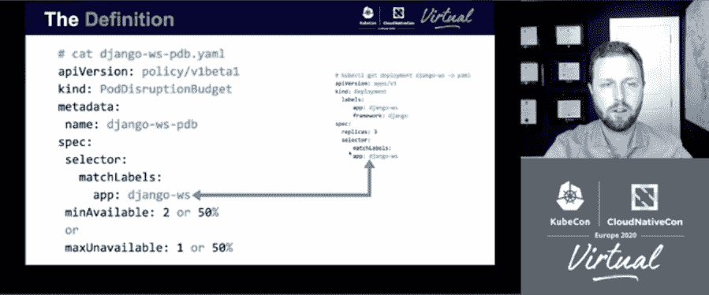
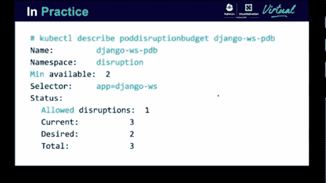
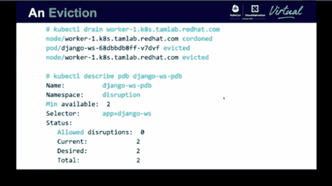
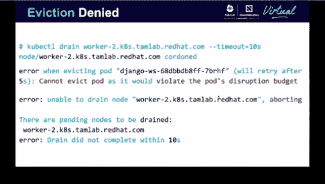

# Kubernetes:使用 podisruption 预算进行应用程序维护和升级

> 原文：<https://thenewstack.io/kubernetes-use-poddisruptionbudgets-for-application-maintenance-and-upgrades/>

在 Kubernetes 中，[pod disruption budgets](https://kubernetes.io/docs/concepts/workloads/pods/disruptions/)(pdb)允许应用所有者定义他们的集群运营预算，限制在任何给定时间可以离线的复制应用的 pod 数量。目前处于测试阶段，pdb 是一种保持高可用性的方法，即使在引入定期自愿中断(如应用程序升级)时也是如此。

[Matthew Robson](https://twitter.com/mattjrobson) ，Red Hat 的首席技术客户经理，在 kube con+CloudNativeCon Virtual Europe 2020 的闪电演讲中，分析了 PBD 及其优缺点。

根据 Robson 的定义，“PodDisruptionBudget 是应用程序所有者创建的对象，它定义了应用程序在自愿中断期间稳定运行所需的最小副本数量。”

但是你为什么想要使用它们呢？罗布森提出了四个令人信服的理由:

1.  pdb 由应用程序团队所有，他说应用程序团队最了解其服务的需求和性能特征。
2.  pdb 通过弥合应用知识和运营执行之间的差距来支持运营团队。
3.  pdb 定义 [可用性要求](https://thenewstack.io/kubernetes-high-availability-no-single-point-of-failure/) ，类似于服务级别协议中的要求，维护法定数量或最小数量的 pod 以支持特定的工作负载。
4.  pdb 受到 [驱逐 API](https://kubernetes.io/docs/tasks/administer-cluster/safely-drain-node/#the-eviction-api) 的尊重，它可以通过编程方式导致驱逐，这意味着 [kubectl drain](https://kubernetes.io/docs/reference/generated/kubectl/kubectl-commands#drain) 、 [autoscaling](https://kubernetes.io/docs/tasks/administer-cluster/dns-horizontal-autoscaling/) ，或者 [解调度器](https://github.com/kubernetes-sigs/descheduler) 可以使用这些中断预算。

罗布森还表示，PodDisruptionBudgets 可以轻松地与最流行的控制器集成，如 [部署](https://kubernetes.io/docs/concepts/workloads/controllers/deployment/) 、 [复制控制器](https://kubernetes.io/docs/concepts/workloads/controllers/replicationcontroller/) 、 [状态集](https://kubernetes.io/docs/concepts/workloads/controllers/statefulset/) 和 [复制集](https://kubernetes.io/docs/concepts/workloads/controllers/replicaset/) 。

但是他指出 pdb 也有一些缺点。这包括节点崩溃、硬件故障和不可避免的网络中断等意外中断。中断预算也不能避免显式缩放到零或任何 pod 删除。

Robson 还警告不要对单个副本使用 PodDisruptionBudgets，因为它们会成为运营团队的负担，从而失去他们最大的优势之一。

此外，请注意，如果您希望发生漏极，您必须删除 PDB，以免最终导致无限期漏极挂起。

罗布森进一步警告说，如果你正在创建多个中断预算，不要重叠选择器，这会使事情变得混乱，并再次使排水管悬空。

当设置您的 PodDisruptionBudget 时，请确保它有一个有意义的名称，将它与它所监管的 pod 关联起来。然后给它一个对应于您的特定控制器选择器的匹配标签。

您的 PodDisruptionBudget 还需要设置 minAvailable(也称为 Desired，建立必须可用的 pod 的最小数量)或 maxUnavailable(设置在任何给定时间可以删除的 pod 的最大数量)。

Robson 说，然后，重要的是利用 PDB 的自愿驱逐，以便在集群维护和升级期间保持高可用性。

云原生计算基金会和 KubeCon + CloudNativeCon 是新堆栈的赞助商。

<svg xmlns:xlink="http://www.w3.org/1999/xlink" viewBox="0 0 68 31" version="1.1"><title>Group</title> <desc>Created with Sketch.</desc></svg>