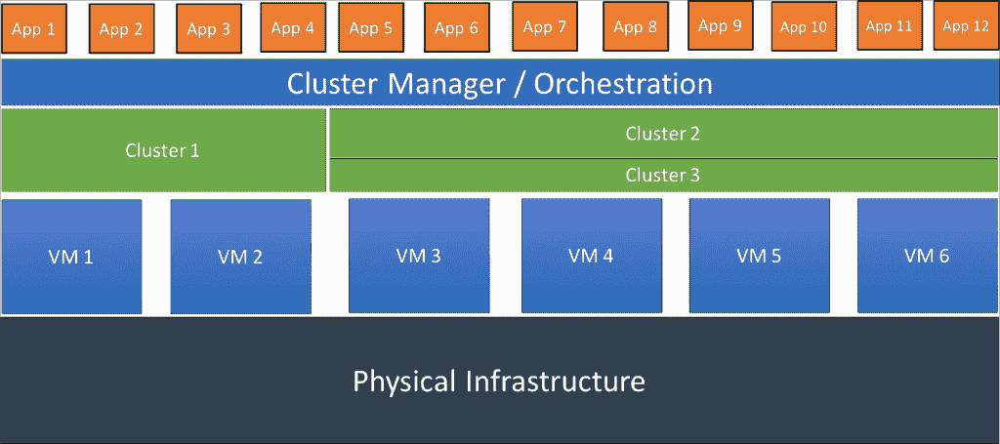

# Kubernetes 之路:豆荚和服务

> 原文：<https://thenewstack.io/kubernetes-way-part-one/>

随着容器越来越受到企业的关注，焦点正慢慢转移到容器编排上。生产中运行的复杂工作负载需要成熟的调度、编排、扩展和管理工具。Docker 使得管理运行在主机操作系统(OS)中的容器的生命周期变得极其容易。由于容器化的工作负载在多个主机上运行，我们需要超越管理单个容器和单个主机的工具。

这就是 Docker Datacenter、Mesosphere DC/OS 和 [Kubernetes](/category/kubernetes/) 发挥重要作用的地方。它们让开发人员和操作员将多台机器视为一个可以运行多个集群的大型实体。每个集群运行属于一个或多个应用程序的多个容器。DevOps 团队通过应用程序接口(API)、命令行接口(CLI)或专用工具将作业提交给负责管理应用程序生命周期的容器编排引擎(COE)。

COE 的高级体系结构

COE 的托管版本作为 CaaS、容器即服务交付。CAA 的例子包括[谷歌容器引擎](https://thenewstack.io/google-container-engine-is-the-product-version-of-kubernetes-and-its-now-live/)、Rackspace 的 [Carina](https://thenewstack.io/rackspace-carina-bare-metal-caas-based-openstack/) 、亚马逊 EC2 容器服务、 [Azure 容器服务](https://azure.microsoft.com/en-us/services/container-service/)和 [Joyent Triton](https://thenewstack.io/with-triton-joyent-further-pushes-container-management-to-bare-metal/) 。

容器即服务

开源集群管理器 Kubernetes 和容器编排引擎是 Google 内部数据中心管理工具 Borg 的简化版本。在首届 Kubernetes 大会 KubeCon 2015 上，社区庆祝了 1.1 版本的发布，该版本具有新的功能。

我写了一篇文章，比较了 [COE 市场格局](http://www.forbes.com/sites/janakirammsv/2015/12/08/if-container-orchestration-is-the-new-hadoop-who-is-the-cloudera/#7ee0afbe10ef)和 Hadoop 的商业实现。有相当多的初创公司和成熟的平台供应商试图为 COE 夺取企业市场份额。Kubernetes 脱颖而出，因为它的成熟来自于谷歌运行网络规模工作负载的经验。根据我的个人经验，我试图找出使 Kubernetes 成为容器编排标准的特性。

## Pods:新的虚拟机

容器和微服务有一个独特的属性——它们一次只运行一个进程。虽然运行全栈 LAMP 应用程序的虚拟机(VM)很常见，但同一应用程序必须分成至少两个容器——一个运行 Apache with PHP，另一个运行 MySQL。如果您将 Memcached 或 Redis 放入堆栈进行缓存，它们也需要在单独的容器上运行。

这种模式使得部署具有挑战性。例如，缓存容器应该靠近 web 容器。当通过运行额外的容器来扩展 web 层时，缓存容器也需要扩展。当请求到达 web 容器时，它在相应的缓存容器中检查数据集；如果没有找到，就对 MySQL 进行数据库查询。这种设计要求将 web 和缓存容器配对在一起，并将它们放在同一个主机中。

> 如果 Kubernetes 是新的操作系统，那么 pod 就是新的进程。

Kubernetes 中 pod 的概念使得标记被视为单个部署单元的多个容器变得容易。它们位于同一主机上，共享相同的资源，如网络、内存和节点存储。每个 pod 都有一个专用的 IP 地址，由属于它的所有容器共享。这还不是全部——在同一个 pod 中运行的每个容器都有相同的主机名，因此它们可以作为一个单元进行寻址。

当一个 pod 向外扩展时，其中的所有容器将作为一个组进行扩展。这种设计弥补了虚拟化应用和容器化应用之间的差异。在保留每个容器运行一个进程的概念的同时，我们可以很容易地将容器组合在一起，作为一个单元对待。因此，pod 是微服务和 Kubernetes 环境中的新虚拟机。即使只有一个容器需要部署，也必须打包成一个 pod。

Pods 管理开发和部署之间关注点的分离。当开发人员专注于他们的代码时，操作员将决定什么进入 pod。他们组装相关的容器，并通过 pod 的定义将它们缝合起来。这提供了终极的便携性，因为容器不需要特殊的包装。简单地说，一个 pod 就是多个容器映像的清单，这些映像被一起管理。

如果 Kubernetes 是新的操作系统，那么 pod 就是新的进程。随着它们变得越来越流行，我们将看到 DevOps 团队交换 pod 清单，而不是多个容器映像。来自 [Deis](http://deis.io/) 的制造商 Helm ，是一个服务充当 Kubernetes 豆荚市场的例子。

## 服务:容易发现的端点

整体服务和微服务之间的一个关键区别是发现依赖关系的方式。尽管 monoliths 可能总是引用一个专用的 IP 地址或 DNS 条目，但是微服务必须在调用它之前发现依赖性。这是因为容器和 pod 可能会在运行时被重新定位到任何节点。每次一个容器或者一个 pod 复活，它都会得到一个新的 IP 地址。这使得跟踪端点变得极其困难。开发人员必须在 discovery 后端显式广告和查询服务，如 etcd、Consul、ZooKeeper 或 SkyDNS。这需要对应用程序进行代码级别的更改才能正常工作。

Kubernetes 凭借其内置的服务发现功能大放异彩。Kubernetes 中的服务始终保持一个定义良好的 pod 端点。这些端点保持不变，即使当豆荚被转移到其他节点或当它们复活时。

跨集群的多个节点运行的多个 pod 可以作为服务公开。这是微服务的重要组成部分。服务清单有正确的标签和选择器来识别和分组充当微服务的多个单元。

例如，在集群中任何与标签“frontend”匹配的节点上运行的所有 Apache web 服务器单元都将成为服务的一部分。它是一个抽象层，将跨集群运行的多个单元置于一个端点之下。该服务有一个 IP 地址和端口组合以及一个名称。消费者可以通过 IP 地址或服务名称来引用服务。这种能力使得它在将遗留应用程序移植到容器时非常灵活。

如果多个 pod 共享同一个端点，它们如何平均接收流量？这就是服务的负载平衡功能的用武之地。与其他 Coe 相比，这个特性是 Kubernetes 的一个关键区别。Kubernetes 有一个轻量级的内部负载平衡器，可以将流量路由到服务中所有参与的 pods。

服务可以以三种形式之一公开:内部、外部和负载平衡。

*   **内部:**某些服务，比如数据库和缓存端点，不需要公开。它们仅由应用程序内部的其他 pod 使用。这些服务通过一个 IP 地址公开，该 IP 地址只能在集群内部访问，而不能对外访问。Kubernetes 通过向内部依赖项公开一个可用的端点来隐藏敏感的服务。该功能通过对公众隐藏私人 pod，为安全性增加了一层保障。
*   **外部:**运行 web 服务器或可公开访问的 pod 的服务通过外部端点公开。这些端点可通过特定端口在每个节点上使用。
*   **负载均衡:**在云提供商提供外部负载均衡器的场景中，服务可以与该负载均衡器连接。例如，pod 可能通过弹性负载平衡器(ELB)或谷歌计算引擎(GCE)的 HTTP 负载平衡器接收流量。该特性支持将第三方负载平衡器与 Kubernetes 服务集成。

Kubernetes 通过接管微服务的发现和负载平衡的职责来完成繁重的工作。它将 DevOps 从处理基础设施级别所需的复杂管道工作中解放出来。开发人员可以按照使用主机名或环境变量的标准惯例专注于他们的代码，而不必担心注册和发现服务所需的额外代码。

<svg xmlns:xlink="http://www.w3.org/1999/xlink" viewBox="0 0 68 31" version="1.1"><title>Group</title> <desc>Created with Sketch.</desc></svg>