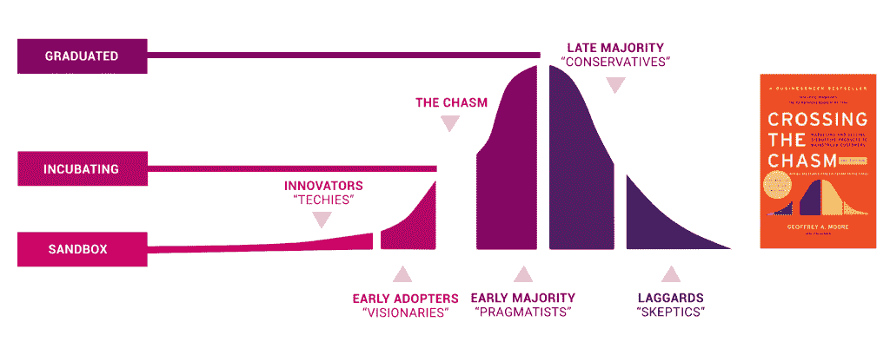

# Kubernetes 将革新企业数据库管理

> 原文：<https://thenewstack.io/kubernetes-will-revolutionize-enterprise-database-management/>

[Á·阿尔瓦罗·埃尔南德斯](https://ongres.com/)

[Á·阿尔瓦罗·埃尔南德斯是一名企业家，OnGres 的创始人，ON postGRES 是一家旨在将 postGRES 转变为通用数据库的初创公司。](https://ongres.com/)

" Kubernetes 为有状态工作负载做好准备了吗？"是决策者考虑在 Kubernetes 上部署数据库时弹出的第一个问题。多年来，答案都是“不要做”，而且理由很充分。Kubernetes 最初被设计用来处理无状态工作负载的编排。但是技术已经成熟，是时候重新考虑在 Kubernetes 上运行数据了。

有三个重要的技术方面需要考虑:

*   库伯内特成熟度
*   Kubernetes 有状态功能
*   在容器中运行数据库的可用性和性能特征。

## Kubernetes 有多成熟？

虽然评估任何技术的成熟度都不是一个简单的过程，但是有可靠的信号可以使用。 [Kubernetes](https://thenewstack.io/category/kubernetes/) 是一个[云本地计算基金会](https://cncf.io/?utm_content=inline-mention)毕业项目，[意味着](https://www.cncf.io/blog/2018/11/05/beginners-guide-cncf-landscape/)该技术具有“采用、健康的变化率和来自多个组织的提交者”。他们的 [2020 调查报告](https://www.cncf.io/wp-content/uploads/2020/11/CNCF_Survey_Report_2020.pdf)显示，“91%使用容器的受访者报告使用 Kubernetes，其中 83%在生产中。”

自 2017 年 11 月以来，知名分析公司 [Thoughtworks](https://www.thoughtworks.com/radar/platforms/kubernetes) 认为 Kubernetes 是一项公司应该采用的成熟技术，并解释说“它已经成为我们大多数客户在将容器部署到机器集群时的默认解决方案。”

图表由云计算基金会提供。

## Kubernetes 有状态准备好了吗？

Kubernetes 的有状态能力经常受到质疑，而第一代有状态技术 Persistent Sets(“PetSet”)是部分原因。这个特性[被弃用](https://github.com/kubernetes/kubernetes/issues/41926)，取而代之的是 Kubernetes 中当前的有状态技术: [StatefulSets](https://kubernetes.io/docs/concepts/workloads/controllers/statefulset/) 。它于 2018 年正式发布(“正式发布”)，目前在无数解决方案中使用，为 Kubernetes 容器提供持久、非短暂的存储。这使得在 Kubernetes 中部署 [Vitess](https://vitess.io/) 或其他云原生数据库成为可能。

最值得注意的是，状态集将持久卷(“PVs”)装入容器。这些 PVs 通常由 Kubernetes 节点外部的存储提供，形式可以是网络驱动器或软件定义的存储解决方案，如 OpenEBS。本质上，Kubernetes 和云中使用的存储与 AWS 上使用的 EBS 卷或 GCP 上使用的持久性磁盘是相同的；我们可以期待同样的成熟度。

## K8s 上运行数据的性能

当然，数据库性能在 Kubernetes 中受到影响，不是吗？容器被错误地认为是“轻量级虚拟机”它们是由 Linux 内核提供的包装文件系统、进程和网络空间的非常薄的抽象层。如果只使用短暂的容器存储数据，可能会有一些开销。但是如果使用外部光伏存储，开销可以忽略不计。

容器短暂的本质是什么？这不会影响高可用性吗？因为容器只是进程的“包装器”,所以它们的生命周期与进程的生命周期紧密相连。换句话说，容器将和运行在其中的数据库进程一样稳定。

## 在 Kubernetes 上运行数据库彻底改变了您运行数据库的方式

在 Kubernetes 上运行数据库有明显的优势:部署简单，整个堆栈由同一个编排工具管理，自动修复，以及自动重新配置失败的容器，从而提高可用性。例如，如果运行数据库的一个节点出现故障，Kubernetes 将自动自我修复，在另一个节点上重新调度工作负载。通过与[数据库管理](https://thenewstack.io/category/data/)软件的合作，它可以选择一个在先前存在的副本上运行的新数据库主节点，并将该新节点重新初始化为一个新副本，所有这些都是自动进行的。但是还有其他更重要的原因让你想在 Kubernetes 上运行数据库。

大多数公司希望将数据库作为 DBaaS(“数据库即服务”)来运营。自行配置自我修复数据库，包括备份和监控。虽然这是大多数云提供商提供的，但通过使用 Kubernetes 自己做可以节省大量成本，并提供额外的功能，如多云和云可移植性。

这些功能是通过 Kubernetes 运营商提供的。Operators 是 Kubernetes 的特定于应用程序的扩展，它对部署和操作自动化进行编码，同时向用户公开简单的接口。高级数据库 Kubernetes 操作员带来了以下好处:

*   部署和更新的声明性方法，使其对任何使用 CI/CD 的公司都是 100% gitop 友好和完美的。操作员定义 CRD([自定义资源定义](https://kubernetes.io/docs/concepts/extend-kubernetes/api-extension/custom-resources/))，它们是高级对象——通常作为简单的 YAML 文件接口——允许以简单的方式部署和管理复杂的数据库架构。
*   自动化“第 2 天操作”:部署、高可用性、备份和监控；修补、吸尘、去除膨胀、重新索引等。操作员可以将这些操作编码成 CRDs，即允许自动执行这些操作的 YAML 文件。这种方法的一个例子是 [StackGres](https://stackgres.io) (我创建的)，这是一个在 Kubernetes 上运行 Postgres 的高级操作程序，它完全自动化了上面提到的所有操作。
*   将数据库功能外部化到第三方、众所周知的 Kubernetes 组件，如[特使代理](https://envoyproxy.io/)；[普罗米修斯](https://prometheus.io/)和[格拉夫纳](https://grafana.com/)进行监控；或用于 SSL 证书管理的[证书管理器](https://cert-manager.io/docs/)。数据库操作员可以依赖这些组件来卸载数据库功能，减少用户操作它们的认知知识，因为它更熟悉，并获得更高级的功能。

在 Kubernetes 上运行数据库不仅是未来，也是现在，正如领先的公司所展示的那样，如[高盛](https://faun.pub/three-kubernetes-success-stories-to-inspire-your-next-application-754db496f363)、[扎兰多](https://engineering.zalando.com/posts/2017/06/postgresql-in-a-time-of-kubernetes.html)和 [Flipkart](https://thenewstack.io/how-flipkart-leveraged-openebs-for-storage-on-kubernetes/) 。与任何技术一样，在部署生产工作负载之前，应该进行仔细而客观的评估。

不出所料，Kubernetes 2021 报告中的[数据发现，90%的受访公司认为 Kubernetes 已经为有状态工作负载做好了准备。这些组织中的大多数(70%)在生产中运行有状态的工作负载，其中数据库位居榜首。那些在 it 上运行 75%或更多生产工作负载的人报告说工作效率提高了 2 倍甚至更多！](https://dok.community/dokc-2021-report/)

考虑到在 Kubernetes 上运行数据库提供的所有优势，公司应该确保考虑它。在 Kubernetes 上运行数据是拥有完全协调的基础设施的最新前沿，我相信这种转变将为企业释放出可观的价值。

<svg xmlns:xlink="http://www.w3.org/1999/xlink" viewBox="0 0 68 31" version="1.1"><title>Group</title> <desc>Created with Sketch.</desc></svg>