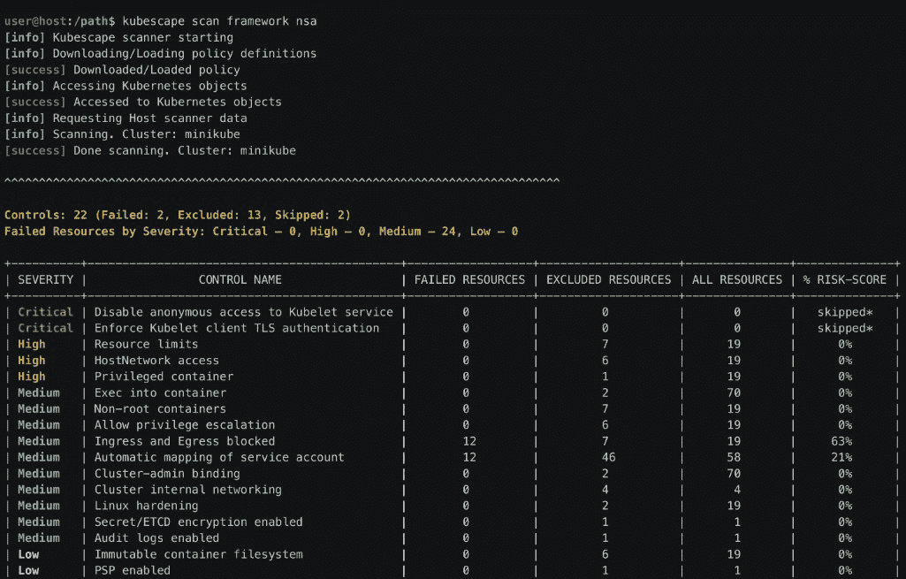

# Kubescape:一个面向所有 Kubernetes 安全的 CNCF 沙盒平台

> 原文：<https://thenewstack.io/kubescape-a-cncf-sandbox-platform-for-all-kubernetes-security/>

来自 ARMO 的项目创建者称，Kubernetes 项目本周被云计算原生计算基金会(CNCF)正式接纳为沙盒项目，这标志着为 Kubernetes 项目提供全面开源安全平台的旅程开始了。

根据 Kubernetes 的文档，开源的 Kubernetes 安全平台涵盖了应用程序的整个生命周期，以及对 [Kubernetes 应用程序](https://thenewstack.io/kubernetes-101-deploy-your-first-application-with-microk8s/)的更新。这包括用于风险分析、安全性、合规性和错误配置扫描的 IDE、CI/CD 管道和集群。

关键词是“平台”和“Kubernetes”平台部分意味着 Kubernetes 不仅仅是众多选择中的另一个具有特定功能的安全工具。Kubernetes 部分非常重要，因为这意味着该平台只面向 Kubernetes。

Kubescape 用于集成您的开发运维团队希望添加用于该平台的必要工具的长清单，例如用于[软件物料清单](https://thenewstack.io/sbom-everywhere-the-openssf-plan-for-sboms/) (SBOM)、签名扫描和策略控制。它从生产周期的左端开始运行扫描，并扩展到 CI/CD 和整个部署和集群管理过程。

用于查找和修复错误配置和漏洞，例如:框架 [NSA-CISA](https://www.armosec.io/blog/kubernetes-hardening-guidance-summary-by-armo/?utm_source=github&utm_medium=repository) 、[米特里 ATT & CK](https://www.microsoft.com/security/blog/2021/03/23/secure-containerized-environments-with-updated-threat-matrix-for-kubernetes/) 和 [CIS 基准](https://www.armosec.io/blog/cis-kubernetes-benchmark-framework-scanning-tools-comparison/?utm_source=github&utm_medium=repository)，Kubescape 扫描 YAML 文件，并在部署时控制图表和集群。Kubescape 还可以集成 Jenkins、CircleCI、GitHub Actions、GitLab、IDEs(即 Visual Studio 代码)Prometheus、Lens 和 Docker。

“我们希望成为 CNCF 的开源 Kubernetes 安全平台；这是我的愿景。我们希望将 Kubernetes security 整合到一个单一的平台中，”的 [Shauli Rozen](https://il.linkedin.com/in/shaulirozen) 的首席执行官兼联合创始人告诉 New Stack。“我真的认为这是这个领域一直缺少的东西。”

一个开源的、CNCF 捐赠的专门针对 Kubernetes 的安全平台的概念很有吸引力。但是这个开源项目如何被采用还有待观察，[企业管理协会(EMA)](https://www.linkedin.com/in/torstenvolk) 的分析师 Torsten Volk 告诉 New Stack。

ARMO 现在也提供 [ARMO 平台](https://www.armosec.io/)，作为 Kubescape 之上的附加安全层。它为 SaaS 或内部部署的 Kubernetes 提供了该公司所说的“现成”安全平台。它可以部署在托管的 Kubernetes 平台上，包括亚马逊的弹性 Kubernetes 服务(EKS)、微软的 Azure Kubernetes 服务(AKS)、谷歌 Kubernetes 引擎(GKE)、Red Hat OpenShift 等。

## 齿轮和轮子

Kubescape 主要依靠[开放策略代理](https://www.openpolicyagent.org/)来验证 Kubernetes 对象与姿态控制库的对比。在 Kubescape 的文档中，监控结果被打印出来，也可以是:

*   导出到 JSON 或 junit XML。
*   呈现为 HTML 或 PDF 格式。
*   提交给云服务。

与此同时，Rozen 告诉 New Stack，该公司计划在未来几个季度内为 Kubescape 开源一些专有功能和开源 kubscape 的后端代码。他说，它计划开源的功能包括扩大持续监控运行时元素的过程，以及“确保它们不会被改变”，例如，在发生内存攻击的情况下。

与此同时，为了赢得开发人员、安全和运营团队成员的支持，Kubernetes 必须能够证明它可以无缝融入他们当前的工作方式，并使所有与 Kubernetes 相关的角色都能受益于安全护栏和来自 Kubernetes 社区的最佳实践，Volk 说。“这可能最终会让公司在与坏人的永恒竞赛中占据优势，”沃尔克说。

Kubescape 用户客户通常分为两类。其中包括已经转向原生云，但继续在 Kubernetes 领域之外的其他类型的基础架构中保持投资的大型组织。另一个极端是最近成立的组织，他们维护“非常专注的 Kubernetes 环境”，Rozen 说。

坦率地说，由中小型公司组成的全 Kubernetes 组织目前是我们的最佳选择，”Rozen 说。

<svg xmlns:xlink="http://www.w3.org/1999/xlink" viewBox="0 0 68 31" version="1.1"><title>Group</title> <desc>Created with Sketch.</desc></svg>