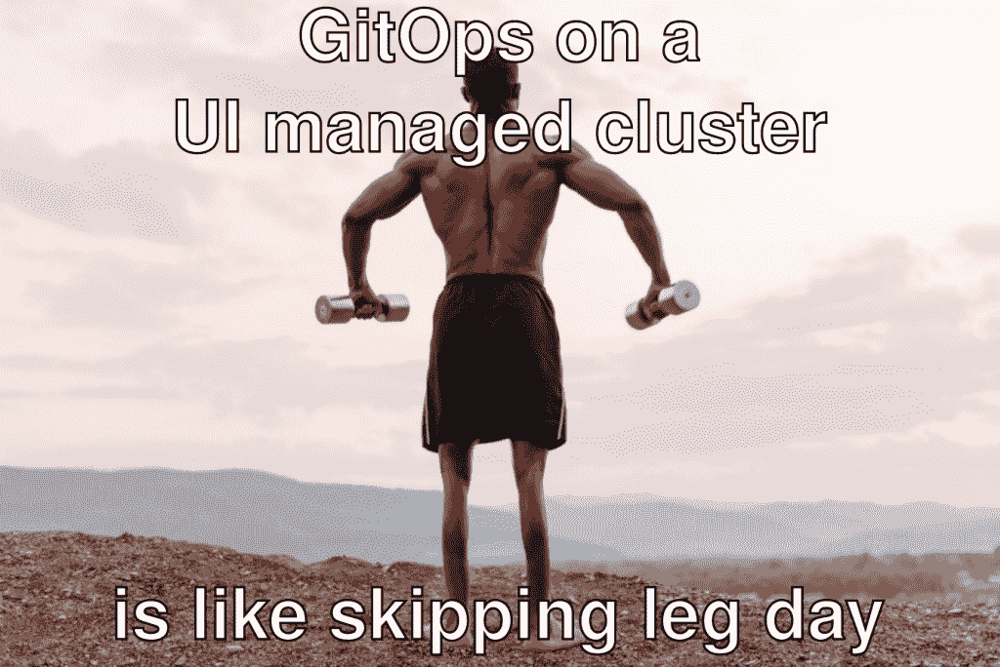

# KubeStack:迈向全栈 GitOps

> 原文：<https://thenewstack.io/kubestack-towards-full-stack-gitops/>

 [菲利普·斯特鲁贝

菲利普自从 2008 年从大学辍学创建 cloudControl PaaS 并帮助开发人员更快地构建更好的软件以来，他一直是云本地人。从那以后，Philipp 在 Exoscale 从事 IaaS 工作，在 CoreOS 从事 Enterprise Kubernetes 工作，最近在 Container Solutions 担任顾问，帮助组织进行云原生转换。Philipp 是 Kubestack 开源框架的维护者。Kubestack 是一个 Terraform GitOps 框架，面向希望自动化基础设施的团队，而不是重新发明自动化。](https://github.com/pst) 

我们已经进入 2021 年，就 GitOps 而言，我们继续去年停止的炒作周期。当然，我们这样做是有充分理由的。将配置保存在 git 存储库中，并在发生变化时应用它，这总是很有意义的。但是，仅仅因为某件事情非常有意义，并不意味着它实现起来是微不足道的。事实证明，只有当存储库中的配置发生变化时才运行的自动化功能非常有限，无法处理操作分布式系统的许多故障场景。

Kubernetes 通过提供一个 API 来声明所需的状态，并提供一个基于控制器的协调循环来保持所需状态和当前状态同步，从而在正确的级别上分离关注点以克服这一问题。因此，这种总是很有意义的想法成为了首选方式，并有了自己的行话，GitOps。

对于 Kubernetes 之上的工作负载，如果你想采用 GitOps，不缺工具。如果你能避开所有赶时髦的供应商的喧嚣，将他们的传统产品重新包装为 GitOps，你就可以选择一个，避免自己处理各种边缘情况。

但是任何系统都只能像它的依赖者一样可靠。您的集群是您系统的基础。如果构建它的集群是最薄弱的环节，那么所有这些高级 GitOps 部署自动化真正能给你带来什么？

由于我们都是人，人工操作容易出错。手动管理集群时的许多常见错误会对您的应用程序工作负载产生严重的负面可用性影响。

因此，您在手动管理的集群上构建的任何东西都将与该集群一样不可靠。

这就引出了两个问题。首先，当足够多的团队采用 GitOps 并大肆宣传时，为什么大多数集群仍然通过 UI 手动管理？第二，当然，我们如何解决这个问题？

如果您需要提醒一下 UI 到底有多重要，请记住所有那些主要通过 UI 管理的 VMware 安装。这种用户界面显然如此普及，以至于 VMware 和亚马逊网络服务公司(AWS)都大力宣传用它来管理亚马逊网络服务(T2)的能力。而 [VMware](https://tanzu.vmware.com?utm_content=inline-mention) 远不是唯一的例子。云提供商自己的用户界面也向这一现实致敬。需要另一个例子吗？我们也不要忘记多云 Kubernetes 用户界面，如谷歌 Anthos，Azure Arc 或 SUSE Rancher。见鬼，甚至有一些公司仅仅是为了构建替代的、据说更好的 AWS UIs 而存在。

在这个 UI 驱动的世界中，尽管它承诺了所有的好处，但作为代码的基础设施受到其令人生畏的陡峭学习曲线的阻碍。而 Kubernetes 的加入，让这个学习曲线变得更加陡峭。

但是，即使你已经走过了陡峭的学习曲线，基础设施即代码和 Kubernetes 也会为迁移项目和绿地项目带来大量的前期工作。您将不得不从头开始编写大量代码，并且在您可以作为一个团队使用自动化来维护一切之前，还要设置和集成许多先决条件。

更糟糕的是，除此之外，基础设施作为代码本身不足以实现全栈 GitOps。Kubernetes 的关注点分离使 GitOps 变得简单可行，但只适用于集群工作负载。当谈到集群的基础设施时，我们仍然面临着与以前相同的复杂性，除非我们有一个适当的系统来平等地分离集群基础设施的声明和协调状态。

现在我们对这个问题有了更好的理解，让我们来看看该怎么办。

一个提供缺失的关注点分离的系统的例子是托管的 Kubernetes 产品，如 AKS、EKS 和 GKE。有了它们，您可以通过 API 声明所需的状态，云提供商负责保持所需状态和当前状态同步。

另一个例子是 ClusterAPI，这是一个云原生社区计划，旨在在超级扩展者的围墙花园之外实现同样的目标。通过收购 Heptio，ClusterAPI 已进入 vSphere，为其庞大的客户群释放了这一功能。

当使用托管的 Kubernetes 解决方案或 ClusterAPI 时，代码形式的基础设施非常适合维护和应用所需的状态。但这仍然留下了必须从头开始构建一切的问题。

对于任何来自应用程序开发的人来说，可能会感到惊讶的是，竟然没有这样一个流行用例的框架。但是作为代码的基础设施，作为一个生态系统，仍然处于起步阶段。

在应用程序开发方面，任何类似的流行用例通常都有多个用任何语言维护的框架。像姜戈，Rails，Spring Boot 或盖茨比，以及他们各自的替代品。仅举几个例子。

但是缺乏框架的原因不仅仅是因为基础设施作为一个代码生态系统仍在出现。只有向容器和 Kubernetes 的范式转变提供了足够清晰的抽象，以防止应用程序需求泄露到基础设施层。在此之前，基础设施团队经常不得不保持特定于应用程序的配置，这使得可重用框架没有共同的需求来增加价值。

作为我对推进作为代码生态系统的基础设施的贡献，我不仅仅写这方面的文章。我全力以赴，写了代码。Kubestack，我维护的 Terraform GitOps 框架将团队为 Kubernetes 集群基础设施和集群服务构建 GitOps 自动化所需的一切集成到一个免费的开源框架中。如果拥有代码形式的基础设施和没有前期和长期努力的 GitOps 工作流的好处听起来好得难以置信，也许你应该尝试一下 Kubestack。

关于 UIs 的最后一个想法。我不是说 ui 在 GitOps 的未来没有位置。毕竟，设计良好的用户界面可以极大地改善用户体验。我只是相信，他们应该帮助团队改变存储库中的代码，而不是改变期望的状态。

<svg xmlns:xlink="http://www.w3.org/1999/xlink" viewBox="0 0 68 31" version="1.1"><title>Group</title> <desc>Created with Sketch.</desc></svg>