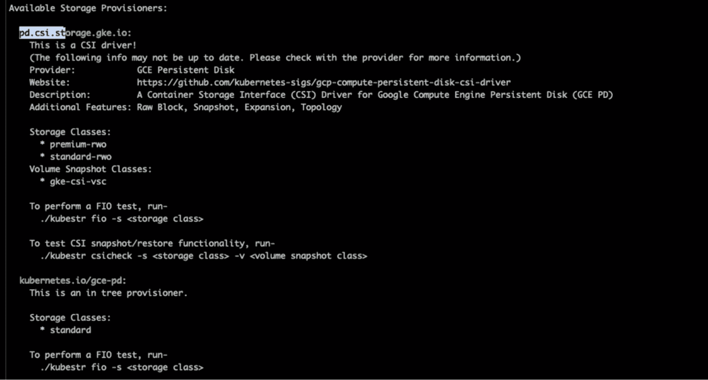
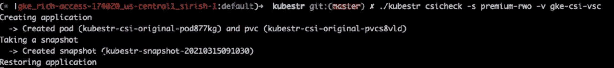
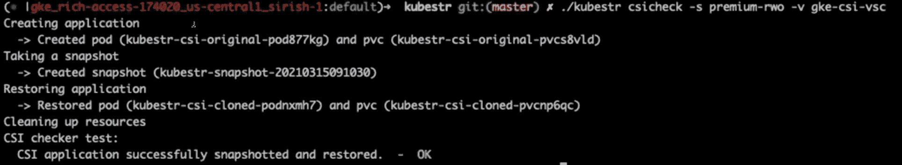

# Kubestr:在 Kubernetes 中验证和调试存储的简单按钮

> 原文：<https://thenewstack.io/kubestr-the-easy-button-for-validating-and-debugging-your-storage-in-kubernetes/>

 [迈克尔·凯德

迈克尔是卡斯滕公司的高级技术专家。他是一名技术思想领袖、社区拥护者和项目负责人，与社区密切合作。](https://www.linkedin.com/in/michaelcade1/) 

需要更好的方式来探索 Kubernetes 储物方案吗？来自 Kasten 的一个新的开源项目可能是答案: [Kubestr](https://kubestr.io) 。

Kasten 一直活跃在开源社区，创建简化 Kubernetes 应用程序开发的解决方案。例如， [Kanister](https://kanister.io) 是一个开源框架，在备份您的 Kubernetes 环境时，它允许应用程序级的数据管理和一致性。另外， [Kopia](https://kopia.io) 是将数据从 A 地提升和转移到 B 地的底层框架，同时确保数据保护和高效管理。

最近，Kasten 推出了 [Kubestr](https://kubestr.io) ，这是一套工具，为开发人员和运营商提供了一种快速便捷的方式来识别、验证和评估 Kubernetes 应用的存储选项。

## 为 Kubernetes 选择持久存储的主要挑战

创建一个 Kubernetes 应用程序需要存储——但是有许多选择，决定走哪条路通常需要一些尝试和错误。这是因为选择正确的存储类型涉及几个因素:

*   对于相关的应用程序和工作负载来说，速度够快吗？
*   您的工作负载需要额外的存储吗？
*   存储是否通过快照提供数据保护？
*   资金限制是什么？
*   从性能角度来看，有哪些技术限制？

考虑到所有这些参数，决定最佳选择可能是困难的，特别是如果你是使用 Kubernetes 的新手。在快速启动和运行新应用程序的压力下，您可能会满足于任何现成的存储选项，而不一定考虑财务后果，也不一定考虑随着时间的推移它将如何影响性能。

此外，存储选项正在激增。CSI 驱动因素的快速扩展为 Kubernetes 存储带来了增强和创新，提供了广泛的选择。虽然这对开发人员来说是个好消息，但它也使决策变得复杂。评估存储选项包括针对各种应用程序类型和用户场景(甚至不同数量的用户)进行测试。您如何以高效、可靠的方式探索所有这些选项？

## 根据命令识别、验证和评估存储

当您在 Kubernetes 中部署一个应用程序时，您有一个 pod 和一些与之相关的数据存储；例如 PV 或 PVC。验证您的存储资源调配器是否能够保护数据非常重要。这需要三个动作，通常以手动方式执行:

1.  确定群集中存在的各种存储选项。
2.  验证存储选项是否配置正确。
3.  使用常见的基准测试工具(如 FIO)评估存储。

下面的例子展示了一个 *gke* 集群。要查看集群中可用的存储选项，您只需编写一个 kubectl `get storageclasses`命令:

Kubestr 确定了三种不同类型的存储类，并按 provisioner 对它们进行了细分(还提供了一些详细信息)。这些信息在大多数情况下已经足够了，但有时您需要了解更多。在这些情况下，您可以单独运行 Kubestr，它会提供更多的详细信息:

Kubstr 还提供了一个自动化的工作流，用于捕获应用程序的快照，然后恢复它以确保写入存储的数据存在。这有助于识别和调试配置过程中的任何问题。

只需选择上一步中确定的存储类别之一。Kubestr 创建了一个包含 pod、PVC 和 PV 的应用程序。在下面的示例中，应用程序将一些样本数据写入 PV 测试卷，例如数据字符串。应用程序准备就绪后，Kubestr 会拍摄快照，然后尝试恢复应用程序:

应用程序恢复后，它会验证其中的数据是否与最初写入的数据相匹配，然后报告存储设置是否正确:

如果没有 Kubestr，识别和验证存储的过程是一个多步骤的过程。使用 Kubestr，只需一个命令就可以完成。

## 优化存储性能的捷径

Kubestr 提供了一种针对集群验证存储选项的快捷方式。对于 Kubernetes 的新用户，它消除了一些复杂性，并有助于确保您从存储中获得最高性能。但它不仅仅是一个零日工具；它允许您追溯和识别现有集群中的存储选项。

假设您致力于使用 Kubernetes，并且您已经使用特定的存储选项部署了应用程序，并且运行良好。也许您想知道幕后发生了什么，或者您怀疑您没有使用所有可用的性能。Kubestr 帮助您了解可用的性能并发现浪费的资源。它还能让您更好地了解 Kubernetes 存储环境中的情况。

你可以在这里看演示或者下载 Kubestr [。](https://kubestr.io)

要了解 Kubestr 的内容、原因和方式，请查看 [Kasten 的网络研讨会和演示](https://youtu.be/Ti9zKceGhZk)。它由 Kubestr 的创建者 Sirish Bathina(Veeam Kasten 的技术人员)和 Michael Cade(Veeam Kasten 的高级技术人员)担任主角。在网络研讨会期间，他们讨论了 Kubernetes 中持久性存储面临的一些挑战，并演示了 Kubestr 如何帮助应对这些挑战，同时简化和精简存储识别、评估和验证方面的繁琐任务。

通过 Pixabay 的特征图像。

<svg xmlns:xlink="http://www.w3.org/1999/xlink" viewBox="0 0 68 31" version="1.1"><title>Group</title> <desc>Created with Sketch.</desc></svg>