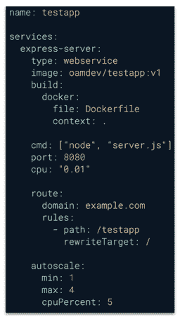
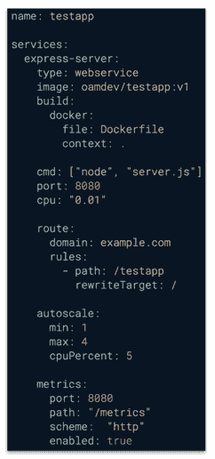
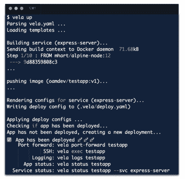
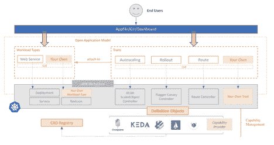

# KubeVela:基于开放应用模型和 Kubernetes 的可扩展应用平台

> 原文：<https://thenewstack.io/kubevela-the-extensible-app-platform-based-on-open-application-model-and-kubernetes/>

上个月在 KubeCon+CloudNativeCon 2020 上，[开放应用模型(OAM)](https://github.com/oam-dev/spec) 社区推出了 [KubeVela](https://github.com/oam-dev/kubevela/) ，这是一个基于 OAM 和 Kubernetes 的易用且高度可扩展的应用平台。

对于开发人员来说，KubeVela 是一个易于使用的工具，使您能够以最少的努力描述应用程序并将其发送到 Kubernetes，但是对于平台构建者来说，KubeVela 是一个框架，使他们能够轻松地创建面向开发人员但完全可扩展的平台。

云原生技术的趋势是使用 Kubernetes 作为公共抽象层，追求跨云和内部基础设施的一致应用交付。虽然 Kubernetes 在抽象底层基础设施细节方面表现出色，但它确实给应用程序开发人员带来了额外的复杂性，即理解 pods、端口暴露、权限提升、资源声明、CRD 等概念。我们已经看到，非平凡的学习曲线和面向开发人员的抽象的缺乏影响了用户体验，降低了生产率，导致了生产中的意外错误或错误配置。

 [郭飞

郭飞目前是阿里巴巴集装箱平台集团的高级工程师。他致力于工作负载自动化，在 Kubernetes 中支持多租户和边缘计算。加入阿里巴巴之前，费在 VMware vSphere DRS(分布式资源调度器)团队工作。](https://www.linkedin.com/in/fei-guo-a48319a/) 

抽象 Kubernetes 以满足开发人员的需求是一个非常固执己见的过程，只有当决策者是平台构建者时，最终的抽象才有意义。不幸的是，今天的平台构建者面临以下困境:没有工具或框架让他们轻松地扩展抽象(如果有的话)。

因此，尽管 Kubernetes 具有可扩展性，但如今许多平台都引入了受限的抽象和附加机制。这使得很容易地扩展这样的平台来满足开发者的需求或者扩展到更广泛的场景几乎是不可能的。

最后，开发人员抱怨这些平台太死板，对功能请求或改进的响应太慢。平台构建者确实想帮忙，但是工程上的努力令人望而生畏:平台中任何简单的 API 变化都可能很容易变成围绕固执己见的抽象设计的马拉松式谈判。

## 介绍 KubeVela

有了 KubeVela，我们的目标是用一种将开发者和平台构建者的关注点分开的方法来解决这两个挑战。

对于开发人员来说，KubeVela 是一个易于使用但可扩展的工具，使您能够以最少的努力来描述和部署微服务应用程序。你所需要的是一个简单的 docker-compose 风格`appfile`,而不是管理少量的 Kubernetes YAML 文件。

### 示例应用程序文件

在本例中，我们将为您的应用程序创建一个`vela.yaml`。该文件描述了如何构建映像、如何将映像部署到 Kubernetes、如何访问应用程序以及系统如何自动缩放它。

只要做:`$ vela up`，你的应用就会在 https://example.com/testapp.上活跃起来

### 在应用程序文件后面

 [张磊

雷是 Kubernetes 社区的联合维护者，应用交付 SIG 的联合主席。雷是阿里巴巴工程项目联合负责人，包括 Kubernetes 和大规模集群管理系统。在此之前，雷曾在微软研究院(MSR)工作。雷是一个受欢迎的演讲者。](https://www.linkedin.com/in/harry-lei-zhang/) 

KubeVela 中的`appfile`没有固定的模式规范，相反，您可以在这个文件中定义什么是由您的平台中可用的工作负载类型和特征决定的。具体来说，这两个概念是 OAM 的核心概念:

*   工作负载类型，它声明了运行时基础设施在应用程序部署中应该考虑的特征。在上面的示例中，它定义了一个名为`express-server`的“Web 服务”工作负载作为应用程序的一部分。
*   Trait，表示附加到工作负载类型实例的操作配置。特征用操作特性扩充了工作负载类型实例。在上面的示例中，它为访问应用程序定义了一个路由特征，并为基于 CPU 的水平自动扩展策略定义了一个自动扩展特征。

每当添加一个新的工作负载类型或特性时，它将立即可以在`appfile`中声明。假设添加了一个名为`metrics`的新特征，开发人员可以通过简单的`$ vela show metrics`检查这个特征的模式，并在前面的示例`appfile`中定义它:

## Vela Up

`vela up`命令将`appfile`中定义的应用程序部署到 Kubernetes。部署之后，您可以使用`vela status`来检查如何按照`appfile`中声明的`route`特征访问您的应用程序。

使用 KubeVela 部署的应用将收到一个 URL(以及版本化的预发布 URL ),其中包含通过 [cert-manager](https://cert-manager.io/docs/) 自动生成的有效 TLS 证书。KubeVela 还提供了一组命令(即`vela logs, vela exec`)来最好地支持您的应用程序管理，而无需成为 Kubernetes 专家。了解更多关于 vela up 和 appfile 的信息。

## 面向平台构建者的 KubeVela

如果没有 KubeVela 作为一个可扩展的平台引擎向平台构建者提供的创新产品，上述体验是无法实现的。这些特点是隐藏的宝石，使 KubeVela 独一无二。具体来说，KubeVela 通过以下方式减轻了在 Kubernetes 上构建面向开发人员的平台的痛苦:

*   **以应用为中心。在 appfile 的背后，KubeVela 将“应用程序”作为其主要的 API，并且所有的 KubeVela 功能仅服务于应用程序的需求。这就是 KubeVela 如何在默认情况下将以应用程序为中心的上下文引入平台，并将构建这样的平台转变为围绕应用程序架构工作。**
*   **天生延伸。**如开发者部分所述，appfile 描述的应用由各种可插拔的工作负载类型和操作特性(即特征)组成。来自 Kubernetes 生态系统的功能可以随时通过 Kubernetes CRD 注册机制作为新的工作负载类型或特征添加到 Kubernetes。
*   简单但可扩展的用户界面。在`appfile`之后，KubeVela 使用 [CUELang](https://github.com/cuelang/cue) 作为面向用户的模式和控制平面对象之间的“最后一英里”抽象引擎。KubeVela 首先提供了一组内置的抽象，平台构建者可以随时自由地修改它们。功能添加/更新或抽象更改都将在运行时生效，既不需要重新编译也不需要重新部署 KubeVela。

在引擎盖下，KubeVela core 建立在 Crossplane OAM Kubernetes Runtime 之上，依赖于 KEDA、Flagger、Prometheus 等，但其功能池是“无限的”,可以随时扩展。

有了 KubeVela，平台构建者现在有了工具支持，可以设计并向最终用户交付任何具有抽象的新功能，而且信心十足，周转时间短。对于一个开发者来说，你只需要学习这些抽象，在一个文件中用它们描述应用程序，然后发布它。

## 不是另一个 PaaS 系统

大多数典型的平台即服务(PaaS)系统还提供完整的应用程序管理功能，旨在改善开发人员的体验和效率。在这种背景下，KubeVela 有着相同的目标。

虽然不像大多数典型的 PaaS 系统，它们要么是不可扩展的，要么是由它们自己的社区创建自己的附加系统。KubeVela 旨在充分利用 Kubernetes 生态系统作为其能力池。因此，在这个项目中没有引入额外的附加系统。对于平台构建者来说，只需向 OAM 注册其 API 资源并提供一个提示模板，就可以随时在 KubeVela 中安装新的功能。我们希望并期待在开源社区的帮助下，KubeVela 的功能数量会随着时间的推移而大幅增长。了解更多有关使用$vela cap 社区功能的信息。

简而言之，KubeVela 是一个用于构建以应用程序为中心的抽象的 Kubernetes 插件。它利用 Kubernetes 固有的可扩展性和功能来解决一个难题——使 Kubernetes 上的应用程序管理变得令人愉快。

## 了解更多信息

KubeVela 由 OAM 社区孵化，作为 [Rudr](https://github.com/oam-dev/rudr) 项目的继承者，而不是一个参考实现，KubeVela 打算成为一个端到端的实现，可以在更广泛的场景中使用。KubeVela 的 appfile 的设计也是 OAM 规范中实验性尝试的一部分，为开发者带来简化的用户体验。

要了解更多关于 KubeVela 的信息，请访问 KubeVela 的[文档网站](https://kubevela.io/)。以下内容也是很好的后续步骤:

*   按照 KubeVela 快速入门页面中的循序渐进教程，尝试一下 KubeVela。
*   给我们反馈！KubeVela 仍处于早期阶段，我们很乐意通过 OAM [Gitter](https://gitter.im/oam-dev/community) 或 [Slack channel](https://cloud-native.slack.com/archives/C01BLQ3HTJA) 向社区征求反馈。
*   扩展 KubeVela 来构建自己的平台。如果您对新的工作负载类型、特征有想法，或者尝试使用 KubeVela 构建更复杂的东西，如数据库或 AI PaaS，请将您的想法作为 GitHub 问题发布，或者向 OAM 社区提出，我们渴望知道。
*   [贡献给 KubeVela](https://github.com/oam-dev/kubevela/blob/master/CONTRIBUTING.md) 。KubeVela 是由来自 8 个以上不同组织的 bootstrap 贡献者的开源社区初始化的。我们打算一旦这个项目稳定下来，就把它捐赠给一个中立的基金会。

通过 Pixabay 的特征图像。

<svg xmlns:xlink="http://www.w3.org/1999/xlink" viewBox="0 0 68 31" version="1.1"><title>Group</title> <desc>Created with Sketch.</desc></svg>