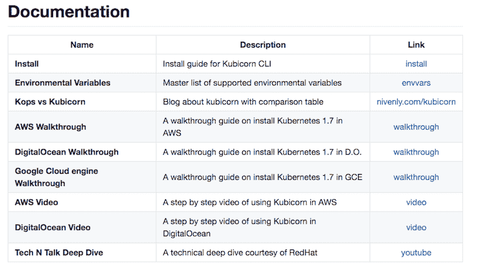

# 36，000 英尺处的 Kubicorn:管理 Kubernetes 基础设施的界面驱动方式

> 原文：<https://thenewstack.io/kubicorn-at-36000-feet-an-interface-driven-way-to-manage-kubernetes-infrastruture/>

在西雅图和旧金山之间的 36000 英尺高空，当微软的一位项目经理拉克伦·艾文森在一次飞行中感到无聊时，一些最新的技术汇集到了一起。所以他启动了一台服务器，创建了一个 Kubernetes 集群，[拍摄了这个过程。](https://www.youtube.com/watch?v=XpxgSZ3dspE&feature=youtu.be)

他在推特上写道:“如何在 3m 以下 36，000 英尺的地方使用[@**kubi cornk 8s**](https://twitter.com/KubicornK8s)在 [@ **数字海洋**](https://twitter.com/digitalocean) 上建立一个 k8 集群，只需 10 美元信用。”

这是尖端科技的最高极客因素。对于我们这些凡人，让我来分解一下。

## 服务器

首先，总部位于纽约的云服务提供商 DigitalOcean 今年频频见诸报端，其首席技术官朱莉娅奥斯汀(Julia Austin)承诺每隔几个月推出一次新功能。今年到目前为止，他们已经增加了负载平衡、安全性和新的高 CPU 容量，所有这些都专注于允许当前客户扩展和吸引更多企业公司。但他们的核心受众是开发者。他们专注于开发人员的需求，使服务器的组装变得简单而经济。正如联合创始人米奇·怀纳去年在一次采访中告诉我的那样。正如 Evenson 所展示的，它既快又简单。想要服务器？嘣。

## 什么是 Kubicorn？

Kubicorn 标志，带有 Gopher rider

Kubernetes 维护者和微软高级开发者倡导者 Kris Nova 的创意，Kubicorn 刚刚诞生不到一个月。该框架旨在帮助用户管理 Kubernetes 云基础设施。

“通过 Kubicorn，用户可以创建新的集群，修改和扩展它们，并随时拍摄集群的快照，”Nova 在 GitHub 上的官方 Kubicorn 自述文件中说道。

她在 Kubicorn 子 Reddit 上说，这并不是为了取代 Kops，因为这两个项目有一些根本的不同。“我喜欢 kops，这不是为了取代 kops”她说。“Kops 是并将永远是官方部署工具。就当这是我可笑的副业吧。”

“Kubicorn 是界面驱动的，”她说，“这意味着整个框架被设计成模块化的，因此用户可以带来自己的实现，或者修改/调整他人。”她深思熟虑地提供了一份详细的差异清单:

> 1.  我们使用 kubeadm 来引导我们的集群。
> 2.  我们努力让开发人员感同身受，代码简洁明了。
> 3.  我们努力实现操作上的共鸣，以及简洁明了的用户体验。
> 4.  我们从配置文件的严格文字开始，然后封送到一个对象中。
> 5.  我们以库的形式提供工具，而不仅仅是命令行工具。
> 6.  我们是原子的，如果有错误，我们将不做任何工作。
> 7.  我们运行在许多操作系统上。
> 8.  我们允许用户定义他们自己的任意引导逻辑。
> 9.  我们不能保证任何作品，永远，使用风险自担。
> 10.  我们不依赖 DNS。
> 11.  我们相信快照，用户应该能够捕获集群并移动它。

## 事实真相

Nova 的目标是通过 Kubicorn 实现简单和优雅。在用户选择的云中，用户定义他们在 Kubernetes 集群中想要什么，然后应用它。“就这么简单，”她说。

Nova 在 Kubicorn 的 GitHub 网站上解释说，它非常灵活，允许用户采用任何 Kubernetes 集群，并强制执行他们的 Kubernetes 基础设施的预期状态，允许简单的可伸缩性。

Kubicorn 的一个有趣的方面是能够将集群的快照作为压缩文件，并随时在云中运行该映像。快照捕获预期的基础架构和预期的应用程序定义。拍摄快照、保存快照、部署快照

“Kubicorn 是作为一个库和一个框架来构建的，”Nova 说。"从而允许它被容易地销售到操作者和控制者模式中，以加强基础设施的预期状态."

仅供参考，Nova 警告不要认为它已经可以生产了，所以 Evenson 安装了它。但是，他和 Nova 一起工作，所以也许不需要信仰。

回到空中，Evenson 架起他的相机和屏幕共享，开始记录。“这是我第一次看它[Kubicorn]，”他说，向下滚动到文档，打开了如何使用数字海洋设置它的演练。他从旋转一个 Droplet(DO 服务器)开始，不到一分钟就完成了。

Kubicorn 文档

在三分钟结束时，他已经有了一个服务器和一个 Kubernetes 集群主机和节点，并按照演练指南进行了安全引导。服务器又花了几分钟时间进入“就绪”状态，因为在 36，000 英尺的空中投掷需要一段时间来创建容器。

好消息是，这个问题已经解决了。

https://twitter.com/Kris__Nova/status/895600493447200768

“最终，”Evenson 在推特上写道，“这是一封给技术的情书。”

在这里可以观看整个过程[。](https://www.youtube.com/watch?v=XpxgSZ3dspE&feature=youtu.be)

微软和 DigitalOcean 是新堆栈的赞助商。

通过 Pixabay 的特征图像。

<svg xmlns:xlink="http://www.w3.org/1999/xlink" viewBox="0 0 68 31" version="1.1"><title>Group</title> <desc>Created with Sketch.</desc></svg>