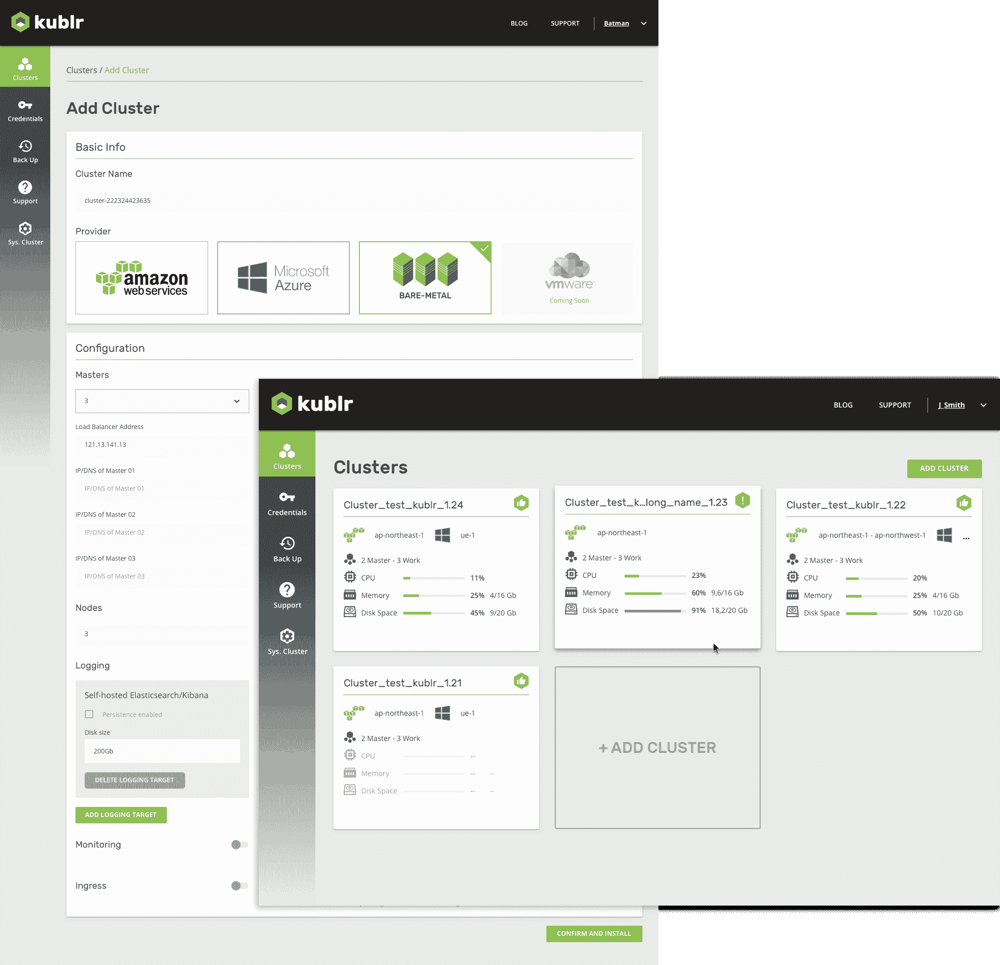

# Kublr 简化了 Kubernetes 的部署、扩展和管理

> 原文：<https://thenewstack.io/kublr-simplifies-deployment-scaling-management-kubernetes/>

 [特里·谢伊

特里·谢伊是 Kubernetes 最全面的企业平台 Kublr 的首席营收官。](https://www.kublr.com/) 

随着每一个主要的云提供商采用 Kubernetes，以及之前的编排解决方案支持者(如 Swarm 和 Marathon)提供它，很明显，2017 年标志着容器编排之战的结束。

Kubernetes 的成功是有原因的。一个很棒的框架——它支持高可用性、可伸缩性以及容器化应用程序和服务所需的状态管理。通过[云本地计算基金会](https://www.cncf.io/kubecon-cloudnativecon-events/) (CNCF)增强 Kubernetes 的社区已经接受了围绕有状态应用、可伸缩性和特定于环境的集成的关键挑战，我们将继续创新。

Kubernetes 更关心运行时而不是设置，它还在使用什么组件以及如何配置它们以提供核心功能方面提供了很大的灵活性。这种灵活性的缺点是它的复杂性。

Kublr 1.8 的发布简化了复杂性，它包括一个自助服务控制平面，使运营团队能够应对大规模部署、运行和管理企业级 Kubernetes 的挑战。

### 大规模容器部署、管理和编排的挑战

对于外行人来说，Kubernetes 看起来可以在几个小时或几天内启动并运行，但任何花时间看过 [Kelsey Hightower 的“Kubernetes the Hard Way”](https://github.com/kelseyhightower/kubernetes-the-hard-way)的人都知道，从头开始手工制作 Kubernetes 是非常复杂的。您需要选择部署哪些组件，更不用说，例如，需要您登录到每个工作节点以安装依赖项、目录、二进制文件以及配置网络、kubelet、代理和启动工作服务的重复步骤，这些都是非常耗时的，并且可能容易出错。公平地说，Kubernetes the Hard Way 声明它是为学习而优化的教程，而不是用于 Kubernetes 部署的自动化解决方案。

还有其他更新的工具解决方案，如 Kubeadm 或 KOPS(仅限于 AWS)提供了一些帮助。然而，Kubeadm 仍处于测试阶段，它建立了一个单一的主节点，放弃了高可用性部署，直到后来的版本。而且它狭隘地专注于设置集群，没有基础架构级别的交互或“第二天”功能的想法。

目前，与 Kubernetes 相关的开源解决方案还不能满足企业在确保安全性、高可用性、日志记录和监控、备份和灾难恢复方面的需求——这些都是让 Kubernetes“生产就绪”所需要的他们无法在多个环境中做到这一点，无论是内部环境还是云中环境，也无法将此功能与现有 IT 系统集成。

### 企业 Kubernetes 标准功能

自从 Kubernetes 集群上市以来，我们一直在部署它。在此期间，我们积累了丰富的 Kubernetes 知识——配置集群和组件的最佳实践，以及哪些组件可以很好地协同工作，哪些不能。这些知识嵌入了 Kublr 的认证架构中。

当我们开始构建 Kublr 平台时，我们知道我们必须处理基本的配置问题:确保身份和访问管理服务(IAM)，保护节点之间的通信，以及在将集群映像投入生产之前对其进行身份验证。同样，对于日志记录和监控，以及备份和灾难恢复(卷和配置数据)，需要选择、集成和测试组件。我们仍然致力于构建具有可插拔架构和上游 Kubernetes 合规性的 kubrr 平台，以使我们的客户能够利用最新的社区贡献——事实上，我们刚刚在 1 月底认证了 Kubernetes 1.9 的 kubrr 平台。

### 用 Kublr 控制平面简化 Kubernetes

作为 Kublr 1.8 版本的一部分，控制平面考虑到了 IT 人员中 Kubernetes 知识的不同水平；让安全、有弹性的集群配置部署变得异常简单。

通过直观的 GUI，您的 IT 运营团队可以选择要部署到的环境，选择主节点和工作节点的服务器大小，确定主节点和工作节点的数量，自动扩展(如果环境中有)，并根据需要设置入口卷和永久卷。

随着 Kubernetes 使用量的增长，快速、可靠、大规模地建立和拆除集群成为一项关键的运营能力。通过自动化该过程，Kublr 使公司能够运营 Kubernetes，并实现容器、Kubernetes 和云原生架构所能提供的速度、可伸缩性和可移植性。

### 独立的企业级 Kubernetes

大多数 Kubernetes 解决方案都依赖于单个云、操作系统，或者专注于为您的开发和运行时环境提供平台即服务(PaaS)。这限制了他们让公司利用容器技术所提供的可移植性优势的能力。大型组织希望利用混合策略，有时甚至是多云策略。他们正在寻找一个单一的解决方案，允许他们选择在哪里部署他们的容器化应用程序。有了 Kublr，您可以轻松地在本地或云中部署、运行和管理您的 Kubernetes 集群。

### 先进的 Kubernetes 功能

当我们考虑大型组织通常需要什么时，我们看到会有更高级的需求:审计、从单一控制台进行多集群监控，以及就地升级到新版本的 Kubernetes。我们还希望在不同的环境中利用固有的功能。AWS 和 Azure 中的云基础设施提供了对用于供应服务器和其他组件的 API 的访问。Kublr 通过集成 AWS 的云形成和 Azure 的资源管理模板，简化了这些环境中的部署。这种集成提供了运行时优势，并使初始配置更容易。虽然 Kubernetes 可以重启失败的 pods，但 Kublr 可以在需要时重启这些 pods 运行的节点。这提供了更高级别的高可用性。

Kublr 还监控 Kubernetes 的内部运作，密切关注内部组件的资源利用情况，让我们看到 Kubernetes 在不同规模和不同工作负载下的表现。Kublr 的可插拔架构允许我们根据工作负载、规模和其他应用考虑因素定制配置。对于高级用户，我们正在开放 Kublr 的命令行访问配置引擎，我们预计在任何组织中只有少数超级用户会使用。这将使他们能够为操作人员提供符合使用情形要求的集群部署预配置模板。

### 正在开发什么？

随着 CNCF Kubernetes 路线图和项目继续增强上游 Kubernetes 和生态系统的能力，我们专注于利用这些发展，为企业客户增加独特的价值。

以下是我们正在进行的一些 Kubernetes 开发项目:

*   我们正在为上游 Kubernetes 开发增强的调度功能，这将实现进一步的控制和更好的经济效益。
*   尽管我们已经支持开箱即用的多可用性区域部署，但是跨多个区域部署单个集群要复杂得多。我们已经在高层次上解决了这个问题，并且正在构建和测试解决方案。
*   与 OpenStack 和 VMware 的增强集成还有几周时间。
*   我们正在检查在 Kubernetes 上运行的预配置应用程序的使用案例，我们[欢迎您对什么能提供最大价值提出想法](mailto:contact@kublr.com)。
*   随着我们的客户继续使用 Kublr，我们增加了对不同环境中运行时问题的了解。Kublr 的智能运营将利用这一知识为 IT 运营人员提供更快的问题隔离和建议的补救措施。

核心 Kubernetes 和生态系统解决方案的改进仍在快速进行。在 Kublr，我们专注于提供一个全面的解决方案，利用开源 Kubernetes 并添加企业所需的扩展功能。

*ku BLR 首席执行官 Slava Koltovich 对本文亦有贡献。*

[云本地计算基金会](https://www.cncf.io/kubecon-cloudnativecon-events/)是新堆栈的赞助商。

<svg xmlns:xlink="http://www.w3.org/1999/xlink" viewBox="0 0 68 31" version="1.1"><title>Group</title> <desc>Created with Sketch.</desc></svg>