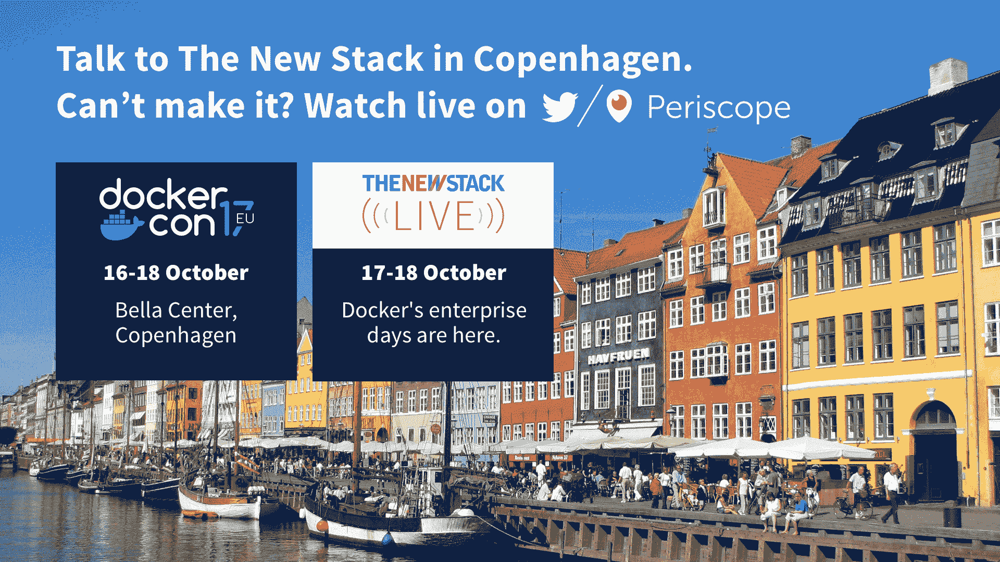

# Kubo 成为 Cloud Foundry 的容器运行时，默认用于 Kubernetes 部署

> 原文：<https://thenewstack.io/kubo-becomes-cloud-foundrys-container-runtime-default-kubernetes-deployment/>

更新后的 [Kubo 部署机制](https://thenewstack.io/kubo-two-platforms-orchestrating-orchestrator/)，更名为 Cloud Foundry Container Runtime(CFCR)，已经成为使用 [Kubernetes](/category/kubernetes/) 和 [BOSH 生命周期管理工具](https://thenewstack.io/bosh-hooks-cloud-foundry-google-cloud-platform-offers-large-scale-vm-lifecycle-management/)部署容器的默认 Cloud Foundry 方法。

根据基金会首席技术官 Chip Childers 的说法， [Cloud Foundry Foundation](https://www.cloudfoundry.org/) 已经将容器运行时添加到其应用运行时中，之前称为 Elastic Runtime，重命名是为了更好地向开发人员解释它，以便整个行业可以理解有两种有效的抽象。该基金会在本周于瑞士举行的 2017 年欧洲云铸造峰会上宣布了这些变化。

应用运行时是一个以应用为中心的平台，简化了整个开发生命周期。Container Runtime 使用 Cloud Foundry 独有的组件(如 BOSH)来创建一种统一的方式，以便在任何云上创建、部署和管理高度可用的 Kubernetes 集群。

“该项目是由采用云铸造、应用运行时的大型企业推动的。他们认为这种额外的抽象需要成为他们体验的一部分，”他说。“通过我们的社区提供这种服务，他们可以在公共云和私有基础架构之间以可移植的方式获得这种混合体验。”

BOSH 是一个开源项目，为大规模分布式服务的发布工程、部署和生命周期管理提供工具链。

在[为新堆栈](https://thenewstack.io/living-multi-cloud-world/)贡献的帖子中，Childers 解释了在云原生世界中多个平台协同工作的需求。他引用 Kubo 和开放服务代理 API(OS papi)作为实现这一目标的两个项目。

他将 BOSH 描述为一个抽象层，让您可以与几乎任何基础架构类型进行对话，无论是像 Amazon 或 Azure 这样的公共云、私有云还是虚拟化基础架构 OpenStack 部署、vSphere 集群或裸机。他说，最重要的是，BOSH 旨在支持部署的“第二天”需求。

Childers 说，尽管很受欢迎，Kubernetes 集群的生命周期管理正在成为一个棘手的问题。

Red Hat 的架构师、Apache Camel、OFBiz 和 Isis 项目的开源委员会成员[在另一篇文章](https://thenewstack.io/myth-cloud-native-portability/)中指出，认为只要将应用程序打包在容器中，就可以轻松地跨不同的云平台移植的想法是错误的。

“无论你是从 Mesos、Cloud Foundry、Kubernetes、Docker Swarm、ECS 开始，你都必须进行大量投资，以了解平台和支持工具，了解文化和工作方式，并与这个仍在快速变化的技术和公司生态系统互动，”他说。

这是云铸造基金会解决这一问题的方法之一。

## 提供弹性

Pivotal 和谷歌在 6 月份开源了 Kubo。 [Pivotal Container Service](https://thenewstack.io/pivotal-container-service-hard-wires-cloud-foundry-kubo-google-cloud/) 是 Cloud Foundry Container 运行时的首次商业化，Childers 说，但它也正在被 IBM 和 VMware 商业化。

它被称为 Cloud Foundry 复制整个 Kubernetes 环境的替代方案，以确保在主服务器发生故障时的高可用性。这是一种利用 Cloud Foundry 的现有功能对虚拟机进行负载平衡的方式，可以有效地平衡虚拟机内多个并发 Kubernetes 实例的流量。

[Kubo 给云代工厂和 Kubernetes 带来了什么](https://thenewstack.simplecast.com/episodes/what-kubo-brings-to-cloud-foundry-and-kubernetes)

Childers 说，这两种抽象有不同的用例。如果您正在编写大量定制代码，那么使用主要的 PaaS 体验是有意义的，它可以处理诸如容器化软件、引入依赖关系等事情。

容器运行时更加关注操作者。容器运行时是 Kubernetes 的打包，由 BOSH 层部署和管理。BOSH 负责对基础架构进行抽象，无论是在公共云中还是在不同的内部基础架构系统中，如 OpenStack 或 VMware vSphere。Childers 说，它将这些抽象出来，创建了健壮的分布式系统管理。

容器运行时和应用程序运行时都有负责维护正在部署的应用程序或容器的健康的组件。因此，如果一个节点离线，它们会将工作重新安排到集群中的其他节点。

"问题变成了:是什么在维护集群自身的健康？"奇尔德斯说。“Cloud Foundry 社区已经和 BOSH 一起做了很长时间了。它为运营商提供了平台本身的强大弹性。他们希望在运营 Kubernetes 时能看到同样的体验。

“Kubernetes 有很强的解决问题的能力，但它不会自我修复。你需要一种方法来做到这一点。”

Childers 解释说，谷歌在内部通过一个名为 Borg 的平台来完成这项工作，该平台包含了其所有的应用程序工作负载。

“波什的设计源自博格的一些团队成员。对于我们这些不为谷歌工作的人来说，这是博格选项。”

应用程序运行时和容器运行时都提供了在任何云上以任何语言或框架运行应用程序的灵活性。这种灵活性还通过 Open Service Broker API 扩展到了服务，它适用于应用程序运行时和容器运行时。

Childers 说，你将继续看到容器运行时发展的一个领域是与 BOSH 层合作，以提供可由 Kubernetes orchestrator 使用的持久数据量。这对于数据服务尤其重要。在[谷歌云平台](https://cloud.google.com/kubernetes-engine) (GCP)、亚马逊网络服务(AWS)和 Vsphere 上对持久性的默认支持现在可用于容器运行时项目。

正在进行的下一个领域是与 Itsio 服务网状网络项目合作，确保它与 Kubernetes 配合良好。

【T2

[Cloud Foundry Foundation](https://www.cloudfoundry.org/) 、 [Google](https://cloud.google.com/kubernetes-engine) 、 [OpenStack Foundation](https://www.openstack.org/) 和 [VMware](https://www.vmware.com/cloud-solutions/app-modernization/cloud-native-apps.html) 是新堆栈的赞助商。

亚历克斯·威廉姆斯的专题图片。

<svg xmlns:xlink="http://www.w3.org/1999/xlink" viewBox="0 0 68 31" version="1.1"><title>Group</title> <desc>Created with Sketch.</desc></svg>