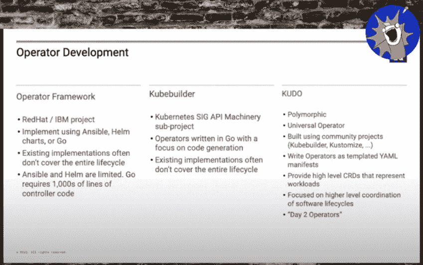
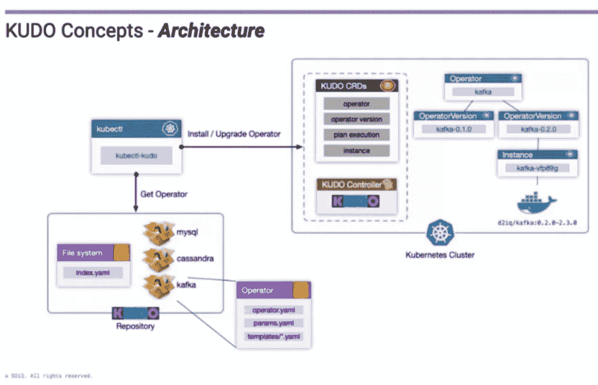

# KUDO 使 Kubernetes 操作员自动化

> 原文：<https://thenewstack.io/kudo-automates-kubernetes-operators/>

[Kubernetes 操作符](https://coreos.com/operators/)简化了在容器中自动化复杂应用程序的体验——例如，[部署了](https://thenewstack.io/datastax-open-sources-a-kubernetes-operator-to-ease-cassandra-management/)Kubernetes——本地有状态 Cassandra 集群，可以与无状态容器一起伸缩——但是创建这些操作符绝非易事。

在上个月 Snyk 的 All The Talks 虚拟会议上， [D2IQ](https://d2iq.com/) 的社区总监[马特·贾维斯](https://www.linkedin.com/in/mattjarvis08/?originalSubdomain=uk)举了一个例子，一个不知名但“主要的 noSQL 供应商”创建了一个“功能非常丰富”的操作符，它有 40，000 多行代码，花了一年多的时间来构建。他说，即使是拥有“一套相当简单的生命周期状态”的 etcd 的操作程序也需要 9000 多行代码。

Jarvis 解释说:“构建操作符可能非常复杂，需要大量关于 Kubernetes 内部的知识，需要 Go 专业知识，还需要关于应用程序的特定领域知识。“投入到高质量操作员身上的工程努力可能非常可观。”

Kubernetes 通用声明性操作符( [KUDO](https://kudo.dev/) )使用声明性 YAML 来更容易地构建这些 Kubernetes 操作符，不仅仅是部署，还包括诸如配置更新、故障恢复和二进制升级等任务的自动化。KUDO 通过提供一个通用操作符来帮助构建 Kubernetes 操作符的过程自动化。

贾维斯提供了一个更简洁的定义，他说 KUDO“基本上定义了操作排序和行动的框架，并允许你定义操作手册，并将其与你的应用程序一起发布，”而该项目的网站进一步提炼了目的，即有能力“部署你的应用程序，拥有操作它们所需的工具，并了解它们的行为方式——所有这些都没有 Kubernetes 的博士学位。”

Jarvis 将 KUDO 与其他运营商构建框架进行了比较，例如目前由 Red Hat 提供并最初由 CoreOS 创建的[运营商框架](https://www.redhat.com/en/blog/introducing-operator-framework-building-apps-kubernetes)，或者 Kubernetes SIG API Machinery 子项目 [Kubebuilder](https://github.com/kubernetes-sigs/kubebuilder) ，Jarvis 解释说，主要差异在于 KUDO 管理整个软件生命周期的能力，而现有的实现通常不具备这种能力，以及使用 YAML 而不是潜在的数千行 Go 来创建运营商。他还指出，KUDO 是多态的，这意味着它“将成为你为其编写 KUDO 操作符的任何应用程序的操作符——因此它只有一个控制器，它可以创建非常完整的操作符，而不需要深入了解 Kubernetes，也不需要编写任何代码。”

深入探究 KUDO 的工作方式，一切都被分解成三个嵌套的部分。

首先，KUDO 术语中的“操作者”是对可部署服务的描述，该服务在集群中表示为自定义资源定义(CRD)对象。其中包含“操作者版本”，它是该服务的特定版本和实现，具有特定的计划、对象和参数。最后,“实例”是 KUDO 所控制的应用程序的实际部署或实例化，在一个运营商版本中可以有许多实例，该版本本身也可以有多个具有更大、更重要的运营商的实例。

从这里开始，计划包含由阶段和步骤组成的指令，这些指令定义了升级、部署、备份和恢复等任务，并为 KUDO 提供了要执行的操作手册，所有这些都可以串行或并行运行。更具体地说，您可以想象一个运行 Kafka 的设置，其中主要的操作符是针对 Kafka 的，操作符版本是针对 Kafka 的不同版本的，最后一个实例是 Kafka 的这些版本之一的部署版本。

出于好奇，Jarvis 提供了 KUDO 的完整演示，可以在下面的嵌入式视频中观看(大约 12 分钟)。

展望 KUDO 的路线图，Jarvis 列出了目前正在开发的几个功能，包括从一个任务到另一个任务的信息的“[管道](https://whatis.techtarget.com/definition/pipe)”,可以“由希望修改特定计划执行方式的运营人员动态创建”的动态 CRD，以及使用除 YAML 之外的其他功能，如 StarLark 或 CUE。还列出了支持依赖性和将现有事物(如舵图)扩展到 KUDO 运算符的能力。

<svg xmlns:xlink="http://www.w3.org/1999/xlink" viewBox="0 0 68 31" version="1.1"><title>Group</title> <desc>Created with Sketch.</desc></svg>