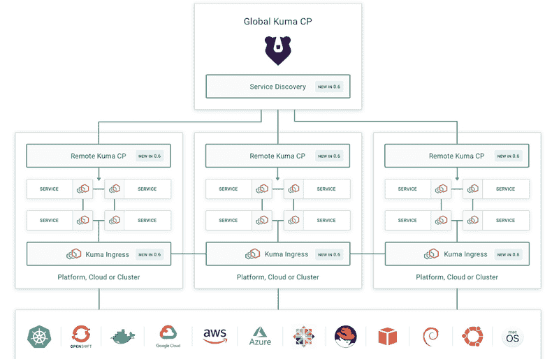

# 库马是 CNCF 的一个新项目，它增强了混合基础架构的控制平面

> 原文：<https://thenewstack.io/kuma-a-new-cncf-project-enhances-the-control-plane-for-mixed-infrastructure/>

“我很确定你不会听到任何人说，‘哦，是的，我们实现了一个服务网格，而且很容易做到。’他们只是极其复杂的系统，”首席技术官孔、马可·帕拉迪诺说。大约在 2017 年发布的第一代服务网格“带有许多移动部件、许多依赖性和许多我们不一定同意的假设。"

他说，这些网格高度集中在 Kubernetes 上，而客户虽然可能运行 K8s，但也仍然运行虚拟机。它们不能扩展，并且每个网格都需要一个新的集群。

库马，2019 年 9 月发布的服务网格 it [使用户能够在任何平台上运行网格，因此它可以在 Kubernetes 或 VMs 上运行，两者都以原生方式运行，并通过单个控制平面管理多个网格。](https://thenewstack.io/kuma-kongs-simpler-service-mesh-for-vms-and-kubernetes/)

在其最新的迭代中，支持跨异构环境运行的复杂应用程序，包括虚拟机、多个 Kubernetes 集群和多个数据中心。

如今，企业为不同的业务线、团队和应用程序运行多个不同的网格。Palladino 表示，其客户希望引入不同的网格进行隔离，并以一种需要较少协调的方式来管理它们。

在 0.6 版本中，“我们还引入了这种称为全局和远程控制平面的新模式，这使得这些整个系统不仅可以跨多个环境移植，而且更具可扩展性，因为我们可以为特定区域分配一个远程控制平面，而不是让所有这些环境的所有数据平面与一个控制平面对话——无论是云、Kubernetes 集群还是平台，”他说。

“因此，当我们有成千上万的数据点连接时，它们不是连接到一个控制平面，而是连接到远程控制平面和与全局控制平面连接的远程控制平面，以便从服务网格中获取策略。”

库马以前支持简单通用模式，具有平面网络要求，最适合不需要与传统系统集成的环境。库马 0.6 的核心是其针对新旧应用基础设施复杂网络的“混合通用模式”。

除了支持全局/远程控制平面，库马 0.6 的功能还包括:

*   **跨所有企业环境和平台的自动化服务连接**。
*   **新的入口数据平面模式**，可以自动进行跨平台和跨集群的服务网格通信。
*   **一个本地通用 DNS 服务发现 API** 抽象出跨多个平台和集群运行的底层服务，就好像它们在一个集群中运行一样。
*   **混合多网格支持。**

他说，入口数据平面模式使跨集群跨平台通信成为可能，而开发人员不必担心首先会发生这种情况。

“我们基本上让所有这些服务在所有这些不同的环境中运行，从连接的角度来看，让它们看起来像是在一台计算机的一个集群中运行。我们抽象出服务网格的连通性，就像 Kubernetes 抽象出数据中心的复杂性一样。我们接受所有的复杂性，以这样一种方式将它变平，即作为一个试图消费另一个服务的服务，我不必担心这种连接是如何发生的。这将会发生，”帕拉迪诺说。

他说，其开箱即用的解决方案是为最苛刻的企业网格要求而构建的，旨在消除复杂性和自动化困难部分，以便组织可以获得服务网格的好处。

“因为 TELUS 数字生活在云中，所以安全是最重要的，库马使我们能够以简单的方式实施零信任网络政策。我们还计划在未来几个月在整个组织中扩大库马的使用，以加速 Telus 更广泛的数字化转型，”TELUS 数字公司首席架构师 Luca Maraschi 表示。

在他的[服务网格平台指南](https://thenewstack.io/an-exploratory-guide-to-the-service-mesh-platforms/)中，分析师[贾纳基拉姆·MSV](https://thenewstack.io/author/janakiram/)解释说，孔 API 网关处理南北流量，而库马管理东西流量。

该公司强调，它是建立在特使代理的基础上，宣布将库马作为沙盒项目捐赠给云计算原生计算基金会。特使是一个毕业的 CNCF 项目。

“看到 Envoy 周围的生态系统继续发展真的很了不起，作为一个供应商中立的组织，CNCF 是库马的理想家园，”Envoy proxy 的创作者 Matt Klein 说。

竞争对手 mesh [Linkerd](https://thenewstack.io/linkerd-2-0-the-service-mesh-for-service-owners-platform-architects-sres/) 虽然是 CNCF 的一部分，却建立了自己的网络堆栈，就像[Containous in building Maesh](https://thenewstack.io/containous-builds-a-service-mesh-on-its-traefik-proxy/)一样。Istio 使用 Envoy，但它不是 CNCF 生态系统的正式成员。

在一份关于服务网络的[报告](https://amalgaminsights.com/2019/05/15/press-release-amalgam-insights-tom-petrocelli-service-mesh-market-continues-to-grow/)中，Amalgam Insights 研究员 [Tom Petrocelli](https://twitter.com/tompetrocelli?lang=en) 指出市场仍在发展。他指出，Istio 和 Linkerd 平台之间存在他所谓的“不幸的竞争”,这引起了人们对 Istio 的独立性的关注，因为它不受开放治理的约束。

“正在进行的 Istio 与 Linkerd 之争将拖累市场。它引入了不必要的冲突、混乱和分心，”他写道，并补充道，“许多供应商和方法都有足够的空间。”

他补充说，像服务网格 orchestrator 这样的新兴创新“对于可能使用不同技术运行服务网格的多云和混合环境来说尤其重要。”

云计算原生计算基金会是新堆栈的赞助商。

专题图片:[奎因·东布罗夫斯基](https://www.flickr.com/photos/quinnanya/)的《蓝色[》。根据 CC BY-SA 2.0](https://www.flickr.com/photos/quinnanya/5906436063/in/photolist-9ZW2Ex-4jQwv-53u6n-91cxHG-237mma-9nxKC1-8JpPGR-2egFMie-apffyU-B8tdq-2fULi9W-ykj4m-ykiZ5-4PqKxc-ykiUY-2iAH9Ew-2iC6Mi7-rykGo1-2gTcP8x-m2JxED-qLoJa-22R8ewe-ekRzZj-Zpuq5E-RCPkXG-2iiQmzN-2j2sDbk-VzkRiz-2iyWgUD-2iMaq9g-25aHYUU-2iz8nqu-2iAD9gV-2itCaBK-KfutXu-o7ah6u-4yk2N5-8JsTo7-ickCmo-8JsTeL-sk18Mr-8JsTAQ-ykj2d-gM753a-8K1xok-8JpPiK-8JpPfn-ykiXo-8JsT9f-KVS7Fk) 获得许可。

目前，新堆栈不允许直接在该网站上发表评论。我们邀请所有希望讨论某个故事的读者通过推特或脸书与我们联系。我们也欢迎您通过电子邮件发送新闻提示和反馈:[feedback @ thenewstack . io](mailto:feedback@thenewstack.io)。

<svg xmlns:xlink="http://www.w3.org/1999/xlink" viewBox="0 0 68 31" version="1.1"><title>Group</title> <desc>Created with Sketch.</desc></svg>