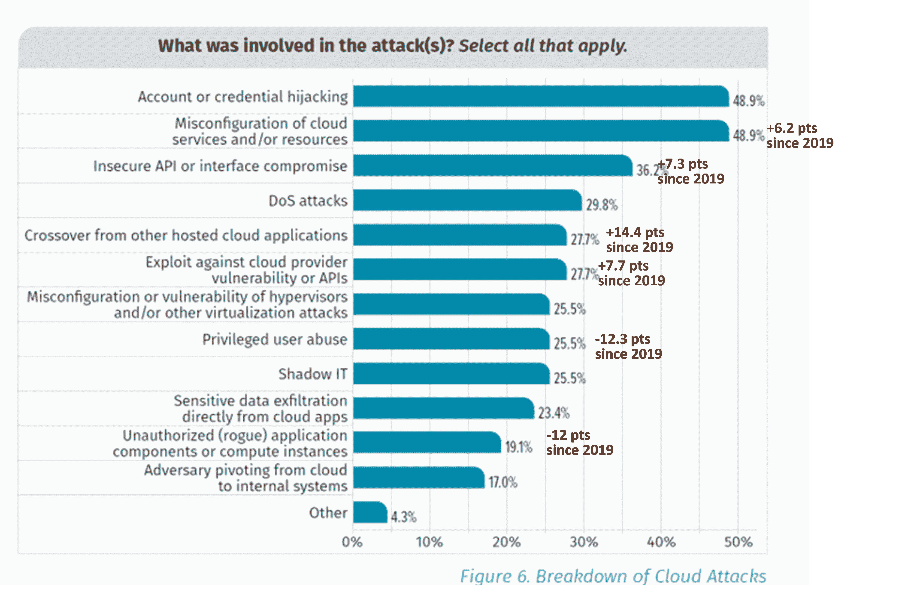

# Kyverno 针对安全配置错误保护容器

> 原文：<https://thenewstack.io/kyverno-defends-containers-against-security-configuration-errors/>

保护容器对于在云环境中部署资源的企业来说是一个特殊的挑战。它们不仅被设计为快速启动和快速扩展，而且技术仍然相对较新，开发人员可能不了解容器安全性的所有潜在设置和细微差别。

提供 Kubernetes 管理和部署工具的 [Nirmata](https://nirmata.com/) 公司产品副总裁 [Ritesh Patel](https://www.linkedin.com/in/patelrit/) 说:“Kubernetes 在工作负载部署方式上提供了很大的灵活性。

“这导致了问题和漏洞，”他补充道。“每隔几周，我们就会看到一些与配置相关的漏洞被公布或暴露出来。”

Nirmata 的创始人兼首席执行官[吉姆·巴格瓦迪亚](https://www.linkedin.com/in/jimbugwadia/)说:“开发人员可能不知道 80%需要配置的东西，他们也不应该知道。“他们应该担心他们的工作负载和应用程序。”

企业可以使用一些工具来帮助配置容器，其中之一是 Nirmata 自己的开源 [Kyverno 策略引擎](https://github.com/kyverno/kyverno)。

“Kyverno 可以非常有效地解决这个问题，”Patel 说。“例如，人们可以编写策略来阻止某些配置。Kyverno 的另一个有趣之处是它实现了自动化。它不仅可以阻止坏的配置，还可以生成新的配置。”

他说，这使得两年前 Nirmata 开源 Kyverno 时行业甚至无法想象的工作流成为可能。

## 不安全集装箱的特殊挑战

安全配置错误对公司来说是一个巨大的问题，而且这个问题越来越严重。

根据行业圣经《2020 年威瑞森[数据泄露调查报告](https://enterprise.verizon.com/resources/reports/dbir/)，错误配置是数据泄露增长最快的来源，自去年以来从第八位上升到第四位。

IBM 和 Ponemon [的一项研究发现](https://www.ibm.com/account/reg/us-en/signup?formid=urx-46542)错误配置的云服务器是最常见的初始威胁媒介，此外还有被盗或受损的凭据。云错误配置导致的违规导致违规的平均成本增加了 50 多万美元，达到 441 万美元。

公司无意中对基于云的资源设置了访问控制，这样任何人都可以访问它们。攻击者可以窃取数据或劫持资源，比如运行密码挖掘软件。

根据 DivvyCloud 的 [2020 云错误配置报告](https://divvycloud.com/wp-content/uploads/2020/02/Cloud-Misconfiguration-Report-FINAL.pdf)，配置错误在过去两年中给企业造成了近 5 万亿美元的损失。

这还只是针对报告的错误。[据 McAfee](https://www.mcafee.com/enterprise/en-us/forms/gated-form.html?docID=be66d487-f531-4484-ba0c-558b534ff779) 称，99%的 IaaS 问题都没有报告。

来源:SANS 2021 云安全调查。

## Kyverno 来救援了

作为[云本地计算基金会](https://cncf.io/?utm_content=inline-mention)的一部分，Kyverno 在不到五个月的时间里就获得了 355 万次下载，这是一个前所未有的采用水平。

它的工作方式是 Kyverno 控制器位于集群中它自己的容器内，并查看向 Kubernetes API 服务器发出的请求。

“运营团队可以定义需要强制执行的策略，”Bugwadia 说。“现在，作为 Kubernetes 许可控制系统的一部分，Kyverno 可以检查每个 API 请求，如果不符合策略，它可以标记出来。”

然而，随着公司开始大规模部署 Kyverno，另一个挑战出现了。当 Kyverno 在管理 Kubernetes 配置时，谁在管理 Kyverno？

“我们的客户最终会在他们提出的每个集群上安装 Kyverno，”Patel 说。“每当新的集群出现时，他们必须想办法自动安装 Kyverno。他们必须围绕它开发一些工具。”

这是 Nirmata 在本周 kube con+CloudNativeCon 2021 期间[发布的用于 Kyverno 的 Kubernetes 策略管理器中提供的管理和自动化水平。](https://nirmata.com/2021/05/05/nirmata-launches-kubernetes-policy-manager-for-kyverno/)

此外，许多企业将其安全和配置策略存储在中央存储库中。

“这些需要传播到集群，以便 Kyverno 可以开始执行这些政策，”Patel 说。“Nirmata 可以通过与 Git 存储库集成，并定义将哪些策略应用于哪些客户，来启用这种策略作为代码方法。例如，有些策略可能适用于您的生产集群，而其他策略则适用于测试和开发集群。”

然后，Nirmata 从各个集群收集所有警报和违规报告，并对服务器工作负载进行分级，以便应用程序所有者可以修复违规情况。

在审计模式下，违规只是被报告。“你也可以配置它来阻止某些配置，”帕特尔说。

Nirmata 也可以在软件开发管道的早期应用。

Bugwadia 说:“您可以在配置推出之前尽早运行检查。“Nirmata 成为开发过程中无缝的一部分。它通过给它一个等级来使整个事情游戏化，同时帮助团队确保他们的工作负载是合规的。”

Nirmata 的 Kubernetes 策略管理器目前可用于选择客户的早期访问。预计将于今年第二季度全面上市。

<svg xmlns:xlink="http://www.w3.org/1999/xlink" viewBox="0 0 68 31" version="1.1"><title>Group</title> <desc>Created with Sketch.</desc></svg>